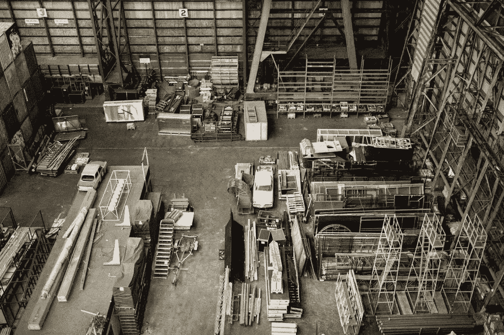

# 加州的制造业复兴

> 原文：<https://medium.com/swlh/californias-manufacturing-renaissance-310bf156b641>

Photo by [Charlize Birdsinger](https://unsplash.com/photos/7b49gfsgQZY?utm_source=unsplash&utm_medium=referral&utm_content=creditCopyText) on [Unsplash](https://unsplash.com/search/photos/manufacturing?utm_source=unsplash&utm_medium=referral&utm_content=creditCopyText)

加州是世界上最强大的经济体之一，在高科技、国际贸易、医疗保健、农业和能源等行业处于领先地位。根据世界银行 2016 年的数据，加州是世界第六大经济体，仅次于美国、中国、日本、德国和英国。