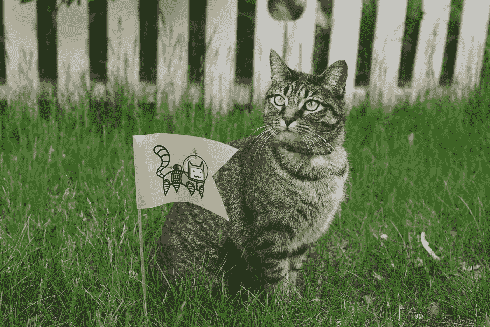

# 呼唤新时代的所有创业公司

> 原文：<https://medium.com/swlh/calling-all-startups-of-the-new-age-6394c59056>

“A tabby cat sitting next to a flag with a cartoon astronaut cat picture” by [Sticker Mule](https://unsplash.com/@stickermule?utm_source=medium&utm_medium=referral) on [Unsplash](https://unsplash.com?utm_source=medium&utm_medium=referral)

你在新闻中听到的关于创业公司的第一件事是什么？是估值。它刚刚筹集了多少钱。卖给另一家公司的价格。当标题中“初创公司”一词旁边出现一个高达数百亿的浮华数字时，它肯定会吸引新闻文章的点击量，但你有没有想过这些公司到底是干什么的？

是的，我们都知道[语法检查器现在正在运转](https://gizmodo.com/lame-grammar-startup-raises-stupid-amount-of-money-1795049121)，但是他们**做什么**？他们让世界变得更美好了吗？所有这些钱都变成了**值那么多钱吗？你知道我在说什么。(咳咳* [Juicero](https://dealbreaker.com/2017/04/juicero-still-dumb/) *咳咳)**

## 坦率地说，这个问题

在我看来，越来越多的创业公司正在成为又一个混乱、无聊、毫无意义的东西，许多人为此花了很多钱，却没有什么好的理由。当然，给世界带来新的想法是很棒的，人们对如此多样的想法持开放态度也很棒。

但是你不能逃避一个事实，那就是有些想法非常愚蠢。

问题在于，在当前的创业世界中，这样的想法得到的关注、资金和可信度与增加实际价值的想法一样多，甚至更多。你上一次在新闻中听说医疗创业是什么时候？在绿色能源领域，你能想到多少成功的创业公司？农业和可持续的粮食生产呢？数字隐私，有人知道吗？

这些创业公司通过改变人们对创业公司的看法，扭曲了整个景观。让我们以一家我们非常熟悉的公司为例:如果在两年内有 10 家模仿果汁的公司，每家都在首次公开募股中筹集了 10 亿美元，每个人都会开始认为果汁创业公司是一项安全、有利可图的投资。然后，当一些公司推出一种革命性的果汁机时，这种果汁机有一个独立的花园，里面有新鲜收获的水果和蔬菜来制作果汁，投资者会奇怪地看着他们，因为他们习惯于只有一台机器来挤压一袋和你自己挤压袋子一样的果汁。

当制造垃圾的初创公司变得如此受欢迎并获得如此多的资金时，每个人都开始青睐类似的公司，而那些提出真正新颖、创新解决方案的公司就会出局。对于那些试图以自己的创造性方式创造价值的现有公司和新公司来说，这是一个真正的问题。

# 是时候专注于创造价值，而不是大数字了。

听着，你想要什么样的未来:一个用回收的狗屎制作名牌纸袋的公司获得成功，还是一个引领消费者海洋探索产业的公司获得成功？如果第一世界对你来说听起来更好，我邀请你回应这篇文章并回答一个简单的问题:*到底是什么？*

如果你在第二阵营，那么还有希望。并不是所有的初创公司都注定要成为 pablum 的分销商，但有足够多的公司值得关注。那么我们能做些什么来解决这个问题呢？一如既往，第一步是意识。透过庞大的数字，透过飙升的估值，看看一家公司的影响力。看看他们想改变世界的什么。看看他们是如何用这些钱让明天的地球变得比今天的更好。看看他们为我们所有人建设的未来。

有几个公司的例子让我个人对它们创造的价值感到钦佩，比如 Brave、 [Snapchat](https://www.amazon.com/How-Turn-Down-Billion-Dollars/dp/1250108616) 和 [TunnelBear](https://www.tunnelbear.com/) 。(好吧，我承认美学动画和插图是我包括最后一个的一个重要原因。)不，我与这些公司都没有关系。我只是其中大多数的快乐用户(Snapchat 在我的旧 Nexus 手机上太滞后了)。

# 在我被钉上十字架之前的最后一句话…

我想大多数人最终都会明白我的意思。迟早会有人提出一个足够荒谬的想法。我说这些，并不是出于嫉妒或恶意去讨厌任何人的工作。只是我认为我们都应该努力对这个世界产生积极的影响，尤其是在充满机遇的时候。

就像年轻人说的，你只能活一次。如何度过这仅有的一次机会取决于你自己。

## 这篇文章发表在 [The Startup](https://medium.com/swlh) 上，这是 Medium 最大的创业刊物，有 344，974+人关注。

## 订阅接收[我们的头条新闻](http://growthsupply.com/the-startup-newsletter/)。

