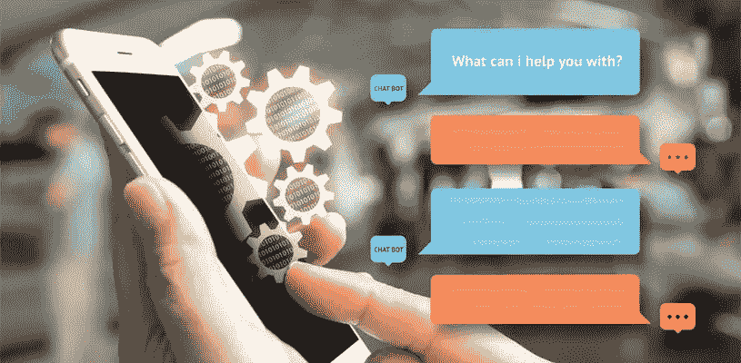
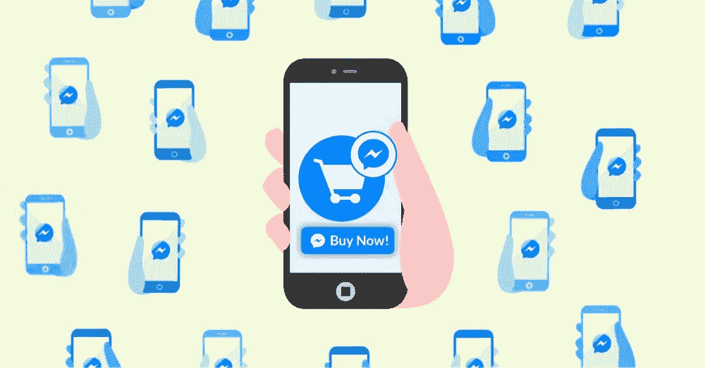
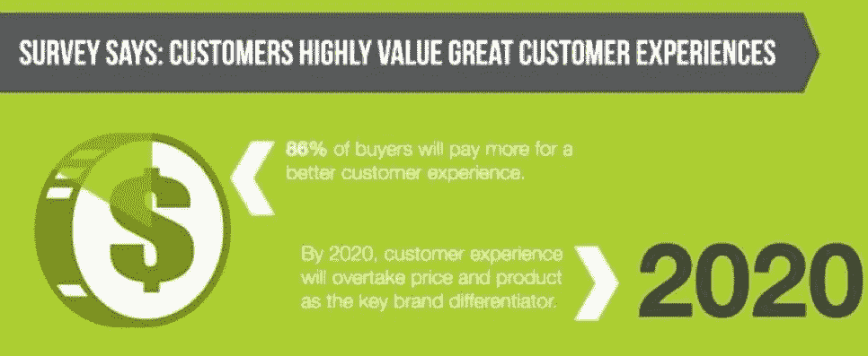
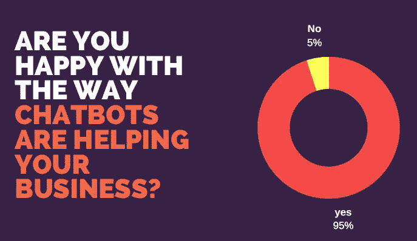
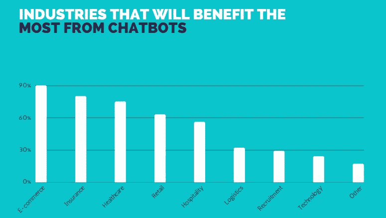

# 2018 年，聊天机器人能让你的业务增长吗？你需要知道的 7 个关键点！

> 原文：<https://medium.com/swlh/can-a-chatbot-grow-your-business-in-2018-7-critical-points-you-need-to-know-c22b3a5111bd>

聊天机器人。也许你听说过他们。也许你没有。

现在是 2018 年，如果你的营销策略没有任何变化，你的结果将保持不变。什么都不会改变。

**如果你想** **发展业务，你需要一个新的营销工具，因为每个人都在做同样的事情，你需要让自己与众不同。**

真正的问题是:

*   应该注意吗？
*   2018 年，聊天机器人能帮助你的业务增长吗？
*   聊天机器人是一种方法吗？如果是，为什么？

这就是我接下来要回答的七个关键点。

在这篇文章的结尾，你将会 100%的明白得到一个聊天机器人是否值得。

# 1.几乎每个使用 messenger 的人都愿意和聊天机器人聊天。

排名前四的消息应用比排名前四的社交网站都要大。

据估计，到 2019 年，超过 27%的世界人口将使用此类应用程序并与聊天机器人聊天。

> “63%的人会开始与聊天机器人聊天，以联系企业或品牌。”

底线是什么？

**人们希望通过聊天来拓展业务。他们更喜欢聊天，而不是其他任何信息传递方式。**

# 2.给人们他们想要的。他们会来找你的！

客户希望聊天机器人提供**建议**。

有时候人们不知道他们想买什么。他们只是去你的网上商店，然后退出，因为他们还没有决定他们想要什么。你永远失去了他们。不要让这种事情发生！

聊天机器人会通过问一些简单的问题来找出人们到底想要什么。然后它会把所有的产品放在他们眼前。

你的转化率会上升！

底线呢？

几乎任何地方的顾客都需要聊天机器人。

# 3.你是在向千禧一代销售吗？

如果是的话，聊天机器人是必备的！

千禧一代喜欢比较产品。比起打电话，他们更喜欢聊天。

如果千禧一代是你的目标受众的一部分，你购买聊天机器人的决定将是非常明智的！

聊天机器人也提供了一个创造互动脸书活动的机会。每个人都在做静态广告，与众不同。让人们在你的活动中玩你的聊天机器人。

底线呢？

给你的营销策略添加新的营销工具。让人们兴奋起来，他们就会成为你的顾客。

# 4.聊天机器人提供了比与人聊天更好的用户体验。

惊讶吗？如果聊天机器人设置得当，是有可能的。

因为人与人之间的交流仅限于文本输入。它们通常是开放式的对话，为用户创造了一种较少引导的体验。

另一方面，聊天机器人会立即作出回应，它们可以将按钮和其他视觉提示与支持文本对话结合起来，为 T4 提供更加丰富的互动。聊天机器人还可以比人更快、更一致地扩展和应用其知识。

人工代理需要训练，他们的反应不一致，需要被激励去关心客户。聊天机器人不会。

通过使用聊天机器人，企业可以比他们的竞争对手更快地获得竞争优势。

但是不要把一切都交给聊天机器人。

> “人和机器的完美结合为创造竞争优势提供了最好的机会。”

底线呢？

**不要雇佣更多的人来支持，找一个聊天机器人。**

与其雇用更多的人来处理重复性的任务，不如找一个聊天机器人解决方案。你会省下一大笔钱。

聊天机器人是呼叫中心的死亡吗？如果你想知道答案，请点击这里。

# 5.聊天机器人将扩大你的业务。

聊天机器人没有限制。

虽然人类一次可以处理 2-3 次对话，但聊天机器人可以无限制地工作。

如果你的企业收到很多询问，聊天机器人可以减轻你的客户支持团队的负担。

如果用户需要与人交谈，聊天机器人将有资格将他重定向到人工代理。

Business Survey on Chatbots — by Chatbot Survey 2017

底线呢？

聊天机器人可以让你的业务发展得更快。

# 6.每个电子商务企业都需要一个聊天机器人。但是为什么呢？

购物正在发展。你也需要进化。

因为你的目标应该是领先，而不是落后，对吗？

如果人们不喜欢你的品牌，一秒钟就会换另一个。

聊天机器人正在彻底改变网上购物体验。怎么会？

*   聊天机器人可以给人们折扣代码和优惠券。
*   聊天机器人可以追加销售和交叉销售。
*   聊天机器人将加速购买过程。
*   聊天机器人会卖出更多你的产品。
*   聊天机器人将处理 90%的客户支持！

Courtesy: Chatbot Survey 2017

底线呢？

电子商务可以从聊天机器人中获利最多。

如果你想知道更多聊天机器人如何帮助你的电子商务赚更多钱的方法，请阅读这篇文章。

# 7.你有零售店吗？停止失去无聊的顾客。

想象一下这种情况。一对夫妇来到你的服装店。女人会四处逛逛，因为她想看看什么是新的，什么最适合她，等等。这段时间这个男人在做什么？他一直在看他的智能手机，在脸书或 Instagram 上滚动(我是个男人，所以我知道这一点:)。

如果在你的窗户上印上一个信使代码会怎么样？

这个人会扫描它->聊天机器人会和他展开有趣的对话->也许你的聊天机器人会问他是否在寻找特定的东西->它会给他一些建议并和他进行愉快的对话。

你能看出区别吗？

不要让人们在社交媒体上浪费时间。**让你的聊天机器人和他们好好聊聊，你会惊讶地发现他们中有多少人会成为你的新客户。**

你还有什么好处？你可以以后再向这些人推销脸书的广告。这样他们就不会忘记你，一次又一次地购买。

底线呢？

**在你的零售店给人们惊人的体验，一些他们从未体验过的东西，他们就会成为你的顾客。**

那么，整篇文章的底线是什么？大问题的答案是什么？

我想你已经知道了，对吗？

如果你想在 2018 年发展业务，聊天机器人营销是一条路要走。

因为几个最终的原因:

你需要让自己与众不同，以获得竞争优势。

如果你什么都不改变，什么都不会改变。

> "聊天机器人不再是如果，而是什么时候."

…您越早利用这一优势，您的业务增长就越快。

所以，请不要错过这个巨大的机会。

你想占便宜吗？

[是的！我想要一个聊天机器人。](https://www.xbotzz.com/i-want-chatbot/)

## 这个故事发表在 [The Startup](https://medium.com/swlh) 上，这是 Medium 最大的企业家出版物，拥有 293，189+人。

## 在这里订阅接收[我们的头条新闻](http://growthsupply.com/the-startup-newsletter/)。

