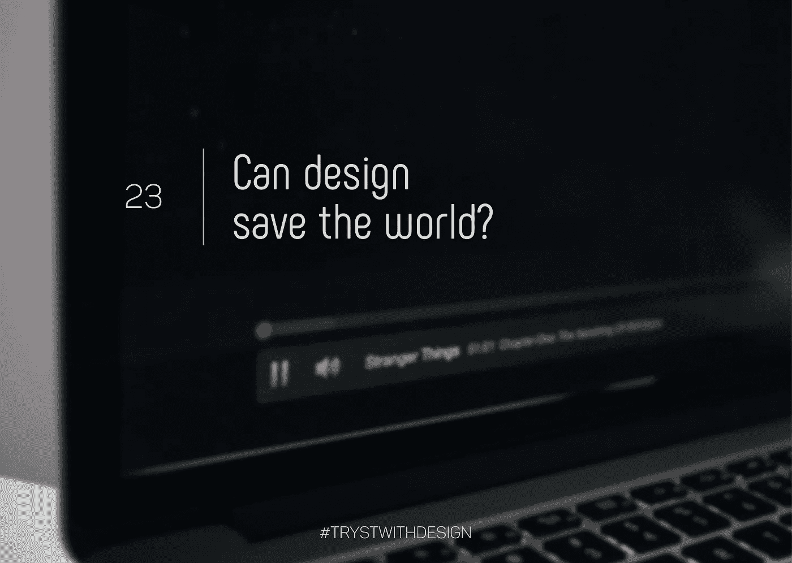

# 设计能拯救世界吗？

> 原文：<https://medium.com/swlh/can-design-save-the-world-2009bc1bdc2a>

Ask yourself — Are you being mentally hijacked?

每次我们都面临着一个引人注目的问题:“我们要留给孩子们一个什么样的世界？”它引发了对物理因素的讨论，如无塑料包装或有机织物，有助于减少碳足迹。但是，作为技术革命的一员，我们有没有停下来问问自己，我们是否在为未来设计负责任的体验？如果历史有所启示的话，人类是适应性很强的生物。某个特定时间点的简单行为特征会对人类进化产生深远的影响。因此，说实话，设计灌输良好习惯的正确体验肯定值得比现在更多的关注。

但是什么是负责任的体验呢？好吧，为了理解这一点，我们先来讨论一些不那么负责任的经历。你有没有在睡觉前浏览你的脸书墙几分钟，却发现那几分钟变成了一个小时甚至更长？你有没有说过‘这一集将是我的最后一集’，但是最后却看了整整一季的《网飞》？别担心，我们都经历过！那么，这些应用程序在刺激你做什么呢？基本上，它们就像信息的无底洞，无耻地向你推送越来越多的内容，直到你被迫停止。简单来说，他们劫持了你的大脑。另一个很好的例子是注意你看手机的次数以了解时间。你有没有只瞥一眼就停下来？或者你会拿起手机，打开一些应用程序，再花 5-10 分钟漫无目的地滚动，完全忘记你真正想做的只是查看时间？

英国心理学家进行的研究表明，年轻人检查智能手机的时间大约是他们估计的两倍。我们是一个由等待通知和对我们尖叫的蓝色扁虱组成的社会，等待被注意。雪上加霜的是，我们被训练去回应这些信号，就好像它们是我们生活的一部分。这就是为什么我们的经历没有很好地利用时间，分散了我们的注意力，让我们感觉没有收获。另一方面，负责任的设计毫不费力地丰富了我们的日常行为，最终改善了我们的日常行为。

谷歌 Pixel 的“永远在线”显示屏就是这种现象的一个完美例子。谷歌的设计者开发了一种屏幕，它总是显示时间和日期，即使在屏幕闲置时也是如此。这是对用户的无声指示，他甚至不需要移动来执行他想要的动作。简单地看一眼他的手机就知道时间了，他可以不受干扰地开始一天的工作。同样，允许用户禁用 Whatsapp 上的“蓝勾”(这一功能本来就不应该被设计出来)，可以让用户摆脱被迫立即回复短信的感觉。他可以从容不迫地对通知做出反应，并决定是否回复，从而确保他不会被迫做出社会互惠。像 Medium 这样的平台显示阅读一篇特定文章所需的大致时间，通过提供准确的时间投入来增强用户的能力。这有助于他预测点击的后果，没有多少人愿意提供这个选项。

iPhone 上的“睡觉时间”功能礼貌地鼓励用户关闭手机，睡个好觉，提醒他优先考虑的事情，并倡导更健康的生活方式。优步为了对抗路怒症，通过屏幕上强烈的红色警报，提醒司机每次超速都要减速。Snapchat 和 Waze 等能够检测运动的应用程序建议用户在移动或驾驶时不要打字。与脸书跟踪数字行为并怪异地显示相关广告的广告策略形成鲜明对比的是，网飞礼貌地告诉你为什么你会收到特定电影的建议，根据你过去的观看倾向向你展示匹配率。这样，负责任的设计是完全可以实现的，而不用操纵消费者，让他做出明智的决定来提高生活质量。

因此，重要的不仅仅是设计得好，还有合理的设计。我们需要一个这样的世界:设计更具激励性而非炫耀性，更以人为本而非以用户为中心，更自由而非受束缚。

“那么，我们应该留下一个什么样的世界？”你问。由我们负责任地设计的那种。

寻找更用心地使用设备生活的方法？你可以这样做。

【http://humanetech.com/take-control/ 号