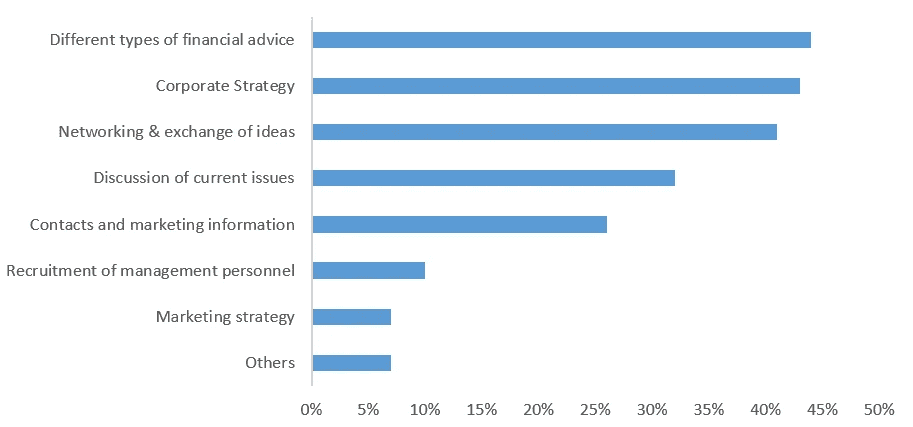
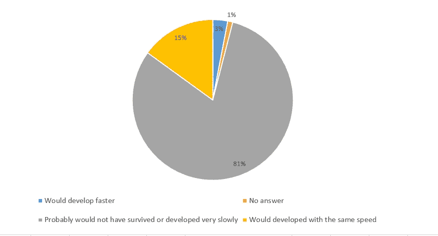

# ICO 能代替风险投资吗？

> 原文：<https://medium.com/swlh/can-ico-replace-venture-capital-63a1311c5296>

最近，密码协会的代表和许多与创新领域相关的官员经常表达这样的观点，即"**ICO 机制的发展可以为学生**和企业家的想法提供获得融资的巨大机会"。

[**ICOscoring**](https://icoscoring.com/) 团队决定找出这些词的能力，以及为真正高质量的项目吸引资金是否存在实际问题。

## **风险投资者的经典方法**

**资金来源的选择对处于早期发展阶段的项目起着至关重要的作用。在风险投资领域，有一个“聪明钱”的概念——这是一个投资术语，假设投资者除了向公司提供资金之外，还花时间为公司的战略发展和技术诀窍提供建议。因此，除了直接融资，公司还获得了投资者的长期经验。在风险企业的术语中，与“聪明钱”相反的是“笨钱”的概念，投资者只提供财务支持。**

与公开市场的投资者不同，在大多数情况下，投资者可以监控公司的各种指标，但没有机会直接影响公司的业务，风险资本家拥有的方法要多得多，从经理和团队的非正式咨询开始，到他们作为董事会成员做出的战略决策结束。所有这些都允许公司管理层决定关注哪些指标，如何改善这些指标，以及如何(和何时)实现退出项目(这里也有许多不同的选择——从 IPO 或杠杆收购到将项目出售给战略投资者)。

## **欧洲创始人**的情绪分析

根据 **EVCA(欧洲风险投资协会)**的研究，大多数接受调查的吸引直接私人投资的公司都认识到，基金给他们的公司带来的不仅仅是财务:只有 12%的受访者认为他们的风险投资者是普通的“基金经理”， **52% —认为他们是“真正的合作伙伴”。**

**Characteristics of the contribution of VC**

只有将风险投资者带给公司的两个要素——资本和管理中的专业参与——结合起来，这些公司才能发展得更快,并有效地解决出现的问题。在 EVCA 调查中接受采访的公司经理高度赞赏风险资本基金的贡献价值。他们中的绝大多数人认为，没有这种支持**他们的公司将无法生存或发展非常缓慢**。

**How managers of invested companies assess their prospects without attracting VC**

似乎合乎逻辑的是**只有风险融资和通过 ICO 筹集资金的结合才能够确保和谐的项目开发**。在这一堆中，ICO 允许降低项目的“金钱成本”，而 VC 的参与将为项目提供所有“聪明钱”的优势。

## **结论**

因此，有人建议, **ICO 机制可以拯救**高层管理团队，降低资本成本，而不会因为缺乏风险投资者的**【聪明钱】**而损害项目，或者拯救质量不佳的项目，因为这些项目不符合风险投资施加的标准而无法获得风险融资。在这种情况下，实现 [**Kin**](https://kin.kik.com/) **，**[**Filecoin**](https://filecoin.io/)**，**[**Unikrn**](https://unikrn.com/)**等成功 ico 的经验。**表明，作为**的最优融资结构应该被认为是一堆 VC + ICO** 。

#区块链#以太坊# ICO #比特币#加密货币

## 这篇文章发表在 [The Startup](https://medium.com/swlh) 上，这是 Medium 最大的创业刊物，拥有 271，813+人关注。

## 在这里订阅接收[我们的头条新闻](http://growthsupply.com/the-startup-newsletter/)。

