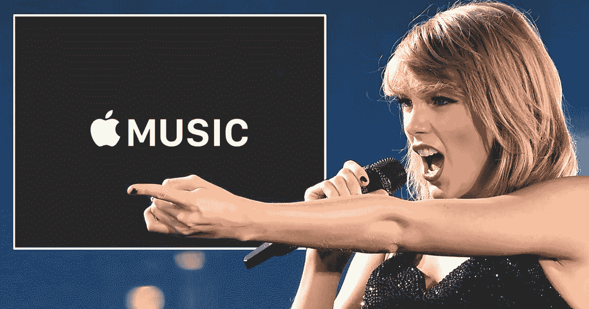

# 泰勒·斯威夫特能拯救苹果音乐吗？

> 原文：<https://medium.com/swlh/can-taylor-swift-save-apple-music-5dae7ca78632>

Can Taylor Swift save Apple Music? Don’t count on it.

认识你的新有线电视公司:亚马逊！

还有…

泰勒·斯威夫特能拯救苹果音乐吗？

这是《媒体不插电》的第 33 集，有品牌权威 [**汤姆·阿萨克**](http://tomasacker.com/) 和媒体战略家 [**马克·拉姆齐**](http://markramseymedia.com/) 。

此外，阿拉莫草案屋的*星球大战*体验，奥马兹的惊人的乔治克鲁尼比赛，以及脸书将永远不可能成为一个播客平台的咆哮和欢呼。

品牌权威汤姆·阿萨克尔和媒体策略师马克·拉姆齐深入了解媒体的真实情况。

请听我们走进媒体，揭露丑陋的真相！

转到此处:

*   [**关于亚马逊成为你的新有线电视公司**](http://recode.net/2015/12/08/amazon-starts-building-its-own-bundle-by-selling-showtime-starz-and-more-with-amazon-prime/)
*   [**Videonuze on 亚马逊颠覆流媒体视频点播行业**](http://www.videonuze.com/article/amazon-could-disrupt-the-entire-svod-industry-with-its-new-streaming-partners-program-?curator=MediaREDEF)
*   [**苹果独家泰勒·斯威夫特演唱会影片作为苹果音乐的诱饵**](http://blogs.wsj.com/digits/2015/12/14/apples-exclusive-taylor-swift-concert-film-tests-video-as-a-lure-for-streaming-services/)
*   [**白杨镇制图室的*星球大战*经历**](http://variety.com/2015/film/box-office/star-wars-force-awakens-cinemas-marathons-fans-1201664355/)
*   [**奥玛泽的惊艳乔治克鲁尼大赛**](https://www.omaze.com/experiences/red-george-clooney)
*   [**认为脸书会是一个新的流媒体平台吗？**](http://www.niemanlab.org/2015/12/could-facebook-be-the-next-big-platform-for-podcasts/) 再想想。

再次特别感谢我们伟大的制作人！ [**杰夫·施密特——激动人心的媒体音频。**](http://jeff-schmidt.com/)

别忘了在 [**、iTunes**](https://itunes.apple.com/us/podcast/mediaunplugged/id907275925) 或 [**Stitcher**](http://www.stitcher.com/podcast/media-unplugged) 订阅媒体不插电(给你 RSS 骑师， [**这里是提要**](http://feeds.feedburner.com/mediaunplugged) )。

如果您有任何评论或内容想法，请使用#mediaunplugged 在@tomasacker 和@markramseymedia 上发推文给我们。