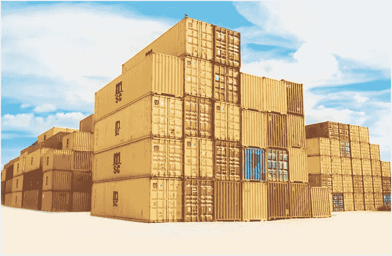
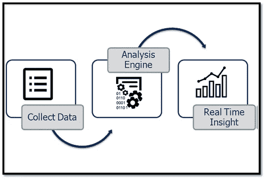

# 技术能促进销售并降低运营成本吗？

> 原文：<https://medium.com/swlh/can-technology-boost-sales-and-minimise-cost-of-operations-c72c4bc2deb0>

过去十年是革命性的，我们见证了几乎每个商业领域的销售和运营模式的巨大转变。一个优秀的销售运营团队在保持健康渠道的同时，始终如一地完成预算、定额和预测。技术进步改变了成功公司的经营方式，它仍然是成功公司的关键驱动力之一。这并不一定意味着他们已经进行了巨大的彻底变革，但在产品、流程、服务和管理方面的小的创新变化使他们脱颖而出，并给了他们某种优势。技术提供了这种转变，企业通过采用技术看到了利润。可悲的是，许多传统公司仍在使用传统的销售和运营方法，让员工疲于奔命。

现在的问题是“新时代的技术真的能促进销售并降低运营成本吗？”我不确定确切的答案，但我个人的意见是肯定的。然而，正如 ***在任何商业和决策场景中，参数都徘徊在灰色*** 的阴影之上，因此在白色和黑色之间做出选择变得越来越困难。

新时代技术，通常被称为信息时代的助推器，负责创造被高科技经济包围的知识社会。它是通过利用计算机微型化的进步而形成的。机器学习、人工智能、数字营销/销售、数据处理、数据扩展、数据安全、数据清洗、数据仓库、弹性吞吐量、大数据、存储能力、统计和预测建模以及云带来了大量创新变化，以削减运营费用，从而提高盈利能力。然而， ***技术在盈利能力中起着核心作用，但过分依赖技术投资而忽视人员、流程和组织方面，可能会导致排名下降*** 。耐克在 21 世纪初实施 ERP (i2)的经典案例，耗资 4 亿美元，导致销售额损失 1 亿美元，股价下跌 20%，在此过程中品牌价值损失，这恰恰强调了 ERP 作为解决所有问题的手段的无能为力。耐克在这方面并不孤单。像 HP、Target、P & G 和 Vodafone 这样的公司做了这样的噩梦:IT 取代了所有其他的流程，以至于这些公司不得不将这些改变恢复到旧的流程。

那么，销售运营项目不需要技术了？不会，肯定不会。相反，技术，如移动和电子邮件通信，已经成为每个公司不可或缺的需求，但总是有必要问一下作为一个组织，我们实际上在做什么，制定一个强制性的清单，我们试图实现什么，我们的战略目标是什么，我们的营销方法是什么，我们希望什么技术来简化我们的流程，入围的技术是否是公司不可或缺的需求，如果是，那么新技术的运输，安装，实施，培训和其他支持活动涉及多少成本，我们能否承担这些成本。如果采用新技术没有提高流程的效率和吞吐量，那么最好将更改恢复到旧流程，否则公司最终会遇到瓶颈。

> 很难说一家公司应该采用哪种技术，但公司可以通过观察竞争对手的例子和取得的成功来感觉到这一点。**做跟随者总比做领导者好**，因为企业的最终目标不是创新、提高流程效率或提高生产率，而是取决于吞吐量、运营成本和库存等参数的盈利能力。高吞吐率、低运营成本和低库存总是使企业高效且有利可图。

企业(尤其是电子商务零售企业)面临的最大挑战是，在提高货物运输速度和质量的同时，发现节约成本的机会。技术可以通过识别运输模式、运输服务类型、物流规划、枢纽搬迁、监控员工和供应商绩效、预测需求和匹配供应链能力，在一定程度上解决这一问题。

例如，谷歌地图和全球定位系统提高了交付操作的性能，而统计和可预测模型通过使用多种算法优化运输网络来识别运输模式和服务载体。自动化、六西格玛和精益为企业提供竞争力，并匹配可以使用机器学习感知的市场需求。

数据科学也是分析大量数据的重要能力，有助于锁定正确的客户，并相应地定位品牌。一些分析数据库，如 Microfocus Vertica、PostgreSQL、Teradata 和 greenplum，提供了通过云存储大量数据的硬件可扩展性，这些数据可通过分析或预测引擎进行精简，以形成可操作的见解，从而在有限资源的可用性范围内更快地做出决策。 ***在这十年里，存储能力将更多相关数据汇集在一起，催生了技术进步，并彻底改变了规模经济。***

除了我们到目前为止讨论过的最小化运营成本，技术在销售中带来了很多优势。通过使用技术，可以找出主要的瓶颈，并使挑战变得可行。简要讨论了一些最大的挑战，其中包括一个基于云、大数据的假设模型，Kafka 用于简化数据，分析引擎和仪表板用于捕捉客户体验，加强市场研究以增加销售额，以及让员工参与进来以提高生产力。

**捕捉客户体验:**

1.了解公司/品牌/产品/产品组合/服务的表现。

2.在购买过程的每个阶段捕捉顾客的体验。

3.品牌选择、购买前的研究(购买前的客户思维)、在线/店内购买体验和购买后的客户满意度，以及净推广者得分(客户忠诚度矩阵——他推荐产品或服务的好坏)。

4.可定制的调查/民意测验/脸书/推特/其他来源来获取客户的体验。

5.确定吸引和倾听客户的要点，并设计针对客户的调查。

6.用于分析趋势和见解的报告仪表板。

**高级架构，当数据转化为信息、见解和决策时，可以将其视为数据管道。**

**加强市场调研:-**

1.捕捉客户对现有/新产品和/或服务的看法。

2.捕捉顾客对服务场所的感知。

3.在投放市场之前，与客户一起测试新产品或服务功能。

4.了解客户对现有竞争对手新产品和服务的感受和想法。

5.支持细分，为现有/旧产品/服务的目标和定位提供见解。

**利用相同的模式，研究内在因素，提高生产率和效率。**

**员工参与:-**

1.利用员工参与度捕捉和理解员工的声音。

2.技术设备与员工的互动更加紧密——捕捉不对称的组织目标和员工的个人目标，反之亦然。

3.用于分析趋势和见解的报告仪表板。

> 拥有一个卓越的现代销售运营计划还不够吗？不行，只有技术没用，人是最重要的资源！永远不要忘记他们！推动高绩效销售运营计划需要广泛的重要能力和管理实践。专注于创造领导环境，让你的组织拥有决策驱动的文化，为人才设立高标准，培养你的销售人员，创建虚拟组织，并致力于确保拥有相关信息的人能够分享这些信息。

**结论**

今天的商业世界经历了比以往更多的技术颠覆。企业应该把目标放在技术投资上，以最大限度地降低运营成本，提高销售额，同时，它们也不能忘记宝贵的资源。此外，他们应该向竞争对手学习如何通过投资 R&D 来提高技术销售或建立创新系统，以克服挑战并为其产品创造独特的差异化价值。很难说一家公司应该选择哪种工具，但你可以通过看竞争对手或其他行业的公司的例子和成功来感觉到这一点。

## 这篇文章发表在《初创企业》杂志上，这是 Medium 最大的创业刊物，有 327，829 人关注。

## 订阅接收[我们的头条新闻](http://growthsupply.com/the-startup-newsletter/)。

