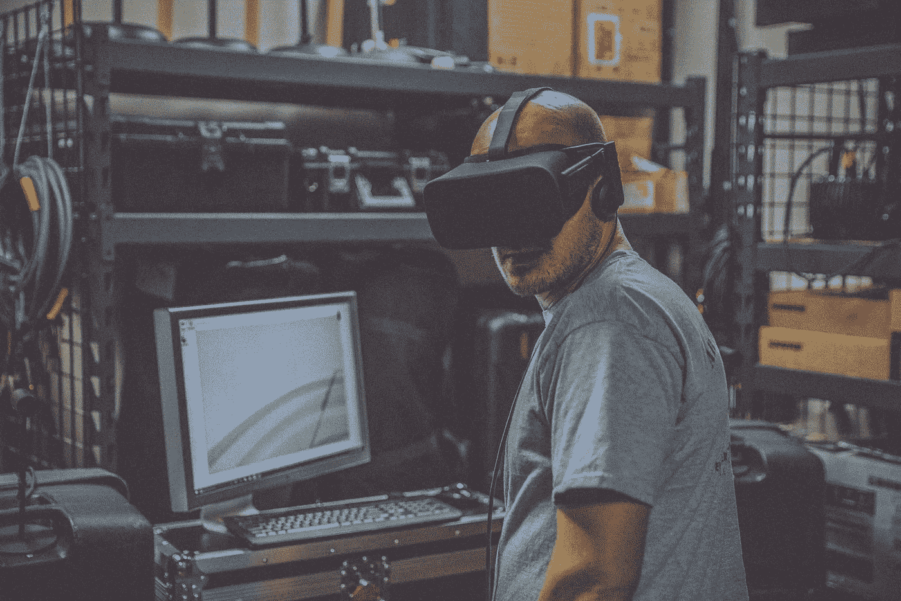
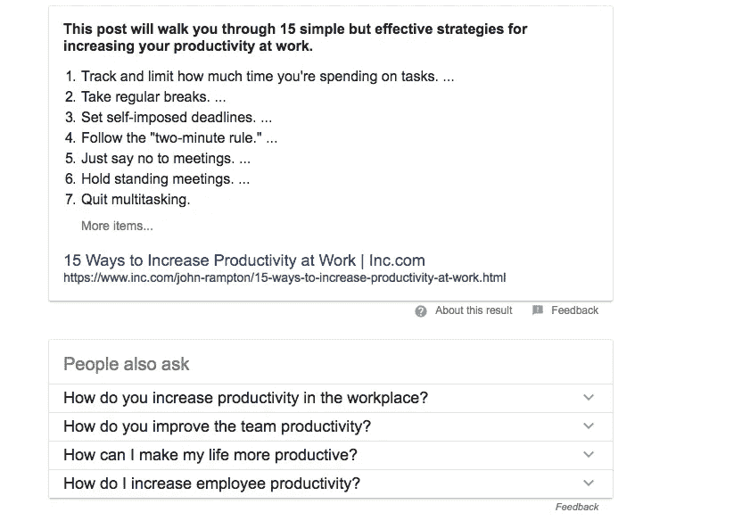
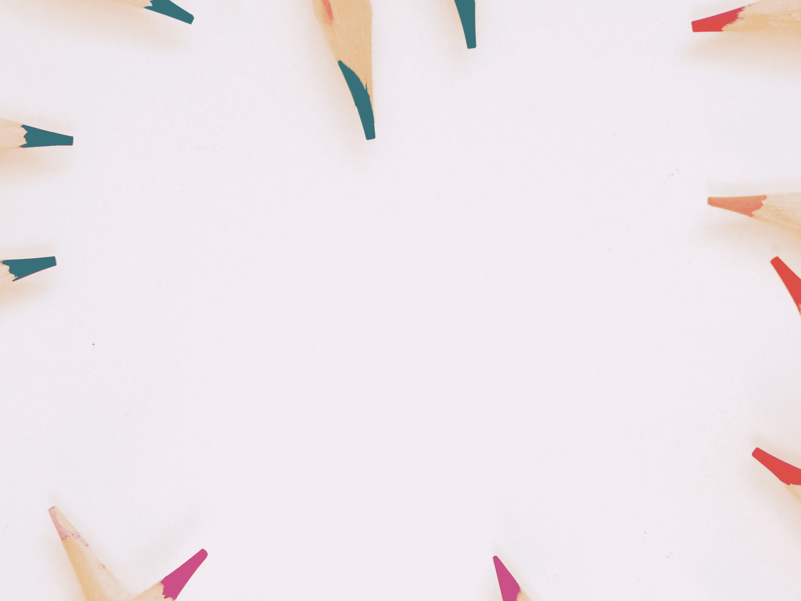
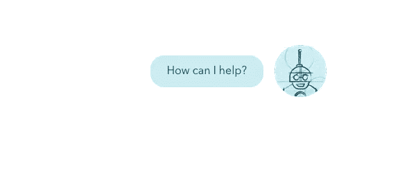
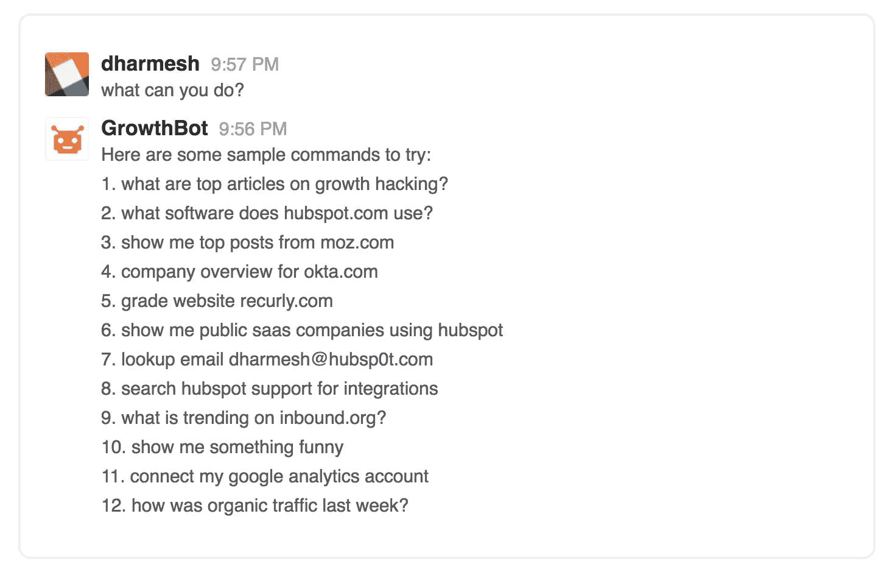

# 技术能拯救我们吗？

> 原文：<https://medium.com/swlh/can-technology-save-us-from-technology-ff50cb8ba8e0>

27.

这是我每天早上使用的应用程序、插件、聊天工具和浏览器的数量。

说作为营销人员、销售人员和初创企业类型的人，我们依赖于技术，这是一种保守的说法。是我们的老板，我们的盟友，我们的祝福。这(几乎)是我们唯一需要过日子的东西。

然而，这也感觉像是一种诅咒。

> 今天的网络景观似乎是故意要摧毁我们唯一需要的东西——我们的注意力。

一个人工智能驱动的时代即将到来:一个在其他(虚拟)现实领域进行的时代，我们与之互动的每一个物体都与物联网相连。

令人兴奋，是的。

但是，这些进步难道不会将我们永远封闭在我们的网络另一个世界里，使我们日益萎缩的注意力更加分散吗？

这是一种可能性。但是我们相信另一个。

如果导致这个问题的技术也能帮助我们解决它呢？

# 一百万个新标签

多任务是一个神话。

[神经科学](http://time.com/4470517/neuroscience-of-mindfulness/)没有给*如果*或*但是*留有余地:我们天生就是单任务者。

当人们试图同时做一堆事情时，所有这些事情都会受到影响。而且不断地在任务之间切换实际上 [***随着时间的推移会降低***](http://www.apa.org/researchttp://www.apa.org/research/action/multitask.aspxh/action/multitask.aspx) **我们的脑力。**

这是因为大脑能够用于持续创造性思维的认知资源是有限的。用互联网无止境的诱惑扰乱这些资源，它会下降得更多。

*以我为例:*

在试图写这篇文章的前半个小时内(表 1)，我刷新了我的电子邮件，这促使我开始一项新任务(表 2)，然后我记得检查 PayPal 并给一个朋友转账(表 3)，后来我决定在 Slack 上发消息(表 4)。

对此有一个说法:[在任务间切换](http://www.nytimes.com/2013/05/05/opinion/sunday/a-focus-on-distraction.html)。

或者对我来说，在*标签*之间切换:想要“快速”打开一个新标签的冲动就像挠痒痒一样直观。

一个接一个。另一个。

随着每个新标签的出现，我们在屏幕上和大脑中制造了更多的混乱。

# 通过分心工作

工作中分心是一件大事。这让企业损失了大笔资金。

一项研究[声称](https://www.vouchercloud.com/resources/office-worker-productivity)普通员工在八小时的工作日中只有三个小时是专注的。

所以，**“如何提高生产率”**是所有[时间](https://www.forbes.com/forbes/welcome/?toURL=https://www.forbes.com/sites/forbescoachescouncil/2017/09/20/seven-ways-to-ditch-distractions-and-increase-productivity/&refURL=https://www.google.co.id/&referrer=https://www.google.co.id/)中最常被谷歌搜索的问题之一也就不足为奇了。

## 但是等等…

自我造成的分心——社交媒体、私人谈话、网上购物——和工作造成的分心是有区别的。

作为销售人员和营销人员，分心似乎是不可避免的:毕竟，它们已经融入了我们的工作规范。

> 销售经理？费力地处理电子邮件通知中没完没了的噪音是一项全神贯注的全职练习。
> 
> 内容营销人？祝你一整天都在研究主题，而不会发现自己跑题。

我们快节奏的日常生活的各种需求就像是在拥挤的主题公园里寻找一个安静、不受打扰的角落的不断尝试。

# 流动的艺术

人类的大脑是一个有趣的、飘忽不定的东西。这是我们身体中永远无法控制的部分——我们越努力，我们的想法就越容易失控。

正如我在上一篇文章中概述的那样，“心流”是一种美丽的状态。时光飞逝；我们几乎意识不到我们在工作。这是一种全神贯注于一种体验的感觉，似乎其他事情都不重要。你的注意力变得如此集中，以至于没有空间去考虑干扰性或不相关的想法。这是奇迹发生的地方。

漂亮，是的。难以捉摸——也是的。

从很多方面来说，追逐它相当于追求一夜好眠。我们不能强迫它——但是我们可以建立一个有利于生产它的环境。

> 有帮助的:昏暗的房间，干净的床单，一本有点无聊的书。
> 
> 没有帮助:嘈杂的音乐，红牛，明亮的灯光。

生产“流”的状态也是如此。我们可以采取一些步骤来打开我们的心灵，欢迎它的到来；其他人将会逃之夭夭。

例如，我知道我的个人生产力在一个充满阳光的安静房间里，在一杯双份浓缩咖啡的帮助下蓬勃发展。空调应该特别冷，因为热得我昏昏欲睡。我的一些同事发誓不梳理椅子，让它们保持在最佳状态；其他人在舒适的沙发上工作效率最高。

这要看情况。但是，就像大多数人需要一张床睡觉一样，在一个流动欢迎的环境中有一个关键的组成部分。

一块空白的石板。

# 创造你的空白石板

不是字面意思。

对于一个作家来说，它可能是他们笔记本上的一页+一支笔。对于一个艺术家来说，他们的画布上布满了颜料和画笔。对我来说，它通常可以归结为一个标签，电子表格或文件。

这块空白的石板代表了您需要的所有资源—在一个地方，就在您面前—不多也不少。

没有其他地方的额外信息，没有谷歌搜索，没有新标签。没有理由离开你的空间，你的房间，你的区域。

因为当我们切换到一项新任务时，即使只有几秒钟，我们脆弱的空白状态也会破碎。

> 平均来说，在被打断后，我们需要 25 分钟才能在精神上回到最初的任务，当我们真的回来时，我们往往无法像以前那样工作。

在我们意识到之前，我们珍贵的心流状态已经飘到了平流层。

# 也许机器人可以拯救我们自己…

这里有一个我日常生活中经常发生的例子。

我记得我需要取消一个会议。

我可以:

*a)查看我的日历找到会议，取消它，并设置一个涂鸦投票来重新安排时间。但是后来我意识到我需要在明天的会议议程上增加一个重要的项目。当我找到之前的几分钟时，我所遵循的任何思路都完全丢失了。为了安慰自己，我打开一个新的标签，查看脸书……*

或者…

*b)几秒钟内给我的机器人发一条信息。它会处理取消、涂鸦和议程等所有的事情。我甚至不需要离开我所在的页面。*

一些机器人(包括我们新的 [Growthbot](https://growthbot.org/) )不仅仅是按照指令行事，还会回答特定的问题(经常弹出的类型，不请自来但不可忽视，正好在我们的思路中间)，

> “我的委托人什么时候吃午饭？我们的竞争对手使用什么软件？迈克尔·杰克逊是哪一年去世的？”

让我们能够在不中断信息流的情况下获取信息。

## 机器人也可以…

多任务。在数百个标签之间切换。他们不会感到无聊。他们从未经历过分心。

他们可以了解我们，我们的习惯，典型的行为，最喜欢的午餐地点，我们通常上班的路线。

他们还可以[了解他人或你的竞争对手](https://growthbot.org/):

他们可以听会议，记笔记，识别谁说了什么，总结结果。

他们可以了解我们的客户，量身定制信息、支持和查询答案。

而这仅仅是*的开始。*

# 今后

> 我相信我们正在走向人工智能驱动的新一波生产力，而机器人正是这一转变的中心。

通过自动化机器比我们做得更好的任务——多任务、手动数据输入、存储大量内容——我们可以自由地将所有精力投入到我们人类比它们做得更好的事情上。

*我们活动的创意方面，我们内容营销文章中的核心理念，我们销售团队的表现。*

当所有盲目的精神混乱被推到一边时，大局变得更加清晰。

那些新挣得的时间——不再浪费在切换和浏览上——可以投资到更大的事情上。

在人工智能的支持下，我们将能够建立新的习惯和新的联系。

我们不会每天打开电脑，看到眼前一片无尽的空白。但它会逐渐扩大，越来越远:突然之间，那些分散注意力的东西只是地平线上的规范。

我们周围不断的噪音会逐渐消失，直到我们意识到自己处于沉默之中。

我等不及了。

# 如果你喜欢这篇文章，请随意点击“鼓掌”按钮👏帮助其他人找到它。

*原载于*[*blog.growthbot.org*](https://blog.growthbot.org/can-technology-save-us-from-technology)*。*