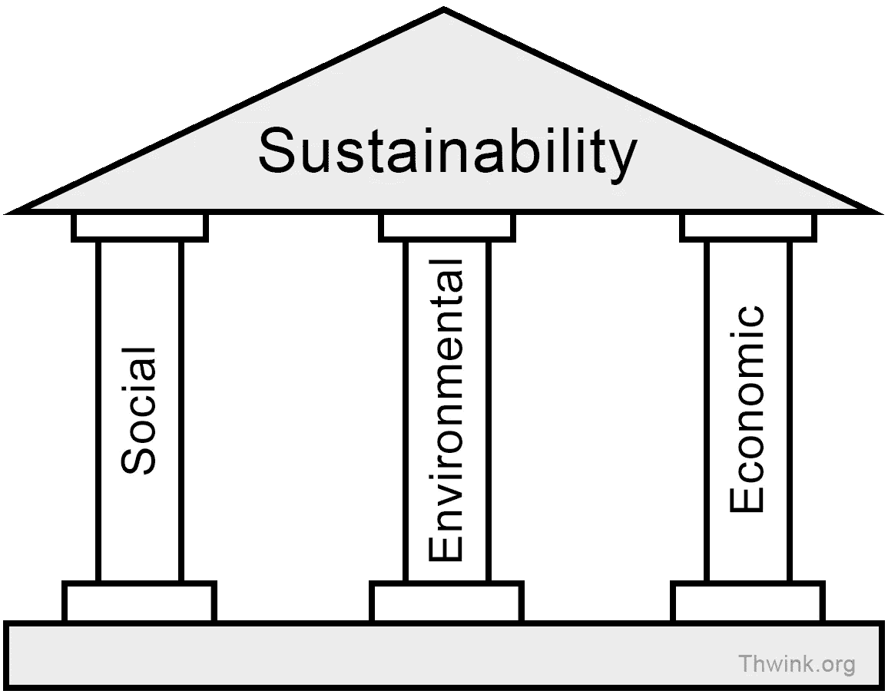

# 我们能在美国实现经济可持续性吗？

> 原文：<https://medium.com/swlh/can-we-achieve-economic-sustainability-in-the-u-s-e9d299f47c42>

Source: Thwink.org

**可持续性**是无限期持续某一既定行为的能力。

**经济可持续性**是指无限期支持特定经济生产水平的能力。在美国，*“经济可持续性”是一个经常被提及的术语，但从来没有被决策者认真对待。*