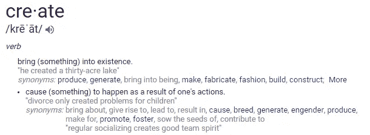

# 我们都能像埃隆·马斯克一样创造吗？

> 原文：<https://medium.com/swlh/can-we-all-create-like-elon-musk-2a5d2891d0a3>

Photo by SpaceX on Unsplash

我不是宗教人士，至少不再是了。

尽管如此，几年前我听到了一些让我难忘的事情。我在 YouTube 上听了一段励志视频，TD Jakes 播放了大约 30 秒。他说，我转述一下，

*“人天生具有创造力，因为他是按照造物主的形象创造的。”*

他的声明引起了共鸣。在那之前，我从未真正想过我们必须创造的力量……*我必须创造的力量。*

“普通”人和埃隆·马斯克这样的人有什么区别？

Photo by Matt Henry on Unsplash

在不到 20 年的时间里，马斯克与人合作创建了一个全球在线支付系统，向国际空间站发送了第一艘载有货物的私人飞船，并创建了一家电动汽车公司。

我要说的是，在其他品质中，埃隆·马斯克一直在不断创新；他不断地为自己的问题创造解决方案，现在大规模地解决全球问题。

在如此宏大的层面上把握创作有点困难，所以我进一步研究了马斯克的历史，寻找他如何走到这一步的更多线索。我发现他在 Space X 和特斯拉时代之前就开始创造东西了。

在大学里，为了付房租，他晚上把宿舍变成了夜总会。他的室友说，他经常不参加聚会，但可以在他的房间里玩视频游戏。对他来说，这完全是一件公事。

这一点，我可以理解。我还不需要发射火箭去太空，但是…

> *在*这个级别*我能做些什么来释放创造力？*
> 
> *在*这个级别*我能做些什么来改善我目前的状况？*

有很多次，我让不太理想的情况持续了太长时间，因为我接受了目前的痛苦状态，而不是深入思考解决方案。

## 总有解决的办法。

很多时候，我们被迫在绝望中创造解决方案。一些最好的解决方案来自于被彻底打破，除了我们自己和我们的聪明才智之外什么都没有留下。

我最近在 Medium 上找到一位作家，他写了一个故事,讲述他在国外如何破产和负债。为了生存，他不得不从无到有创造一些东西。

他和一个朋友共同创办了一家直运公司，在 11 个月的时间里，他们赚了 75 万美元。他现在创立了自己的品牌“你愿意吗”

他的故事对我来说真是令人惊奇和鼓舞。

从一无所有开始会令人畏缩。65 个故事之前，我只有 10 个故事，是我在 6 个月的时间里创作的。我查看了其他拥有数千粉丝的账户，想知道他们是如何建立起如此庞大的读者群的。

答案是:

# 通过创造。

我和许多媒体上的人一样，把空白的屏幕变成了关于生活和经历的故事。这是一个有趣的过程，不知道写什么，然后神奇地拼凑出一些东西。

虽然我很享受这一点，但我觉得它只是触及了我想做的事情的表面，我忍不住要更深入地思考它。

最近我一直在问自己的问题是，我还能创造什么？

# 这是第 65 天。

感谢您的阅读！❤

如果你喜欢这篇文章，请随意**拍拍**你的心满意足——这将有助于其他人找到这篇文章。

## 你愿意一起工作吗？

*访问我这里*

****

## **这篇文章发表在 [The Startup](https://medium.com/swlh) 上，这是 Medium 最大的创业刊物，拥有 305，765+的读者。**

## **在此订阅接收[我们的头条新闻](http://growthsupply.com/the-startup-newsletter/)。**

****