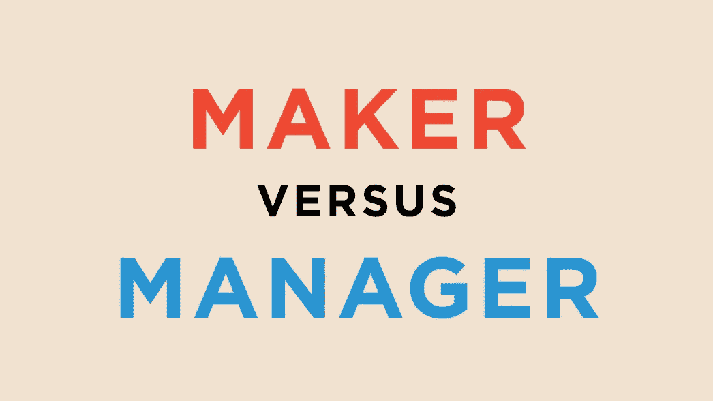
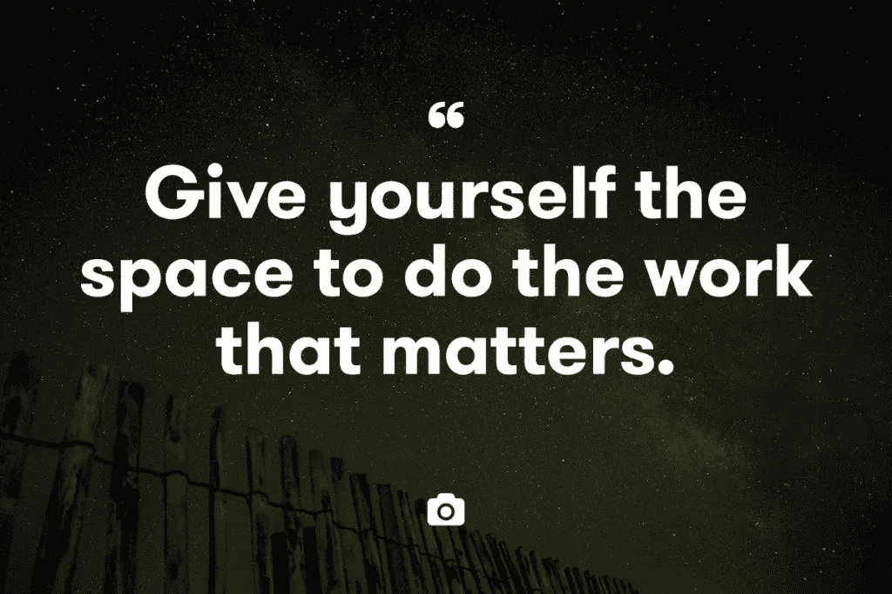
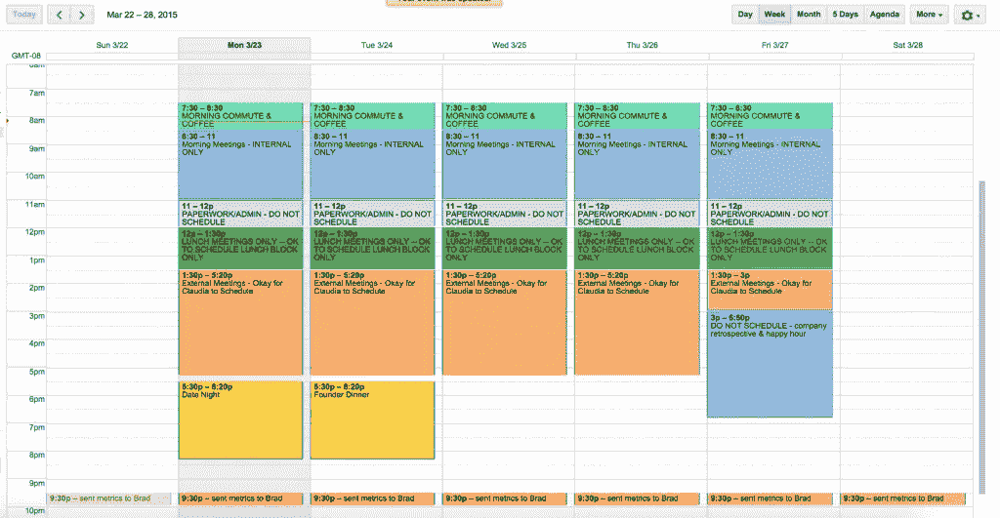
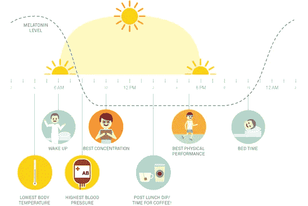

# 我们能不能既是创客又是管理者？

> 原文：<https://medium.com/swlh/can-we-be-both-makers-and-managers-7219f7bc17e9>

Want more articles like this as they’re published? Sign up for the Crew newsletter [here](http://ooomf.us2.list-manage1.com/subscribe?u=655606e77350bfa30e1ab5457&id=2afdbea3a0).

## 我们如何度过每一天，最终决定了我们如何度过一生

虽然我们都希望我们可以把时间花在创造和做有意义的工作上，但现实生活(也就是忙碌的工作)却以一种有趣的方式让我们脱轨。

本应半小时完成的紧急任务花了半天时间。我们最终花在管理上的时间比做出来的时间还要多。

很压抑。我知道。我每天都要面对这种挣扎。

每个星期，Crew 的每个人都会向团队的其他成员发送一份他们一直在做的事情的更新。虽然当你是远程团队的一员时，这是保持联系的一个很好的方式，但一周又一周，我发现自己回头看我的待办事项清单，问自己“我到底做了什么？”

管理其他人和项目的紧急任务经常会占用我为创建 T1 而留出的时间。我生活在空闲和电子邮件中，像马斯洛夫可怜的小狗一样回应每一个 ping 和通知。

几年前，散文家、程序员和风险投资家保罗·格拉厄姆研究了这个问题，[提出有两种非常不同的方式来安排你的工作日:](http://www.paulgraham.com/makersschedule.html)

> “经理的时间表是给老板看的。它体现在传统的约会簿上，每天被分割成一个小时的间隔……当你这样使用时间时，与某人见面只是一个实际问题。在你的日程表上找一个空位置，预订它们，然后你就完成了。
> 
> 但是还有另一种利用时间的方式，这种方式在程序员和作家等制造东西的人中很常见。他们通常喜欢以至少半天为单位来使用时间。你不可能以小时为单位写好或写好程序。这点时间刚刚够开始。"

不幸的是，我们大多数人都坐在中间。当然，有纯粹的制造者和纯粹的管理者，但我们这些为自己工作的创意者和企业家需要两者兼而有之。

> 我们需要在一天中挤出时间来管理和创造。去计划和创造。

所以，当你被迫将时间分配在两个截然不同的任务上时，你如何确保每个任务都得到适当的关注？

# 尊重你的时间

现在看看你的时间表。上面写了什么？它被约会和会议填满了吗？做小任务的小提醒？还是有大量的时间用于制作和建造？

**你的时间表是对你认为最有价值的东西的深入观察。**

经理按照他们的时间表生活和死亡，每项任务被划分成连续的 1 小时块。时间过不去，因为总有别人在等你。链条上有一个扭结，整个发动机就会停止运转。

另一方面，日程表和待办事项列表对制作者来说不起作用。没有办法说这篇文章或那个项目会花两个小时，因为你永远不知道，直到你深陷其中。又有谁会因为一个自我强加的期限而放弃那种美好的心流状态呢？

无论你处于哪种模式，尊重你付出的时间是很重要的。

Photo by Guillame on [Unsplash](https://unsplash.com/guillaume)

当你制作时，最简单的方法之一就是练习低头工作。关掉所有的通知，尽可能地排除干扰，专注于你正在做的事情。

与受时间表支配的经理相反，低头意味着忽略手头任务之外的一切，让它发生。

这是行动，而不是反应。

这意味着当你处于“创造者”模式时，允许自己说“不”——不仅是对会议和工作相关的活动，也包括其他社交活动。

《魔鬼经济学》*的合著者斯蒂芬·j·杜布纳(Stephen J. Dubner)谈到了[在写书时是如何进入成熟的制作人日程的](http://freakonomics.com/2009/07/28/read-this-if-you-hate-meetings/):*

> “……到了要写的时候，我就消失了。我尽可能少回复电子邮件，很少接电话，并试图拒绝每一个不重要的邀请。当我没有拒绝某件事时，我不可避免地会后悔，我猜邀请我的人也会后悔，因为我心烦意乱，脾气暴躁。”

然而，这种低头时间不必一次持续数月。它可以简单到每天花几个小时进行不受干扰的创作。

起初，时间可能看起来无关紧要，但重要的是要记住，一点一点地削减项目是有力量的。《快乐计划》的作者格雷琴·鲁宾解释道:

> “我们往往会高估我们在短期内能做的事情，而低估我们在长期内能做的事情。”

保持和尊重你的创造者时间比连续 18 个小时全力以赴更重要。

# 建立系统，而不仅仅是时间表

当你建立工作习惯时，有两件事需要考虑:你的时间表和你的系统。

把你的系统想象成你日程表下面的结构。每天或每周可重复的过程有助于你坚持不懈地努力。

如果你的系统是你的皮肤和骨骼，那么你的时间表就是你的衣柜——不管你每天选择穿什么，它都必须符合你的体形。

作为一名程序员出身的首席执行官，Mattermark 首席执行官丹尼尔·莫里尔(Danielle Morrill)不得不从一个充满创造者时间的时间表转变为一个充满经理时间的时间表。她的答案是[为她的日历建立一个潜在的 timbebox 结构](/@DanielleMorrill/warming-up-to-the-manager-s-schedule-e3ec18c7408e),这意味着每天都有类似的流程。

通过为创建和管理安排时间段，你将永远知道应该处于什么模式，当有人向你提出会议要求时，你可以把它安排在你知道自己将处于管理模式的时间，而不是打断你的创造性工作流程。

> “我们就是我们反复做的事情。因此，优秀不是一种行为，而是一种习惯。”—亚里士多德。

时间表让你受别人的摆布；一个系统让你的时间成为你的选择。

# 划分(并征服)你的任务

一次又一次的事实证明[我们没有人能成功地一心多用](http://blog-pickcrew.s3.amazonaws.com/does-your-to-do-list-make-you-sad-mine-did-until-i-changed-this/)。试图在制造和管理之间转换会极大地消耗我们的认知能量。

虽然有一个系统可以帮你规划时间，但是利用这些时间去做或者管理会让你不太可能因为忽略了其他任务而感到内疚。

我最喜欢的一个例子是[剧组首席执行官 Mikael Cho](https://twitter.com/mikaelcho) ，他实行“行政星期二”——他所有的会议、管理任务和行政工作都在一天内完成。

类似地，如果你试图写作或做一个项目，将任务分组有助于你的大脑进入某种“工作模式”。

作为畅销书作家和设计师[，保罗·贾维斯解释道](https://pjrvs.com/a/productivity):

> “你专注于一项任务的时间越长，完成的速度就越快。因此，把我必须做的所有写作集中到一个上午意味着我可以一下子写 5-6 篇文章。完美。或者我会花一整天的时间为客户编写网站，这让我的大脑进入了‘代码模式’。”

虽然这适用于短期目标，但你也可以[将更大的任务组合在一起](http://blog-pickcrew.s3.amazonaws.com/creative-momentum/)，这样你就总能知道自己下一步在做什么。

这就是作家兼艺术家奥斯汀·克里昂所说的“连续吸烟”:

> “我们不会在项目结束时停下来担心接下来会发生什么，而是用一个项目的结束来照亮下一个项目。”

# 用你的精力工作，而不是反对它

大量研究表明，我们的能量水平在一天中会有自然的起伏。这些被称为昼夜节律，尽管我们尽了最大努力 100%地工作，但对抗这些节律就像对海洋大喊大叫阻止它进来一样有效。

通常，一旦工作日开始，需要几个小时进入高峰工作模式(大约上午 11 点至下午 1 点)，然后在下午 3 点左右急剧下降，然后在下午 6 点前后的几个小时内恢复。

(当然，个体差异是存在的，但令人惊讶的是，我们大多数人[遵循同样的节奏](https://hbr.org/2015/01/the-ideal-work-schedule-as-determined-by-circadian-rhythms)。)

意志力和决策是有限的资源。因此，如果你的自然能量流是在早上更加清醒，那么用这段时间回复邮件、参加基本会议和做其他不太密集的任务就是浪费。

相反，根据你自己的日常节奏来安排你的工作，利用你的高峰时间去做那些最需要集中注意力的事情。

# 建立仪式和惯例

最后，所有人真正想要的是制定一个常规，让我们日复一日地做好你的工作。

但这不是一个小任务。难怪我们在文化上变得痴迷于成功艺术家和创意者的套路。

“日常色情”让我们认为创作可以归结为遵循一些简单的步骤。该模拟将产生相同的结果。虽然例行公事可能会帮助我们决定什么时候去做一个项目的*，但创造性的工作需要的不仅仅是封闭的时间。它需要仪式——一套让我们进入正确创作模式的习惯。*

然而，正如 Brainpicking 的创始人玛丽亚·波波娃解释的那样，[常规和仪式实际上是一枚硬币的两面](https://www.brainpickings.org/2015/02/13/routine-ritual-anne-lamott-stitches/):

> “常规的目的是让日常生活的混乱变得更加可控，而仪式的目的是让世俗充满神奇的元素。”

美好的生活需要两者的平衡——秩序和混乱，纪律和自由，世俗和神奇。

Photo by Alex Jones on [Unsplash](https://unsplash.com/alexjones)

当我们考虑平衡我们自己的生活时，花费在管理上的时间需要例行公事，而创造性的工作需要仪式。

对于设计师 Sarah Foleske 来说，这意味着在新闻主播 Pat Kieran 午睡时(每天)保留并重温泪纸。见鬼，[贝多芬在开始工作之前，必须为他的早晨咖啡精确地数出 60 粒咖啡豆。](http://bigthink.com/think-tank/a-look-at-the-daily-rituals-of-the-worlds-most-creative-minds)

不管仪式是什么，一旦你知道了，你就能够用它来推动自己进入创造模式。

尊重你的习惯，尊重让自己进入创造性工作的正确心态所需要的时间。一旦你到了那里，切换回管理的时间投资将会超过你愿意放弃的。

对我们所有人来说，从创造者到管理者再回到创造者都很难。

我们更喜欢创造性的工作或者工作和管理人通常是有原因的。这两者很少(如果有的话)容易结合在一起。

> “好日子是不缺的。美好的生活来之不易。”—安妮·狄勒德

但是花一点时间建立你的习惯和惯例，尊重你做这两件事的需要，并致力于时间表和系统，给你时间来管理和制定，你将不仅拥有美好、富有成效和创造性的日子，而且拥有有意义的生活。

# 嘿，我是乔里！

*我帮助公司和有趣的人通过聪明和专注的写作讲述他们的故事。想一起工作吗？* ***在 hello@jorymackay.com 给我发邮件***

