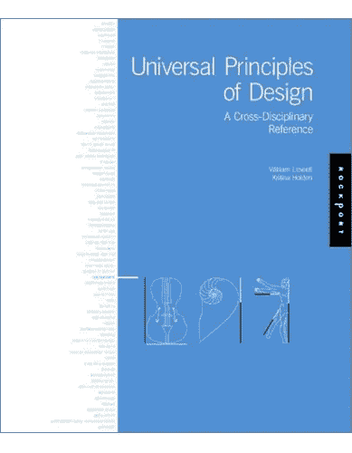
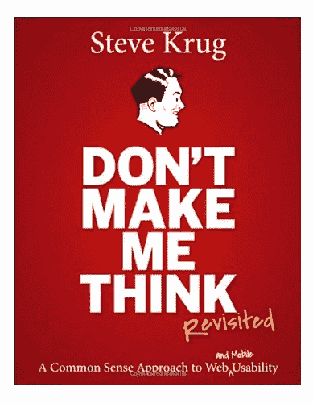
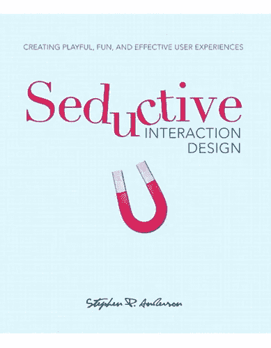
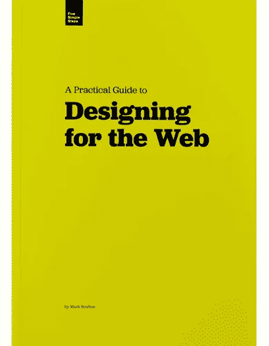
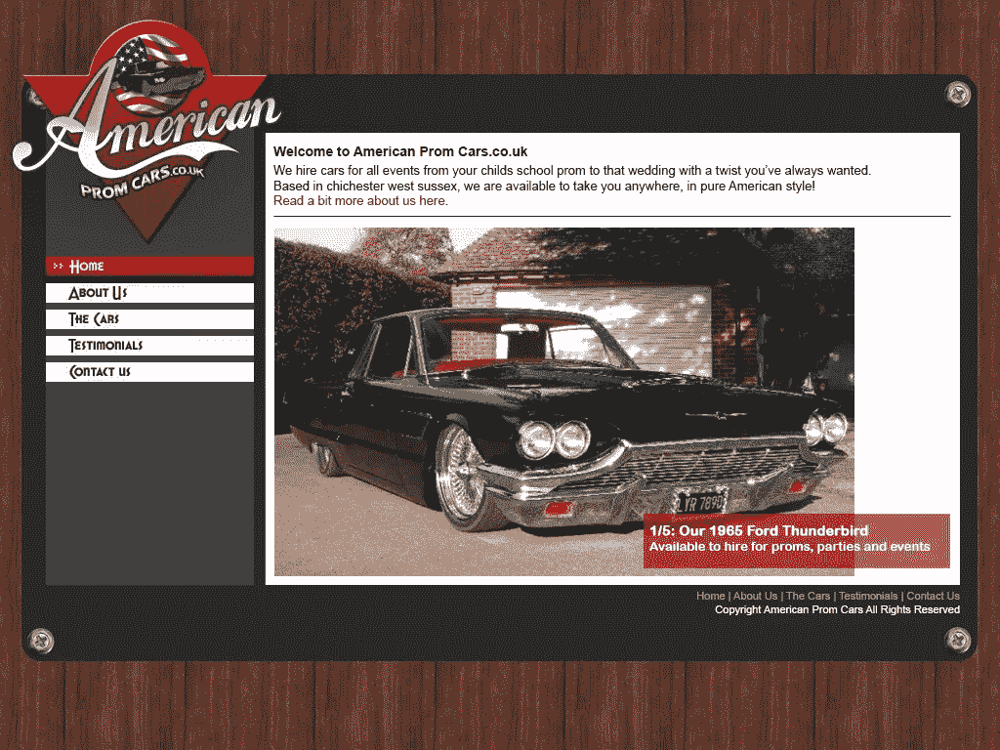

# 可以学设计吗？

> 原文：<https://medium.com/swlh/can-you-learn-design-2594eaf3dc77>

这需要一段时间。需要一段时间是正常的。你只需要奋力一搏。

最近，在我的#LETSTALKDESIGN 系列中， [Ashley](http://twitter.com/iamashley) 问了我一个很棒的问题:

我发现自己处于一个尴尬的境地，我以前认为自己是“注定”要成为一名设计师的人，因为我在艺术方面还行，其他方面都不太好。最重要的是，我喜欢它。

但是当我回想起我早期的工作时，我确实进步了。这意味着，是的，你可以学习设计。我确实有。

# 所以，你想学设计？

首先，我敢说这是学习设计从未有过的更好的*更容易的*时间。与仅仅 10 年前相比，我们现在拥有的工具是不可思议的。像[素描](http://bohemiancoding.com/sketch/) & [亲和设计师](https://affinity.serif.com)这样的 app 都是很实惠的，当然，Photoshop 总会有的。*(没错，我* ***做*** *觉得 Photoshop 是设计工具，不过那是后话。)*

也有一些很棒的书。如果要我推荐的话，我会推荐如下:

**通用设计原则**
【http://amzn.to/1fFCRyi 

**别让我想到**
[http://amzn.to/1MTqkWW](http://amzn.to/1MTqkWW)

**诱人的交互设计** [http://amzn.to/1PA3ZeH](http://amzn.to/1PA3ZeH)

**网页设计** [http://www . fivesimplesteps . com/products/a-practical-guide-to-design-For-The-Web](http://www.fivesimplesteps.com/products/a-practical-guide-to-designing-for-the-web)

开始阅读！

# 向他人学习

我学习某些设计技巧或风格的最佳方式是通过模仿。当大多数人已经思考过了，我们就更容易去创造一些东西。

** **这并不意味着你应该剽窃一个设计师的作品，把它当作你自己的作品。****

我鼓励你做的是下载一些 PSD 或 Sketch 文件，并尝试重新创建另一位设计师所做的东西，这可能会让你学到很多东西，同时也提高你在 Photoshop/Sketch 中的技能

但是有大量的资源可供你使用和学习，[在 Dribbble](https://dribbble.com/search?q=free+psd) 上简单搜索就会找到数百个，或者你可以从[主题森林](http://themeforest.net/category/psd-templates)或[创意市场](https://creativemarket.com/search/themes/psd/1)购买一些。

# “但是我已经试过了…”

我经常听到有人抱怨人们对自己的进步不满意:

> "但是我读了所有的书，仍然不能为 sh*t 设计！"
> 
> 我试过 Photoshop，但觉得太混乱了
> 
> “我喜欢在浏览器中设计，但我的设计从来没有那么有创意！”

首先，**设计不仅仅是创意**。一直以来，人们都说我们作为网页设计师的工作是解决问题，伟大的设计是“不会碍事的设计”。

但我们是有创造力的人，对吗？我们想做一些看起来也很棒的东西。*我明白了*，我经常说设计也应该*有趣。这绝对是我进入设计行业的原因，它与我在学校里上的英语和数学课形成了有趣的对比，正好你可以把它变成一份职业。*

其次，也是更重要的——这需要时间。

没人会醒来发现自己是个伟大的设计师。每一个让你垂涎三尺或试图重新创作的设计师作品，都是经过多年努力才达到这一步的。

这是我的第一个网页设计项目:

很糟糕，不是吗？没关系，你不会伤害我的感情。这是在 2008 年左右完成的，我想我已经变得更好了😉

这只是时间的问题，一开始你可能会很糟糕，但你会成功的，如果 T21 坚持下去。

这让我想起了伊拉·格拉斯的一句名言:

> “没人会把这个告诉初学者，我希望有人告诉我。我们所有做创造性工作的人，我们进入它是因为我们有好的品味。
> 
> 但是有这个差距。在最初的几年里，你做的东西并没有那么好。它在努力变好，它有潜力，但它没有。但你的品味，让你入行的东西，仍然是杀手。你的品味就是你的工作让你失望的原因。
> 
> 很多人永远过不了这个阶段，他们放弃了。
> 
> 我认识的大多数从事有趣的创造性工作的人都经历过多年这样的生活。我们知道我们的工作没有我们想要的特殊之处。我们都经历过这个。如果你刚刚开始或者还在这个阶段，你应该知道这很正常，你能做的最重要的事情就是做大量的工作。
> 
> 给自己设定一个截止日期，这样每周你都会完成一个故事。只有通过大量的工作，你才能缩小这个差距，你的工作会和你的抱负一样好。我花了比我见过的任何人都长的时间才明白如何做到这一点。
> 
> 这需要一段时间。需要一段时间是正常的。你只需要奋力一搏。

总结一下，是的，你可以学习设计。如果你想，你应该。但是尽你所能去做。读，做，迭代，再做一些。分享你从别人那里学到的东西。

最重要的是，享受它。

你可以看我在最新一集《让我们谈谈设计》里对阿什莉的回答:

*发表于* **创业、旅游癖和生活黑客**

-