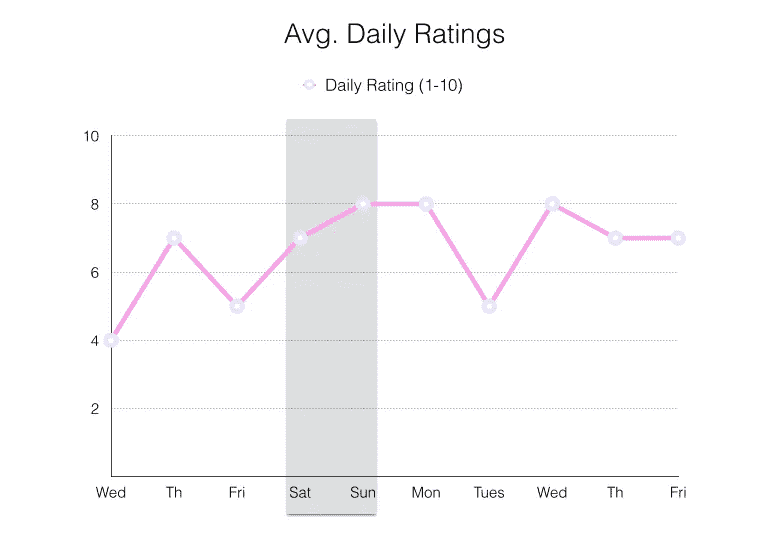
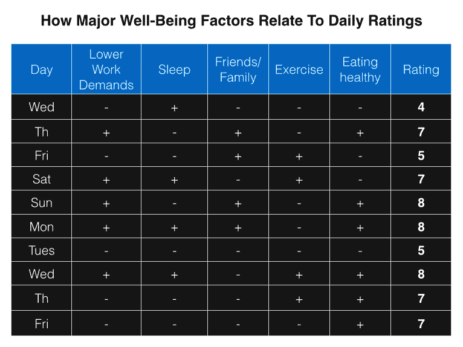
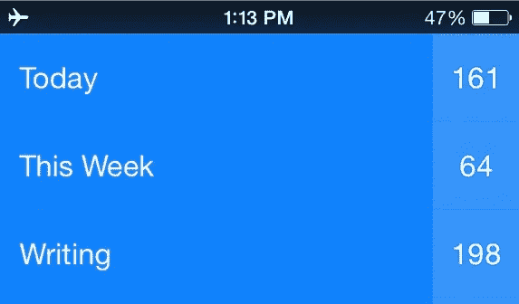
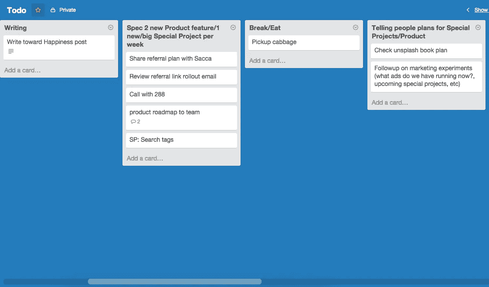
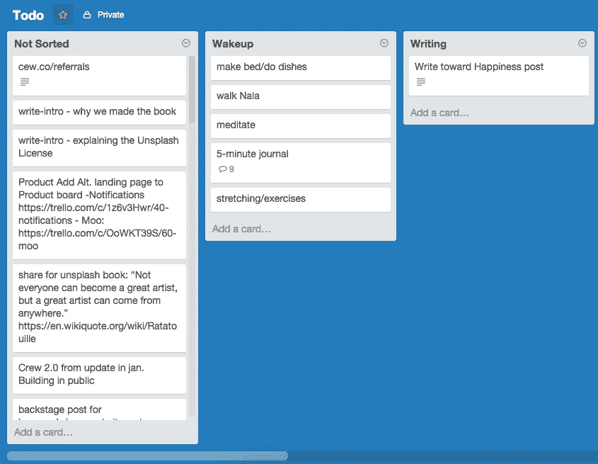
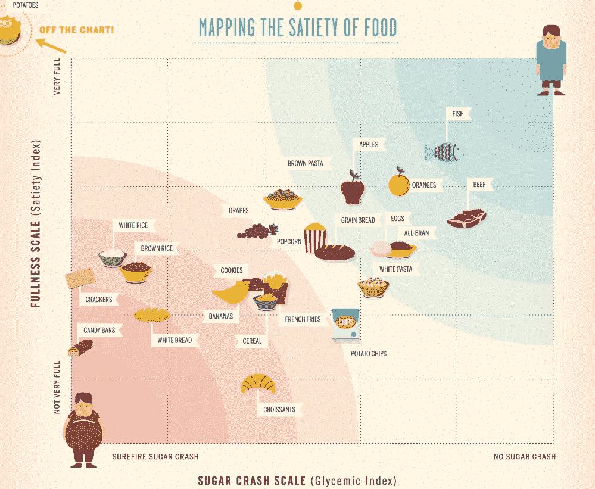

# 你能让每一天都像星期六一样吗？

> 原文：<https://medium.com/swlh/can-you-make-every-day-feel-like-saturday-1a20bce6f082>

我们在周六晚上 7:26 最开心。虽然晚上 7:26 的准确时间很奇怪，但有多项研究表明，人们通常在周末更快乐。

来自罗彻斯特大学的一组研究人员发现，不管你挣多少钱，工作多少小时，甚至你以什么为生，T2 人在周六和周日最快乐。

[根据斯坦福大学的一项研究，甚至失业的人在周末也会感到更快乐。](http://news.stanford.edu/news/2014/february/time-value-jobless-022014.html)

似乎不管生活中发生了什么，我们都会有“周末快乐”的感觉。

尽管我热爱我的工作，可以自由安排自己的时间表，但我知道我在周末也感觉压力较小。这一切让我不禁要问:

为什么星期六和星期三感觉不一样？

## 设计一个快乐实验

为了找出是什么让周末感觉好多了，我决定设计一个实验，让我自己当小白鼠。

这个想法是，如果我能发现压力和快乐的主要来源，我就能更好地理解是什么让周末感觉不同于工作日。

为了寻找让我开心和有压力的模式，我在 10 天内跟踪了以下因素:

1.  我吃的/喝的
2.  我睡了几个小时
3.  任何重大事件(如聚会、与朋友共进晚餐等)

每天我还记录:

*   用 1-2 句话总结我一天结束时的感受
*   当天的评分为 1-10 分(10 分为完美的一天)

最初，我计划在更长的时间内运行测试，但即使在仅仅 10 天后，清晰的模式开始出现。

看完我的每日评分后，第一件让我震惊的事情是，我没有一天的评分高于 8/10。

事实上，我的平均日评分是 6.6/10。略好于平均水平。

当我看到这一点时，它让我停下来思考我是如何生活的——我是如何将生活中发生的这么多美好的事情视为理所当然的。

我很幸运出生在一个稳定、充满爱的家庭，这个家庭鼓励我学习。

我还清了学生贷款，娶了我的梦中情人。

在过去十年的大部分时间里，我一直在做我喜欢的工作，并以此为生。

这是我想要的生活，也是我一直努力的方向。所以我不应该每天都打 10 分吗？

我知道有一些原因让我每天的满足感越来越低。看着我自己的数字，在工作日似乎发生了一些事情。

以下是我对普通工作日和周末的评价对比:

**我的平均工作日评分(周一至周五):6.4/10**

**我的周末日平均评分(周六-周日):7.5/10**

为了弄清我的不满，我浏览了我所有的日常记录，列出了让我感到快乐或压力的常见事情。

## 我的快乐来源:

*   降低工作要求
*   减少来自他人的压力
*   睡眠充足
*   花足够的时间在创造性的任务上(对我来说，就是写作)
*   每天做最重要的事情
*   与朋友/家人见面
*   早上做好专注的工作
*   参加体育运动或锻炼身体
*   健康饮食

## 我的压力来源:

*   一天做不完的事情
*   中断
*   争论
*   做一些我认为不太重要的事情(如搬家具、打扫浴室)
*   吃油腻/不健康的食物
*   没有体育活动(没有健身房锻炼/足球/伸展运动/长距离步行)

我注意到(可能和预期的一样)我一天中拥有的快乐因素越多，我对这一天的评价就越高。在我经历了 4/5 主要快乐因素的两天里，我给那些日子打了 8/10 分。

每天快乐的时刻越多越好。但是压力源呢？

当我揭开好日子和坏日子的层层面纱时，我注意到一个似乎是所有坏日子的根源的压力来源:一天中完成“足够多的工作”的持续压力。

**Avg。当我认为我做了足够多的工作时，每日评分:7.6/10**

**平均我认为自己工作做得不够时的每日评分:5.6/10**

当我觉得一天中有太多事情要做时，我认为不太重要的任务和干扰会让我更加恼火。这通常会引发争论，吃得太快(而且通常不健康)，或者为了节省时间而不去锻炼。

为了证实我的感觉，即这个压力源对我的伤害最大，我查看了每个压力源存在或不存在的日子的平均总体评级，然后使用变化来查看哪个因素实际上影响最大。

很明显，完成足够工作的压力是我压力的主要驱动力。虽然我知道这通常来自我给自己施加的压力，但有时似乎有外力在起作用。尤其是在工作日。

## 二手压力:周一至周五的案例

我妻子和我在许多方面很相似，但说到工作方式，我们就大不相同了。

我把早晨留给安静专注的工作。没有电话。没有邮件。而我的妻子更喜欢打电话和查看电子邮件。

因为她也是我的联合创始人，她在邮件中看到的许多东西都与我有关。我一醒来，就知道发生了什么，这可能也让她感到紧张。这立刻让我热血沸腾，让我更难把注意力集中在我预先确定的最重要的工作上。

我学到了一个术语叫做间接压力，这是压力在人与人之间传递的方式。

我们进化到能够识别某人什么时候有压力，因为这是一种生存优势。如果你能很好地感同身受，这将是分享食物、住所或水的关键。如果你看到有人来回踱步或生气地说话，你的压力荷尔蒙皮质醇水平自然会开始增加。无论你喜欢与否，你大脑中的镜像神经元都会激活。

虽然这种程度的同理心有利于交友，但在管理压力时，它可能会产生不可控制的负面影响。

## 压力的网络效应

二手压力甚至可能比你自己的压力更糟糕，因为它完全不受你的控制。

即使你擅长管理自己的情绪，如果你周围的人有压力，你也会感到有压力。你周围的人压力越大，这种感觉就越强烈。

压力就像一种[网络效应](http://en.wikipedia.org/wiki/Network_effect)——一个在商业中最常用的术语，用来描述一种产品如何随着更多人的使用而迅速传播(例如，想想脸书或优步的指数增长)。

如果你经历过交通拥挤，你就会体验到压力的网络效应。即使你可能没有压力，你也能感觉到周围的人有压力。人们不停地按喇叭，互相超车，或者在车里大喊大叫。

复合二手压力是我们在一周中感到更多压力的主要原因之一。尽管越来越多的公司采用[更灵活的工作时间表](http://www.theatlantic.com/business/archive/2015/01/not-everyones-internal-clock-is-set-for-the-9-to-5/384398/)，世界各地的企业仍然期望每周工作 40 小时[。](https://en.wikipedia.org/wiki/Working_time)

因为你周围的许多人(客户、队友、朋友和家人)都在同时工作，这可能会迫使你进入一个你无法控制的时间表。

每个人都有自己要做的事情清单。和你一起工作的人越多，你被列入的名单就越多。在这一周里，有更多的邮件、更多的会议和更多的期望。我们变得不知所措。事情失控了。

此外，许多人也不喜欢自己的工作(调查公司盖洛普发现，大约 70%的人对自己的工作不满意)，这导致了更深的脱节感，导致更多的压力，甚至更低的幸福感。

当你周围的世界感到压力或不满意时，这些感觉很容易传染给你。

来自 T2 罗彻斯特大学的研究人员记录了 74 名年龄在 18 岁至 62 岁之间的全职工作成年人的情绪，发现了类似的结果。研究人员在不同时间呼叫参与者，并要求他们分享他们的感受。

他们发现，参与者在周末有更高的幸福感，其中有两个变量对积极情绪影响最大:

1.**自主:**选择自己想做的事情的能力。

2.联系:与他们最亲近的人共度时光的机会。

周末产生了更大的自主感和联系感，因为更多的人觉得他们有自由时间，可以选择他们想做的事情和与谁一起。

**周末:**高自主性+高连通性= **积极的幸福感**

**工作日:**低自主性+低连通性= **低幸福感**

我知道与家人和朋友共度时光会让我快乐，但在我进行实验之前，我并不知道这是多么大的快乐来源。(这是我第三大快乐来源)。

这也许可以解释为什么即使是失业的人在周末也会感到更快乐。斯坦福大学的一组研究人员对“失业忧郁”进行了研究，发现即使那些没有工作的人每天可以自由地做他们想做的任何事情，他们仍然倾向于在周末感到最快乐。

因此，即使你有想工作时工作的自由，你的快乐和压力感也很容易和其他人的时间表联系在一起。

## 如何让每一天都更像周六

在看到我自己的实验结果后，我对什么让我快乐和有压力有了更清晰的认识。

我也学到了更多关于别人对我的快乐和压力的影响。虽然我可能无法改变世界运行的时间表，但我找到了一些方法来减少这些外部压力对我的影响。

我意识到我不会一直感到快乐。这没关系。感到悲伤、压力或愤怒是体验生活的一部分。我想要的是改善我对每一天的总体看法。

当事情发生时，我们选择如何反应。虽然偶尔一点压力不会要了你的命，但是持续的压力会。

路漫漫其修远兮，一片乌云一直笼罩着你是不健康的。你永远不会觉得自己做得够多了。你的作品就不会那么犀利了。最终，你会耗尽汽油。

正如《T2》一书的作者 Steven Pressfield 所写的，

> “职业选手在项目开始时磨练自己，提醒自己这是艾迪塔罗德，而不是 60 码短跑。他保存他的能量。他为长期奋斗做好了思想准备。他用知识支撑着自己，如果他能让那些哈士奇保持糊状，雪橇迟早会到达诺姆。”

在我做了这个实验后，我想找到长期运作的方法。

如果我能做到这一点，我知道我不仅会每天感觉更好，而且我还能持续地做得更好。

自从两年前进行这个实验以来，我发现了多种方法来消除我日常压力的主要来源。

以下是对我有效的方法:

## 1.制作一个简短的，有优先次序的待办事项清单

我最大的压力来源是感觉我有太多的工作要做。

意识到这一点后，我意识到这不是实际工作量的问题，而是我没有正确组织我需要做的事情的事实。

我的压力来源归结为一件看起来很简单的事情:我的待办事项清单。

它变得笨拙了。我的清单没有存放当天的任务，而是变成了任何任务或目标的存放处，不管现实与否。

回想起来，我曾经一天有 161 项任务要做，这似乎很可笑。

这种想法的储存让你感觉不到自己有任何进步。随着清单越来越长，你感到不知所措，你没有去处理那些会让你前进的关键任务，而是默认了那些找上门来的任务，比如检查邮件。

我以前写过关于[来自我的待办事项清单](http://blog-pickcrew.s3.amazonaws.com/does-your-to-do-list-make-you-sad-mine-did-until-i-changed-this/)的压力。这是一个漫长而艰难的探索过程。仅仅一个较短的列表并不能解决问题。

为了赢得你的待办事项清单，你需要一个简短的、按优先顺序排列的清单，足够灵活以适应即将出现的事情。

我没有把所有的事情都放在一个长长的清单里，而是通过查看典型的一天，并按优先级排序我需要做的事情，来重新组织我的每日清单。

以下是我一天中做的典型事情:

1.  写
2.  规划产品功能/营销项目
3.  制定营销计划
4.  与队友分享反馈
5.  会议/电话/投资者
6.  每天分享一件事
7.  回复最重要的电子邮件/项目跟进

一旦我弄清楚我每天做的事情，我就把它们按重要性排序。我把写作作为我的第一件事，不仅因为它对我来说很重要，还因为我知道如果我一天不早点写，以后就没有时间了。

一旦我有了这个列表，我就把这些任务放到项目管理工具 [Trello](http://trello.com/) 中。

在每一栏下面，我写下了我正在做的项目。例如，这篇博客文章可以归入“写作”一栏。我完成了足够多的任务，大约需要 5-6 个小时才能完成。

这为可能出现的其他意外任务以及休息留出了足够的时间。

通过安排专门的休息时间，我将它们视为我日常任务的一部分，让我更容易留出时间来吃一顿好饭、锻炼或与朋友和家人见面(所有这些都是快乐的源泉)。

对我来说，现在典型的待办事项清单是这样的:

在“写作”专栏之前，我创建了一个关于我早上例行事务的专栏和一个名为“未分类”的专栏，我把出现的事情放在那里，这样我可以在以后对它们进行优先排序。

除非某项任务很重要，否则我只会在做完当天已经安排好优先顺序的事情后才看这个“未排序”列表。

每天晚上当我完成工作后，我会试着为第二天建立待办事项清单。因为我的待办事项列表栏已经就位，所以我不断地被提醒我的优先事项是什么。我只需要填补空白。

我的待办事项列表中的另一个挑战是事情永远不会被划掉。一个重要的待办事项可能会被搁置数月，这会侵蚀我的动力，让我紧张。

因为我的清单一直没变，所以没看到进展。因为我现在是如何组织我的清单的，我可以很容易地清理出单个的任务，这让我觉得我正在走向胜利。

有了一个更短、更优先的清单，你可以专注于积极向上的事情，而不是感到压力和做低质量的工作。

## 2.高估你的截止日期

在过去的一年里，我跟踪了我个人的最后期限。我只击中了其中的四分之一。

像大多数人一样，我总是认为我能做得更多。但是当我错过最后期限时，它就成了压力的来源。对此，我的解决方案是让我需要做的每一件事都有一个清晰的行动，容易达到。

例如，当我写作时，我不会设定字数或完成一篇博文的目标。相反，我给自己的目标是每天只写。可以是一段，也可以是一整篇文章。只要我写了东西，我就赢了。

只有当我接近完成一个故事时，我才会把待办事项改为“完成博文”。

一遍又一遍地设定不切实际的最后期限会让你精疲力尽，让你更难长期保持高质量的工作。如果你今天超负荷工作，明天不工作，结果会怎样？可重复的进展更少，压力更大。

一个每天写 200 字，坚持十天的人和一个每十天写 2000 字的人完成了同样的事情。

当然，如果你在一个区域，不要停下来。有感觉就写 5 万字。但是如果你的注意力开始消退(例如，你可能忍不住看手机或查看你最喜欢的网站)，这就是分手的信号。

事情总是需要更长的时间。如果你提前完成了某件事，你会觉得你有多余的时间。你上次觉得有多余时间是什么时候？

今天能做多少就做多少，这样你明天还想再做一次。

## 3.做专注的工作。但在此之前，告诉你的同事。

[并非所有的时间都是相同的](http://blog.crew.co/why-you-shouldnt-work-set-hours/)。

仅仅因为你工作了更多的时间，并不意味着你做了更多(或更好)的工作。

多任务处理是一个神话。当我们试图同时处理多项任务时，我们可能会觉得我们做得更多，但研究表明，[我们实际上做得更少，犯的错误更多。](https://blog.bufferapp.com/what-multitasking-does-to-our-brains)

一个小时没有分心的专注工作比三个小时被检查文本、电子邮件、pings 和铃声打断的工作更有价值。

当我第一次开始不间断地工作时，感觉很尴尬。我觉得自己戴上耳机，当别人跟我说话时不回答是很粗鲁的。因为我在想我的无礼，我的思想没有完全集中在我的工作上。

我意识到我犯的一个错误是，当我进入一段专注的工作时，没有告诉我经常一起工作的人。不是每个人都这样工作，所以如果我选择这样做，我需要告诉我周围的人。

这里有一个我在开始工作前给妻子发信息的例子。

这种方法比以前的方法好得多，以前当我正在专心工作的时候，如果我的妻子问我一些事情，我会很生气。这几乎总是会导致争论——压力的另一个来源。

虽然给同事发信息需要时间，但如果他们在你努力集中注意力的时候问你要东西，这比厉声斥责他们要好得多。或者忽略它们。这两者只会给每个人带来更多的压力。

## 4.和每天让你开心的人在一起

我意识到，不管我有多少事情要做，花时间和我在乎的人一起做点什么，会比挤出几个小时工作更让我开心。

[和你爱的人浪费时间](http://blog.crew.co/productive/)。

## 5.睡觉。但是如果你睡不着，那就醒来做你想做的事情。

我知道我通常每晚需要 7.5-8.5 小时的睡眠才能感到休息。

我注意到，因为我在一周中感受到更多的工作相关任务的压力，所以与周末相比，我的平均睡眠时间更少。

在一周中，我经常会有一两个晚上睡不着觉，因为我的大脑在飞速运转。我曾经躺在床上，用尽一切办法强迫自己入睡。随着我醒着躺的时间越来越长，我能感觉到我的压力越来越大。

我知道睡眠很重要，所以我越想睡着，我就越难受。所以，我没有在睡不着的时候醒着躺在床上，而是尝试了一些新的东西。

如果我焦躁不安，我会醒来，做我想做的事情。不管是凌晨 2 点，3 点，还是 4 点。半个小时的工作比几个小时的辗转反侧来强迫自己睡觉更能让我平静下来。

去睡觉吧。但是如果你做不到，那就清醒过来，努力解决困扰你的问题。

## 6.你不必每天锻炼。快走吧。

虽然我们的身体渴望运动，但你不需要大量的锻炼来达到保持健康所需的锻炼水平。

国家地理研究员丹·比特纳[研究了世界上人们寿命最长的地区](https://www.youtube.com/watch?v=I-jk9ni4XWk)。他和他的团队一致发现的一件事是，他们研究的人正在进行持续的低强度锻炼，通常是通过散步、站立和坐下，或者打理花园。

保持任何一个姿势太久都会导致我们的血液循环下降。移动让你有时间恢复精神。无论是步行去办公室，用微波炉加热午餐时花时间伸展身体，还是进行体育运动，任何类型的血液流动都可以作为一种释放。这是一个让你头脑清醒、心情愉悦的机会。

在你工作的间隙，动起来。换位置。躺在地板上。交换你正在工作的桌子。去散步。

## 7.让健康饮食变得容易

从我的实验中，我知道健康饮食的感觉是我快乐的主要来源之一。但最让我惊讶的是，它的影响力几乎是健身和良好睡眠的 10 倍。

但是当我开始感到饥饿时，我能感觉到我的意志力变弱，并且[对难吃食物的渴望在](http://blog.crew.co/how-to-eat-a-sustainable-plan-for-eating-healthy-for-life/)蔓延。

因此，我已经瞄准了我身边一直有的食物，它们不会破坏我的能量水平，并且几乎不需要准备。

这是我最喜欢的零准备“健康”零食清单:

*   [干烤毛豆](http://www.amazon.com/Seapoint-Farms-Roasted-Edamame-Lightly/dp/B000G2UUOS/ref=sr_1_1?ie=UTF8&qid=1450124002&sr=8-1&keywords=dry+roasted+edamame)
*   脱脂希腊酸奶
*   一大包胡萝卜
*   易开金枪鱼罐头
*   切成薄片的火鸡

*(*编辑:我最近皈依了素食主义，所以我在寻找酸奶、金枪鱼和火鸡的替代品)*

这个列表是通过反复试验找到的食物，这些食物能让我有饱腹感，同时给我所需的营养。

如果你需要灵感，这本[食物指南会让你有饱腹感](http://blog.crew.co/how-to-eat-a-sustainable-plan-for-eating-healthy-for-life/)但不会让你崩溃，可能会有帮助:

让你崩溃或膨胀的食物不会让你感到快乐。

## 8.每天花 5 分钟进行自我肯定

我很幸运，但我没有考虑我有多幸运。

作为我们博客的作者之一，杰瑞米·杜瓦尔最近[写道](http://blog.crew.co/hedonic-adaptation/)，不感恩的一个主要原因是所谓的享乐适应，这是一个有趣的术语，意思是当好事(或坏事)发生时，我们会自动适应。当让我们感觉良好的事情发生时，比如加薪，我们的幸福感会瞬间增强。然而不久之后，我们发现自己又回到了和以前一样快乐(或不快乐)的状态。

为了更多地意识到我已经拥有的美好事物，我开始每天留出 5 分钟来回答这些问题:

**开始一天:**

*   “我很感激……”
*   “什么会让今天变得伟大？”
*   “每日肯定。我是(即有创造力、快乐的人)……”

**结束一天:**

*   “今天发生的三件神奇的事。”
*   “我怎么能让今天过得更好呢？”

我是在听畅销书作家和经常以生产力为主题的作家蒂姆·费里斯主持的播客[时了解到这个技巧的。](http://fourhourworkweek.com/2015/09/18/5-morning-rituals/)

通过每天写下你对这些提示的回答，你在提醒自己什么是你应该感激的，什么是你珍视的。这个练习来源于[自我肯定](https://en.wikipedia.org/wiki/Self-affirmation)的心理学理论，该理论认为反思自己的价值观可以为发生的负面事情提供缓冲。它框定了你的思想，所以不管今天发生了什么，好的还是坏的，你都会想起你已经有值得感激的事情了。

起初，我不认为花时间写下我感激的东西会有多大帮助。我想这和更经常地思考我所感激的事情不会有太大的不同。但是这样做了几天后，我发现我一整天都更积极了。对于一件只需要 5 分钟的事情来说，这是一个很大的冲击，这和我穿裤子和刷牙的时间一样长。

## 过周末不是一种生活

我们总是向前看，努力让我们的生活变得更好。虽然向前看是进步的必要条件，但有时我们需要停下来环顾四周。

如果我们只是循环度过紧张的五天，然后恢复两天，那我们就错过了。

为了过上让你快乐的生活，确定你感激什么，什么让你快乐，什么让你有压力。然后你可以复制上面的实验，找到消除压力来源的方法，并给每一天增加快乐的来源。

如果你第一次尝试没有成功，那就再试一次。我仍然没有完美的公式，但我清楚地知道什么能让我对生活感到满足。

当作家史蒂文·普莱斯菲尔德与批评作斗争时，他的朋友托尼·凯普勒曼告诉他:

> “……要快乐。你在你想去的地方，不是吗？所以你受到了一些打击。这是置身竞技场而不是旁观的代价。不要抱怨，要感恩。”

凯普曼是对的。参与游戏的一部分就是被击倒。那是肯定的。但重要的不是会有打击的事实，而是你如何应对打击、成功以及其间的一切。