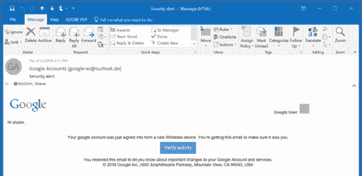
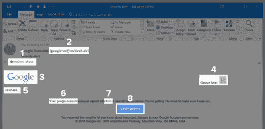
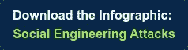

# 你能发现这封邮件中的网络安全漏洞吗？

> 原文：<https://medium.com/swlh/can-you-spot-the-cybersecurity-flaws-in-this-email-e2f87142ae5c>

*最初发表于*[*【www.align.com】*](https://www.align.com/blog/spot-the-cybersecurity-flaws-in-this-email)*。*

通常最严重的网络犯罪始于一个简单的失误:打开一封电子邮件，成为网络钓鱼攻击的牺牲品。太多时候，我们看到整个公司因为一个疏忽造成的错误而被勒索软件控制，导致本来可以避免的重大损失和停机。

比以往任何时候都有更多的恶意电子邮件进入您的收件箱。[电子邮件网络钓鱼攻击](https://www.align.com/blog/common-phishing-attack-vectors)仍然是渗透设备和窃取凭据的流行方法。随着攻击者变得更加顽固和足智多谋，消费者和员工必须对安全威胁保持警惕。很可能我们都见过看起来莫名其妙的电子邮件，但在其他方面看起来是真实的，但这种看起来无害的电子邮件真的安全吗？这里有一个快速测验，测试你发现不安全或危险邮件迹象的能力。完成后，向下滚动查看突出显示的解决方案:

你能发现所有的[危险信号](https://www.align.com/blog/avoid-phishing-scams)吗？

**1。发送到 Outlook 地址的 Google 帐户电子邮件:**
这可能很难识别，因为我们经常对多个地址使用一个邮件客户端，但仔细思考一下为什么 Google 电子邮件会被定向到您的 Outlook 地址是很重要的。如果你没有把那个特定的地址添加到你的谷歌账户中用于恢复目的，这几乎可以肯定是一封伪造的邮件。留意发件人和收件人对于邮件的内容是否“有意义”。

**2。假冒发件人电子邮件:**
最容易识别和辨别网络钓鱼攻击的一种方法是使用看似合法的显示名称，但地址明显可疑的电子邮件。对任何来自一个明显是假的或被伪造成*看起来*真实的地址的公司信件持怀疑态度——你可能必须格外仔细地看，但是用“0”代替字母“O”或一个微妙的拼写错误可能会欺骗你。仔细阅读会帮助你发现一个冒名顶替者。

**3。一个过时的标志:**
在这个例子中，我们使用了一家非常知名的公司，但这同样适用于你经常合作的公司。如果徽标或资产看起来过时或取自旧版本，这是一个危险信号。谷歌已经快三年没用这个 logo 了！一名合法的谷歌员工不太可能犯如此明显的错误。

**4、5。信息缺失或不完整:**
请注意，在这封电子邮件中，攻击者称呼用户的名字(不大写)，并且在右上角有一个难以描述的字段。攻击者希望您相信他们提供给您的最少量的细节，并自己填写细节，以使他们的攻击看起来无害。在这种情况下，典型的谷歌提醒会包括你的照片和名字，而不是一个灰色框和“谷歌用户”

**六、七。可疑的拼写:**
注意“Google”没有大写，“from”拼错了。不是所有的攻击者都会如此草率，但是如果你在一封声称是官方的邮件中看到拼写错误，请保持谨慎。当然，打字错误偶尔会发生，但更有可能是个别攻击者所为，而不是糟糕的拼写检查。

**8。危险链接:**
链接是把你带出邮件客户端进入危险领域的终极武器。点击此按钮可以将您重定向到一个旨在完美模仿谷歌主页的网站，目的是捕获您的登录信息或任何其他攻击方法。始终注意链接是很重要的；将鼠标光标快速悬停在上面可能会显示一个明显伪造的、不安全的网站或指向恶意文件的链接。

***你知道吗？*** 在最近的一份报告中，威瑞森发现 **30%** 的网络钓鱼通信是由目标受害者打开的，其中 **12%** 的用户会点击恶意附件或链接。在另一份报告中，SANS Institute 称 **95%的企业网络攻击都是鱼叉式网络钓鱼**成功的结果。当有疑问时，最好的确定方法是自己找到你需要的信息，而不是跟着网址走。对于我们的例子，你可以直接去 google.com，登录你的帐户，并验证电子邮件中的信息，知道你这样做是通过安全渠道。

你表现如何？有时迹象可能很明显，但聪明的攻击者不断发展他们的策略，所以假货并不总是那么容易被发现。如果您遗漏了我们在这个示例中列出的任何内容，那么这个缺陷可能意味着发现陷阱和成为网络钓鱼的牺牲品之间的区别。为了帮助降低网络安全风险，可以考虑对公司员工进行网络安全培训。

**从 Align 的专家那里获得网络钓鱼防范培训和网络安全咨询的最新信息。** [**今天找专家谈**](https://www.align.com/contact) **。**

**有兴趣了解更多？**下载下面的信息图，了解社会工程师使用的顶级技术。

## 这篇文章发表在 [The Startup](https://medium.com/swlh) 上，这是 Medium 最大的创业刊物，有 317，238+人关注。

## 在此订阅接收[我们的头条新闻](http://growthsupply.com/the-startup-newsletter/)。

