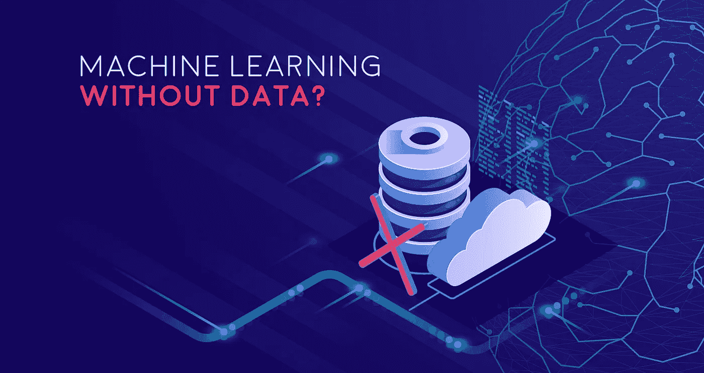
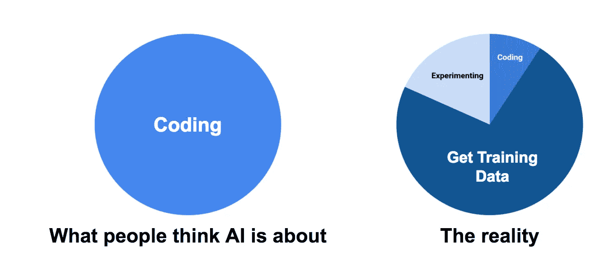
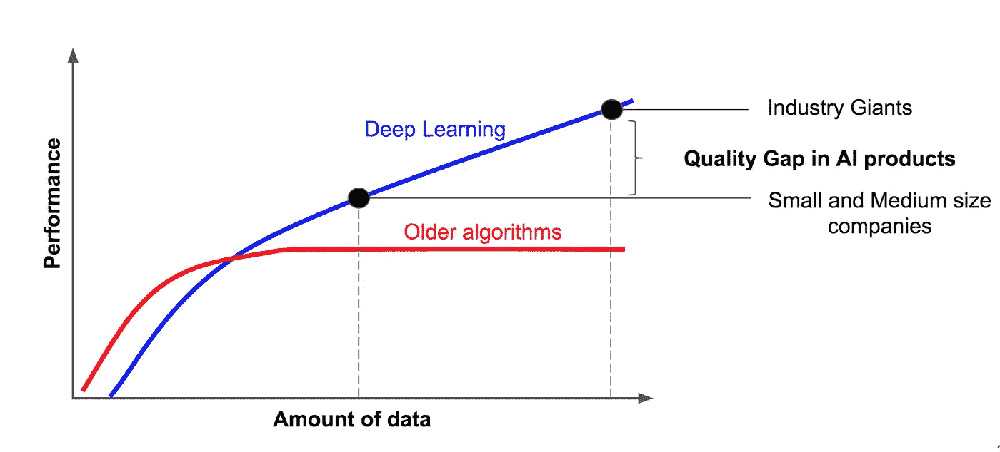
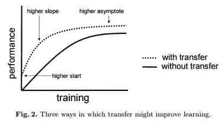

# 你的企业可以在没有数据的情况下使用机器学习吗？

> 原文：<https://medium.com/swlh/can-your-business-use-machine-learning-without-data-340c59bf9fb0>

使用吴恩达关于宇宙飞船及其所需燃料的咒语，任何致力于创造一流人工智能产品的人都需要大量数据来馈送给机器。这种必要性是由计算机要掌握的模型中的多个参数决定的。而且说实话，得到一堆训练样本或者有标记有结构的信息的问题，甚至比只是拿某个算法然后用它更难解决。然而，我们在 [PerceptionBox](https://perceptionbox.io/) ，想要与你分享一些意想不到的数据来源，并解释你如何使用机器学习来改善你的业务。

# 数据源

根据问题的复杂程度，所需的参数数量和数据量也很大。然而，发挥创造力并着手处理昂贵的大数据是一条可行之路。现在你可能很好奇，如果不使用机器大数据的标准概念，如何找到训练机器所需的数据集，例如科学或医疗记录，这可能是一个成本障碍？下面是我们在这方面要说的。

虽然没有任何数据，你通常无法使用机器学习，但是，ML&AI 可以通过几种常见的方式为你的业务提供动力:

*   在 web 上的多个免费数据集中找到所需的数据，这些数据是通常的机器学习系统开发所必需的。
    你可以在很多地方获得对你的业务非常有用的数据集，无论是对于一些 ML 系统培训还是经典数据分析。检查[谷歌数据集搜索](https://toolbox.google.com/datasetsearch)、 [Kaggle](https://www.kaggle.com/datasets) 、[政府数据](https://catalog.data.gov/dataset)或任何其他来源。
*   如果你需要一些特定行业的信息来进行机器学习算法训练，但你可能会在多个网页和网站上找到这些无价信息的碎片，那么你就可以放弃它。
    确实有很多不同的云和本地工具，如 [Octoparse](https://www.octoparse.com/) 、 [ParseHub](https://parsehub.com/) 、 [Dexi.io](https://dexi.io/) 或其他工具，可以帮助您快速、轻松、自动地完成这项工作。
*   大量现成的 ML 解决方案供您使用。您可以使用多种高端技术轻松提升您的业务，如语音识别、计算机视觉、推荐和匹配引擎等。
*   如果这些方法都没有帮助你，那么具有几种特殊技术的深度学习就发挥作用了。

# 朴实无华的深度学习

根据项目重点、行业和详细要求，稍微不同的技术或算法是更可取的，但这取决于您的机器学习开发人员。但其一般建议 ***使用最新最先进的深度学习算法*** 。下面是上面提到的吴恩达的一张有点修改的幻灯片，显示了深度学习最近如此受欢迎的原因。

在我们查看了在手头数据量有限的情况下启动项目的输入之后，让我们进一步深入研究处理现有数据的替代方法:

为了捕捉长期依赖性，人们可能会考虑从**迁移学习**开始。让我们假设你有一个任务要解决，这个任务是高度特定于某个领域的，因此项目所需的数据集的数量是无处可寻的。因此，为了建立新的培训模式，你需要额外的资源，这是昂贵的。

然而，想想在以前的项目中使用的模型，但是共享特定的领域组件。为什么不在你现在处理的项目中雇用这些人呢？这种方法被广泛称为迁移学习。想象一下知识移交——从一个辞职的人手中接管到一个新同事手中。

> “迁移学习是一种新兴的技术，它允许我们将在一个数据集中学习的知识迁移到另一个数据集中。”
> 
> 布拉德利·阿瑟诺

类似于培训模式，一个新人将有一个从离开公司的高级合伙人那里继承来的基础，以建立未来的知识并连接它们。

如果处理少量训练数据造成的不确定性，**领域专长**和**无监督学习**(聚类)可以是关键。例如，有一个假设，你仍然不确定研究的最终结果。因此在训练样本中没有提供目标特征。接下来的想法是建立一个可用于对原始数据进行分类的分类。无监督学习背后的基础是找到数据集的底层结构并对原始材料进行分组。这些是从无标签数据开始的无监督学习的基础。

在这里想想程序化广告，想象一个营销专业人士需要判断一个社区(甚至一个国家)的购买模式的历史记录。一个广告引擎会一方面聚集那些在鞋子上挥霍的人，另一方面聚集那些每个周末去有机商店购买健康的全谷物食品的人。最终，营销大师们获得了更好的洞察力，可以更好地决定广告活动的目标。

聚类是这里的本质，它是关于根据事件、人或事物彼此之间的相关性将它们放在一起，聚类被用作输入机器的洞察力。

最后，你也可以看看**强化学习**。后者是关于试错，因此，当来自先前行动的反馈用作指导和映射时，努力导致在交互环境中的自我发现。利用从经验中学习的技术，一套大棒和胡萝卜帮助机器完善方法，并决定下一步可能采取的最佳步骤。

> 强化学习是迈向机器学习未来的最大一步，在机器学习未来，人工智能系统不是由人类训练，而是由其他人工智能系统训练。

为了说明这个概念，我们可以看看化学实验室的设置，以及科学家如何通过深度强化学习来优化化学反应。由斯坦福大学开展的[研究的核心思想是创建一个模型，该模型将迭代记录化学反应的结果，并选择新的实验条件以增强反应结果。](https://pubs.acs.org/doi/full/10.1021/acscentsci.7b00492)

# 蝙蝠的权利

如果你决定在科技巨头和数据爱好者提供的现有培训材料上增强自己的力量，该怎么办？让我们看看有什么适合你的。

[**谷歌云 AI**](https://cloud.google.com/products/ai/)

从云视频智能到云翻译 API，这就是可以增强您业务的谷歌云人工智能产品。谷歌是一家拥有大量数据来训练其 ML 系统的公司。这就是为什么如果你想努力玩，你可以看一眼谷歌机器学习服务，为你的业务带来无与伦比的规模和速度。

[**微软 Azure AI 平台**](https://azure.microsoft.com/en-us/overview/ai-platform/)

微软 Azure 提供各种人工智能驱动的认知服务，能够为你的业务带来许多神奇的能力，如复杂的信息和数据映射、语音和文本识别、情感评估等。“随用随付”模式让您可以尝试只为您使用的内容付费，同时在旅途中扩展您的业务。

[**亚马逊机器学习**](https://aws.amazon.com/free/?nc2=h_ql_pr&awsf.Free%20Tier%20Types=productcategories%23ai)

为了满足所有类别开发人员的需求，亚马逊为不同水平和项目专业知识的科学家开发了一套全面的工具。在这些评价中，你可以找到沃达丰、Expedia、瑞安航空等知名企业的好评。但除了付费产品，亚马逊还有 AWS 免费层，特别是它的 SageMaker，面向那些希望使用完全托管的平台来创建、训练和运行机器学习模型的专业人士。

# 机器学习味道

现成的机器学习 API 或定制的机器学习软件与不同的第三方工具或您的内部数据相结合的使用示例有很多。

为了让您简单了解如何使用这些工具，并通过机器学习改善您的业务，让我们想象一下，您拥有一个巨大的女性服装电子商务网站。你现在有各种不同的品牌和型号的存货。每个电子商务公司面临的最大问题之一是正确的库存管理，以最大限度地减少库存余额(减少存储成本和利润损失)。因此，每个大型网上商店面临的一个主要问题是在接下来的季节选择哪些品牌和型号以及数量。正确的选择可能会显著降低库存余额并增加收入！

让我们想象一下，你想利用机器学习和数据科学发展的全部力量，了解你的客户喜欢当前的哪些品牌和型号，以及哪些型号将在下一季流行。这种情况很有可能发生，不是吗？

为了使您的商业计划和股票规划达到最佳效果，您可以**收集/挖掘/提取以下数据**:

*   从你的客户关系管理或库存管理系统中获得你所有商品的销售历史。我们假设你店里的每件商品都有所有细节(类型、类别、型号、颜色、特征等)。).
*   从您的网站下载客户对特定商品的所有评论。
*   使用一些社交媒体监测工具(如 Hootsuite 和/或 Google Alerts)或直接使用 Twitter API 进行意见挖掘，收集每个服装品牌和型号的所有提及。
*   查看时尚杂志或一些受欢迎的美妆博主的 RSS 订阅源，收集所有与特定类别或细分市场相关的文章。

在你收集了所有这些数据并为将来的使用做好准备后，**你可以应用一些机器学习技术:**

*   使用数据聚类技术找出衣服的类型、特征、颜色等。更受欢迎，卖得更好。
*   查看[谷歌云翻译](https://cloud.google.com/translate/)以了解不同语言和不同国家的趋势(如果您在全球运营，您可以稍后使用这些信息来更好地定位您的产品)。
*   使用[Amazon understand](https://aws.amazon.com/comprehend/)来检查所有关于每件产品、型号、类型，比如说，一件衣服或它的颜色的提及，并了解提及或评论的文本是积极还是消极的。
*   通过 [Azure Text Analytics](https://azure.microsoft.com/en-us/services/cognitive-services/text-analytics/) 将文本与网络上的附加信息相关联，识别产品评论或社交媒体提及中的多个实体，并将不同的实体相互链接。
*   检查你从上面提到的所有东西中收集的所有东西，找出哪些产品、衣服类型、颜色等等。**将会在你的特定部分观众中变得更受欢迎，更令人满意。**
*   ***盈利！***

上面提到的一切在没有数据的情况下都是可能的，是的，你需要一个真正熟练的[机器学习开发人员](https://perceptionbox.io/ai-machine-learning-development)来实现这一点(找出数据通道，预先学习数据准备，如数据清理或构建聚合指标，定制模型训练，整体系统组装)。但是我们希望现在你明白你不需要惊人数量的数据来从 ML 的力量中获益。

无论你是机器学习行业的新手，还是已经尝到了削减成本的 ML 魔力的滋味，都有替代资源和技术来增强你的业务，并充分利用新兴技术来增加你的收入。

## 这篇文章发表在 [The Startup](https://medium.com/swlh) 上，这是 Medium 最大的创业刊物，拥有+ 377，345 名读者。

## 在此订阅接收[我们的头条新闻](http://growthsupply.com/the-startup-newsletter/)。

