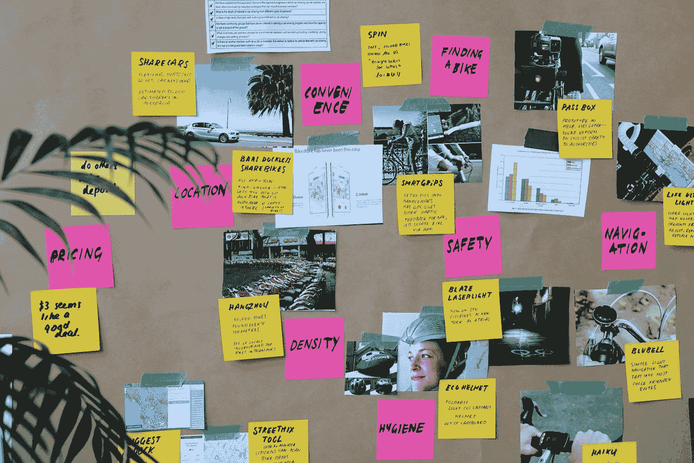

# 加拿大需要提升它的科技水平

> 原文：<https://medium.com/swlh/canada-needs-to-elevate-its-tech-game-c361c877107>

是时候增长黑客了

Image by [Marvin Meyer](https://unsplash.com/@marvelous?utm_source=medium&utm_medium=referral) on [Unsplash](https://unsplash.com?utm_source=medium&utm_medium=referral)

2016 年，[加拿大统计局](https://www150.statcan.gc.ca/n1/pub/11-627-m/11-627-m2017032-eng.htm)分享说，大多数加拿大人每天都在使用技术。事实上，他们中几乎 60%的人认为，由于使用了技术，生活变得更好了。

我们对技术的理解各不相同，但有趣的是我们如何评价技术。

统计数据显示:

*   77%的加拿大人认为技术帮助他们更好地与他人交流
*   66%的加拿大人声称科技帮助他们节省时间
*   52%的加拿大人表示，技术帮助他们做出更明智的决策

> 然而，只有 36%的加拿大人认为科技帮助他们更有创造力。

最后一个数据有点令人震惊。在一个技术推动创新、鼓励创造性思维的时代，这么低的数据令人惊讶，也难以消化。

但这是为什么呢？

Image from Google

在过去的一周里，我有机会参加了加拿大科技行业今年最受期待的活动——T2 Elevate Tech Fest。

> Elevate Tech Fest 汇集了来自全国各地的技术爱好者，来进行破坏、创造、分享和创新。

上周二早上坐在主舞台前是一种前所未有的体验。你被传送到了一个不同的空间。一个有着灵感氛围、创造力氛围和兴奋感的空间，让你起鸡皮疙瘩，并给你带来改变的能量。

我们在那里学习、实验、开创和建设一切都是为了——我们如何利用技术来改善世界。

想象一下:大约上午 10:00，Razor sule man(Elevate Tech Fest 的首席执行官)走上台来谈论加拿大在技术投资方面的立场。根据彭博报告，当听到中国在世界创新指数上排名第 22 位时，观众感到震惊。你开始想，这怎么可能！？我们缺什么？

技术投资塑造创新之路。那么，我们如何实现这一点呢？通过:

# 提供访问权限

Image by [Samuel Zeller](https://unsplash.com/@samuelzeller?utm_source=medium&utm_medium=referral) on [Unsplash](https://unsplash.com?utm_source=medium&utm_medium=referral)

加拿大被认为是一个发达国家，因此，我们假设每个人都可以接触到像多伦多、滑铁卢和温哥华这样的科技中心的技术。但是我们忘记了，不管我们觉得自己有多先进，总有改进的空间。

加拿大的许多地区(尤其是农村)可能不具备科技中心那样的优势来鼓励人们创新。他们缺乏推动创造力前进的基石。

事实上，随着年轻一代出生在一个科技唾手可得的时代，科技公司和政府应该鼓励学习，并赋予年轻人跳出框框思考的能力。他们应该获得必要的工具来支持他们的创新。

鸢·吕特克( [Shopify](https://medium.com/u/bab76dfc19b0?source=post_page-----c361c877107--------------------------------) 的首席执行官)提到，作为一个国家，我们应该以一种系统的方式来解决这个问题。我们必须接触年轻一代，让他们有能力利用各种方法来实现增长和促进经济发展。

> 我们需要激发人们的好奇心。

# 体验数字

Image by [James Bold](https://unsplash.com/@jamesbold?utm_source=medium&utm_medium=referral) on [Unsplash](https://unsplash.com?utm_source=medium&utm_medium=referral)

我们比以往任何时候都更经常地通过各种镜头体验生活。

如今，人们希望以不同的方式思考他们的经历。一旦你将这种体验数字化，它会改变一切。

> “现在在这个星球上获得影响力的唯一途径是通过技术”。—惠特尼·沃尔夫(邦布尔公司首席执行官)

惠特尼通过 Bumble 取得了巨大的成功，这一切都是因为她想以不同的方式数字化约会体验——通过赋予女性发起对话的权利。惠特尼用技术和成长改变了约会游戏，开辟了她的成功之路。

我们希望大企业能够创造数字化体验，改变人们与其业务互动的方式。但是，当你向那些具有企业家心态的人提供技术时，你就让他们能够以自己的方式思考、梦想、颠覆和创造。他们的观点为数字体验提供了不同的视角。

> 是时候挑战现状，创造改变我们思维方式的体验了。

# 授权创作

Image by [Nikhil Mitra](https://unsplash.com/@nikhilmitra?utm_source=medium&utm_medium=referral) on [Unsplash](https://unsplash.com?utm_source=medium&utm_medium=referral)

创新不只是企业家的专利。伟大的想法来自任何地方，来自每个角色，来自人们旅程的每个阶段。每个人都应该创新，设计解决问题的思路。

为了打造卓越的产品，我们必须了解客户的挣扎。想象一下能够使用工具消除任务中的摩擦——你正在开始使用为消费者消除障碍的技术。

人们通常害怕说出来，因为他们觉得自己不是企业家或创造者。事实上，疯狂的想法可能来自任何地方和任何人。无论你是创客、理想主义者、战略家还是建设者，每个人都好奇喜欢解谜。

> 改变一个行业很难，但当你获得资源和激励你的人时，事情会变得容易。

在当今时代，技术让我们变得灵活。因此，问题就变成了，我们如何利用这种力量，让**彻底改变人们体验科技的方式？**

Razor Suleman 分享了塑造加拿大科技融合未来的三大支柱:

# 我们必须走向全球

Image by [Fernando @cferdo](https://unsplash.com/@dearferdo?utm_source=medium&utm_medium=referral) on [Unsplash](https://unsplash.com?utm_source=medium&utm_medium=referral)

*   我们必须与其他市场建立战略伙伴关系，共同创新。鼓励多元化的产品和生产方式。
*   我们必须关注未触及的领域。探索尚未被发现的领域，即使他们已经找到了新的路径。
*   我们必须致力于解决复杂的问题。

# 我们必须调动战略资本

“two person holding mug and pen beside turned-on MacBook” by [rawpixel](https://unsplash.com/@rawpixel?utm_source=medium&utm_medium=referral) on [Unsplash](https://unsplash.com?utm_source=medium&utm_medium=referral)

*   我们必须增加我们经济中明智资金的供给。支持我们未来经济增长的投资。
*   我们必须让这些资产经得起未来的考验，并更多地接触科技领域。我们不是在与硅谷竞争，我们是同一场游戏中的合作伙伴。
*   战略性地投资改变游戏规则的技术。我们是为了赢得它。我们不仅仅是为了进入季后赛而比赛，我们要表现出来，站起来，向前一步并采取行动。

# 我们必须让这个地方成为人才成长的目的地

Image by [Nathaniel Bowman](https://unsplash.com/@nathanielwbowman?utm_source=medium&utm_medium=referral) on [Unsplash](https://unsplash.com?utm_source=medium&utm_medium=referral)

*   这似乎是一个短期风险，但它有一个长期的收益
*   这种类型的投资是一个信号，表明人才将加拿大视为一个充满机遇的国家。
*   在这里，你向最优秀的人学习，为最优秀的人工作，创造最优秀的人。
*   我们需要加拿大被视为吸引人才和突破性公司的磁石。

在这一周里，我们有机会听到许多有才华的人在一些令人惊叹的公司工作的故事。以下是我发现的一些影响力很大的故事，以及我从中吸取的教训。

# SoulCycle:民有民享

Image from Google

SoulCycle 的创始人和前首席执行官朱莉·赖斯(Julie Rice)将 SoulCycle 定义为一项以人为本的业务。

> 这是一个人们相互扶持、相互激励而不是相互竞争的空间。

她的团队希望创造一个空间，让人们感受到自己的声音，他们很重要，他们的要求得到满足，同时享受健身的乐趣。SoulCycle 是为那些寻求以不同方式体验健身的人而创建的。对于不想被健身房吓倒的人来说。对于那些想要社区感的人来说。

> **Julie 的建议:**不要停止倾听客户的意见，因为当你这样做时，你就失去了与改善和参与的联系。

# 互联——给你的牛排增添一点活力

Image by [Markus Spiske](https://unsplash.com/@markusspiske?utm_source=medium&utm_medium=referral) on [Unsplash](https://unsplash.com?utm_source=medium&utm_medium=referral)

Connected 的首席执行官麦克·史登曾经认为他们只是产品人员。直到他的营销团队决定举行一次场外活动，向他展示产品不仅仅是技术，还有如何包装和展示。

迈克分享了他那天学到的非常有价值的东西，

> 我们不仅仅是产品人员，我们希望推动改进。我们必须让我们的工艺咝咝作响。

他称这种产品为牛排。当你去牛排馆时，不仅仅是牛排做得有多好——是的，这是为什么牛排馆以其食物而闻名的一个重要因素，而是配菜、配菜和与牛排搭配的饮料为消费者创造了一种食物体验。他告诉我们将这种想法应用到所有产品中。

作为创作者，我们希望能够策划体验并做出改变，这些体验需要令人难忘。

> **迈克的建议:**好产品解决问题——提供实用性。伟大的产品会影响、激发和点燃情感联系。

# first mark Capital——创建连接

Image by [rawpixel](https://unsplash.com/@rawpixel?utm_source=medium&utm_medium=referral) on [Unsplash](https://unsplash.com?utm_source=medium&utm_medium=referral)

凯瑟琳·乌尔里希(FirstMark 的经理总监)是一位经验丰富的产品经理。她将亚马逊 Prime 和汽车保险作为真正与客户联系的产品的主要例子。

凯瑟琳强调，作为创新者，创业的成本可以很低，但质量仍然很重要。

> 为了提高质量，我们必须专注于消费者想要什么，以及我们如何才能轻松地将它提供给他们。

产品的质量是让消费者想要不断回来的原因，但是将这种质量与以下 4 个关键因素结合起来，你就踏上了打造一个伟大产品的道路。

1.  解决消费者问题——这是所有优秀产品的一个明显主题
2.  协调和激励——给用户一个与你互动的理由
3.  UX 设计——展示和印象很重要

Catherine 还将我们带回了产品的三个 p，以及如何在我们的构建过程中利用它们。

*   人——让你的员工多样化。在产品、技术和人之间找到合适的动力来建立伙伴关系。
*   过程——使团队能够自主和自我驱动。让他们找到适合他们的方法。
*   原则——以客户为中心，相信你的团队会实现这一价值。

> 凯瑟琳的建议:产品不仅仅是你构建的东西，而是一种端到端的体验。增强这种思维的一种方法是消除对进步的恐惧，创造一种行为状态的改变。

# Shopify —我们不是我们的客户

Image by [Jo Szczepanska](https://unsplash.com/@joszczepanska?utm_source=medium&utm_medium=referral) on [Unsplash](https://unsplash.com?utm_source=medium&utm_medium=referral)

satish an war(Channels[Shopify](https://medium.com/u/bab76dfc19b0?source=post_page-----c361c877107--------------------------------)副总裁兼总经理)告诉我们，在创新方面，多样性和同理心非常重要。

> 当要为你的客户创造有影响力的东西时，产品、团队和工作的多样性同样重要。

他提到了他同事的一句话:“当我们在系统层面工作时，当我们在决策桌上重视多样性时，变革就会发生。”

现在应用到我们构建产品的方式上，它给了我们一个全新的视角。

他声称我们不是我们的客户，当我们开始思考时，会发生以下事情:

*   我们无法扩展
*   我们的客户在不断变化，但我们不会
*   当问题继续增长时，我们远离客户的问题
*   我们的客户群开始变得越来越多——越来越多样化
*   我们的内部团队成长，我们开始分裂

> **萨蒂什的建议:**我们上学并不总是为了我们生活中想做的事情。作为产品经理，我们希望释放 it 的潜力，让我们的客户能够从中获益。公司里的每个人都在开发产品，为什么不一起成长，一起进步呢？

# 电影城——背景决定一切

Image by [Clem Onojeghuo](https://unsplash.com/@clemono2?utm_source=medium&utm_medium=referral) on [Unsplash](https://unsplash.com?utm_source=medium&utm_medium=referral)

deepika Malik(Cineplex 副总裁)认为，我们为客户扮演着促进者、推动者、礼宾者、沟通者等角色。

> 我们带他们经历一段旅程，让他们获得他们期待的体验。

但是没有上下文，这一切都是不可能的——上下文就是一切！

作为建造者，我们总是考虑显性因素，但我们往往会忘记，在创造有意义的体验时，隐性因素同样重要。感觉、状况、互动都是经验的来源。一次旅行必须尊重这种背景。

> **迪皮卡的建议【分享她同事的想法】:**这都是关于访问——惊人的吸引力、巧妙的连接、引人注目的内容、引人入胜的安可、复杂的服务、超级简单。

# Knix —从头到尾拥有关系

Image by [Jessica F](https://unsplash.com/@jessica_favaro?utm_source=medium&utm_medium=referral) on [Unsplash](https://unsplash.com?utm_source=medium&utm_medium=referral)

现在营销中的个性化就是一切。Joanna Griffiths(Knix underwear 的首席执行官)从第一天开始就与她的客户保持联系，并利用他们的故事来激发创作更多 Knix 产品的灵感。

> 人们想要故事，他们想要品牌的真实性。

通常，旧的创新方式意味着我们告诉客户他们想要什么，我们基于如何在竞争中脱颖而出进行营销。

现在，我们问顾客他们想要我们做什么，我们向他们学习，为他们制造。我们重新想象我们的产品可能是什么，它能解决什么问题，可能性是无限的。

她说 Knix 之所以成功，是因为他们从头到尾都拥有客户关系。他们尝试通过其他商店零售路线，发现他们的关系是断开的。他们每天都在努力建立和培养与顾客的积极关系，让顾客对自己的身体感觉良好。

> **乔安娜的建议:**分享你的产品之旅。人们想知道你是怎么做到的，他们想知道你的推理。分享你的原型，你的实验，你的经验。

我们生活在一个必须高度关注客户体验的时代，这种体验需要始终如一。因此，这里是通过构建有意义的体验的高质量产品来解决复杂问题。

## Anjali Arya 是 RL Solutions 的产品营销人员，也是来自加拿大多伦多的新兴媒体博客作者。有什么有趣的分享吗？或者只是好奇她的工作，在 [LinkedIn](https://www.linkedin.com/notifications/) 、 [Medium](/@arya.anjali) 和 [Twitter](https://twitter.com/AnjaliAryaa?lang=en) 上关注她，开始一段对话！

如果你喜欢你所读的，别忘了表达你的爱——鼓掌吧！

## 这篇文章发表在 [The Startup](https://medium.com/swlh) 上，这是 Medium 最大的创业刊物，拥有+ 374，685 名读者。

## 在这里订阅接收[我们的头条新闻](http://growthsupply.com/the-startup-newsletter/)。

