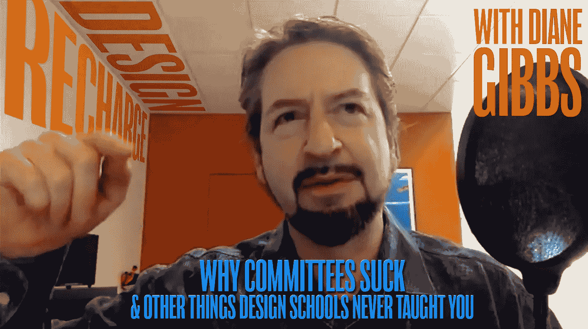
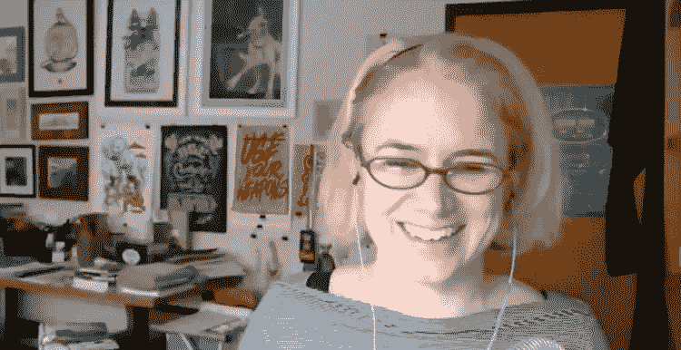
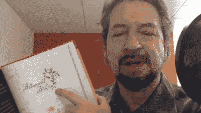

# 对创业、品牌、客户和设计的坦诚见解(设计学校不会教你的东西)

> 原文：<https://medium.com/swlh/candid-insights-on-startups-brands-clients-and-design-the-stuff-they-dont-teach-you-in-design-93eac9eb34fc>

黛安·吉布斯(Diane Gibbs)是设计再充电的无情主持人，这些年来多次慷慨地邀请我，涵盖设计、客户关系、插图、文字、品牌等等。

**Diane Gibbs**, host of Design Recharge

正如黛安所说:

> “我总是能从我们的谈话中获益良多。我已经能够从这些对话中获得一些收获，并能够在我的业务战略和设计战略中加以实施。他帮助我学会了如何与客户交谈。”

但随着我的新书《品牌介入 [*、将你拥有的品牌转变为你需要的品牌的 33 个步骤》的发布，我不仅仅是一个客人，而且是所有日子中的情人节，这是不可避免的。*](http://a.co/igIfhfa)

“Committees are a death sentence”

我们讨论了许多话题，笑得很开心。最重要的是，对设计和品牌的深刻见解给这次面试增添了亮点。

没有更多的序言，这里有一个奇妙的探索，是什么让品牌在今天的商业环境中真正发挥作用。

## 这篇文章发表在 [The Startup](https://medium.com/swlh) 上，这是 Medium 最大的创业刊物，拥有 299，352+人关注。

## 在此订阅接收[我们的头条新闻](http://growthsupply.com/the-startup-newsletter/)。

