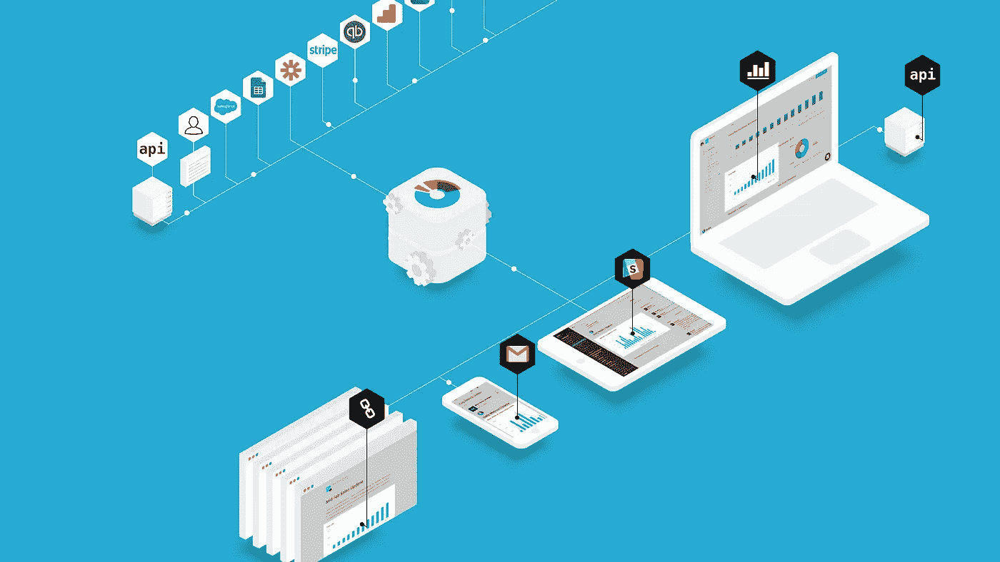
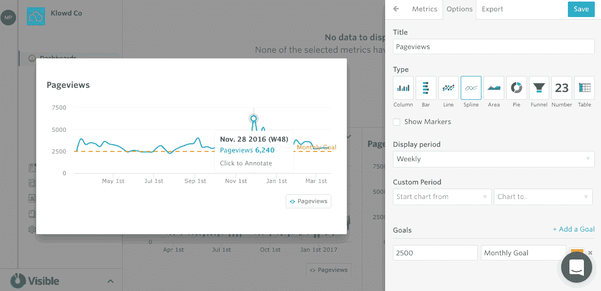
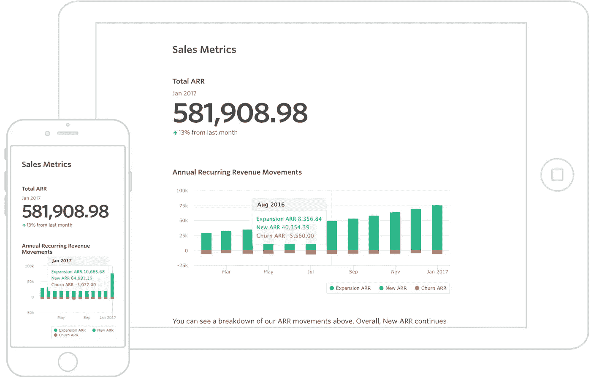
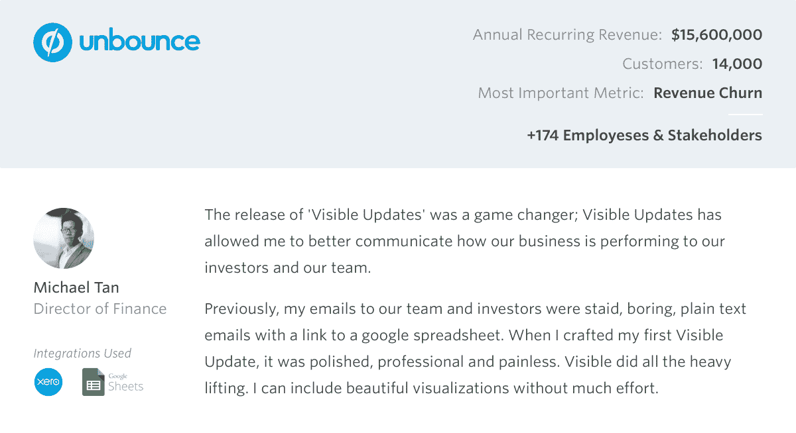

# 使用 Visible 捕获关键绩效数据，并与您的利益相关方分享您的故事

> 原文：<https://medium.com/swlh/capture-key-performance-data-and-share-your-story-with-your-stakeholders-using-visible-d8ec8b48e054>

*最初发表于*[*【siftery.com】*](https://siftery.com/stories/capture-key-performance-data-and-share-your-story-with-your-stakeholders-using-visible)*。*

[**可见**](https://visible.vc/) [将](https://visible.vc/explore/integrations/)与您已经用来运营业务的应用程序集成，如 [**G Suite**](https://siftery.com/g-suite-formerly-google-apps-for-work) 、 [**Salesforce**](https://siftery.com/company/salesforce) 、 [**Stripe**](https://siftery.com/stripe) 、**等，以帮助自动获取您的所有关键绩效指标，并在一个平台中利用您的所有利益相关方。**

**他们对您的所有 KPI 进行转换、标准化和集中化，然后将这些数据与相关的上下文可视化，以创建一份引人入胜的报告。**

**[**格里贾科曼科尔耶**](https://medium.com/u/f6f05bc6266b?source=post_page-----d8ec8b48e054--------------------------------) 采访了 [**迈克尔普勒斯**](https://medium.com/u/b22ff86ffe6e?source=post_page-----d8ec8b48e054--------------------------------) ，首席执行官 [**可见**](https://medium.com/u/279ece005ab3?source=post_page-----d8ec8b48e054--------------------------------) 了解更多。**

****

## **你能告诉我们你在做什么吗？什么是可见的？**

**[**可见**](http://visible.vc) 是 2000 多家企业使用的利益相关者数据报告平台。我们通过漂亮的报告帮助您的所有团队成员、投资者和利益相关者保持参与。**

## **你为什么要建这个？有特别的灵感来源吗？**

**Visible 是由一群企业家和投资者创办的。作为投资者，我们无法很好地了解每家投资组合公司的情况。我们希望确保我们的投资组合公司能够尽可能地利用我们，通过帮助解决任何近期机会或问题来提高他们的成功机会。**

**作为运营商、企业家和高管，我们对目前市场上的数据报告工具并不满意。我们希望为运营商创造真正有价值的产品。太多的时间花在拼凑数据/报告上，我们相信您的时间可以花在更有影响力的领域。我们希望帮助重新分配用于决策、改善结果和以更具说服力的方式讲述故事的时间。**

****

## **Visible 与市场上已经存在的有何不同？你的产品有什么独特之处，为什么你认为公司应该使用 Visible？**

**在我看来，就可见性而言，我们有三大独特优势。**

1.  **我们继续努力做到“数据不可知”。我们希望连接到您的关键性能数据，无论它位于何处。这可能是在谷歌工作表、 [**、Salesforce**](https://siftery.com/company/salesforce) 、 [**Mixpanel**](https://siftery.com/mixpanel) 或任何其他你可能用来运营你的业务的云应用中。我们开始时是一种你可以输入数据的形式，现在已经发展到尽可能创造一种无摩擦的体验。**
2.  **我们想给你工具来讲述数据的故事。仪表板可以让你快速了解趋势，但不能告诉你数据的真实情况。没有上下文的仪表板可能非常危险。我们希望通过注释、更新等方式增加内容，让客户有机会讲述他们的故事。我们也试图成为“媒介不可知论者”。你可以通过电子邮件、PDF 文件、共享链接向 Slack 发送完整的更新……这样你就明白了。**
3.  **商业用户友好。如今，拥有好看的产品和用户体验是重中之重。我们希望确保任何可以使用 Excel 或 Salesforce 等工具的人都可以使用 Visible。您不需要让数据科学家或工程师参与进来，就可以获得 Visible 的全部功能。**

****

## **目前在您的领域中，谁是最大的竞争对手？**

**这取决于你试图解决的问题，但在投资者报告方面有类似 [**AngelLoop**](https://siftery.com/angeloop) 和 [**FounderSuite**](https://siftery.com/company/foundersuite) 的工具，然后有类似 Google Data Studio、 [**Power BI**](https://siftery.com/microsoft-power-bi) 和[**Amazon quick sight**](https://siftery.com/amazon-quicksight)的工具用于内部 BI 报告。**

## **您的客户如何使用 Visible？你能分享一些不同的使用案例吗？**

**投资者报告——投资者报告是我们的生计。我们就是这样开始的。首席执行官、创始人和金融专业人士通常使用 Visible 进行投资者报告。它们连接到集成，如[**【Quickbooks】**](https://siftery.com/intuit-quickbooks)[**Xero**](https://siftery.com/xero)和 Google Sheets，并提供可能发给投资者、董事会成员和团队成员的每月投资者更新。我们也有客户用它来筹款！我们的一个客户 [**Unbouce**](https://siftery.com/unbounce) 就是一个很好的例子。**

**内部报告—我们增长最快的使用案例。这是像[**Skyscanner**](https://siftery.com/company/skyscanner)[**Braxton Brewing**](https://siftery.com/company/braxton-brewing-company)等等很多公司使用的。他们连接到我们的 [**集成套件**](http://visible.vc/explore/integrations/) 和产品仪表盘，以及他们内部团队的每周更新。我们看到销售经理、营销团队、财务和运营团队以及支持团队都在使用内部报告。**

****

**客户报告——这个用例仍在开发中，但非常有前途和令人兴奋。举个简单的例子: [**Lessonly**](https://siftery.com/lessonly) 每周使用 Visible 通过我们的更新功能将数据分享给他们的大型企业客户，告诉他们如何利用 Lessonly 并为接下来的几周提出建议。通常，我们看到客户报告由客户成功专家处理，每周向每个客户发送一次更新。**

## **Visible for 有没有您没有想到或预料到的独特用例？**

**实际上，我们在新西兰有一个教堂使用 Visible 向他们的会众报告数据。我们认为这很酷！**

## **有什么早期的“成长秘诀”或策略促成了你现在的成功吗？**

**内容一直是我们新客户的稳定来源。这是你必须尽早投资的事情，并确保保持强劲的节奏。他们最初的回报似乎很小，但随着时间的推移，他们继续复合和支付股息。**

**让顾客开心！我们为强大的支持和优秀的产品而自豪。这本身并不是一种增长黑客，但客户和口碑推荐是目前为止我们获得新客户的最佳渠道。**

## **在早期构建产品时，最大的挑战是什么？你是如何解决的？**

**当我们开始可见的时候，我们服务和销售给太多的主人。我们试图成为一个可以被公司、投资者、投资者(LP)和更多人使用的工具。**

**我们观察了市场，决定把重点放在我们能赢的地方，那就是公司报告。我们删除了很多功能，并有意搅动了一些早期客户。这些决定并不容易，但却获得了巨大的回报。**

## **你加入的最有趣的整合是什么？有什么对你特别有影响的吗？**

**我认为，如果你调查我们的客户，他们会说 Google Sheets 是一个彻底的游戏改变。仔细想想，电子表格是世界上最常见的“编程语言”。电子表格可以用于任何事情，任何人都可以使用。**

**我们的 Google Sheets 集成帮助我们的客户打开了太多的锁，这是巨大的。我们刚刚被接纳为谷歌云技术合作伙伴之一，这非常令人兴奋。**

**Salesforce 还帮助我们将产品推向市场，并帮助我们了解世界上最好的 SaaS 公司是如何运营的。**

**整合对我们来说意义重大。我们直接支持 10 和另外 750+ (via [**Zapier**](https://siftery.com/zapier) )。我们将继续投资改进我们当前的集成，并推出新的集成。**

## **你运营公司所依赖的顶级工具是什么，你如何使用它们？**

**[**Segment**](https://siftery.com/segment) — Segment 帮助我们在应用程序中跟踪事件数据。这对了解我们的客户如何使用 Visible 以及帮助我们做出更好的产品决策产生了难以置信的影响。**

**[**对讲机**](https://siftery.com/intercom) —对讲机是我们客户群的脉搏。我们可以看到我们的用户如何使用或不使用 Visible，并动态地向他们发送消息。我们可以轻松地对任何支持请求进行分类，并为其补充新的培训产品。我们是超级粉丝。**

**[**Trello**](https://siftery.com/trello) —我们用 Trello 做几乎所有的事情。从产品管理到试用用户管理，Trello 让每个人都保持一致。**

**[**G Suite**](https://siftery.com/g-suite-formerly-google-apps-for-work)—Gmail、G sheets 和 Google Calendar 是我们喜欢使用的主要生产力工具。这应该是不言自明的；)**

**[**Slack**](https://siftery.com/slack) —如果对讲机是我们客户群的脉搏，那么 Slack 就是我们公司内部的脉搏。几乎所有的东西都流经松弛。我们公司内部邮件已经到了 0%左右。**

****—我知道这是老生常谈，但我们每周都用 Visible 向团队内部报告，每月向投资者报告。****

> ****你使用可视并推荐它们吗？你可以在这里做[https://siftery.com/visible?recommend](https://siftery.com/visible?recommend)。****