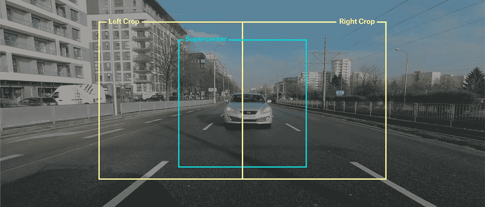
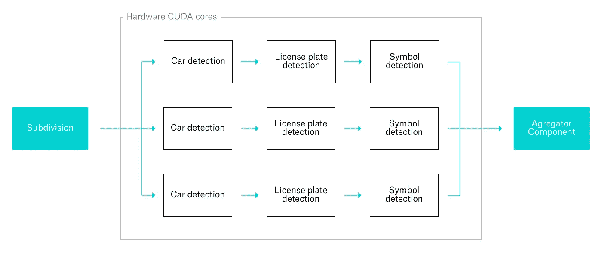
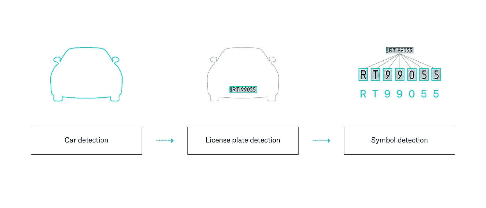
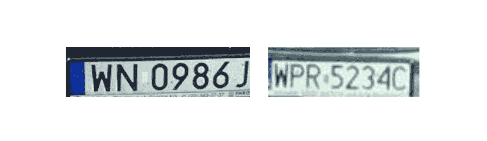
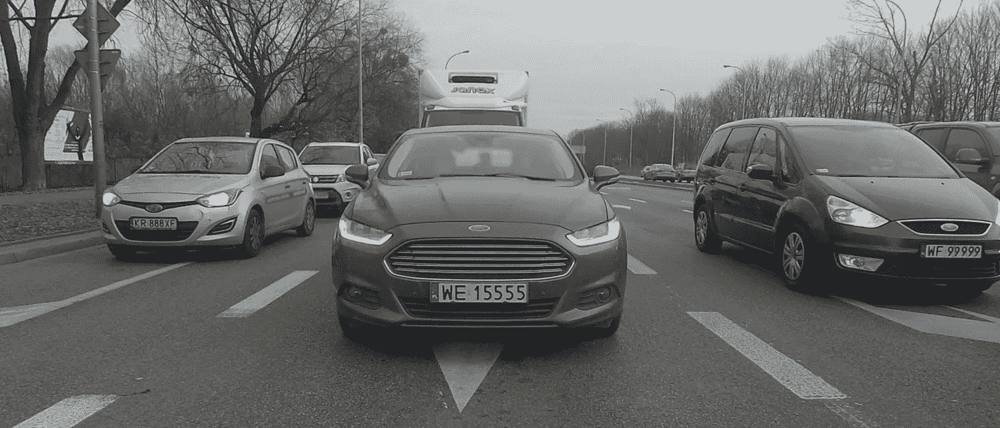

# 基于 DNN 网络的汽车检测与识别

> 原文：<https://medium.com/swlh/car-detection-recognition-using-dnn-networks-3ac7603d2e9b>

关于 2017 年汽车行业的创新，已经说了很多，也做了很多。基本的驾驶机制和推进正在被电动引擎和替代燃料生动地破坏……与此同时，汽车获得了自动驾驶能力和深度环境意识——这要归功于计算机视觉和机器学习。

随着我们在这个方向上走得更远，许多增强车辆体验的新用例变得可能，并且应该被探索。我们正在为客户构建的一个项目需要一种收集和处理汽车周围信息的方法:识别附近的其他汽车、街道标志、人、建筑地标和基础设施元素。

可以理解的是，没有一个平台可以提供这种服务，我们可以很容易地根据自己的需求进行调整。我们想深入研究这个话题很长一段时间，所以我们急切地抓住这个机会，开始构建我们自己的解决方案！

我们从一开始就知道，我们希望这个系统是通用的，完全基于神经网络和深度学习，因为它在其他项目中对我们来说非常好。也就是说，我们需要一个有形的、具体的用例来验证现实生活中的结果。我们决定从一个流行的问题入手:检测汽车和车牌。

车牌检测是一个常见的用例，已经解决了(多少)几次，但我们觉得我们可以提供比当前选项更好的东西。

# 检测方法

我们最初的决定之一是使用高质量的 4K 广角镜头后置摄像头。由于广角，我们能够捕捉周围地区的大背景。高分辨率让我们有机会提取很多细节，即使是相对较远的物体。

经过一些实验后，我们决定将图像细分为 3 个不同的区域，作为算法的第一步。这是很重要的，因为我们想切掉大面积的“天空”和不相关的空白内容。此外，并行处理较小的图像比处理一幅大的高分辨率图像更有效。最后，处理完整的 4K 输入对于硬件来说有点吃不消。

我们发现，在汽车后面的“超级中心”里，发生了许多非常有趣的事情。这是检测对我们来说最重要的图片区域，所以我们让它更突出，用更高的缩放因子重叠左/右裁剪。

对于检测本身,[我们](https://ynd.co/)决定使用三步法，使用 3 个单独训练的 DNN 网络。首先，我们检测并隔离汽车本身。然后，我们切下车牌，最后我们通过一个网络传递这些符号，挑选出单个的字母和数字。

最后，来自所有 3 个图像的检测数据被聚集/结合在一起，消除可能的重复。

对于每一步，我们都使用了定制的网络:

1.  汽车— 90，0 00 次迭代
2.  板— 102，000 次迭代
3.  数字/字母— 97 000 次迭代

为了准备网络，我们绕着城市转了很多圈，并捕捉了实际的镜头来输入训练系统…经过我们的 QA 团队细致的描述和标记过程。

后来，在对解决方案进行实际测试时，我们总是记录下一切，并将数据再次反馈到系统中以改进网络(在开始时，我们使用公开的汽车拍卖对模型进行了预训练)

至于检测本身，我们使用了一个最先进的卷积神经网络与包围盒回归和分类。这种流行的方法避免了传统方法的缺陷，传统方法通过重新利用分类器来执行检测，这种方法非常慢，并且不容易扩展到现代 GPU 加速硬件。该方法已在论文中[进行了描述，并具有切实可行的实施效果。](https://arxiv.org/abs/1506.02640)

# 为什么不是 OpenALPR？

[OpenALPR](https://github.com/openalpr/openalpr) 是一个流行的开源库，用于从图像中提取车牌号码。由于有一些[非常热衷于](https://medium.freecodecamp.org/how-i-replicated-an-86-million-project-in-57-lines-of-code-277031330ee9)关于其准确性的文章，很自然地会问为什么我们决定设计自己的深度学习解决方案，而不是重用一个现成的组件。

这有几个原因:

1.  **通用方法:**如前所述，车牌只是一个测试用例，我们本身并不感兴趣。我们真正想要的是建立一个系统，用于快速检测、识别、分类并对道路上可见的*不同*元素做出反应，包括但不限于牌照。这就是为什么我们需要一个更深入、更深远的解决方案。
2.  **硬件加速:**我们希望解决方案速度快，并且我们希望它在未来随着我们期望的领域的技术进步而扩展。当我们在 [Nvidia](https://www.nvidia.com/en-us/self-driving-cars/) 平台上运行我们的汽车软件时，这意味着我们希望支持硬件提供的 256 个并行计算 [CUDA 内核](https://en.wikipedia.org/wiki/CUDA)。虽然 OpenALPR 通过底层的 [OpenCV](https://en.wikipedia.org/wiki/OpenCV) 提供了一定程度的 GPU 支持，但由于 [LBP 机制](https://en.wikipedia.org/wiki/Local_binary_patterns)，它只是部分支持，而且我们无法让它在我们的平台上工作。
3.  **检测质量:** OpenALPR 和所有类似的解决方案都经过优化，能够在理想的照明/视觉条件下处理特定的受限数据集。各国车牌不同，OpenALPR 检测质量也不同。它似乎很好地工作与美国板，有点接受与欧洲板和向下可悲的新加坡板，这只是看看我们测试的。相比之下，我们基于深度学习的解决方案只需要一点额外的训练数据就可以检测新加坡车牌。

一般来说，车牌图像需要比较理想，以便在 OpenALPR 中进行可接受的检测——高对比度，白色背景上的深色文本，没有太多的倾斜/旋转，可接受的分辨率。

特别是分辨率要求意味着检测范围非常有限(**注意:**在 4k 分辨率+宽镜头下，10 米处的板图像小于**100 像素**宽，无法进行 alpr 检测)。

# 结果和比较

左边的高分辨率车牌可以由 OpenALPR 处理，我们的解决方案同样可以给出正确的预测。

> 然而，右边的低分辨率远距离图像**在 OpenALPR 上失败，但可以被我们的 DNN 解决方案检测到，没有问题**。

此外，我们的解决方案可以更好地处理来自单个图像的多个印版，例如:

OpenALPR 只能处理两个牌照(中间和右边)，而我们的解决方案可以处理所有三个牌照。

请注意，人类可以毫无问题地处理这两幅图像。这是一个特定的方案:通常我们会看到一个人类完全可读的图像，但它根本不符合 OpenALPR 方面的特定技术条件。相比之下，基于 DNN 的解决方案倾向于接近与人类相似的成功水平(“如果一个人能读懂它，网络也会”)。

总之，根据我们的经验，在实际测试中，OpenALPR(和类似的)解决方案与基于 DNN 的方法之间至少有很大的差异。所有参数的差异都很明显:检测速率、一致性以及检测工作所需的物理范围。

# 下一步

实现车牌识别用例是一个有趣的挑战，有着惊人的好处。[我们](https://ynd.co/)通过机器学习了解到有很多高质量、大范围的车牌/车辆检测和识别的商业用例。

此外，我们还验证了我们用于通用对象检测的平台方法，并为更高级的东西创建了基本的构建块。

有了这一切，我们期待着精简我们在其他 ML/AI 项目中所学的一切，并为下一代上下文感知汽车驾驶解决方案提供一个完整、高效且易于访问的平台。

到时见！

*此帖由 YND 人工智能专家之一、特别项目负责人米恰·张秀坤·科斯特拉泽瓦·阿图尔·巴马加执笔。需要一些脑力吗？通过*[*【hello@ynd.co】*](http://hello@ynd.co)*与我们联系，询问您关于 ML/AI 项目的问题。*

## 这个故事发表在《创业》(Startup)杂志的第 10 期上，这是 Medium 最大的创业刊物，有超过 298，432 人关注。

## 订阅在此接收[我们的头条新闻。](http://growthsupply.com/the-startup-newsletter/)

