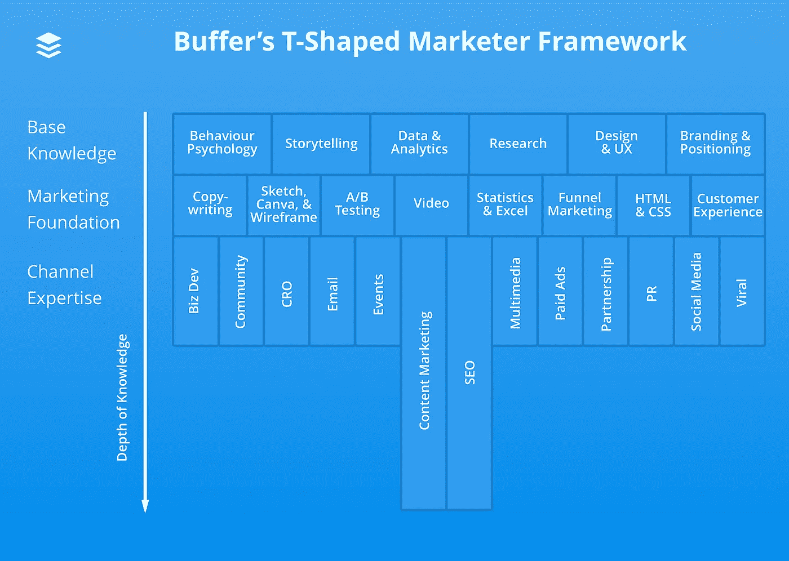
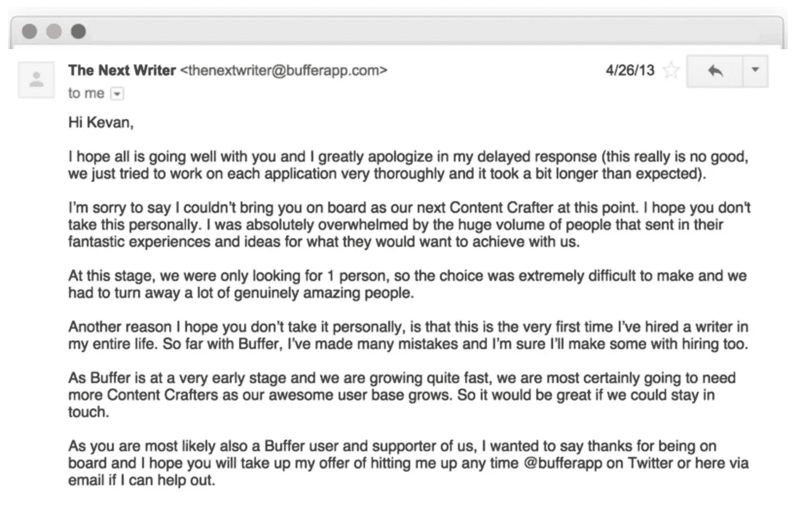
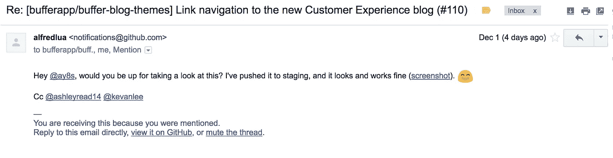
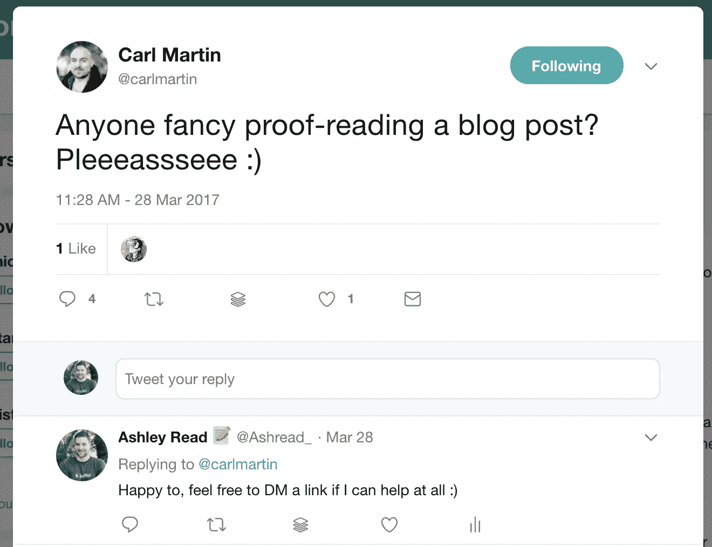
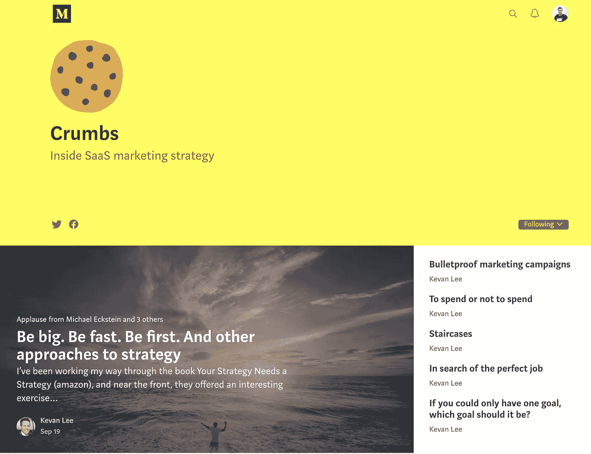
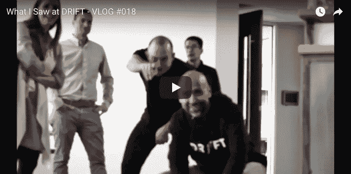

# 如何建立营销职业生涯

> 原文：<https://medium.com/swlh/career-in-marketing-7a284cba08ed>

## 顶级创始人和投资者的建议和见解

Photo by [Jonathan Velasquez](https://unsplash.com/photos/78sqdU2FC00?utm_source=unsplash&utm_medium=referral&utm_content=creditCopyText) on [Unsplash](https://unsplash.com/?utm_source=unsplash&utm_medium=referral&utm_content=creditCopyText)

> 你是如何进入营销行业的？

在 Buffer，我们营销团队的成员经常被问到这个问题。事实是，我们每个人的道路看起来都不一样:

*   阿尔弗雷德在军队里
*   Arielle 是一名健康教练
*   我们的营销总监凯旺是一名体育记者

但是，对于那些想在市场营销领域开始职业生涯或者想在 2018 年的基础上发展的人，我们很乐意帮助你找到:

*   你如何从现在的角色过渡到市场营销？
*   应该重点学什么？
*   需要什么技能？

来帮助回答这些问题(以及更多！)，我们与[产品搜寻](https://medium.com/u/b8b4445269d0?source=post_page-----7a284cba08ed--------------------------------)合作，他们最近[出版了他们的第一本职业书籍](https://books.producthunt.com/careers)。这本书强调了顶级创始人和投资者对指导、克服挑战的最佳见解，以及他们收到的最佳和最差的职业建议。

在本帖中，我们将分享 Product Hunt 书中的一些见解，包括 Tim Ferriss 和 Reddit 联合创始人 Alexis Ohanian 的经验，以及 Buffer marketing 团队关于建立营销职业生涯的一些建议。

准备好了吗？

# 1.围绕你的优势形成习惯

> 你是你交往最多的五个人中的平均水平。此外，你不需要获得太多的权利来获得和感受成功。围绕一两个强项形成习惯就好。
> 
> *—* [*蒂姆·费里斯*](https://medium.com/u/56d3bc91794f?source=post_page-----7a284cba08ed--------------------------------)

在产品亨特的书中，蒂姆·费里斯给任何想要开始职业生涯的人的第一条建议是“围绕几项优势养成习惯。”

在 Buffer，我们围绕我们个人的核心优势建立了我们的营销团队。例如，作为一名编辑，我主要关注我在内容营销和 SEO 方面的优势:

正如[凯旺](https://medium.com/u/5187e5fad31d?source=post_page-----7a284cba08ed--------------------------------)在我们的 [T 型营销人员帖子](https://blog.bufferapp.com/t-shaped-marketer)中解释的那样:

> 一般来说，缓冲营销团队的每个人都会具备所有的基础知识和营销基础技能；此外，每个队友将选择至少一个他们是专家的主要渠道。

试着围绕你最感兴趣的营销领域养成习惯:

*   如果你喜欢视频，下载一些素材并开始编辑
*   如果你想成为一名 SEO 大师，试着尽可能多地阅读来自 [Moz](https://moz.com/blog) 、 [Ahrefs](https://ahrefs.com/blog/) 和 [Backlinko](https://backlinko.com/) 等网站的内容
*   如果写作是你的事情，每天在日历上留出时间坐下来写作

看着营销并认为你需要完全掌握:分析、数据、CRO、SEM、广告、文案、SEO、社区等等，这可能会令人生畏。

但实际上，要成为一名成功的营销人员，你不需要成为每个渠道的专家:一两个专业领域就足够了。

然而，在一头扎进并选择一两个领域来专注之前，尝试一下不同的技能，看看什么最适合你。

# 2.“不”只是一个起点

> 我收到的最好的建议是,“不”往往只是一个起点，大多数值得拥有的职业都需要相当大的决心、勇气和一般的“尝试、再尝试”。
> 
> *—* [*凯瑟琳·明舍*](https://medium.com/u/447e3c46a013?source=post_page-----7a284cba08ed--------------------------------) ，缪斯的创始人

当谈到如何在市场营销领域开始职业生涯，甚至是如何往上爬时，你可能会听到*“不”*以及比*“是”*更多的回答。

从向编辑推销内容创意到申请各种角色和自由职业，在我的职业生涯中，我被告知*很多次“不”。*

*但我一路走来学到的是，每一个*【不】*都让我离*【是】*更近一步。例如，我拒绝的每一篇文章都帮助我最终获得了第一份带薪写作工作。*

*当我得到 Buffer 的职位时，实际上这是我第二次申请——凯旺现在是我们的营销总监，他的第一次 Buffer 申请也没有成功。*

**

*凯旺用上面的话作为动力，没能得到理想的工作帮助他意识到他可以集中精力改进的地方。*

*把每一个*【不】*都当成学习和提升自己技能的机会。*

# *3.关注永恒的技能*

> **天天写。即使你不是作家，我也发现这种做法可以澄清很多事情。**
> 
> **—* [*M.G .西格勒*](https://medium.com/u/5c6977d2a94f?source=post_page-----7a284cba08ed--------------------------------) ，谷歌风投公司合伙人*

*营销中有某些技巧永远不会过时。仅举几个例子:*

*   *沟通*
*   *写作*
*   *讲故事*

*这些技能永远是有价值的。*

*例如，无论是博客文章、登录页面的文案还是视频的字幕，写作永远是营销人员的一项关键技能。*

*在加入 Buffer 之前，凯旺曾经[每天至少写 2000 字](http://www.kevanlee.com/content-marketing-jobs/)来帮助提高他的技术。在进入 Buffer [工作之前，Alfred](https://twitter.com/search?f=tweets&vertical=default&q=%40alfred_lua%20streak&src=typd) 也挑战自己[每天写作](http://alfredlua.com/what-ive-learnt-from-my-30-in-30-writing-challenge/)，当他第一次转变为专注于内容的角色时，又挑战自己。*

*试着在日常生活中寻找机会来练习这些永恒的技能。*

*例如:*

*   *把你发的每一条推文或每一封电子邮件都当作提高写作技巧的机会*
*   *下次你和客服人员交谈时，想想如何让你的交流变得清晰易懂*
*   *下次你写脸书状态时，想想如何有效地讲述你想要分享的故事(这些[讲故事的公式可能会有所帮助](https://blog.bufferapp.com/storytelling-formulas)*

# *4.追求旁门左道*

> *如果你已经有了想要建造的东西，那就为了学习新事物而建造它们。*
> 
> **—* [*亚历克西斯·奥哈尼安*](https://medium.com/u/16dda160d8d5?source=post_page-----7a284cba08ed--------------------------------) ，Reddit 的联合创始人*

*在 Buffer，[我们喜欢副业](https://open.buffer.com/getting-started-side-projects/)。*

*说到营销，副业是学习新技能和拥抱你所热爱的领域的好方法。*

*例如，当我们的内容制作人 Alfred 渴望了解更多关于网站设计和编码的知识时，他开始着手重新设计他的个人网站并自己编码。*

*这个兼职项目使 Alfred 提高了他的技能，现在他甚至可以提交对缓冲区代码的更改:*

**

*如果没有这个兼职项目，Alfred 可能没有机会了解设计和开发。但是通过一个兼职项目，他学到了一些对我们团队来说非常宝贵的技能。*

*无论你处于职业生涯的哪个阶段，兼职都是学习和提升技能的好方法。*

*说到考虑副业，我喜欢在 Medium 上分享的三条规则 [Hiut Denim Co](https://medium.com/u/fa7e1b350adb?source=post_page-----7a284cba08ed--------------------------------) [:](/makers-mavericks/why-side-projects-matter-a024eddad60c)*

1.  *他们不需要给你提供生活来源。如果他们失败了，你还可以吃。*
2.  *他们没有截止日期。由于没有时间压力，你不会回到你通常的公式。你尝试新事物。你实验。你承担风险。*
3.  *这是一项爱的工作。你提供了“劳动力”。而你提供了‘爱’。所以当你花时间在这上面，是因为你真的想。让你不断回来推动它。这很重要。这件事需要你坚持不懈地努力，也许，几年。*

*在整个缓冲营销团队中，我们仍然接受帮助我们提升营销和其他领域技能的副业项目:*

*   *凯旺有一份关于营销和领导力的每周[简讯](http://www.kevanlee.com/newsletter/)*
*   *海莉有一个[未来工作播客](https://makeworkwork.promogogo.com/poster/makeworkwork/8576f051d6174166)*
*   *阿尔弗雷德有一份两周一次的营销简讯*

# *5.拥抱行业*

> *我真的相信，如果你是一个有创造力的人，要想在一个特定的行业中出类拔萃，你需要生活在这个行业中，感受这个行业的气息。*
> 
> **—* [*海伦娜·普莱斯*](https://medium.com/u/675f0c1dc602?source=post_page-----7a284cba08ed--------------------------------) ，摄影师*

*营销是一个不断变化的行业。*

*我们用来接触目标受众的平台，如脸书、Instagram 和谷歌，都在不断发展，今天能产生效果的策略，明天就不会了。*

*通常，最成功的营销人员之所以成功，是因为他们热爱他们所做的事情，并且总是紧跟最新的趋势、新闻和发展。*

*处于职业生涯各个阶段的营销人员都可以从关注行业博客、出版商和领导者中受益。*

*以下是我推荐的资源列表:*

## *营销行业博客*

*   *《广告周刊》:营销人员获取新闻和洞察力的主要来源*
*   *[格言](http://adage.com/):来自营销和媒体领域的每日新闻和更新*
*   *[CMO](http://cmo.com/) :数字领导者的洞察力、专业知识和灵感*

## *要关注的个人*

*   *马特·纳瓦拉:社交媒体的一切*
*   *Rand Fishkin :搜索引擎优化、营销和领导力*
*   *[Ali Mese](https://medium.com/u/d43c46db5b92?source=post_page-----7a284cba08ed--------------------------------) :获得大量优秀的创业营销和内容建议*

# *6.帮助别人*

> *找出你擅长什么，并开始用它来帮助别人——把它拿出来。向前支付。*
> 
> **—* [*海军拉维康*](https://medium.com/u/67f5049293c7?source=post_page-----7a284cba08ed--------------------------------) ，AngelList 联合创始人*

*在事业上取得进步的最好方法之一就是帮助别人。*

*当你花时间帮助他人解决问题并提供反馈时，你就有机会展示你的技能，同时建立你的人际网络。*

*说到找人帮忙，你可以从回答社区上的相关问题开始，比如[入境](https://inbound.org/)、[成长黑客](https://growthhackers.com/)和 [Quora](https://www.quora.com) 。*

*例如，在他职业生涯的早期，Hubspot 的收购总监 Matthew Barby 在互联网上搜索他可以回答的营销问题，以帮助他人:*

> *我在网上论坛和社区中搜寻我能回答的问题，当我回答了这些问题，我会详细讨论。*

*你也要关注社交媒体，寻找机会帮助你所在领域的人。当人们寻求反馈或帮助时，通常会求助于 Twitter 和其他在线社区。*

**

*创造内容也是帮助其他营销人员的好方法。例如，凯旺经常在他的媒体出版物 [Crumbs](https://medium.com/content-wins) 中分享关于 Buffer 营销的见解:*

**

*搜索引擎优化顾问[丹·舒尔](https://medium.com/u/47f7a240f049?source=post_page-----7a284cba08ed--------------------------------)，用他的视频博客带领人们了解搜索引擎优化世界的幕后生活:*

**

***时刻寻找帮助他人的机会。***

# *7.像记者一样思考*

> *成为一名好记者最重要的是批判性思考的能力。一个好的记者会问正确的问题，在故事中发现真相，并告诉读者什么是重要的。*
> 
> **——*[*《骰子与男人》的作者大卫·m·埃沃特*](https://medium.com/u/c741e88b3af4?source=post_page-----7a284cba08ed--------------------------------)*

*记住上面的话，营销人员和记者非常相似。*

*在市场营销中，保持批判的眼光和质疑一切是很重要的。例如，如果你的博客流量增加了，你可能会问自己:*

*   *是什么导致了增长？*
*   *流量来自哪里？*
*   *为什么会发生这种情况？我们能重复这一成功吗？*

*对于营销人员来说，在我们分享的内容中发现真相也很重要。通常，营销内容会引用数据或研究，作为营销人员，我们有责任核实我们分享的内容，并确保我们提供了正确的来源。*

*Smooch 编辑部主任[丹·j·利维](https://medium.com/u/8d54cf599c72?source=post_page-----7a284cba08ed--------------------------------)，[对 Moz](https://moz.com/blog/content-marketers-and-journalists) 解释道:*

> *我曾经有一篇博客文章排着队，准备第二天早上第一件事就是上线，直到我们眼尖的社会战略家认出了文章中引用的一个案例研究，并注意到作者完全曲解了结果。在一个小行业中，例子和统计数据经常从一个博客循环到下一个博客。结果是电话坏了，事实在传输中变得混乱。正确的归属可以更容易地追踪故障发生的位置，并纠正错误。*

*在市场营销中，用好奇的眼光看待一切事物，寻找每一个数据背后的“为什么”和“如何”是一个很好的做法。*

*正如布莱恩·鲍尔弗在他的博客上分享的:*

> *真正的洞察力不是通过抓表面而产生的。真正的洞察来自于对更深层的挖掘。*

**

# *轮到你了*

*非常感谢你查看这个帖子。如果你对来自超级成功的创始人和投资者的更多职业建议感兴趣，你可以在这里查阅产品搜寻的书。*

*我也很想在下面继续和你对话。*

*你对想在市场营销领域发展的人有什么建议？或者如果你想进入营销行业，欢迎在评论中提出任何问题。*

**

**如果你喜欢这个帖子，你可能也会喜欢这些帖子:**

* [## 借助这些社交媒体分析和报告技巧，成为精通数据的营销人员

### 你怎么知道你的社交媒体在做什么？什么没用？

medium.com](/social-media-tips/learn-social-media-analytics-a1cd6db957a3)  [## 社交媒体经理的一天

### 社交媒体经理如何打发时间？

medium.com](/social-media-tips/social-media-manager-life-fbdd8f840bb9)  [## 每天 10 分钟掌握社交媒体

### 面向营销人员的新电子邮件课程

medium.com](/social-media-tips/social-media-growth-strategies-email-course-4e9e9927c432) 

*这篇博文最早由*[*Ashley Read*](https://medium.com/u/b26ad460c3bb?source=post_page-----7a284cba08ed--------------------------------)*于 2017 年 12 月 7 日在* [*Buffer 社交博客*](https://blog.bufferapp.com/career-in-marketing) *上撰写。*

## 这篇文章发表在 [The Startup](https://medium.com/swlh) 上，这是 Medium 最大的创业刊物，拥有 274，707+读者。

## 在这里订阅接收[我们的头条新闻](http://growthsupply.com/the-startup-newsletter/)。

*