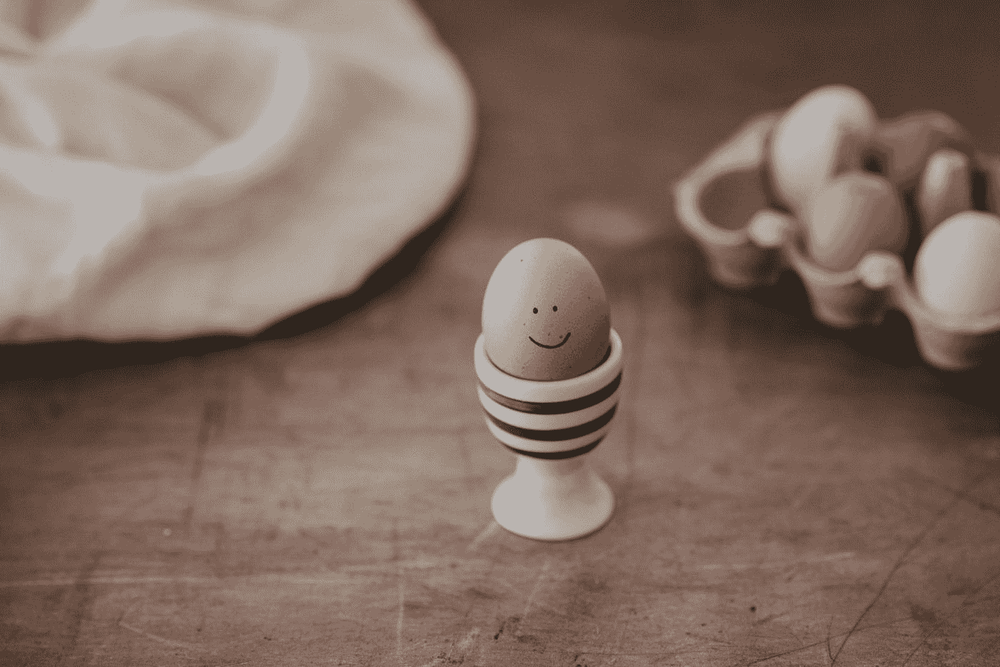
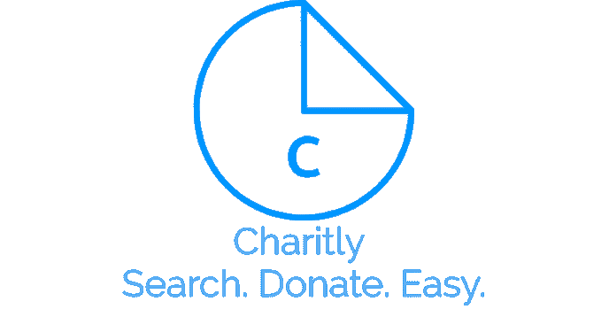

# 卡内基 2.0:试图赢得朋友和影响他人？不要笑！

> 原文：<https://medium.com/swlh/carnegie-2-0-trying-to-win-friends-and-influence-people-dont-smile-9407537d568e>

请在这里小心下载！

“selective focus photography of brown egg” by [Annie Spratt](https://unsplash.com/@anniespratt?utm_source=medium&utm_medium=referral) on [Unsplash](https://unsplash.com?utm_source=medium&utm_medium=referral)

你读过戴尔·卡内基的《如何赢得朋友和影响他人》吗？如果你不像我一样是一个初露头角的反社会名流，那么让我来告诉你吧！他最著名的建议之一就是微笑！微笑让你看起来更加平易近人。现在我不是来反驳这种说法的，我是来谈论一种不同类型的微笑，亚马逊微笑。

亚马逊微笑是亚马逊说“哇，我们得到了很多报酬，让我们假装分享它！”该计划的工作方式是，如果一个人使用特定的亚马逊微笑链接，购买特定的亚马逊微笑产品，亚马逊将向特定的慈善机构捐赠特定金额的 0.5%或 0.005。现在，亚马逊似乎非常慷慨，已经有无数的开发者进行了浏览器扩展，将亚马逊链接转换为亚马逊微笑链接，以对抗其明显的模糊性。然而，有一种更好的方式将慈善工作融入我们的日常生活，那就是向特定的慈善机构捐赠超过 0 . 005 英镑的特定物品。那条路就是[charity](https://chrome.google.com/webstore/detail/charitly/oajfolkiagalddkgaabkdealabfeiebp)！

我叫里沙布·辛格，博通大师赛全国半决赛选手，MNMS 项目[的创始人。这是我在慈善系列的第二篇文章！第一个可以在](http://www.projectmnms.org)这里找到[。](/swlh/forget-google-i-coded-an-app-and-it-will-change-the-world-forever-b0ca3b9cb3f2)

【teens 项目是一个博客和课程平台，我们在这里教青少年和成年人如何创造性地使用技术，以对抗其负面用途。当我第一次开始[MNMS 项目](http://www.projectmnms.org)时，我考虑了如何引导科技的积极和消极用途之间的对话。随着网站的发展，我开始对如何进一步发展对话有了更清晰的认识。

人们经常有被动使用技术的习惯，却没有真正理解技术是如何工作的，以及它如何影响我们。如果有人真的想看看这些设备是如何影响我们的日常生活的，我们可能都会更清楚我们希望在生活中如何使用它们。这就是为什么在 MNMS 项目中，我们经常称赞科技的建设性和创造性应用。如果您想了解更多关于技术的知识，请查看我们的课程部分，了解更多关于我们如何鼓励我们的社区学习更多关于技术的知识。今天我们来看看我开发的一个网络应用程序，以及它是如何帮助整个世界的。那个应用程序是[慈善。](https://cybertheory.github.io/Charitly/)

Charitly 是一个非常简单的应用程序。它的作用是允许谷歌 Chrome 浏览器用户搜索谷歌，同时会在旁边展示一个赞助视频。用户可以选择忽略它或者继续观看它。(视频是自动计算的)一次互动被 Youtube 算作一次印象。然后，我们将这种印象作为衡量赞助商的标准，并将大部分收入捐给各种慈善机构。

Charitly 把我们的一项日常活动变成了慈善捐赠的工具。想想看，每天在谷歌上有 35 亿次搜索。利用其中的一小部分来资助慈善机构会非常有益。

[MNMS 项目](http://www.projectmnms.org)鼓励你们每一个人走出去，用科技改变世界。你可以通过本文顶部的链接从 chrome 网上商店下载。分享[MNMS 项目](http://www.projectmnms.org)的信息，帮助我们让世界更有创造力！

## 这篇文章发表在 [The Startup](https://medium.com/swlh) 上，这是 Medium 最大的创业刊物，有+ 373，685 人关注。

## 在这里订阅接收[我们的头条新闻](http://growthsupply.com/the-startup-newsletter/)。

