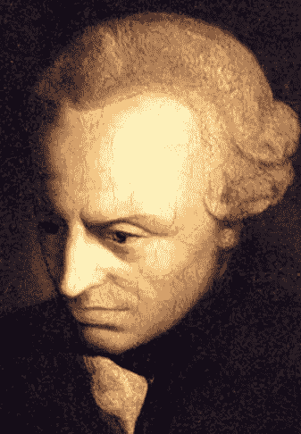

# 技术的级联效应——时间的涟漪

> 原文：<https://medium.com/swlh/cascading-effects-of-technology-ripples-in-time-779fc7661988>

> “我曾经读过一本书，我的整个生活都变了”
> ——新生活，奥尔罕·帕慕克

Immanuel Kant

狂热的读者不会忽视一本书可以改变一个人生活的观点。一本书也能改变整整一代人的生活吗？同样，一个原创的想法，一点独创性的火花能改变未来吗？在文学和科学史上有许多非常有影响力的书籍…