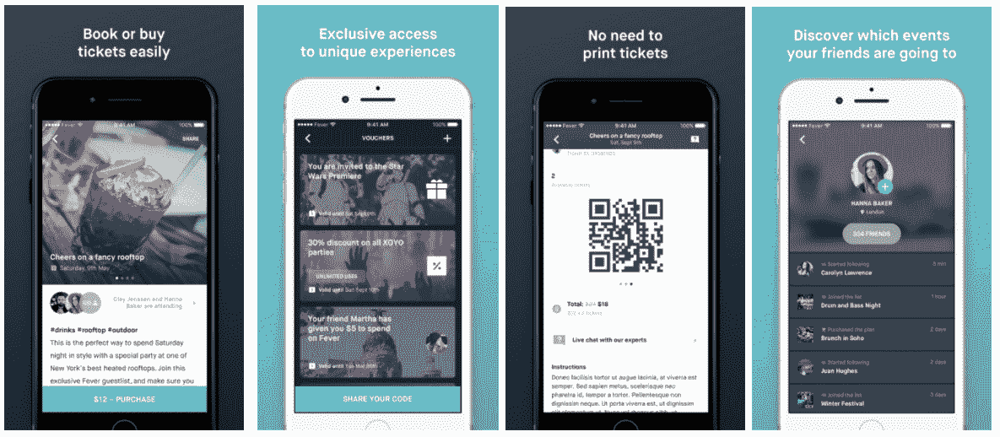
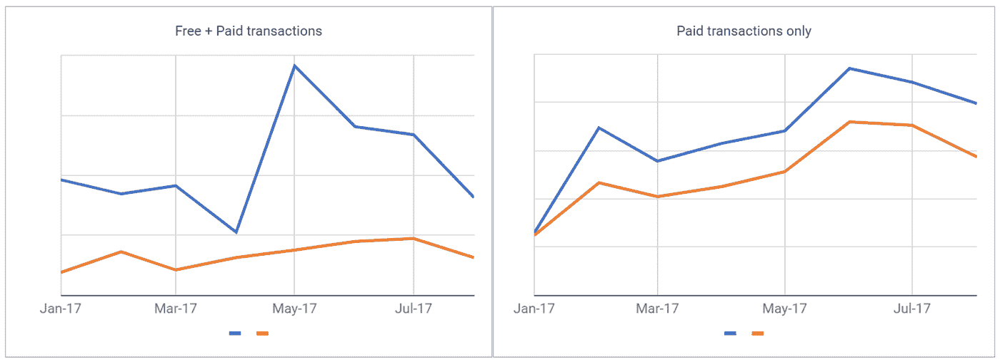
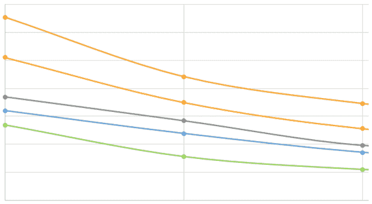
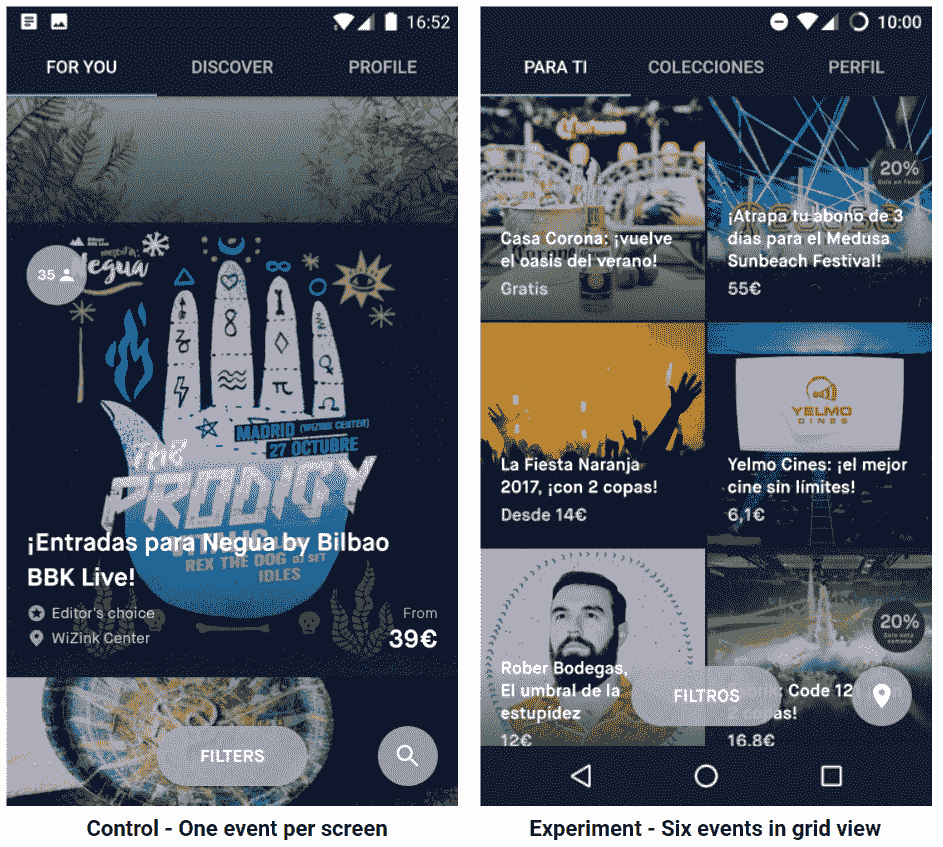
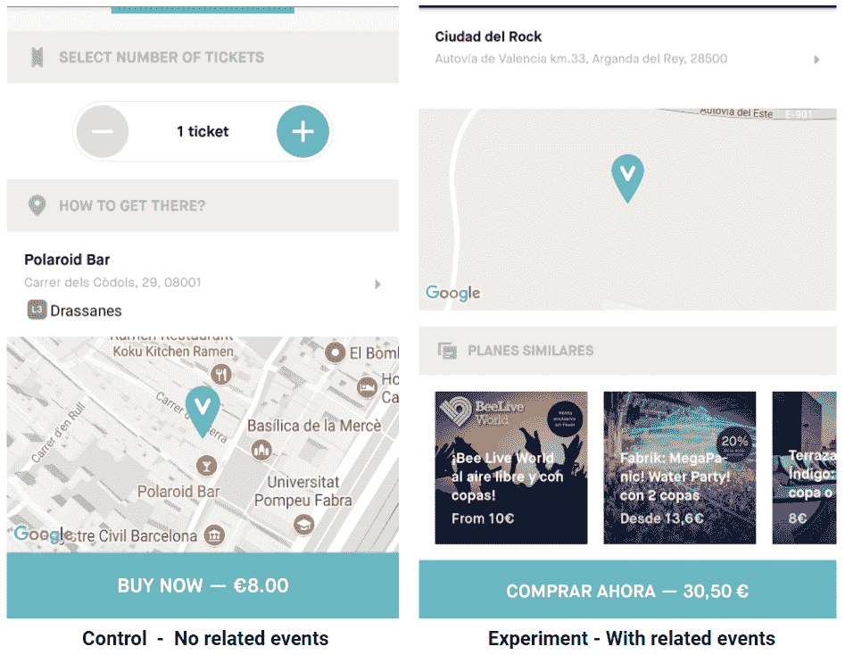
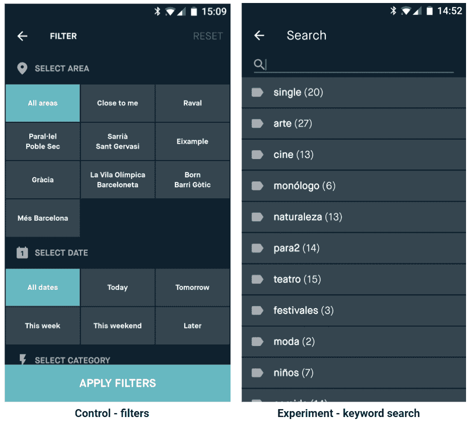
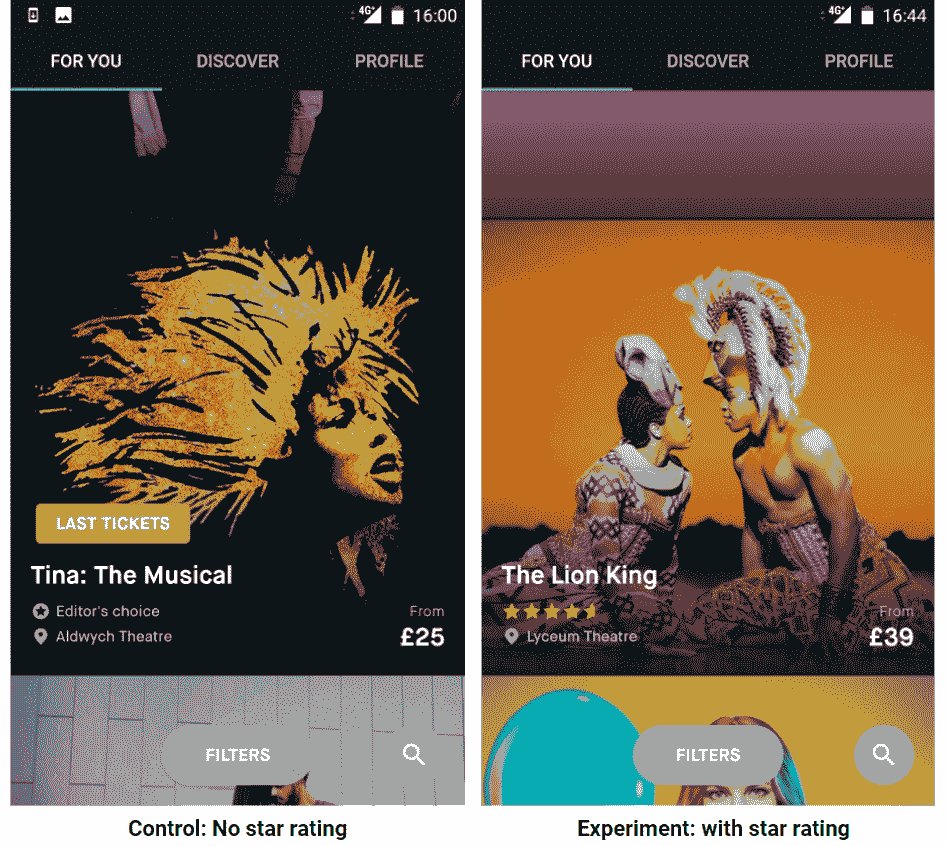
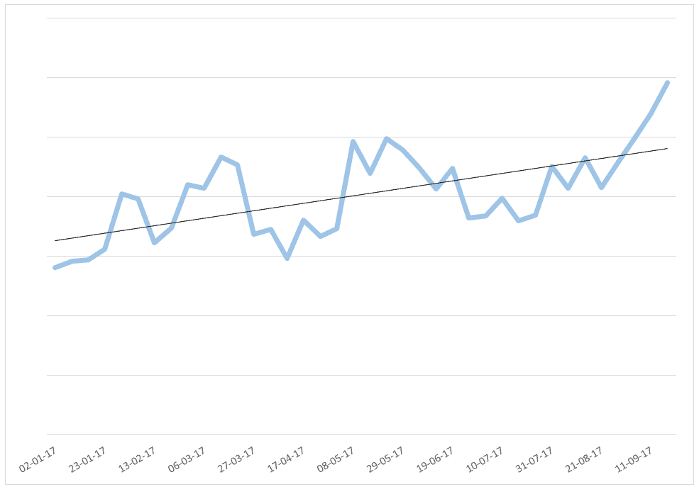

# 案例分析:Fever 如何利用 A/B 实验和数据分析将客户终身价值翻倍

> 原文：<https://medium.com/swlh/case-study-how-fever-uses-a-b-experiments-and-data-analysis-to-double-customer-lifetime-value-24c093ea85>

去年 4 月，移动事件发现初创公司 Fever 邀请我帮助其发展计划。发烧帮助用户发现和预订活动——从派对到时尚、美食和健身。该服务在马德里、纽约、伦敦和其他城市获得了牵引力，去年产生了超过 300 万个预订，并通过其平台和媒体网站达到了每月超过 3000 万人的独特受众。

随着公司[达到收支平衡](https://www.google.com/url?q=http://www.expansion.com/emprendedores-empleo/emprendedores/2017/07/10/5963b5f2ca4741f3198b4631.html&sa=D&ust=1509627138020000&usg=AFQjCNFNMTX89JcgALi0edEWAP_LIYmD1A)并转向快速增长模式，新的挑战出现了:如何在不损害用户体验的情况下快速提高关键业务指标？如何在不大幅增加员工人数的情况下尝试许多想法？

经过初步分析，我们着手实施以下变更:

*   **数据驱动的开发——KPI、指标、仪表板、数据深度挖掘**
*   **A/B 实验**
*   **定性研究(本文未涉及)**

# 将数据用于你的优势

数据是任何公司的关键资产，正确使用数据可以创造巨大的竞争优势。每个人都希望像谷歌、Booking.com 和网飞一样由数据驱动，但许多公司都陷入了关注虚荣指标、看太多指标、错误解读数据和使用糟糕统计数据的常见陷阱。这是我们在发烧时做的。

## 识别关键指标

*   **一个重要的指标** —我们首先确定了客户终身价值(LTV)这一热门指标，并希望进一步提升。拥有一个重要的指标(OMTM)对于公司的关注和发展速度至关重要——关注太多的指标可能会适得其反；专注于总收入等虚荣指标，可能会推动短期的、不可持续的增长。
*   **支持指标** —下一步是确定支持指标，如保留率、购买转化率和重复购买率，然后将这些指标进一步分解为我们可以影响产品的指标。这是一个正在进行的迭代过程，非常具体的产品。结果是一个“度量树”,它有不到 10 个我们想要关注的基本度量，并且偶尔会发现一个新的关键度量。

## 即将举行的研讨会

*   [**精益产品管理**](https://ti.to/itamar-gilad-events/lean-PM-BCN-July-2019)**——巴塞罗纳——7 月 17 日**:在本次研讨会中，我将向您介绍精益产品管理的原则和工具——创建战略和商业模式、设定目标、确定想法的优先顺序、使用 GIST 执行和验证。
*   [**产品价值和突破性增长**](https://ti.to/itamar-gilad-events/lean-growth-BCN-2019) **—巴塞罗纳 9 月 30 日**:在这个独特的研讨会上，增长教父**肖恩·埃利斯**和我将向你展示谷歌和 Dropbox 这样的公司是如何通过结合精益产品管理和增长黑客原则来保持其产品的高价值和持续增长的。
*   **其他日期和地点(包括私人作坊)**:[itamargilad.com/workshops](http://itamargilad.com/workshops)

## 使用仪表板

根据我的建议，发烧数据团队创建了一个包含我们确定的指标的仪表板，其中许多指标按周或月分组。

接下来，我们建立了一个每周增长会议，从回顾仪表板开始。当我们看图表时，我们会问自己这样的问题:

*   目前的趋势是什么——上升/下降/持平？
*   有趋势变化吗？如果有，是什么造成的？
*   数据中是否有任何异常，例如某个特别好或特别坏的一周，是什么导致了这些异常？
*   不同地域如何比较？

这是我们仪表板中的一个图表示例——按群组划分的采购量:

Dashboard example: purchase buckets by cohort

每条线代表在加入 Fever 的第一周内预订一次(蓝色的 G1)或两次(橙色的 G2)活动的用户百分比。左边的图表包括所有交易——付费和免费，而右边的图表只显示付费事件。数据按月分组，例如 2017 年 6 月、2017 年 7 月等加入发烧的所有人。这两张图表使用不同的比例尺。

请注意，这张图表让我们可以立即观察到一些事情:

*   **右图(付费活动)** —购买一个或两个付费活动的用户比率呈上升趋势(良好)。此外，这两条线非常接近，表明发烧在将用户从第一次付费购买转移到第二次付费购买方面是有效的(非常好)。
*   **左图(免费+付费事件)** — %的用户进行了两次交易，(G2 橙色线)也呈上升趋势，但 G1 线(蓝色)正在发散，且不太一致。在进一步的调查中，我们了解到来源可能是大规模的免费活动，如公共弹出窗口，大型快速约会，口袋妖怪 go 聚会等。这些都有一个积极的短期效果，将首次用户带入平台，但大多数不会在头 7 天内转化为第二次交易。然而，当我们着眼于更长的时间尺度时，我们观察到这些免费活动确实增加了客户的终身价值，因此值得拥有。

## 数据深度挖掘

分析仪表板时，通常会出现新问题，例如:

*   用户提前多长时间购票？
*   某些事件类别是否比其他类别更容易被记住？
*   星级好的活动会让用户更多的回来吗？

数据团队负责寻找这些问题的答案，并在下一次增长会议的“本周深度探讨”部分展示这些答案。数据深度挖掘是洞察力和实验想法的丰富来源。

Data deep-dive example: retention by event category

上图显示了按用户预订的第一个活动类别(如聚会、电影、美食……)划分的用户保留率。如您所见，内容类别不同，留存率也会有所不同。这可能意味着一些事件类型更“粘性”，或者选择某些事件类型的用户从发烧中获得更多价值。这种洞察力导致进一步的用户和内容细分，并导致推荐算法的变化。

## 学问

仪表板分析+数据深度挖掘推动*学习*——更深入地了解用户如何使用产品以及为什么使用，什么好用，什么不好用。这通常会产生如何改进的想法。下一步是在产品中尝试这些想法。

# A/B 实验

A/B 实验是每个公司都需要的另一个超级工具，但很少有人能成功做到。它们允许快速、廉价且高度确定地测试想法。公司可以在很短的时间内完成许多想法，淘汰那些行不通的，并充分推出那些行之有效的。这大大降低了投入到不良项目中的成本，并缩短了从创意到发布的周期。

**成功/失败比率**——在我与发烧的第一次会面中，我解释说，当进行测试时，大多数想法没有显示出任何可测量的改进，有些甚至显示出负面结果。网飞和微软等公司报告称，平均三分之一的实验产生了积极的结果，但根据我的经验，初创公司应该假设十分之一的胜率，因为他们的产品测试较少，用户也较新。我们在发烧方面的经验支持这个经验法则，尽管发烧做得稍微好一些，而且它的胜率在不断提高。

这是我们在发烧时做的一些实验。

## 网格视图实验

发烧应用程序在订阅源中一次显示一个事件。我们假设在一个 gridview 中每个屏幕显示六个事件，尽管细节较少，但会增加印象、点击率并最终增加购买。

结果: ***失败***

实验版本的用户在中看到的事件数量平均只增加了 11%，但点击率下降了 23%(可能的原因:每个事件的信息更少，注意力更分散)，购买转化率下降了 24%。每用户总收入下降了 23%。

学习:重要的是在 feed 中给用户足够的信息，让他们在进入活动之前做出决定。

## 相似事件实验

我们假设，当用户参加一个活动时，会从找到相似的活动中受益，这将导致活动浏览量和购买量的增加。

结果:**T5 失败 **

我们用相关事件转盘的不同位置测试了这个想法两次。有一次我们得到了微不足道的结果。在另一项调查中，我们发现每个用户的总收入下降了 3.2%——很可能是因为用户界面分散了注意力。

## 关键词搜索实验

发烧应用程序提供了一个精选的事件列表+按类别和区域过滤的能力。我们假设添加关键字搜索将帮助用户更快地发现感兴趣的事件，并将导致更多的转换。

结果:**成功！**

点击率和付费转化率都上升了 7%左右，每个用户的总收入上升了 12%！

## 展示星级实验

发烧客户可以对他们参加的活动进行 1-5 星评分。我们进行的深入分析显示，参加高评分活动平均会导致用户更多地再次使用该应用程序，因此我们假设，通过在应用程序中显示星级，我们将提高转化率。

结果:**成功！**

实验版的点击率提高了 1%，付费转化率提高了 5.1%，每用户收入提高了 4.4%。确定无疑的胜利。

# 正确实施 A/B 实验

A/B 实验是关于快速测试许多想法。在狂热中，我们希望工程和设计团队“拥有”实验。我们是这样做的:

*   围绕关键指标——转换、保留和重复购买——组建了 eng/ux 团队。每个团队“拥有”这个度量标准，并且有很大的自由来选择如何最好地改进它
*   创建了一个创意银行，并要求团队和管理层对创意进行添加和投票。
*   指导团队在固定的迭代周期内工作——1 周编写实验代码+2–3 周运行实验并收集结果

结果是速度、团队所有权和透明度的提高，同时降低了管理开销。团队成员可以看到他们的想法在几天内实现，并以客观的方式接受评判——不受任何人意见的影响。团队自我激励以加速过程，并在测试和分析基础设施中启动了许多改进。发烧现在每周进行多达 5 次实验。

# 总体结果

下图显示了 lt V7——注册后前 7 天每位客户的平均收入。您可以看到，自从我们启动增长项目以来，LTV7 增长了近一倍，趋势是积极的。

LTV7 是 LTV(全客户终身价值)的一个很好的领先指标——在第一周内吸引更多用户参与并购买几乎肯定会增加总购买量。当然，我们也定期观察更长的时间尺度:LTV30、LTV60、LTV90 和 LTV365，以了解它们的趋势。

需要说明的是，这种增长并不都来自于产品的变化——该公司也在营销、内容、合作伙伴和渠道方面做出了改进。尽管如此，当我们使用 A/B 实验时，我们确切地知道产品变化有多大作用。

# 最后的想法

通过专注于关键指标、系统数据分析和基于假设的实验，我们能够加速公司的增长，并使其走上达到或超过目标的轨道。话虽如此，数据和实验只是成长故事的一半。同样重要的是，退一步，尝试找出一家公司发展的关键驱动力。在 Fever 中，我们还启动了定性用户研究，以了解*人们为什么*做他们所做的事情，内容需求与供应分析以及用户细分。也许是另一篇博文的主题。

*伊塔马尔·吉拉德(*[*itamargilad.com*](https://www.google.com/url?q=http://itamargilad.com&sa=D&ust=1509627138041000&usg=AFQjCNEE9NcnCNm5NUjk-E51q1CnXPfQ7A)*)是一名产品顾问，帮助科技公司打造能够创造巨大价值的产品。他专门研究产品战略、产品市场适应性、增长和创新。此前，他是谷歌、微软和许多初创公司的首席产品经理。*

***如果你喜欢通过电子邮件*** [***收到类似的帖子，请注册我的简讯***](http://eepurl.com/djUMjn) ***。***

## 即将举行的研讨会

*   [**精益产品管理**](https://ti.to/itamar-gilad-events/lean-PM-BCN-July-2019)**——巴塞罗纳——7 月 17 日**:在本次研讨会中，我将向您介绍精益产品管理的原则和工具——创建战略和商业模式、设定目标、确定想法的优先顺序、使用 GIST 执行和验证。
*   [**产品价值和突破性增长**](https://ti.to/itamar-gilad-events/lean-growth-BCN-2019) **—巴塞罗纳 9 月 30 日**:在这个独特的研讨会上，增长教父**肖恩·埃利斯**和我将向你展示谷歌和 Dropbox 这样的公司是如何利用精益产品管理和增长黑客原则的结合来保持其产品的高价值和持续增长的。
*   **其他日期和地点(包括私人作坊)**:[itamargilad.com/workshops](http://itamargilad.com/workshops)

## 这个故事发表在 [The Startup](https://medium.com/swlh) 上，这里有 263，100+人聚集在一起阅读 Medium 关于创业的主要故事。

## 在这里订阅接收[我们的头条新闻](http://growthsupply.com/the-startup-newsletter/)。

