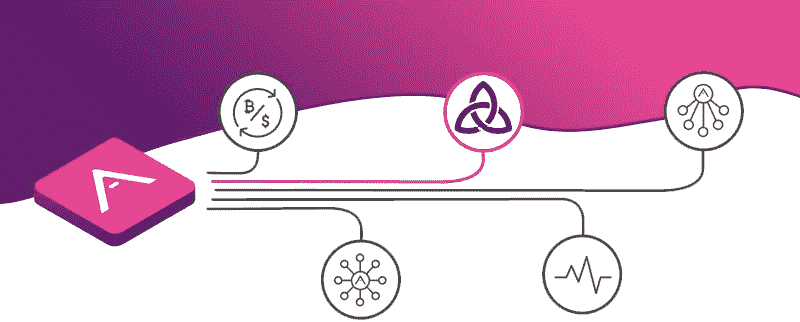

# ThorBlock 如何利用 Arkane 的 API 构建区块链应用

> 原文：<https://medium.com/swlh/case-study-how-thorblock-leverages-the-power-of-arkane-api-to-build-blockchain-apps-557d23677c77>

## 一次漫游

> 感谢你对阿尔凯恩·❤️感兴趣，我们希望了解你，所以请不要害羞，加入我们的[电报](https://t.me/ArkaneNetworkOfficial) ✨

最近 [ThorBlock](https://thorblock.io?utm_campaign=arkane.network) ，一个避险保护伞下的 VeChain dapp，推出了。Thorblock 是第一个与 Arkane 集成的实时应用程序之一。这篇文章解释了 ThorBlock 如何利用 Arkane Network 的力量。

> ⚠️剧透警报-文章底部的演示

安全港希望 ThorBlock 的消费者在创建或加入加密池时体验非常用户友好的区块链界面，为此，ThorBlock 使用了以下组件:

*   证明
*   钱包供应
*   事务处理

## 证明🔐

Arkane 用户可以使用他们的 Arkane 账户登录 ThorBlock，ThorBlock 用户也可以在 Arkane 中进行同样的操作。这种整合到目前为止，如果用户在 ThorBlock 中通过认证，他们甚至不需要登录 Arkane。这是通过使用一种叫做[单点登录](https://en.wikipedia.org/wiki/Single_sign-on)的技术来实现的。如果 Safe Haven 继续在其所有产品中应用相同的身份验证策略，其用户将只需登录一次即可登录所有产品，这同样适用于注销。

## 钱包供应💳

让区块链应用程序更加用户友好是避风港和 Arkane Network 的共同目标。消费者可以使用社交账户在 ThorBlock 注册。Arkane 将检测用户是否有 VeChain 钱包，如果没有，将动态创建一个钱包。

通过使用“自动逻辑”🌟钱包创建功能，避风港可以搭载新用户轻松访问他们的产品。

## 事务处理🔗

大多数区块链用户能够找到创建钱包的方法，但要求他们在区块链上进行交易似乎仍然遥不可及。在年轻的生态系统 VeChain 上，情况稍微复杂一些，因为支持其生态系统的工具较少。Arkane Network 正在通过提供一组 API 来解决这个问题，应用程序开发人员可以使用这些 API 在他们的 DAPPS 中实现 VeChain 上的区块链交易。ThorBlock 是区块链应用程序应该如何与终端用户互动的一个完美例子。

下面是一个小 gif，展示了 Arkane 给 ThorBlock 带来的一些功能。

Arkane integrated into ThorBlock

## 这篇文章发表在 [The Startup](https://medium.com/swlh) 上，这是 Medium 最大的创业刊物，拥有+386，297 名读者。

## 在这里订阅接收[我们的头条新闻](http://growthsupply.com/the-startup-newsletter/)。

