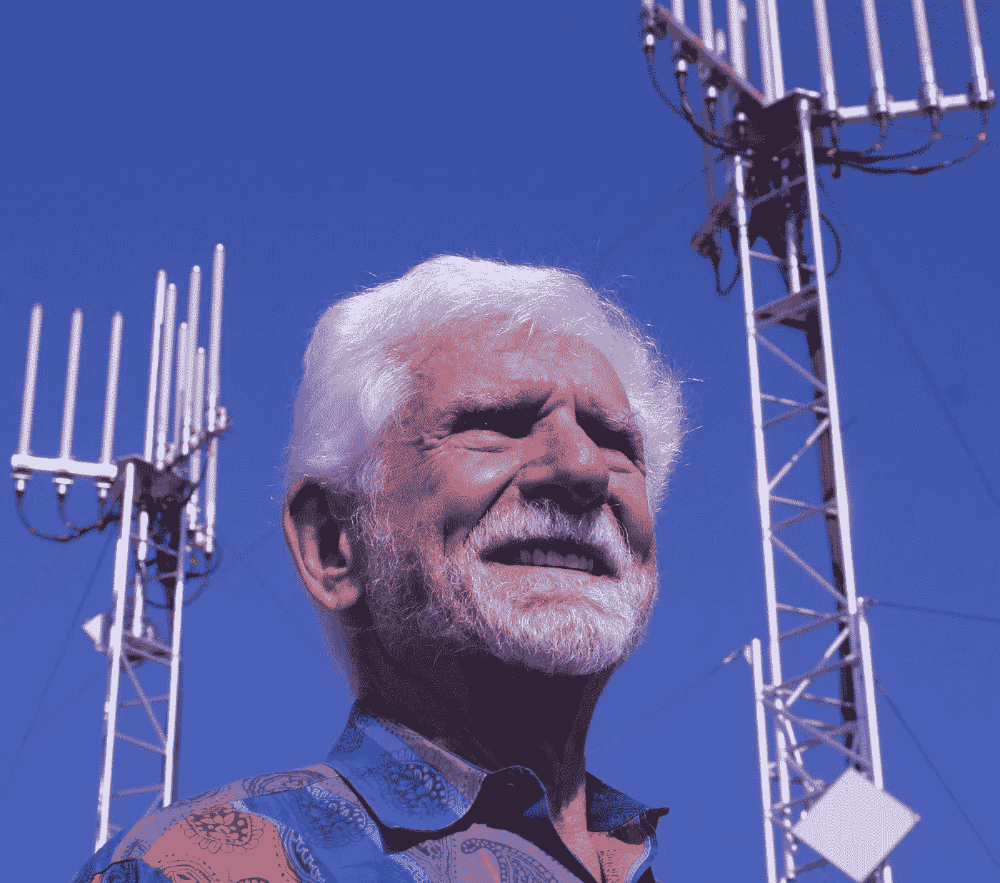

# 手机发明家的创业，成功和天才的火花

> 原文：<https://medium.com/swlh/cell-phone-inventor-on-startups-success-and-sparks-of-genius-ea1988ebf27a>

Marty Cooper, Inventor of the mobile phone

采访手机先驱马蒂·库珀。

2011 年，当我在写我的第一本书《T2》《T3》《手机广告狂人》《T4》《T5》时，我联系了马蒂，问他是否愿意为我写前言。谢天谢地，他同意了，接下来是他好心地与我分享的伟大故事的一部分。