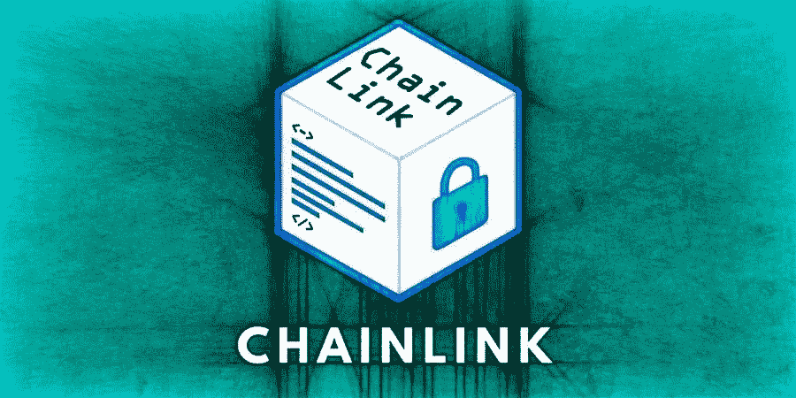
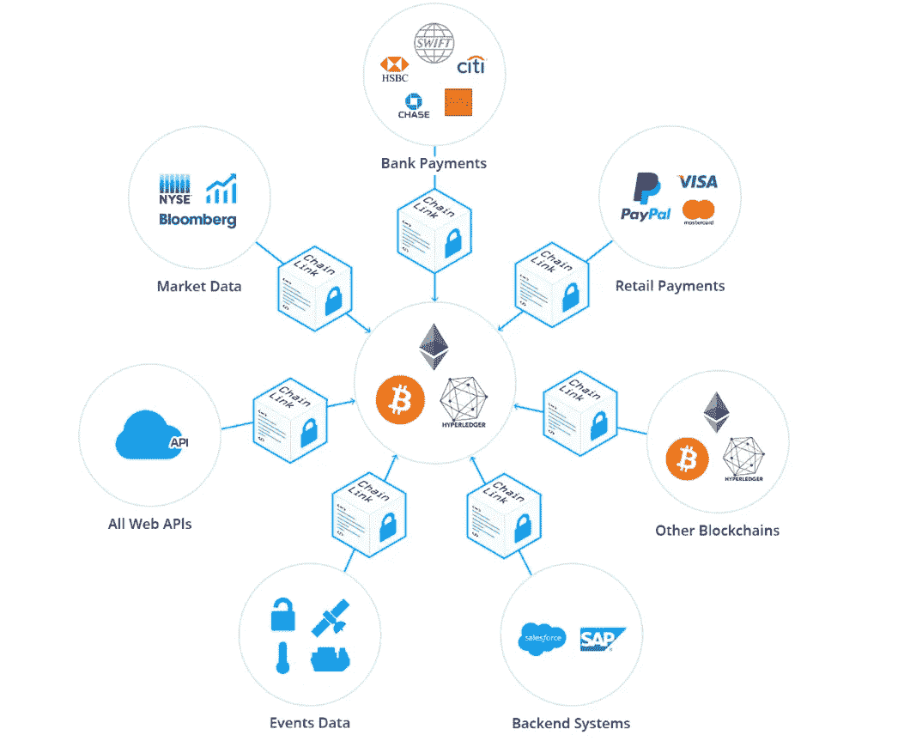
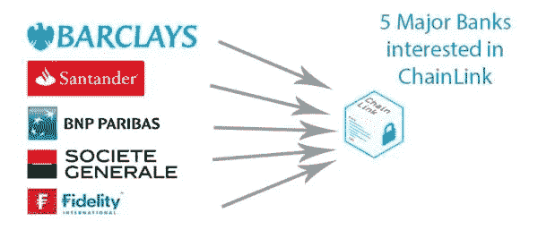

# 链式链接——神谕的分散网络

> 原文：<https://medium.com/swlh/chainlink-decentralized-network-of-oracles-6844ff96f47f>

智能合约无疑是区块链领域最伟大的创新之一，因为它们有能力超越互联网，影响现实世界的功能，特别是金融功能。想象一下，支付你的抵押贷款或让债券发行人通过智能合约向投资者支付利息。与当前格式相比，通过智能合同轻松实现这一点不仅会大幅降低运营和安全成本，而且最终将允许大规模采用区块链技术。这个名为 **ChainLink** 的项目正在创建一个**的神谕**分散网络，这些神谕是允许区块链的智能合约与链外 API 和数据进行通信的软件。Chainlink 的目标是成为第一家以太坊、比特币和其他区块链的分散式 oracle 提供商。如今，ChainLink 的交易价格为**$ 0.54 一枚硬币**，然而，由于 ChainLink 在分散的 oracle 网络中具有先发优势，与 SWIFT 等机构的世界级合作伙伴关系，Q1-Q2 mainet 的预定发布，以及广泛的使用案例，这种令牌可能在 12 个月内交易价格为 **$2 一枚硬币**。

# 基础知识:

1.  链家的母公司**SmartContract.com**，成立于 2014 年 9 月。
2.  ChainLink 是一个**去中心化的 oracle 解决方案**，它**弥合了**现实世界**和**基于区块链的智能合约**之间的鸿沟。**
3.  智能合约所有者使用**链接令牌**向 **chainlink 节点支付从它们那里获取数据的费用**，oracle 节点拥有的链接越多，它的声誉就越好。
4.  **股票代码:LINK**价格:$ 0.54
    按市值排名:85
    市值:191，549，050 美元
    流通供应量:350，000，000 LINK
    最大供应量:100，000，000 LINK
    交易量(24 小时):4，714，320 美元
    共识:以太坊共识

# 团队:

1.  ChainLink 团队由谢尔盖·纳扎罗夫领导。纳扎罗夫的职业生涯始于建立 P2P 市场，并于 2011 年加入了加密货币革命。
2.  CTO 是**史蒂夫·埃利斯**。Steve 之前是 Pivotal Labs 的软件工程师和团队领导，在那里他致力于保护敏感的 HIPAA 合规数据并构建可扩展的支付自动化软件。
3.  链节的**顾问**包括:

*   阿里·朱尔斯——IC3 联合总监
*   安德鲁·米勒——伊利诺伊大学计算机科学教授
*   埃文·程——脸书工程总监
*   **哈德逊·詹姆森** —以太坊社区经理
*   **杰克·布鲁克曼**——区块链顾问
*   **布莱恩·莉雅**——史密斯+皇冠的首席执行官

# 增长驱动因素:

1.  ChainLink 团队赢得了与 SWIFT 合作开发概念验证的竞标过程。SWIFT 是最大的国际银行通信系统，拥有超过 11，000 家合作银行。当银行需要发送国际电汇时，他们使用 SWIFT 网络进行处理。ChainLink 是唯一一家与 SWIFT 合作促进这一流程的区块链公司。
2.  对于 PoC，SmartContract 的 oracle 用于将五家参与金融机构 **Barclays、BNP Paribas、Fidelity、Societe Generale 和 Santander** 的利率转移到 ChainLink 的**市场利率智能合约中。**该合同将数据汇总成一个单一比率，然后用于一个价值 100 万美元的智能联系债券的虚拟表示。
3.  如果 PoC 进展顺利，它可能会在 2020 年成为 SWIFT 的标准。
4.  该团队编写了一份最强、最具技术性的白皮书。([https://link.smartcontract.com/whitepaper](https://link.smartcontract.com/whitepaper))
5.  ChainLink 已经**在过去的 3 年里致力于他们的产品**，他们的初始测试网将在 Q1 发布。
6.  在去中心化的 oracle network ChainLink 几乎没有竞争对手和先发优势**，因为他们正在努力连接脱节的区块链生态系统。有一些项目提供了集中的 oracles 网络，但是将这些具有中心故障点的网络与区块链项目集成在一起违背了总体目标。**
7.  ChainLink 团队正在积极招聘更多的开发人员和营销主管。
8.  ChainLink 的分散式 oracle 网络可以为**广泛采用**从抵押贷款、保险、小额支付等任何类型的金融支付打开大门。
9.  Chainlink 团队最近的合作伙伴是 **ZeppelinOS。** ZeppelinOS 是一个基于 EVM 构建的工具和服务的开源分布式平台，用于安全地开发和管理智能合约应用。ZepplinOS 被 OmiseGO、CIVIC、Aragon、STORJ、Tierion、Augur、District0x、Ripio Credit Network 等项目使用。
10.  PayPal 的区块链版 Request network 使用 ChainLink 的 oracle 作为他们的菲亚特网关。
11.  ChainLink 被 Gartner 选为 **2017 区块链应用酷派厂商。这验证了首席技术官和首席信息官在 Chainlink 将智能合同与关键外部资源联系起来的更安全方法中看到的价值。**
12.  ChainLink】还与康乃尔大学的 IC3 合作，帮助推出智能合同和外部数据之间的首个英特尔 SGX 安全链接。
13.  ChainLink 还被世界经济论坛的 Tipping pointt 报告选为智能合约的“行动转变”,因为他们允许比特币网络中的智能合约由外部数据自动触发。

# 逆风:

1.  ChainLink 成功的一个重要因素是开发 SWIFT 将采用的产品。
2.  由于监管总是会落后于创新，数字货币领域未来可能会受到新监管的约束。

# 总结:

ChainLink 将自己定位为区块链技术和现实世界金融应用之间的桥梁。众所周知，区块链技术将成为未来社会的基石，而 ChainLink 将是推动这一趋势的最重要的参与者之一。凭借 ChainLink 与 Shift 的合作伙伴关系、他们在技术开发方面的稳步进展、众多的合作伙伴关系和广泛的使用案例，这种令牌可以在 12 个月内以每枚**6 美元的价格交易。**

要了解更多信息，请访问我的网站:

[www.MasiDigitalVentures.com](http://www.MasiDigitalVentures.com)

## 这篇文章发表在 [The Startup](https://medium.com/swlh) 上，这是 Medium 最大的创业刊物，有 312，043+人关注。

## 在此订阅接收[我们的头条新闻](http://growthsupply.com/the-startup-newsletter/)。

