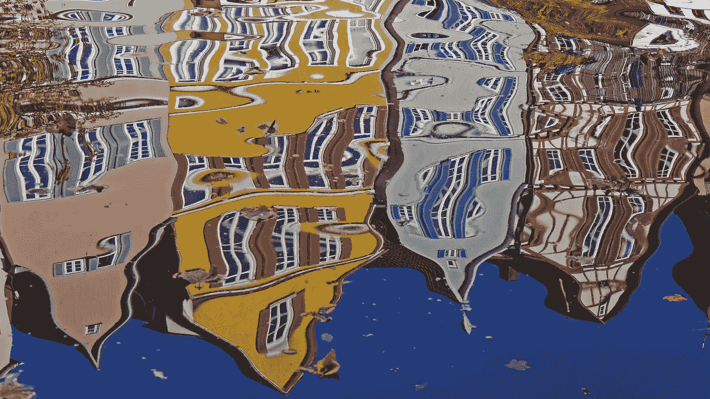

# 挑战这 15 个扭曲的想法，在生活中获得成功

> 原文：<https://medium.com/swlh/challenge-these-15-distorted-thoughts-to-get-ahead-in-life-45a382ca372e>

## 我们都有。

扭曲的思维模式，或者说**认知扭曲**是**的把戏**我们的思想在欺骗我们，让我们相信一些不真实的事情

我们**都**有认知扭曲。它们甚至困扰着最平衡的思想家。