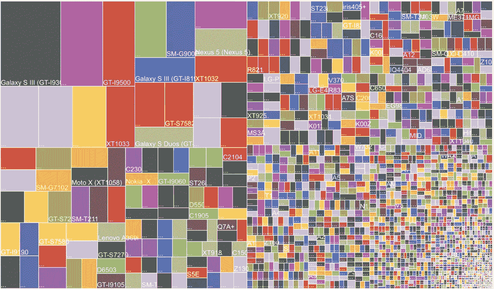

# 移动应用测试面临的挑战和解决方案

> 原文：<https://medium.com/swlh/challenges-and-solutions-to-mobile-app-testing-56748fd50b3e>

Challenges and Solutions to Mobile App Testing

如今，智能手机无处不在。随着 it 的发展，应用程序领域经历了一场革命，产生了大量的应用程序来满足用户的需求。企业越来越发现有必要拥有一个应用程序来与他们的用户保持联系。此外，您用户的手机已经超越了在其范围内工作的应用程序。应用程序现在可以与可穿戴技术、车辆和家用电器协同工作。您的开发人员面临着他们的挑战，但是您的测试人员也面临着同样的挑战。随着我们今天工作环境的不断变化，一刀切的解决方案已经成为过去。

别忘了，测试移动应用比测试传统桌面甚至网络应用更复杂。这不应该刺激你忽略你的测试需求。看看今天的市场；有足够多的应用程序声称能做你的应用程序所承诺的事情。让你与众不同的是你为你的应用服务的目的。测试将决定你的服务质量。说服你的目标消费者下载你的应用程序并不像说服他们在遇到错误、低于标准的性能、功能缺陷、设备兼容性问题时继续使用它那样具有挑战性，所有这些都会导致糟糕的用户体验。不要犯在测试上妥协的错误。它不再是关于启动一个良好开发和测试的应用程序。你必须不断升级和改进你提供的服务，以确保你的用户永远不会考虑离开。让我们来看看测试移动应用时面临的挑战。

# 挑战

许多企业没有时间或能力去浏览由多种操作系统、平台、服务和设备组成的新兴迷宫。即便如此，当他们意识到测试已经变得多么必要，并决定做必要的事情时，这些是他们经常面临的挑战。

# 1.设备、平台和操作系统碎片:

毫不奇怪，这一点占据了榜单的第一位。大约有 20 亿 Android 设备和超过 10 亿 iOS 用户。Android 拥有 4000 多种不同的设备，而 iOS 也有着惊人的数量。然而，设备碎片对 Android 操作系统来说更是一个问题。这些数字包括手机、移动电话、IPads、平板电脑、可穿戴技术等。当然，随着市场容纳更多的设备和平台，这个问题只会变得更具挑战性。由于 CPU、内存、屏幕分辨率、操作系统优化和硬件可能会有所不同，因此这种多样性使您的质量团队无法向您保证一个经过测试的应用程序是否能在来自同一经过充分测试的产品系列的另一台设备上运行良好。

我肯定你见过这张照片。你会在任何讨论设备碎片的地方找到它。这张图片为你的挑战提供了一张图片。它代表了 2013 年 7 月存在的大约 12，000 种不同 Android 设备的数据图表。相比之下，2012 年大约有 4000 台设备。在数字主宰市场的今天，我们理解您的工程团队所面临的压力，他们的目标是为您的用户提供跨不同平台、设备和操作系统的流畅用户体验。

# 2.不同的移动应用类型:

您的移动应用程序可以是本地的、基于 Web 的或混合的。他们的每个测试用例场景都会有所不同，因为他们的实现互不相同，尤其是当你在做性能、压力、兼容性和一致性测试的时候。本地应用的测试范围较小，而混合应用和网络应用则需要平台内外的测试。网络应用必须在浏览器版本和本地混合应用的选择、执行、下载、兼容性、平台交互和更新方面进行更多测试。

# 3.移动网络运营商:

你可能测试了你的应用程序的每一个功能，它们都工作得很好。在现实世界中，当你的用户试图使用一个功能，你的应用程序执行它，但晚了 8 秒，因为糟糕的网络或负载问题。你的用户可能会认为它有问题，并删除它。你的应用应该在在线、离线、实时以及介于两者之间的任何地方都能很好地工作。如今，消费者在旅途中使用应用程序。想象一下您必须应对的一切，更换网络、漫游、弱信号等。这里的碎片化比我们讨论不同操作系统时要危险得多。网络模拟器会让您更加清晰，为您提供基本的测试。在真实网络上进行测试仍然至关重要。

# 4.安全性:

您的用户在您的应用程序上存储和共享他们的个人和关键数据，您必须采取措施来确保数据隐私。在安全的私有云中测试您的应用将为您的测试团队提供必要的访问权限，以确保不会发生数据泄露。这将帮助您更快地识别安全问题。在生产之前修复这些问题将帮助您节省资金，因为在生产之前修复一个错误比在生产之后修复它节省大约 20 倍的成本。

哪一种自动化工具可以满足您所有的移动测试自动化需求？或者更像是有没有一种工具可以完成这项工作？老实说，没有，一个尺寸不再适合所有人。市场上有如此多的工具。这变得很难选择，除非你有一个合理的移动测试策略，并准确理解你需要优先考虑什么。您很快就会意识到，尽管有一系列第三方和开源工具用于移动测试，但每种工具都有其局限性，您必须对其进行定制以满足您的测试需求。以一些流行的开源工具为例。他们没有图像比较或缓慢的 iOS 平台脚本执行等等。

# 解决方法

1.  您在移动应用测试上的投入将决定您的客户体验有多完美。消费者越来越不宽容，这意味着他们不会原谅任何一个错误，不管你的应用程序有多棒。他们甚至倾向于将你的品牌与错误联系在一起。无论测试移动应用程序的挑战现在看起来有多艰巨，解决方案都相当简单，归结起来就是你对你的环境有多了解。
2.  应用程序的成功在很大程度上取决于 UI 的简单性。大多数应用程序必须处理常规的移动测试挑战，避免多应用程序架构带来的额外复杂性的最简单方法是消除多余的东西。
3.  找到你的观众。确定目标地区的目标消费者群，并找出最常用的设备。你将会节省很多时间，这将会帮助你专注于你首先需要解决的问题。
4.  执行测试必须广泛地进行。你的应用在离线状态下表现如何？例如，如果你的应用程序保存了航班的登机牌，而你的用户没有连接到任何网络，他将如何访问它？各种 Wifi 速度、信号强度、2G、3G 和 4G 网络对你的应用性能有多大影响？当您的用户切换到 3G 网络或网络中断时，会发生什么情况？还必须研究在不同网络下共享和存储数据时的安全性。
5.  移动模拟器和仿真器是必要的测试工具，允许我们执行常规回归测试并验证一般功能。但是使用仿真器和模拟器，测试是在模拟的而不是真实的环境中进行的。这些工具提供的好处是有限的，并且永远不能替代“野外”测试。使用仿真器和模拟器以及真实世界的测试，结果不会让你失望。
6.  如果使用得当，自动化是一个福音。但是有多少呢？测试自动化越来越多地被用于减少测试周期，缩短产品上市所需的时间。然而，将一切自动化并不明智。自动化更多的是理解在项目生命周期中何时何地使用它，但是它不能代替手工测试。为了利用自动化测试的所有优势，利用云使您的移动测试团队更加高效和多产。想象一下，您的测试人员的桌面上有一个移动测试套件，包含自动化、网络虚拟化和负载工具，帮助您的测试人员在创纪录的时间内完成工作。
7.  您的 QA 的目标是确保在您的用户和您的企业之间最受欢迎的界面上获得良好的体验。一个快乐的用户是你最好的销售伙伴，移动测试是将他们转化为你的品牌大使的工具。测试人员应该超越传统知识，与业务分析师和营销团队互动，以了解应用程序的哪些部分让客户感到困扰，以及他们对哪些部分感到满意。拥有一个在竞争中脱颖而出的应用程序是小公司与大公司竞争的真正方式。

> **结论:**
> 
> 一个有效的移动测试策略将成为你交付可靠、高性能应用的基础。移动测试的挑战通常是每个企业所独有的，因此解决方案也将取决于您的环境。解决方案将是工具、框架、平台和人员的混合，最终在成本、质量和上市时间之间达到最佳平衡。最终，没有什么比与合适的同事合作更有助于快速应对挑战。

*最初发表于 CognitiveClouds 的产品洞察博客:Top* [***Ruby on Rails 开发公司***](https://www.cognitiveclouds.com/custom-software-development-services/ruby-on-rails-development-company)

## 这篇文章发表在 [The Startup](https://medium.com/swlh) 上，这是 Medium 最大的创业刊物，拥有 299，352+人关注。

## 在此订阅接收[我们的头条新闻](http://growthsupply.com/the-startup-newsletter/)。

