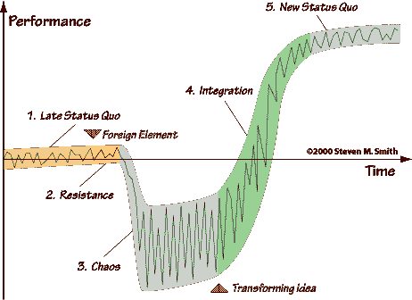

# 改变从来都不是免费的

> 原文：<https://medium.com/swlh/change-never-comes-for-free-4cfa819e0476>

人们如何应对变化？家庭治疗师[维琴尼亚·萨提亚](https://en.wikipedia.org/wiki/Virginia_Satir)提供了一个有趣的模型，也可以应用于组织变革。稳定的现状受到外来因素的挑战。在最初抵制外来因素之后，与外来因素的对抗最初会导致不确定性和混乱，从而导致生产力的损失。根据这种冲动的强度，这个阶段会持续或长或短的时间，直到改变的机会最终被理解和利用。渐渐地，该集团将恢复其原有的生产力，并有望进一步发展。然而，从本质上讲，这种模式意味着变革永远不会免费到来。虽然这听起来微不足道，但组织很少在大的和小的变化中承认这一点。然后由于错误的期望和他们的不耐烦而失败。

Source: [Steven M. Smith](https://stevenmsmith.com/ar-satir-change-model/)

史蒂文·m·史密斯在[的详细文章](https://stevenmsmith.com/ar-satir-change-model/)中的图表很好地展示了维琴尼亚·萨提亚的模式，我将在下面简要分析其各个阶段及其对变革的影响。

# 阶段 1:晚期现状

在这个阶段，稳定占主导地位。关系和期望都很稳定。这种合作由来已久，尽管并非没有摩擦，但总是有相同的缺点。

# 第二阶段:抵抗

可能已经存在多年的现状受到了外来因素的挑战。这可能是一种威胁现有商业模式的新技术(例如 MP3 与宽带互联网的结合)，一个具有不同工作方式和更高生产力的新竞争对手(例如丰田的精益生产)，或者是一个越来越 VUCA 化并需要向更灵活转变的世界。或者所有这些的组合。对此的第一反应是否定、拒绝、抗拒。

# 第三阶段:混乱

在最初的抵抗之后，可靠的关系在对外来因素的反应中崩溃。标志着后期现状的明确角色和稳定流程岌岌可危。这导致了不确定性和恐惧，因为目前还不清楚新的现状会是什么样子。然而，这一阶段是必不可少的，不能因为对其他地方使用的框架和蓝图等银弹缺乏耐心而被忽略(“让我们像 Spotify 那样做吧！”).

# 第四阶段:整合

在这个阶段，小组认识到如何成功地整合和使用曾经的外来元素。人们改变视角，开始尝试新元素，并从中获得经验。尽管在这些实验中出现了失败和错误，但新的可靠关系、明确的角色和稳定的流程出现了。

# 第 5 阶段:新的现状

外来因素现已完全融入，一切都已恢复到与先前现状类似的稳定状态。不过，希望生产率能更高。

# 伴随着变化

为了能够以教练的身份参与变革过程，首先需要认识到团队目前所处的位置。维琴尼亚·萨提亚的模型对此有所帮助。度过混乱的第三阶段至关重要。它包含了新的和更有生产力的现状的种子。这里的任务是帮助人们获得新的视角，并逐步促进尝试新的和外国的事物以及相互学习。让每个人都能看到这些实验的第一次成功是很重要的，因为正是这些成功可能成为其他团队的决定性推动力(维琴尼亚·萨提亚模型中的*转化想法*)。更重要的是，要克服急躁情绪，避免走明显的捷径。

> *问题不是问题；应对才是问题。*
> 
> *—维琴尼亚·萨提亚*

*原载于 2018 年 4 月 21 日*[*fuehrung-erfahren . de*](https://fuehrung-erfahren.de/en/2018/04/change-never-comes-for-free/)*。*

## 这篇文章发表在 [The Startup](https://medium.com/swlh) 上，这是 Medium 最大的创业刊物，拥有 318，120 多名读者。

## 在这里订阅接收[我们的头条新闻](http://growthsupply.com/the-startup-newsletter/)。

