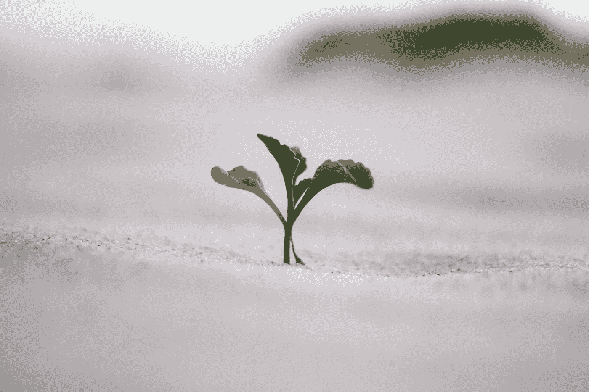

# 改变你告诉自己的故事，你就改变了你的生活

> 原文：<https://medium.com/swlh/change-the-story-you-tell-yourself-and-you-change-your-life-e65d9e700ac9>

> “改变你的想法，你就改变了你的世界。”—诺曼·文森特·皮尔

昨天，我在我住的附近的一家书店偶然看到了这句话。当我走向一个公交车站时，一种怀旧的感觉突然出现，因为我曾经认为我周围的每个人都比我更快乐、更聪明、更富有。这是我一直告诉自己的一个故事，只要我继续这样做，我就继续认为 [*还不够*](https://ye-chen.com/undo-the-lie-of-not-being-good-enough/) 。我花了几年时间，才能够睁开眼睛，改变我的故事。

从字面上来说，你变成了，你接受了你告诉你的潜意识你应得的和认为应该成为的。你现在的生活状态是你告诉自己的故事和你真正相信的可能性的直接结果。通过改变你告诉自己的所有限制性故事，你将能够随着时间改变你的生活。

我开始意识到我们经常告诉自己的虚假现实及其破坏性影响。我花了几年时间才从这种状态中挣脱出来，但我知道还有其他人仍然困在他们自己创造的现实中，也想挣脱出来。所以，让我来分享我的五步指南，告诉你如何改变你告诉自己和你的生活的故事。

# 1.你现在告诉自己什么故事？

这个问题的原因是让你确定你告诉自己的限制性故事。

那么，你告诉自己的极限故事是什么？常见的故事有:我永远不会找到爱情；我永远不会成功；我太害羞了，不敢在公众面前演讲；我不打算上大学，因为我不够聪明；或者我懒得去健身房。也许，你也在想你还不够。

如前所述，你现在的生活状态是你告诉自己的故事的直接结果。所以，你对现实的感知是由你自己讲的故事决定的。这并不一定使它们真实，除非你相信它们是真实的。你的故事创造并决定了你对生活的态度和反应。这是你需要挣脱的。

你和那些正在做或拥有你一直想要的东西的人之间的区别在于你告诉自己的故事。改变那个故事是开始改变你生活的最重要的一步。

# 2.把它变成一个充满力量的故事

当你确定了你的限制故事，你必须把你的旧的限制故事变成一个新的授权故事。

就拿我的 [*不够用*](https://ye-chen.com/undo-the-lie-of-not-being-good-enough/) 的老极限故事来说吧。对我来说，决定我够了是我的新故事。尽管听起来很容易，但事实并非如此，因为一个新的故事本身是不会持久的。这个新故事需要在我的信仰中固定下来。

当我决定改变我自己的故事时，我环顾我的生活，寻找我的新故事是否真实的证据。比如朋友家人觉得我够不够。

# 3.用情感支持你的新故事

用事实支持你的新故事会帮助你相信它，但真正将它锚定在你生活中的是将它与积极的情绪和积极的思维联系起来。

我每天早上做的是，想象我的一天会是什么样子。我想象着去健身房，好好锻炼一个小时。我想象着自己端上一杯咖啡，阳光透过窗户明亮地照射进来。我想象着这一次我将如何用什么样的主题和介绍风格吸引读者。

通过在脑海中想象和排练，积极的结果会让你感到快乐，并期待你每天计划完成的事情。

> *“为你的生活想象一个新的故事，并开始实践它。”—保罗·柯艾略*

# 4.让它发生

想象不足以让改变发生。你通过采取行动让它发生，这是你真正开始看到变化发生的地方。现在你有了一个关于你生活的新的授权故事，你将能够在你的生活中看到更多的机会。你也会有勇气去尝试你从未做过的事情。

你会开始更频繁地挑战自己，从更积极的角度看待事物。有时，你可能会重新陷入旧习惯，但请记住，努力会让你比以前更接近你的理想。

> 有些人希望它发生，有些人希望它发生，有些人让它发生—迈克尔·乔丹

# 5.不要责备自己

变化不会像你希望的那么快。然而，接下来会发生的是，你会意识到那些会让你成功的机会。

如果对你来说发生得不够快，或者如果你没能做出你想要的改变，不要生自己或他人的气。每天朝着正确的方向缓慢而稳定地前进，会让你到达你需要的地方。保持一致很重要。

如果你又回到旧习惯，不要责备自己。我们常常是自己最大的批评者。振作起来，重新开始。继续前进的能力会让你达到目标。

*原载于 2018 年 4 月 18 日*[*ye-chen.com*](https://ye-chen.com/change-the-story-you-tell-yourself-and-you-change-your-life/)*。*

## 这个故事发表在 [The Startup](https://medium.com/swlh) 上，这是 Medium 最大的创业刊物，拥有 317，629+人关注。

## 在这里订阅接收[我们的头条新闻](http://growthsupply.com/the-startup-newsletter/)。

