# “改变来之不易”

> 原文：<https://medium.com/swlh/changes-dont-come-easy-dd3e08c1f21b>

*提高乌克兰的环保意识*

*原载于*[*voicesofchange . eu*](http://voicesofchange.eu/anna_ukraine/)*。*

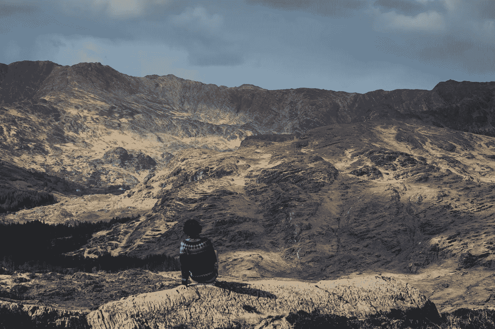

Photo by [Elias Ehmann](https://unsplash.com/photos/DxuDxXNXQnc?utm_source=unsplash&utm_medium=referral&utm_content=creditCopyText) on [Unsplash](https://unsplash.com/?utm_source=unsplash&utm_medium=referral&utm_content=creditCopyText)

“我记得我们早上离开公寓时会打开窗户通风，回来后会看到窗台上的一层黑色灰尘……”，这是 26 岁的安娜·恰希金娜(Anna Chashchyna)对自己在乌克兰顿巴斯长大的描述，顿巴斯是欧洲工业化程度最高的地区之一。“追根溯源，这可能是我决定不想生活在每天吸入大量煤尘的环境中的原因。我当时根本没有考虑过环境保护主义，也没有考虑过环境正义——我现在确实在考虑，当时我 17 岁，我只想离开。”

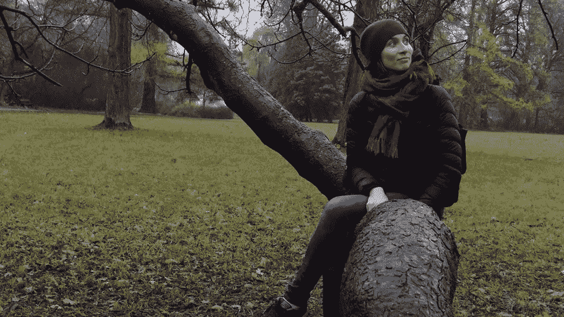

将近十年后，安娜现在住在基辅，从事环境和社会风险管理工作，同时经营着自己的环境咨询机构 Ecognize.me。正如她所说，一切都始于“梦想做调查性新闻，报道战区和正常人不会自愿去的地方。”

“那把我父母吓坏了，猜猜他们做了什么？他们和我一起搬到了基辅，我妈妈牵着我的手去了我申请的每一所大学，一路上确保我不会把我的文件留在新闻机构。结果将是前所未有的。我选择环境研究作为一种妥协，只是为了不让家人失望。我一点也不知道，它会变得如此令人兴奋，为我开辟了一条全新的道路，给我们大家带来了一种新的思维方式，并让一群非凡的人走进了我的生活，”安娜回忆道。

她当时的新闻梦想被置于“冬眠”模式，但她并没有放弃。事实上，当我 2016 年在敖德萨第一次见到安娜时，这个梦想正在悄悄实现。新闻业和环境保护主义的结合听起来像是可以改变我们的社会——这正是安娜想要做的。调查性新闻成为探索环境保护主义诸多方面的工具。

“我只把时间投入到我真正热爱的事情上，投入到给我带来满足感和愉快感的事情上，投入到我正在改变一些好的东西或创造一些新的有用的东西上。我的最高目标是围绕环保主义、环境正义和获取环境数据。安娜解释道:“新闻业、企业家精神和科学工作只是我用来探索我职业的无限领域的工具。

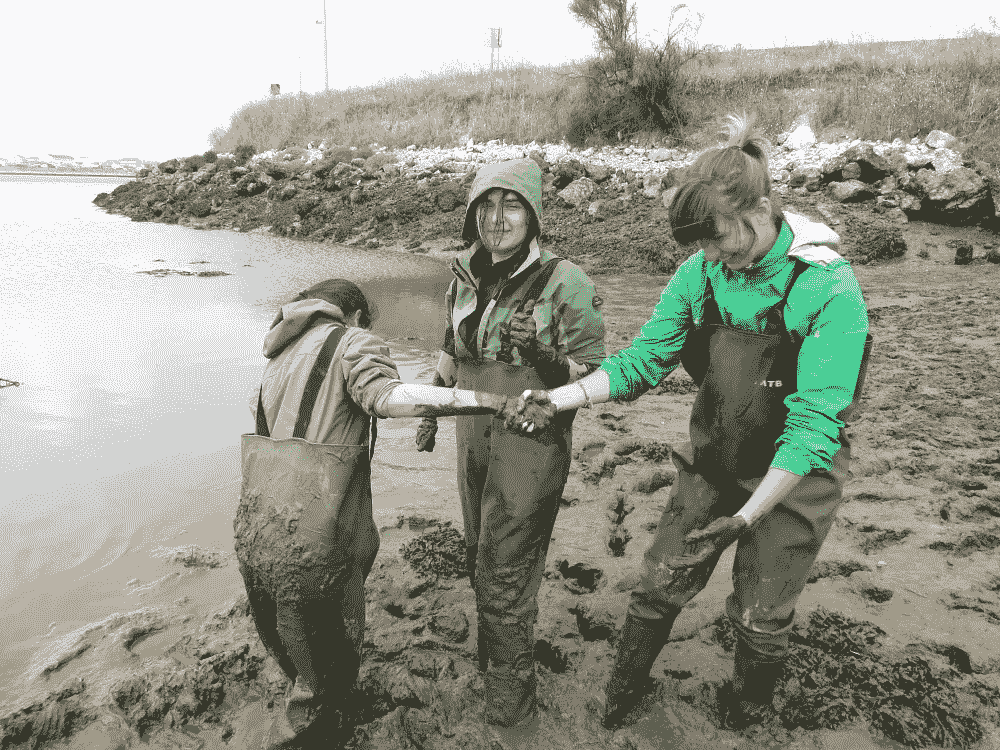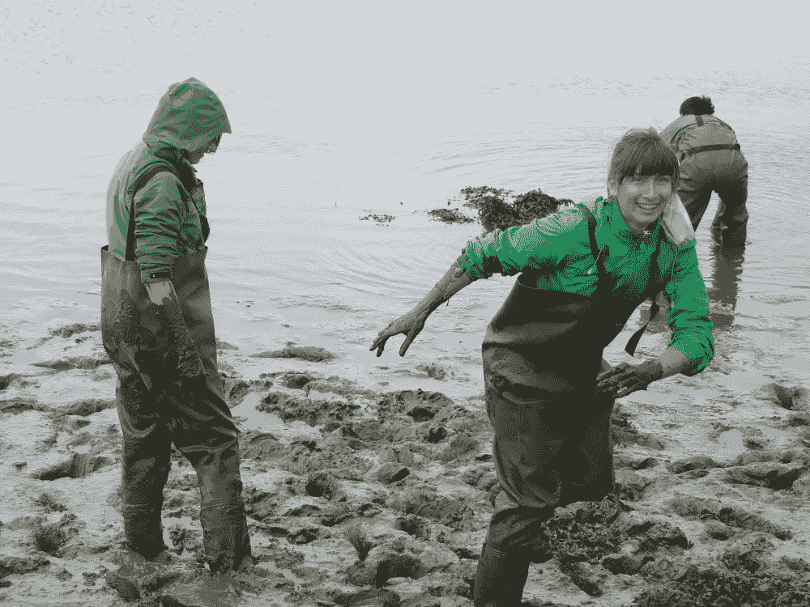

# **来自工业城市的童年记忆**

对于她工作中的创造性部分和她今天所做的事情，安娜归功于她在家乡顿涅茨克的童年。通过她年轻的眼睛，顿涅茨克是一个明亮干净的地方，舒适和规划良好，绿色和繁荣…

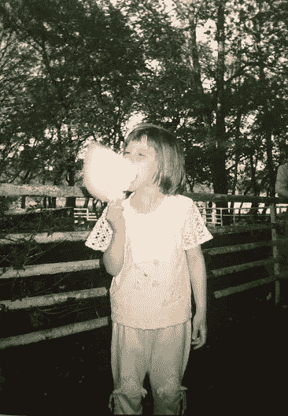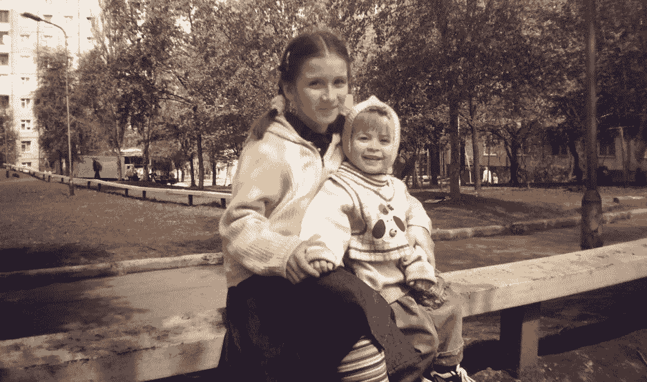

“很久以后，我才开始意识到‘工业’城市的含义，并发现我的家乡以各种褐色经济福利而闻名:冶金、焦化厂、煤矿和煤炭深加工。回顾过去，我意识到:我们生活在资源极度匮乏的环境中。直到今天，我仍然认为个性的发展是由孤立和某些限制形成的。富足不会给人这种珍贵的感觉，也不会把一个人推到创造性的边缘，从一无所有中挖掘出最好的东西。”

当我们面对困难的时候，我们会有一些最好的创作；她的创业就是如此。她当时面临的困难远不止是职业上的，克服创业路上的障碍需要很大的勇气和决心。

因祸得福。这个环境咨询局的概念是在我忙于应付失业和失败的婚姻时产生的。我迫切需要在我的职业中做一些事情，而不考虑我的地理位置，因为我不被允许去任何地方，除非是在我的伙伴旁边(即使现在对我来说听起来很有趣，但相信我——不是的——因为我受到了直接的影响)。毕竟，我们的联盟崩溃了，但 Ecognize 留下了。这一切都是从一个博客开始的，然后我收集了我的专业知识，并将其打包，”安娜反思道。

> **我在考虑‘我想解决哪个问题？’而不是‘我从哪里能得到最多的钱？’它帮助我形成了一个完整系统的工作方法。**

当生态认知的想法还在发展的时候，安娜正生活在法国，攻读应用生态学的硕士学位。在此期间，她在电子垃圾研究、环境影响和产品生命周期评估等领域获得了宝贵的经验。

完成学业并建立了最初的项目后，安娜回到了乌克兰，并继续挑选负责运行和实施该项目的团队。很快，围绕 Ecognize 的难题被解决了，这家初创企业开始运营。

“在 2016 年 9 月搬回乌克兰之前，我一直独自在 Ecognize。不久之后，我遇到并雇佣了一名软件工程师和一名生物学家/遗传学家。我们三个人将拼图中缺失的部分连接起来，开始研究废水处理的技术解决方案。一旦我们准备好了，这将成为我们的第一个现实世界。由于我也教授和主持环境讲习班，这一部分也包括在网站上，是我想进一步发展的方向之一。去年，我在科索沃的普里什蒂纳设计并教授了为期 3 天的环境可持续性研讨会，并希望在科索沃或巴尔干半岛的其他地方继续开展。我渴望探索更多，”她补充道。

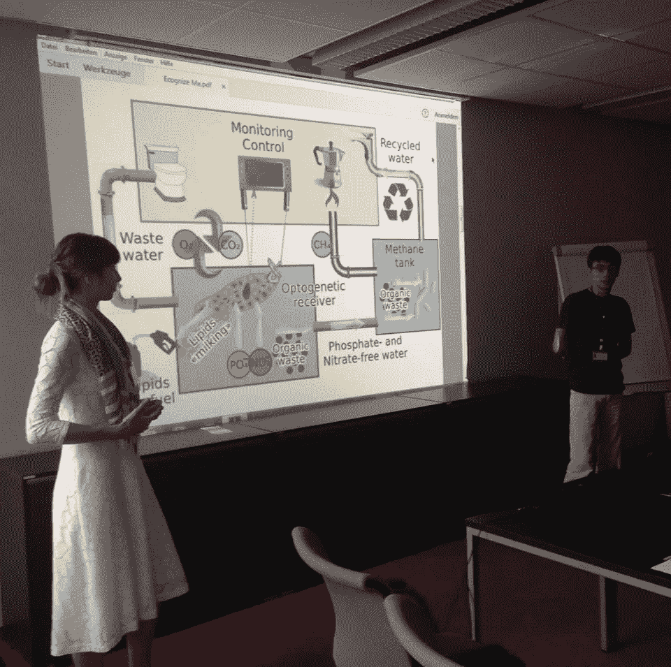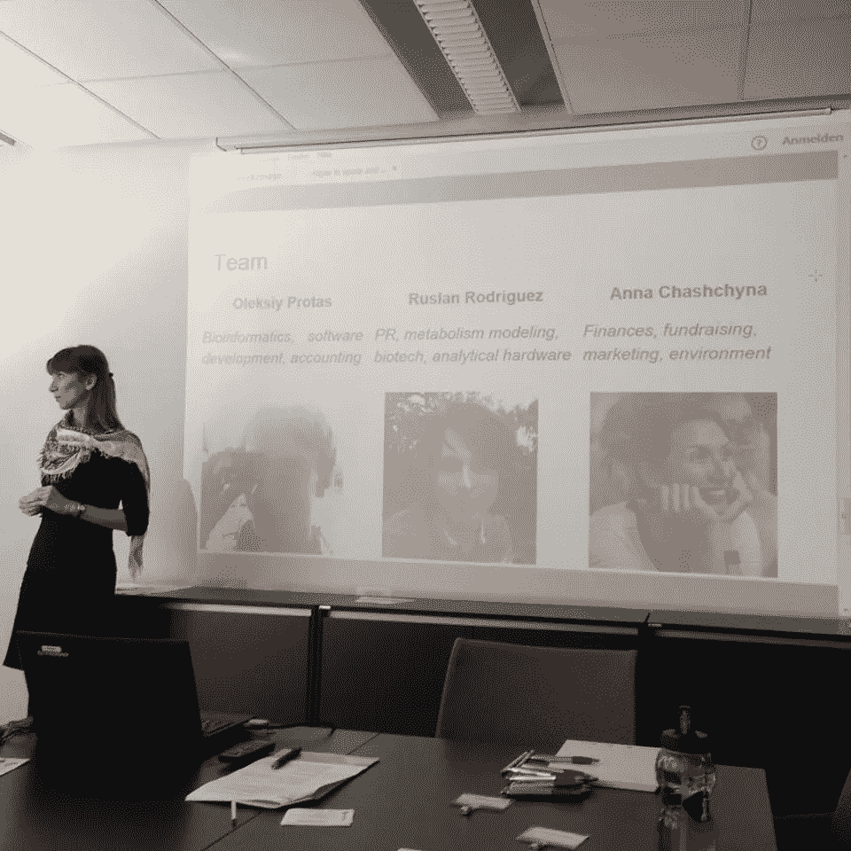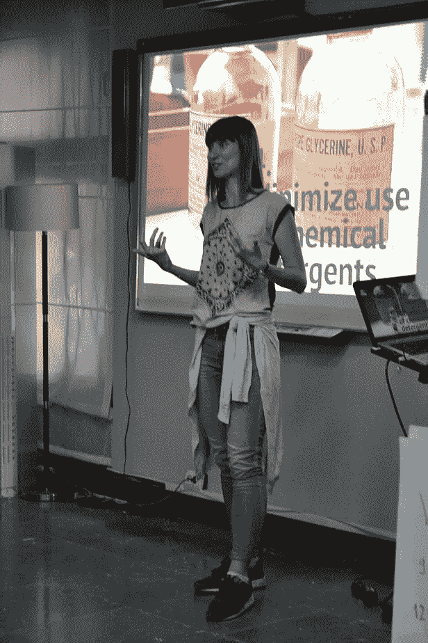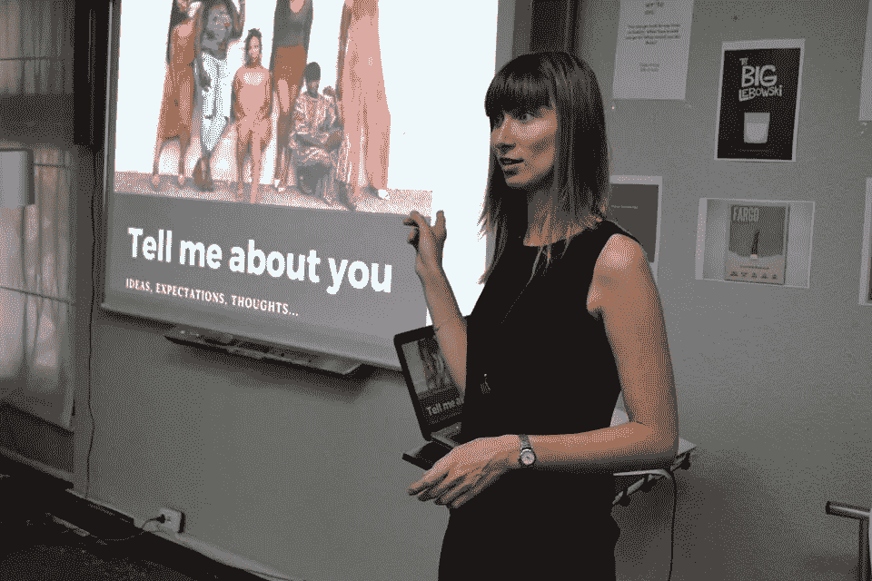

# 提高乌克兰的环境意识

在乌克兰提高环保主义和生态意识有多难？在臭名昭著的切尔诺贝利事故发生 22 年后，乌克兰被称为世界上最严重的核灾难的发源地，近年来一直在寻求一些可再生能源项目。一个例子涉及切尔诺贝利核电站本身，它将成为一个新的太阳能发电厂。建成后，它将产生足够一个中等规模的村庄，或大约 2000 套公寓的电力。安娜直接参与了这个项目——这一次不是作为一名活动家，而是通过为项目做环境和社会评估。她解释说，提高意识既不危险，也不困难——因为整个国家对环境问题都很感兴趣。

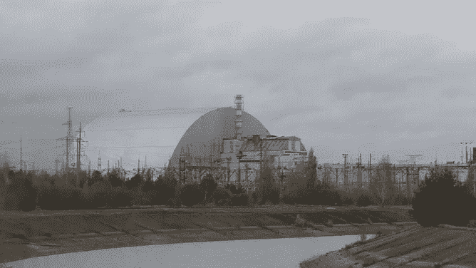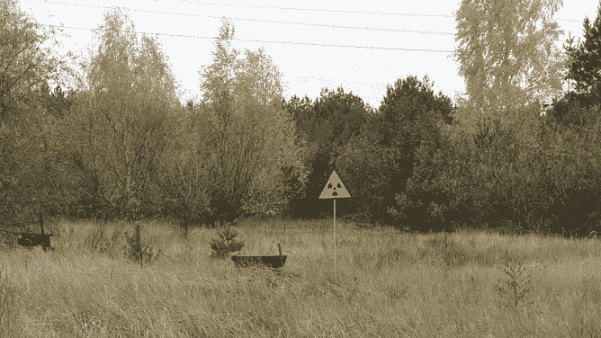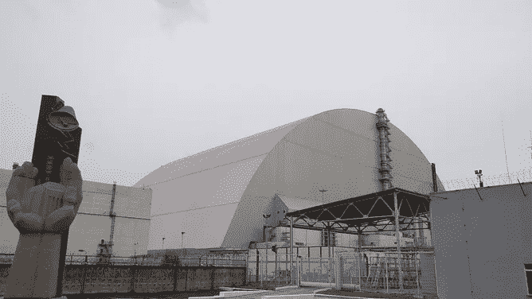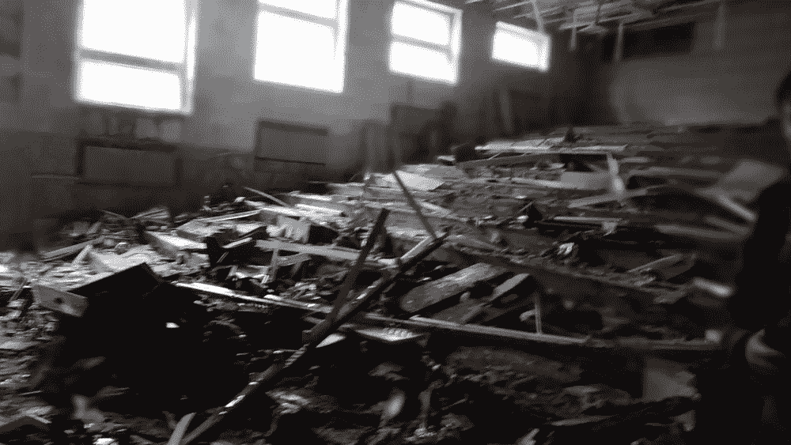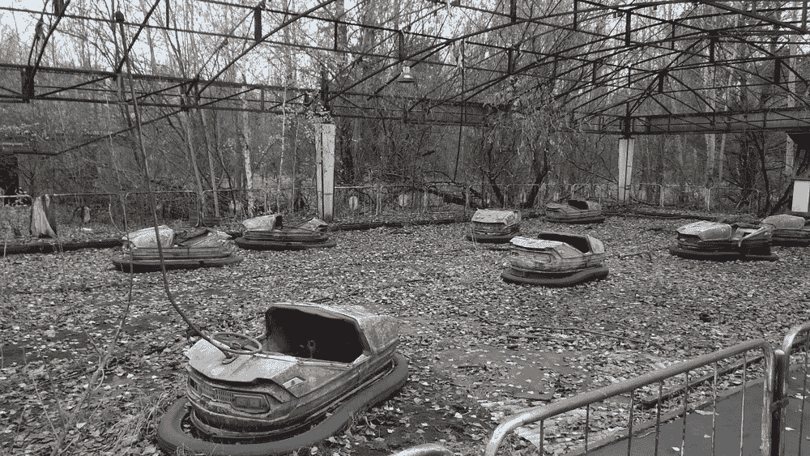

“我可以看到很多积极的变化。许多人正在改革他们的社区，这有时是一件极其困难和忘恩负义的事情。我看到一些年轻人在欧洲和海外工作和学习后回到乌克兰。我自己就属于这一类。我注意到那些敬业、积极、受鼓励的人，他们不仅相信，而且日复一日地工作，一点一点地成为他们想在世界上看到的变化。我在社交媒体上关注倡导零废物生活方式的当地博主，接触在全国各地组织清洁日的环保非政府组织领导人，以及传播环境教育理念的教师/主持人。”

安娜认为，尽管如今乌克兰人已经做好了出门后整理垃圾、回收垃圾或清扫宠物的准备——但这仅仅触及了环保意识应该如何发挥作用的表面。要让根本性的变革在乌克兰社会站稳脚跟，还有很多事情要做。

> 没有发生的是经济激励。人们不理解少消费的核心理念，因为他们倾向于认为自己没有为此买单。

实现长期变化的一个完美方法是将环境因素充分融入系统的金融和经济过程。“在我的日常工作中，我在国家金融机构——银行——开发一个环境和社会风险评估系统。总体目标是将环境和社会方面纳入塑造经济的整体金融和经济过程。理想情况下，生态社会部分应该成为完整决策过程的一个有机的、自然的部分。安娜指出:“旧的体系中，这种成分几乎不存在，正在慢慢消亡，我很高兴也很害怕看到新的浪潮到来。”。

# 永无止境的求变

我们都在努力争取积极的改变——无论是在个人或职业层面，还是在我们的社区或社会中——有时我们太急于看到结果。当他们不是我们所期望的，我们最终会失望和脱节。安娜也不例外，虽然她已经取得了成功，但她知道改变是很难实现的。“我正在做的改变来之不易，不会在一夜之间或几天内完成。我经常感到沮丧、失落和气馁。有时候我想放弃一切，因为用头撞墙是很痛苦的。然而，我拒绝放弃。至少在我看到一个令人满意的切实结果之前。”

其中一个成果是安娜在科索沃做的多媒体项目“尘埃层”。这篇报道完美融合了环保主义和调查性新闻，探讨了科索沃的肮脏能源问题。

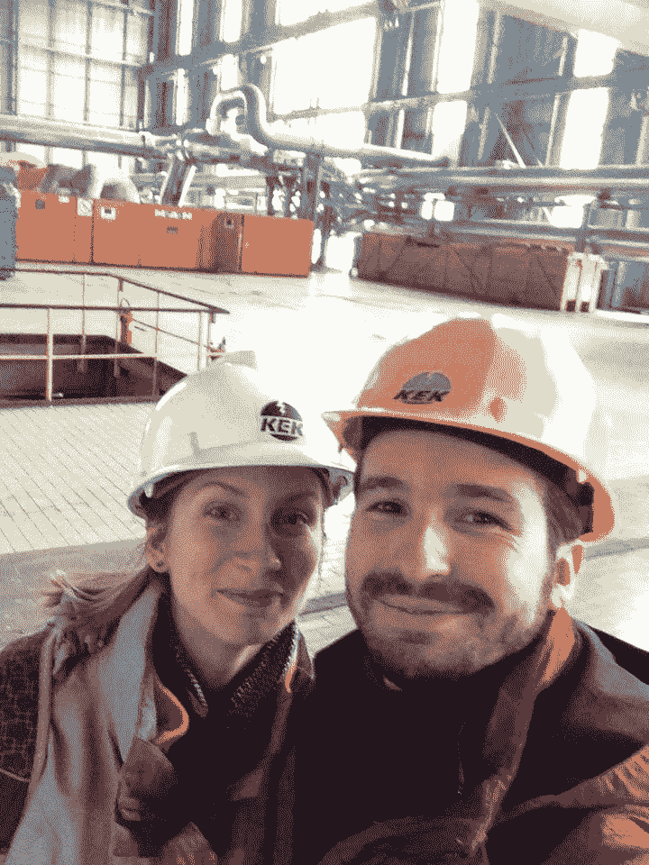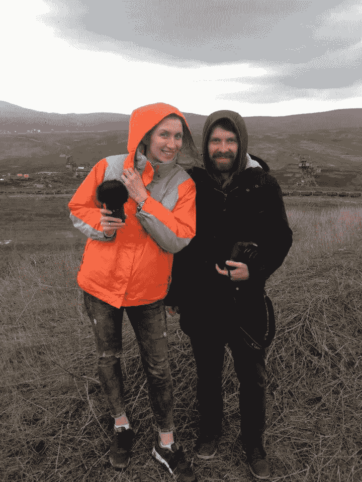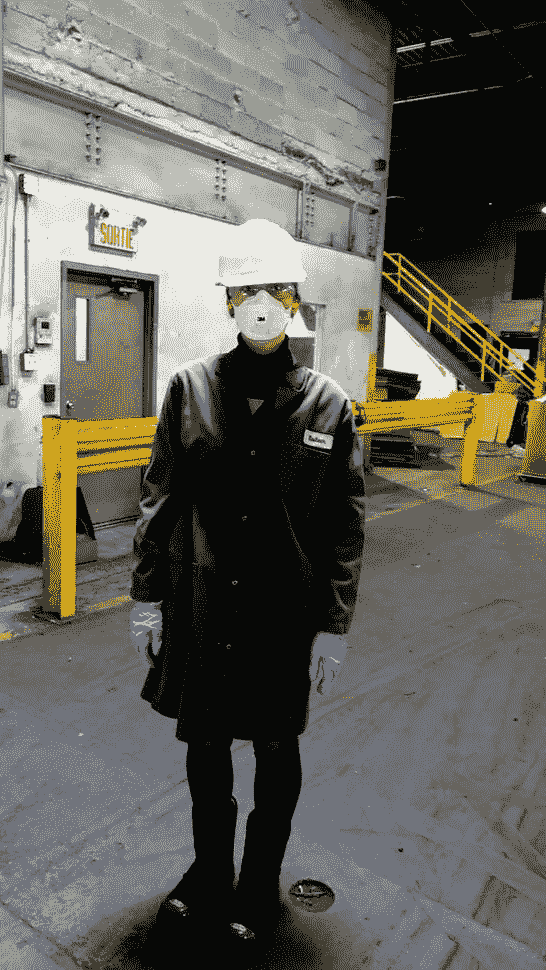

“这个故事的核心是我的人生格言‘抓住每一天，抓住世界提供的每一个机会’。我的一个朋友，Lukas，有一个在科索沃的环境调查报告项目的想法，他正在寻找一个环保主义者。我立即回应了他的请求，跳上了船，从此再也没有后悔过。这是我第一次真正亲身体验调查性新闻，我仍然把它当作我的宝贝。从事这个故事非常具有挑战性、有趣并且充满责任感——我非常喜欢。令我惊讶的是，科索沃变成了一片富饶的、反应极其灵敏的土地，有许多角度可以照亮一个故事。我在旅途中学到了很多东西，崇拜 Lukas 对待事情和人的方式，喜欢和我们的修理师 Julia 以及我采访的当地人一起工作。我们是一个小团队——只有三个人:Lukas(来自德国的纪实摄影师)、我自己和 Adrian(来自西班牙的数据记者)，我真诚地认为我们做得很好，”Anna 说。

然而，安娜认为，这些类型的故事需要在主流媒体上得到更好的曝光，这样越来越多的人可以阅读这个故事，并采取行动。“对于那些直接受到电厂影响的人来说，我仍然抱有一丝希望，事情会有所好转。”她继续说道。“说起《尘埃层》的目标，我觉得我们好像没有达到它的目的。带着信任和希望，我将只留下一个词——然而。”

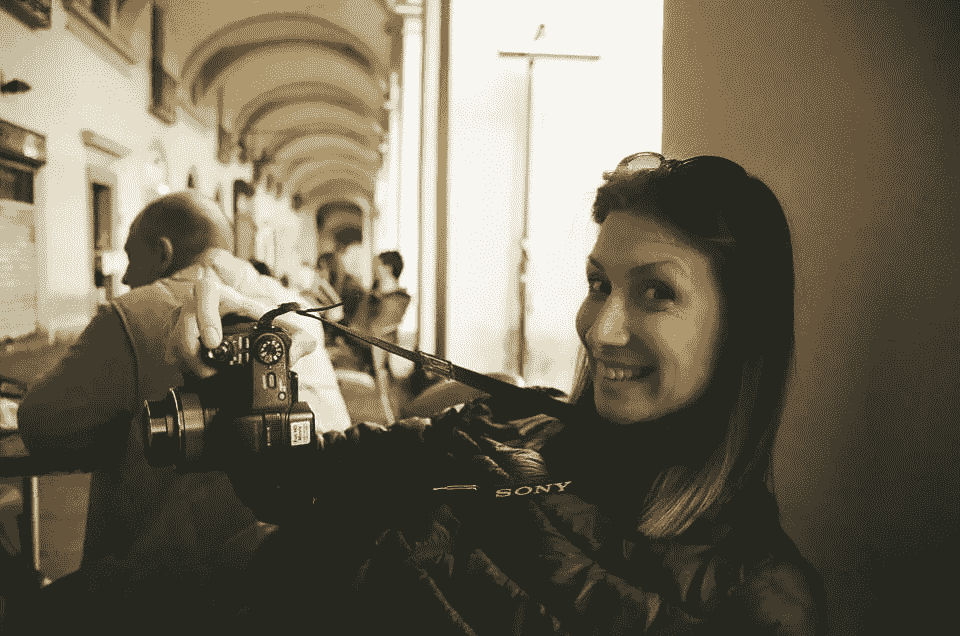