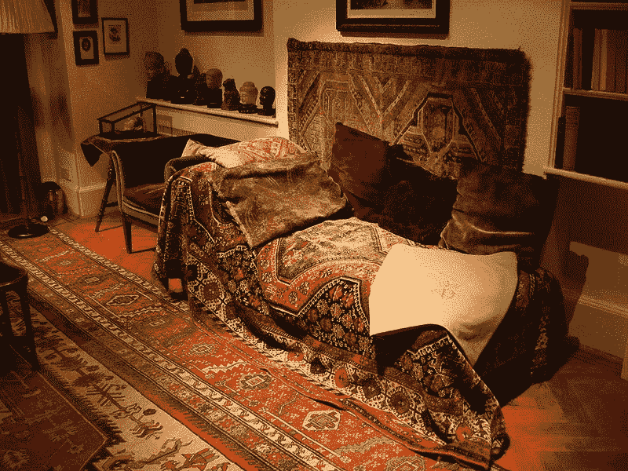
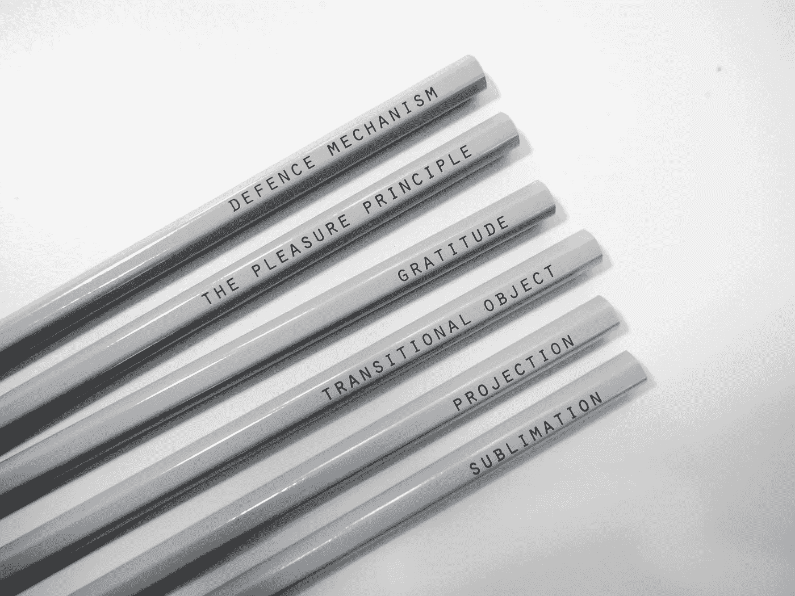
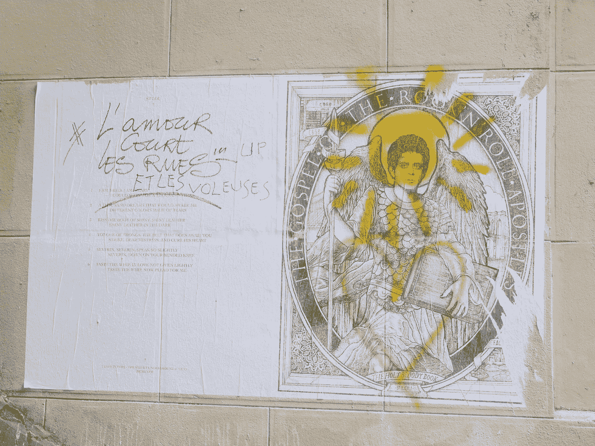

# 魅力、争议和可卡因:看古鲁的奇怪世界

> 原文：<https://medium.com/swlh/charisma-controversy-cocaine-a-look-at-the-strange-world-of-gurus-cb3606ae28bc>

# 残留的雪茄烟味

几年前，我参观了位于伦敦的弗洛伊德故居。它比你想象的要小——不算小，但也不算过分炫耀财富。这所房子的大部分都很普通。有图案的地毯。书架。弗洛伊德的雕塑收藏。奶油色墙壁。陈列柜和招牌很少，看起来像是有人居住的地方。眯着眼你就在你叔叔家了。

## 然后你走进[礼品店](https://shop.freud.org.uk/)，看到一个与弗洛伊德相关的奇怪的小摆设。

一双“弗洛伊德式拖鞋”、印有名言的钢笔和笔记本、无尽的书籍、杯子、手提袋、冰箱贴、涂色书、明信片、薄荷糖盒、雕塑等等。

**这种脱节是深刻的。**

弗洛伊德的信仰与精神病学和心理学纠缠在一起，以至于很难将两者分开。但是如果你设法绘制出弗洛伊德信仰体系的精确参数(我正在努力)，他的影响程度是惊人的。

> 他在流行文化中。他就在我们说话的地方。我们看待自己的方式。到处都能闻到挥之不去的雪茄烟味。

弗洛伊德是一位非凡的思想家，也许是他那个时代最伟大的思想家之一。他的工作使得人们谈论自己的感受在社会上被接受。去思考是什么力量造就了我们。认识到我们的过去和现在之间的联系。理解我们的行为可能有不合逻辑的动机。

说他完全重塑了西方思想可能有些言过其实，但也不尽然。他的影响不能通过把弗洛伊德想成一个医学从业者或研究者来理解。

## 弗洛伊德是一位大师。

The most famous sofa in the world. Probably. Source: [Wikimedia Commons.](https://de.wikipedia.org/wiki/Freud_Museum_(London)#/media/File:FREUD%27S_SOFA.jpeg)

# 为自己着想很难。自己做决定很难。质疑、怀疑和旋转是很难的。

这种东西耗费了大量的精神能量。我们已经准备好寻找捷径。

因此，我们寻找并抓住那些为我们思考的人。告诉我们正确选择的人。让我们不再怀疑的人。他们为我们展示了一幅和谐的生活蓝图，打成一个整齐的蝴蝶结。我们都这样做。在每一种文化中，在世界的每一个地方，几千年来，或者也许从我们成为人类以来，你都会发现扮演这一角色的人。

> 我们可以用不同的方式来看待这些人，他们的差异如此之大，以至于用一个笼统的术语很奇怪。但是一个名词确实存在: ***这些人都是古鲁。***

谈论古鲁而不发现自己如履薄冰是不可能的。用复杂的想法玩弄复杂的人的明显简化。尽量不冒犯任何人——因为很少有什么事情比冒犯一位大师更让人恼火。因此，尽管我之前已经说过这些免责声明毫无意义，我还是要澄清,“guru”这个词是一个名词，而不是一个判断声明、谴责或贬低。这是一个类别。

“古鲁”是一个棘手的词。一个包括有史以来最伟大和最糟糕的人的类别。最善良的和最残忍的，被误解的和被操纵的。古鲁对我们世界的塑造达到了难以想象的程度。然而，我们很少意识到它们之间的联系。

即使你把自己描述成一个无神论者、不关心政治、持怀疑态度、有科学头脑的理性主义者，你仍然几乎肯定会追随那些展现出与你嘲笑的大师们相同特征、使用相同技巧的人。

# 从黑暗走向光明

从广义上来说，古鲁是以一种特定的生活方式领导其追随者的老师。[梵文定义](https://en.wiktionary.org/wiki/gurus)是指引我们从黑暗走向光明的人。宗教人物是最明显的例子，也是这个术语的起源。但这种类型的教师/领导者的基本概念要宽泛得多。

政治家、教育家、研究人员、哲学家、邪教领袖、心理学家。任何生活和工作基于传播一种信仰体系的人。今天，我们也指营销大师、自助大师、激励大师。所以这是一个包括从佛陀到吉姆·琼斯，从佛洛依德到艾克哈特·托尔的所有人的范畴。我想参加一个晚宴。

## 关于古鲁，有趣的是，作为人，他们的生活遵循一条独特的道路。

我最近读了安东尼·斯托尔的《泥足深陷》，他是一位出色的、被严重低估的作家，他的作品让我爱不释手。这是对古鲁的研究，以一种我从未见过的方式观察他们，从而引出对他们是什么以及他们是如何出现的理解。

# 如何在 10 个简单的步骤中成为大师

这是试图总结一个古鲁的生活，基于斯托尔在《一尺粘土 中所写的以及我在别处读到的。当然，没有“典型的”或“普通的”大师——这些仅仅是共性。

大多数人都有孤独或孤立的童年。后来变坏的古鲁往往在童年时被虐待过，或者经历过创伤事件。他们很聪明，大部分时间都在沉思。

在某个时候，通常是在青春期，他们会经历一场危机，陷入深深的绝望。每个人都会在某种程度上经历这种情况。和其他典型的经历一样，对古鲁来说，这种经历更加强烈和持久。他们表现出精神病医生会诊断为[躁郁症](http://www.rcpsych.ac.uk/healthadvice/problemsanddisorders/bipolardisorder.aspx)或[精神病](https://www.earlypsychosis.ca/pages/curious/symptoms-of-psychosis)的症状。（

这通常伴随着我们认为的抑郁症状(绝望、自杀理想化、退缩)和自我毁灭行为(如长时间禁食、在偏远地区长时间孤立自己、自我伤害)。)西方主流文化谴责这些行为和症状。其他文化在其中看到了价值。

> 古鲁一生中很少被诊断出患有任何形式的精神疾病。我们如何解释这些迹象各不相同。某个特定的古鲁是否患有精神疾病无关紧要。重要的是，总有一段迷茫和动荡的时期。我们如何看待这一点取决于他们以后的生活。

为了恢复内心的和谐，他们踏上了探索之旅。旅游是常事。拜访老师和精神人物也是。这可能是一个智力的、内在的旅程，也可能包括四处游荡。不管怎样，这是一个寻找答案的时期，伴随着心理混乱。他们的探索可能首先是由于他们占主导地位的信仰体系的崩溃——就像荣格与弗洛伊德心理学分道扬镳一样。

# 当他们发现答案时，一个大师的探索在一个灵光一现的时刻达到高潮。

有助于解决他们所有问题并恢复他们生活和谐的信仰体系。一瞬间，他们永远改变了。或者说，这是他们讲述的故事。

我们称之为启蒙、顿悟、发现、重生、重塑，随你挑选。这种洞察力不同于可以被测试、证明或反驳的科学发现——它是一种包罗万象的、新的(据他们所说)生活方式。

> **大师们有一种迷人的倾向，认为他们自己的经验是普遍的。**

我们都在一定程度上做到了这一点，但大师们将它发挥到了极致。**他们认为适合他们的信仰体系具有普世价值。也许这对很多人来说是有价值的——不同的是他们从不质疑这一点。他们无法想象任何人会从采纳他们的信仰中获益。许多人大量借鉴了其他思想家的观点，却没有得到承认。**

# 魅力和魅力

如果这样的话，他们会被认为是疯狂的，或者充其量是古怪的。一些孩子游荡到山里，回来时没有洗澡，留着胡子，形容憔悴，声称发现了宇宙的秘密。是的，没错。去洗个澡，看看心理医生，史蒂夫。

> ***但是古鲁们有一个优势:让其他人认同他们的能力*** *。他们极具魅力，对自己充满信心。周围的人觉得他们很有吸引力。*

大师们通常是有才华的演说家，能够在没有笔记的情况下连续演讲几个小时。大多数也是优秀的作家。如果他们在其中一个方面有所欠缺，他们在另一个方面的表现会好一倍。

所以他们用这种魅力来吸引追随者、信徒和支持者——不管你怎么说。他们的支持者被古鲁的信心和他们在接受他们的信仰时所体验到的益处所说服。

在早期，古鲁通常是一股积极的力量。他们可能很慈善，宣扬平等——这可能会吸引边缘群体追随他们。人们崇拜他们。每个遇到他们的人都会着迷。任何不同意的人都是敌人。在任何时候，古鲁都不会批判性地评估他们的信仰体系，即使他们有证据反驳它。

通过谈话、写作和谣言，古鲁吸引了越来越多的追随者。在某些情况下，这些人会跟随古鲁左右，甚至和古鲁住在一起。追随者经常给古鲁大笔的钱，并允许他们支配他们所做的一切，也许放弃他们的财产或辞掉他们的工作。其他追随者只是远远地聆听和采纳他们的想法。

> 随着古鲁积累影响力，他们和他们的追随者与其他团体发生冲突。在这一点上，他们可能会购买一块偏远的土地，并与他们的追随者搬到那里。或者他们可能会创建某种机构。今天，这可能意味着论坛或聊天室或脸书小组。

不管这采取什么形式，古鲁和他们的追随者通常会以孤立告终。任何不认同他们信仰体系的人都会被怀疑、怜悯或憎恨。被崇拜的追随者包围着，古鲁免受批评或问责。

## 这是有趣的部分。

一些古鲁将继续作为有益于他们的追随者的美好、善良的人。有些人死后他们的教义会被扭曲。而有些人，不管他们的初衷是什么，完全被这种力量腐蚀了。

吉姆·琼斯就是一个很好的例子。在琼斯镇建立和真正的邪恶事件发生之前，他是一个[有影响力的民权活动家](https://jonestown.sdsu.edu/?page_id=31327)冒着自己的安全风险促进种族融合。他安慰种族虐待的受害者，帮助整合教堂和医院，开展针对种族主义餐馆的诱捕行动，揭露纳粹并收养弱势儿童。很难说这是否是一个获得追随者的故意策略，或者如果他的意图在一开始真的是纯粹的，他被绝对的权力和- [惊喜](https://jonestown.sdsu.edu/?page_id=35405)逼疯了！-大量吸毒。

## 每次发生这种情况，我们都会感到惊讶。我们不应该。

绝对的权力，即使凌驾于一小群人之上，也会对思想产生可怕的影响。历史一次又一次地证明，很少有人能处理好，几乎没有人能长期处理好。

# 回到弗洛伊德。

将他描述为大师听起来很奇怪。当我第一次看到他被列入[*的泥人脚时，我吃了一惊。*](https://www.amazon.co.uk/gp/product/0006384234?ie=UTF8&tag=rosieleizr06-21&camp=1634&linkCode=xm2&creativeASIN=0006384234)

然而这就是他。弗洛伊德没有通过严格的研究来发展他的理论。他的大部分主张要么是错误的，要么是不可证伪的。精神分析是一段时期内心混乱的产物，因为他在寻找既能帮助他理解自己又能让他成名的东西。

# 自恋的典型

最终，受可卡因刺激的弗洛伊德提出了一个解决他内心困境的信仰体系。他的父母应该受到责备！哒哒。

当然，他确实把一些技术建立在似乎对他的病人有帮助的基础上。但是现在人们认为这是因为他们第一次有了一个理解的倾听者和说话的空间。他的技术无关紧要。我很清楚，精神分析不仅仅是责备父母，这正是问题所在。

从那里，弗洛伊德概括说，同样的必须适用于每个人。就像，对他来说是真的，对所有人来说也是真的，这是自恋的缩影。

安东尼·斯托尔引用了一封信，他在信中解释说，他在自己身上“发现了”恋母情结。因此，弗洛伊德总结说，这必须是一个普遍的事实。

我有没有提到他一直服用大剂量的可卡因？长期大量服用会导致躁狂、精神病、偏执狂和触觉幻觉。现在我很清楚，如果明天所有的可卡因瘾君子都消失了，经济将会崩溃——让我们记住，弗洛伊德不可能处于智力的最佳状态。同样值得指出的是，他差点因为一次拙劣的手术杀死了一个病人。

尽管如此，他还是吸引了一些追随者——那些相信他所说的一切、不怀疑他并与他分享精神分析是解决他们问题的方法的富人。

没有人总是完全确定自己的能力，即使是大师也必须经历自我怀疑。**追随者的存在增强了他们的信念，创造了一个回音室，每个人都同意他们的观点。**

# 为什么我们不能放过弗洛伊德？

认为一个人未经证实的、很大程度上是错误的、经常是可笑的信念会主宰像我们对大脑工作方式的理解这样基本的东西是没有意义的。或者说，面对铺天盖地的相互矛盾的证据，他还能在如此长的时间里保持如此大的影响力。

Case in point: as I was writing this, I went to jot something down and realised I was using one of these pencils.

> 归结起来就是完全相信。完美的自信。完全的自信。你可以感觉到它从他的作品中散发出来。弗洛伊德相信他写的每一个字。

**我大约 12 岁时开始阅读弗洛伊德，在我高中的图书馆里发现了一本《梦的解析》。在接下来的几年里，每当我做了一个不寻常的梦，我都会去查阅它。尽管从那以后我没有重读它，但我记得它写得就像一本科学教科书——毫无疑问。因此，当我梦见穿着溜冰鞋在一个镜子大厅里追逐一个朋友时，弗洛伊德告诉我，我被它们秘密吸引，并引发了持续数月的身份危机。**

那时，我正第一次涉猎荣格、卡夫卡、杰梅茵·格里尔、马克思、娜奥米·沃尔夫、西蒙娜·德·波伏娃等等。通常青少年的最爱。没有一个像弗洛伊德一样让我难忘。他们的想法迫使你向外看，去面对世界上的系统性问题。做出艰难的道德判断。

女权主义理论家让我震惊和沮丧。没错。马克思留给我的困惑是，为什么他看似完美的想法在现实生活中并不奏效。此外，译者坚持保留德语语法让我很头疼。在学校里，我读荣格的话不超过两句，就会有人问我“Jug 到底是谁？”反正他给我出题。太多了。

## **佛洛依德反其道而行之:给我答案。错误答案。**

他的作品鼓励自我检查、自省和自我反省。自我放纵。他的确定性让你从表面上接受一切，[避免怀疑的努力。几年后，我才意识到我是多么容易地被一个妄想的信仰体系所迷惑。](https://www.rosieleizrowice.com/blog/creativityisvulnerability)

# 当我们想要了解人性时，最好的起点总是从极端开始。

然后要认识到一切都在一个光谱上，极端是光谱的一部分，而不是一些不相连的东西。

正常和极端之间的分界线远比我们大多数人想象的要细。有时我们发现自己站在这条线的哪一边只是运气或巧合。当你观察大多数古鲁(不包括宗教领袖)的生活时，你会看到我们其他人的一种更极端的形式。

*   你看到一系列的情况导致了一个可以理解的结果。
*   你会看到可以用完全相反的方式来解释的行为和行动。
*   你看到一个被忽视的关于文化相对论的讨论。

## 引人注目的是，大师之所以成为大师，是因为他们令人难以置信的自信，而不是因为他们的能力或洞察力。

一个站得住脚的论点，站不住脚，毫无意义。一个有说服力的弱论点是强有力的。我们都会上当。

> 放大和强化一个古鲁的是拥有保护他们免受批评并相信他们每一句话的追随者。

到那时，就没有退缩或改变主意的余地了。他们被关在回音室里，外面的每个人都是错的。在那种情况下，根本不可能保持平衡的观点。

> 互联网让任何人都可以将自己定位为大师。我们都有能力表达我们的观点，分享我们的信仰体系。我们比任何时候都更能积累追随者和支持者。几乎所有东西都有一个论坛，这已经是老生常谈了。

安东尼·斯托尔于 2001 年去世，所以我们不知道他对互联网会有什么感受。也许他会认识到，我们的生活中都有一个古鲁形状的空洞，我们只是在寻找新的方法来填补它。

今天大部分关于古鲁的文章都集中在揭露或批评某个特定的古鲁，或者分享古鲁没有答案的不那么残酷的事实。这比考虑我们最初为什么相信它们更没意思或更没用。

**我的问题是，这对我们有什么影响？**如果每个人都能找到支持者，是不是意味着每个人都能找到验证自己想法是真的呢？我们是否都在走向一个我们的信念越来越脱离现实的点？为了逃避不确定性和怀疑，我们付出了什么代价？

# **当我们把我们的想法外包给其他人，仅仅因为他们听起来有说服力，我们会失去什么？**

*附:如果你希望我的帖子每月发送一次到你的收件箱，请在这里* *注册* [*。*](https://rosieleizrowice.substack.com/welcome)