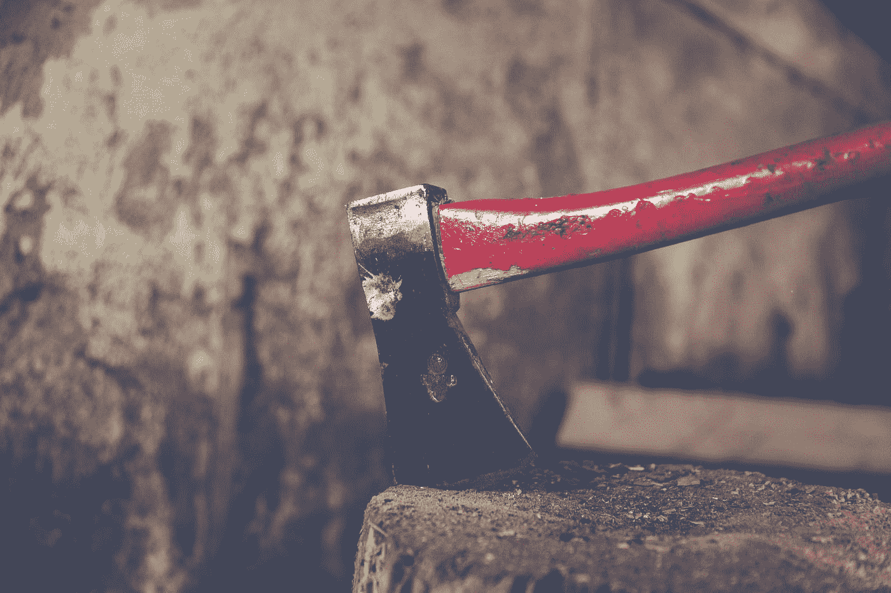

# 慈善的选择

> 原文：<https://medium.com/swlh/charitys-choice-a0abc2866f63>

Photo by [Markus Spiske](https://unsplash.com/@markusspiske?utm_source=medium&utm_medium=referral) on [Unsplash](https://unsplash.com?utm_source=medium&utm_medium=referral)

## 人生的一课

三个十几岁的姐妹穿过森林，寻找新家。他们成了孤儿，因为他们嬉皮士的父母在他们的父亲没有清理烟囱时无意中放火烧他们的小屋。不幸的是，父母都在大火中去世了，他们把女儿从前门推到安全的地方，