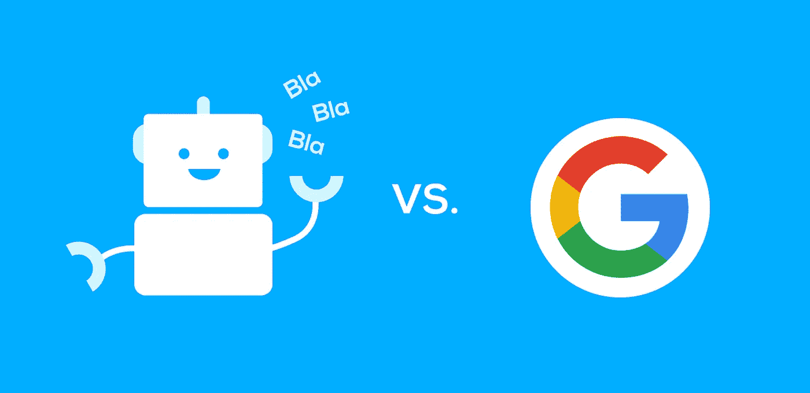
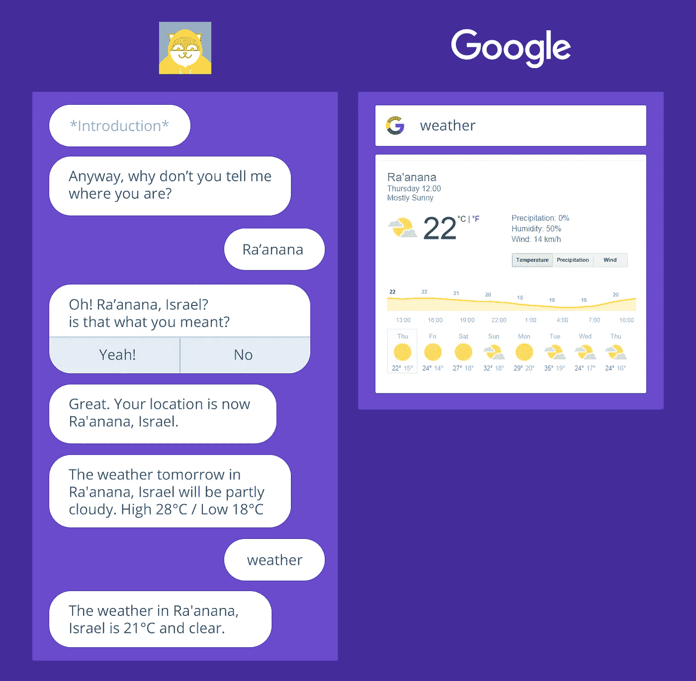
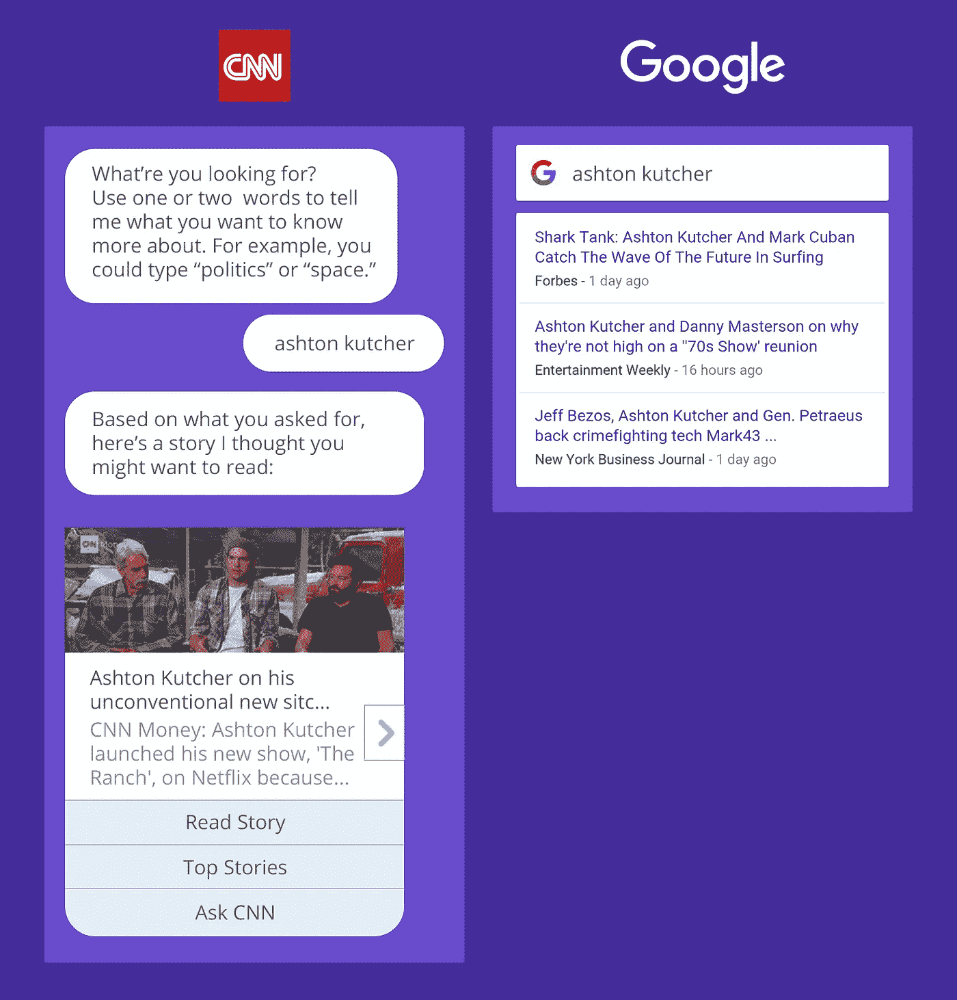
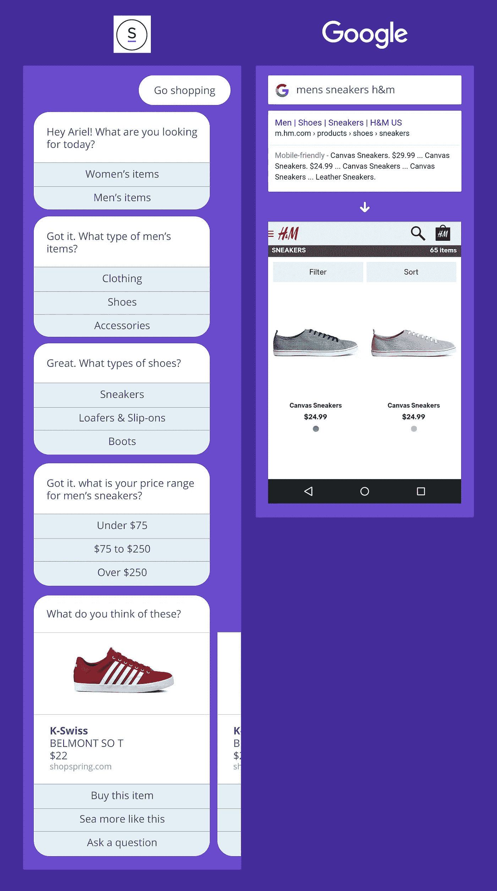

# 聊天机器人与谷歌搜索

> 原文：<https://medium.com/swlh/chat-bots-vs-google-search-b44d11a53f14>

聊天机器人可能是硅谷现在最热门的东西。作为证据，我们可以看到微信蓬勃发展，Slack 成为世界上最大和最受欢迎的公司之一，脸书推出了他们新的企业信使平台。各种类型的公司都在努力工作，并花费大量资金来研究如何利用这一新的渠道来吸引更多的客户。

当我第一次和聊天机器人互动时，我觉得它很有趣也很酷。在第二次的时候，我仍然认为这是一个有趣的概念，但从那以后，我和几十个人进行了交谈，现在当我和一个人交流时，我倾向于想:

> 作为一个聊天机器人，我真的需要这项服务吗？

对微服务的需求显而易见。简单的服务，比如查天气，应该可以从你已经在的屏幕上以一种非常快速的方式获得。

我拥抱谷歌 I/O 宣布的安卓即时应用程序，T2 的 Slack 商店很酷，T4 的谷歌和必应都在他们的搜索结果中提供简单的服务应用程序，这种趋势肯定会继续。但是谁说微服务有聊天界面就更好了？事实上，聊天界面需要大量的点击来输入字母，通常它们背后的大脑甚至不够聪明，不知道我要说什么。

所以我认为将著名的聊天机器人与谷歌进行比较会很酷。以下是我对三个用例的了解。

## **1。查看天气**

如果你不知道，在谷歌中输入“天气”会给出你所在地区今天和本周剩余时间的天气，有很棒的 UX 和时间线。Poncho 可能会以一种更好、更个人化的方式告诉我当前的天气，但它肯定没有那么容易，也不会产生更好的结果。

## 2.阅读新闻

谷歌一下你要找的标题，你会在网上找到它的热门文章。CNN 相对较新的聊天机器人只是他们向你发送推送通知的另一种方式，对于忠实用户来说，浏览体验相当糟糕。

## 3.买衣服

试试 Spring 的聊天机器人，你会发现它甚至不是一个聊天工具，而是一个界面，它会问你许多不同的 3 选项问题，以便从他们的网站上获得一些特定的内容。谷歌正是你需要得到更准确的结果。但不是在春天，因为搜索引擎优化的问题(它不是比聊天机器人更重要吗？)，所以我以 H&M 为例。不用说，在网站内部浏览要比在 messenger 内部容易得多。

# 聊天机器人不一定更糟糕

机器人实际上可以派上用场，但我们还有很长的路要走。我认为机器人的主要优势是个性化。只要感觉自然，聊天是服务从用户那里收集数据的一种很好的方式，并由此提高报价和语言的准确性。但是现在，许多机器人并不比填写一个又长又累人的表格更好。

所以我认为机器人是万物的未来吗？也许是，但很可能不是。谷歌、苹果、脸书和微软已经非常了解我，他们可以在比聊天简单得多的界面上为我提供服务和答案。但是机器人不是很酷吗？当然是了，我甚至[自己也造了一个](http://arielverber.com/intiguru/)。真的很聪明。