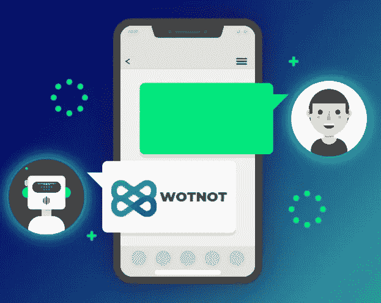

# 聊天机器人和千禧一代——天作之合？

> 原文：<https://medium.com/swlh/chatbots-and-millennials-a-match-made-in-heaven-2d77db6d4cd1>

Photo by [Jacob Ufkes](https://unsplash.com/photos/Q-RP-Or3tD4?utm_source=unsplash&utm_medium=referral&utm_content=creditCopyText) on [Unsplash](https://unsplash.com/search/photos/solution?utm_source=unsplash&utm_medium=referral&utm_content=creditCopyText)

2018 年即将结束，可以肯定地说**这是聊天机器人**的一年。千禧一代是主要原因。根据 CARAVAN 进行的一项[研究，大约五分之二的千禧一代认为聊天机器人提供的服务比人类更好。](https://orcinternational.com/wp-content/uploads/2016/06/ORC-Millennials-and-Chatbot-infographic.pdf)

大约 70%使用过聊天机器人的千禧一代称这是一次积极的体验。千禧一代倾向于使用聊天机器人等自助服务选项，而不是与人交往。

那么，为什么千禧一代和聊天机器人是天作之合呢？让我们找出答案。

# **即时解决方案**

千禧一代比他们的上一代更看重速度和效率。作为经历智能手机时代的第一代人，千禧一代不习惯等待。聊天机器人很好地满足了这种需求，它可以同时与多人互动，而在传统方法中，这是不可能的。

Chatbots provide instant solutions which reduce the turn-around time.

聊天机器人在它的对话流程中预定义了答案集，因此它会立即给出所需的响应。千禧一代更有可能选择有快速答案的聊天机器人，而不是客户服务号码或电子邮件，后者很可能会回复他们说“我们将在 2-3 个工作日内回复你”

# **谈话式的做事方式**

随着脸书的崛起，我们正在经历社交媒体应用程序，因为它们的对话性质，我们被它们迷住了。千禧一代总是通过各种社交媒体应用程序与他们的朋友和粉丝互动。
不仅如此，他们甚至通过社交媒体应用消费信息、玩游戏、购物和做更多事情。

> 根据一项研究，美国的千禧一代每月在社交应用上花费近 30 个小时。

Millennials prefer texting than talking

除了在千禧一代已经使用的平台上与他们互动，聊天机器人还以对话和非正式的方式与他们互动。毫不奇怪，像达美乐和星巴克这样的大品牌已经部署了脸书信使机器人来接受订单，并相应地安排食品/饮料的交付。

> 所以现在，千禧一代更喜欢输入“我想要一个橄榄配料的玛格丽塔披萨”,而不是拨打披萨外卖员的电话！

# **颠覆性技术**

千禧一代以精通技术而闻名。不像他们的上一代，新技术不会吓倒他们。千禧一代不会介意排队购买最新的手机和其他设备。

Millennials do not shy away from welcoming new technologies.

聊天机器人是最新颠覆性技术——人工智能——的产物。AI 学习并适应自己，以满足用户的需求。通过使用这项技术，千禧一代在不久的将来会对人工智能的发展产生影响。千禧一代以引领数字革命为荣。

> 与他们的上一代相比，千禧一代更愿意尝试新技术。

千禧一代对聊天机器人的反应更加积极，这就是为什么越来越多的品牌倾向于在其业务中实施聊天机器人的原因。

Chatbots improve the ROI of your business.

不仅仅是因为你所服务的用户群的类型，聊天机器人正在被各行各业实施，还有其他各种原因使它们成为一项有前途的技术。随着聊天机器人逐渐成为主流，对于公司来说，实现构建良好的[聊天机器人，使其很好地适应他们的业务流程](https://wotnot.io/)，变得更加重要。

Can your business generate leads even while you are asleep? Yes, it can!

你的企业[为聊天机器人革命](http://www.wotnot.io)做好准备了吗？

## 这篇文章发表在 [The Startup](https://medium.com/swlh) 上，这是 Medium 最大的创业刊物，有+393，714 人关注。

## 订阅接收[我们的头条新闻](http://growthsupply.com/the-startup-newsletter/)。

