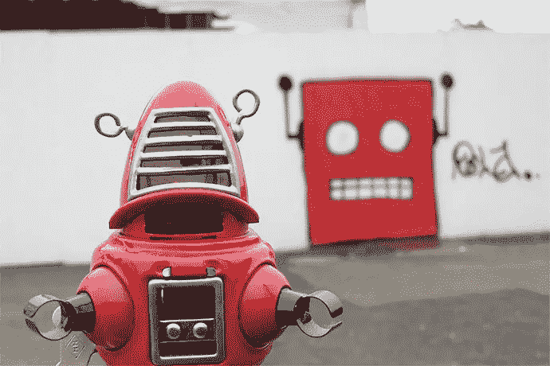
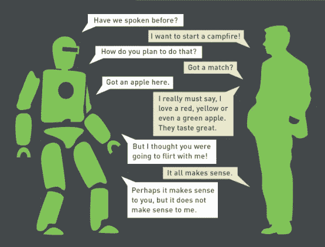
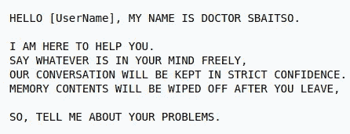
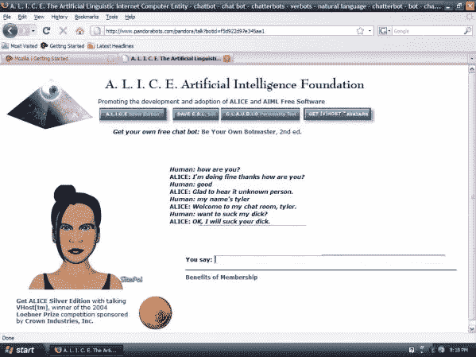
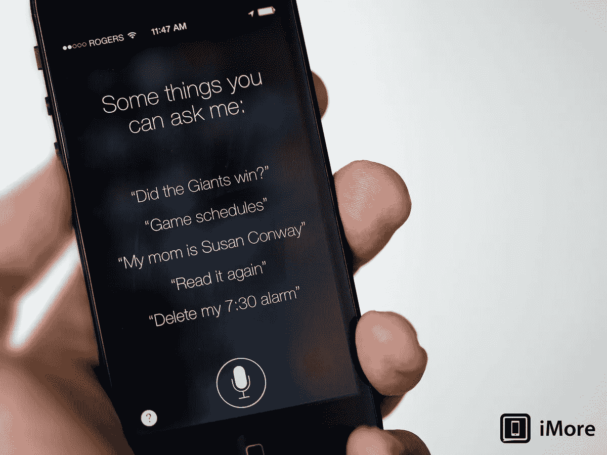

# 聊天机器人的过去和未来

> 原文：<https://medium.com/swlh/chatbots-past-future-8df2076192e5>

每当我们听到聊天机器人，我们许多人认为这是一个新兴技术只有几年的历史。令人惊讶的是，事实并非如此，你们中的许多人可能会对此感到惊讶。聊天机器人的历史和计算机本身一样悠久。

第一个成熟的聊天机器人(当时叫做 chatter bot)是 1966 年由麻省理工学院创建的 Elizza。这个聊天机器人的唯一目的是在机器和人之间创建一个聊天界面。Elizza 在最初的精神病学访谈中伪装了非定向精神治疗师的回答，从而获得了知名度。

在 1972 年 Elizza 之后，斯坦福大学创造了另一个非常著名的聊天机器人 Parry。这个聊天机器人被称为伊丽莎白的变体，但是有一种态度。最有趣的是，这两个最初的聊天机器人通过 ARPANET 连接在一起，并相互交谈。此外，在图灵测试中，有经验的精神病学家只能区分 48%的人类和帕里的反应。

在文本聊天机器人成功之后，出现了第一个模拟人类声音的聊天机器人 Jabberwacky。创建这个聊天机器人的目的是让聊天机器人通过图灵测试。紧随 jabber wacky**T3**的脚步，另一个名为斯拜索博士的聊天机器人于 1992 年诞生。聊天机器人有一个用户界面，斯拜索博士模拟了心理学家的反应。****

20 世纪最著名的聊天机器人是 1995 年创造的爱丽丝。这款聊天机器人也受到了伊丽莎白的启发，但凭借其启发式功能，它能够更有效地与人类聊天。后来，爱丽丝成为苹果个人助理聊天机器人 Siri 的灵感来源。除了计算机科学，爱丽丝还启发了电影工业，导致不同的科幻电影。

现在我们可以说聊天机器人不是一个陌生的想法。几十年前就存在了。所有这些聊天机器人背后的主要动机是帮助人类高效地完成任务。

尽管如此，聊天机器人的使用并不像现在这样过度。聊天机器人的革命随着苹果个人助理 Siri 的推出而到来。Siri 支持广泛的用户命令，包括执行电话操作、检查基本信息、安排事件和提醒、处理设备设置、搜索互联网、导航区域、查找娱乐信息，并能够与 iOS 集成的应用程序进行互动。

Siri is part of Apple’s [iOS](https://en.wikipedia.org/wiki/IOS), [watchOS](https://en.wikipedia.org/wiki/WatchOS), [macOS](https://en.wikipedia.org/wiki/MacOS), and [tvOS](https://en.wikipedia.org/wiki/TvOS)

行业巨头 IBM 的沃森也为自然语言处理铺平了道路。亚马逊推出了具有自然语言处理能力的 Alexa。谷歌还通过开发名为 Dialog Flow 的对话代理，在更高效的聊天机器人中发挥了重要作用。该代理提供了与脸书、Skype、Twitter、Slack、Cortana、Alexa 等聊天机器人框架的单一平台集成。

许多商业巨头现在使用聊天机器人来提高效率。从食物链到电影院，从体育到健康，你会看到聊天机器人无处不在。

未来几年，这些聊天机器人将成为我们生活中不可或缺的一部分。这些聊天机器人将能够分析信息并自己做出决定。这种自己做决定的想法可能会吓到很多人。但是，我们相信这将使人类能够有效和高效地解决他们的问题。例如，如果发生任何灾难，这些智能个人助理可以通知他们的主人，并帮助他们及时撤离。天空是无限的，使用这些人工智能聊天机器人可以做什么。

使用人工智能聊天机器人技术将会大大发展，为人类的日常工作提供便利。

## 这篇文章发表在 [The Startup](https://medium.com/swlh) 上，这是 Medium 最大的创业刊物，有 281，454+人关注。

## 订阅接收[我们的头条](http://growthsupply.com/the-startup-newsletter/)。

