# 聊天机器人是下一件大事:发生了什么？

> 原文：<https://medium.com/swlh/chatbots-were-the-next-big-thing-what-happened-5fc49dd6fa61>

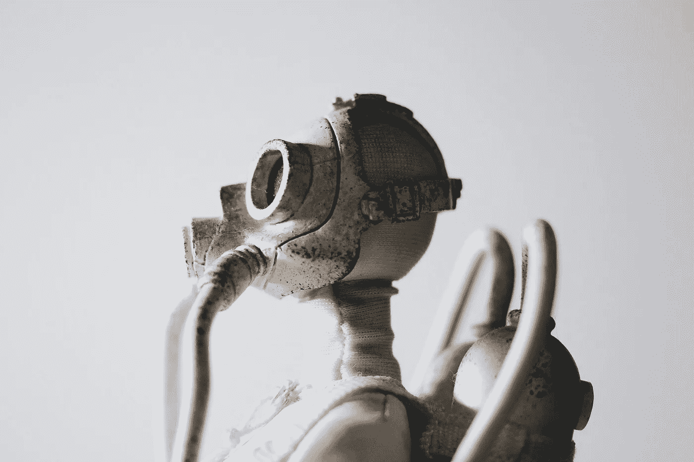

哦，标题是多么响亮:

> “……2016 年的 bot 模式转变将比过去十年从网络到移动应用的转变更具破坏性和趣味性。”

聊天机器人是下一件大事。

我们的希望非常高。目光炯炯，尾巴浓密，这个行业迎来创新新时代的时机已经成熟:是时候开始与机器交流了。

为什么不会呢？所有的路标都指向疯狂的成功。

> 信息是巨大的！对话式营销是一个炙手可热的新词！微信！中国！
> 
> 此外，越来越明显的是，对于那些讨厌的、难以开发的应用程序，供应远远超过了需求。

在【2017 年世界移动通信大会上，聊天机器人是主要的头条新闻。[大会](https://www.gsmaintelligence.com/research/?file=b3b570e28bbd10d2d128069bd1ce1a79&download)的组织者称，在品牌和企业的焦点不可避免地转移到聊天机器人的事件中，人们表现出了压倒性的接受。

事实上，围绕聊天机器人的唯一重大问题是**谁**会垄断这个领域，而不是**聊天机器人是否会首先起飞**:

> "会出现一个单一的平台来主导聊天机器人和个人助理生态系统吗？"

一年过去了，我们有了这个问题的答案。

**号**

因为连一个平台主导的生态系统都没有。

# 被另一个炒作周期愚弄

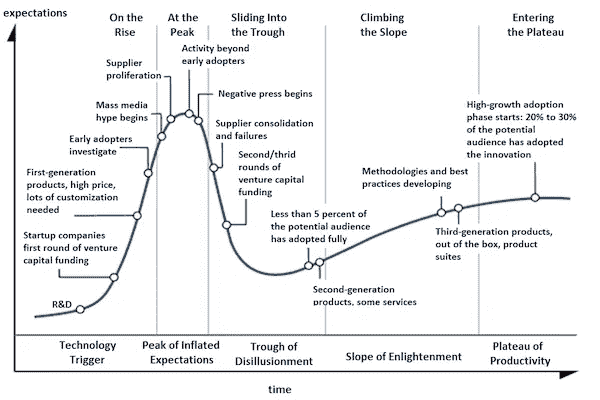

聊天机器人并不是第一个被夸夸其谈，然后又黯然失色的技术发展。

古老的炒作周期以熟悉的方式展开…

> 虔诚的 TechCrunch [文章](https://techcrunch.com/tag/chatbots/)写好了。
> 
> 像克里斯·梅西纳这样的先知先觉的思想领袖也加入进来。
> 
> 硅谷对与智能自动化对话的前景垂涎三尺。
> 
> 信使开始充斥着机器人。
> 
> Slack 经历了指数级增长，甚至推出了 bot 投资的基金。

期望建立，建立，然后…..一切都不了了之。

预言的天堂转变并没有实现。

很明显，应用程序仍然生机勃勃。

我们回顾了我们气喘吁吁的乐观主义，并转向对方，有点困惑:

*“就这样吗？这就是我们承诺的聊天机器人革命吗？”*

Digit 的 Ethan Bloch [总结了](https://www.inc.com/sonya-mann/digit-chatbots-are-dead.html)的普遍共识:

> “我甚至不确定我们是否可以说‘聊天机器人已经死了’，因为我甚至不知道它们是否曾经活着。”

[根据 Heap 产品设计副总裁戴夫·费尔德曼的说法，聊天机器人不仅仅是在一个难题上失败了:他们在几个问题上失败了。](https://chatbotslife.com/chatbots-what-happened-dcc3f91a512c)

# 文本对语音对图形用户界面:一个浓缩的历史

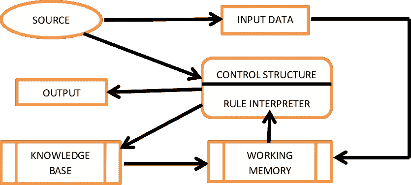

机器人可以以不同的方式与用户交互。最大的区别是文本和语音。在(计算机界面的)开端是(书面)文字。

用户必须手动向机器输入命令才能完成任何事情。

然后，图形用户界面(GUI)出现了，挽救了局面。我们被窗口、鼠标点击和图标迷住了。嘿，我们最终也有了颜色！

与此同时，一群研究科学家正忙于开发数据库的自然语言(NL)接口，而不是学习一种晦涩难懂的数据库查询语言。

另一批科学家正在开发语音处理软件，这样你就可以对着电脑说话，而不必打字。事实证明，这比任何人最初意识到的都要困难得多:

> …这么多不同的口音，人们说话太快或太慢，喃喃自语，嗯嗯啊啊。
> 
> 你说的是“识别演讲”还是“破坏一个美丽的海滩”？

议程上的下一项是与机器进行双向对话。这里有一个关于 VCR 设置[系统](https://pdfs.semanticscholar.org/e4b0/2de85c848b8d9284cec8550d25bd455fb8b2.pdf)的对话示例(可以追溯到 20 世纪 90 年代):

> 用户:“你好。”
> 
> 经纪人:“你好，你叫什么名字？”
> 
> 用户:“糖果。”
> 
> 经纪人:“你好，糖果！”
> 
> 用户:“我们来设置时钟吧。”
> 
> 代理人:“几点了？”
> 
> 用户:“时间是上午 11 点。”
> 
> 代理将时钟设置为上午 11 点。

很酷，对吧？该系统以协作的方式轮流工作，并智能地找出用户想要什么。

它是精心制作的，用来处理涉及录像机的对话，只能在严格的限制范围内操作。

现代机器人，无论是使用打字还是语音输入，都必须面对所有这些挑战，而且还要在各种平台上以高效和可扩展的方式工作。

基本上，我们仍在努力实现与 30 年前相同的创新。

我认为我们错在这里:

# 从机器人和应用程序的角度思考

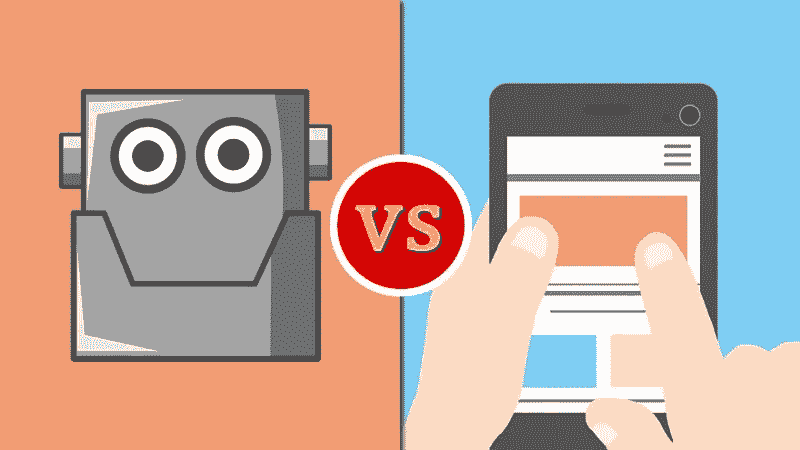

一个过大的假设是，应用程序已经“结束”，并将被机器人取代。

通过将两个如此不同的概念对立起来(而不是将它们视为服务于不同目的的独立实体)，我们阻碍了 bot 开发。

你可能还记得十年前应用程序首次出现时类似的呐喊:但你还记得应用程序取代互联网的时间吗？

据说，一个新产品或服务需要以下两个条件:**更好**，**更便宜**，或者**更快**。聊天机器人比应用程序更便宜还是更快？不——至少还没有。

它们是否“更好”是主观的，但我认为公平地说，今天最好的机器人无法与今天最好的应用程序相提并论。

另外，没有人认为使用 Lyft 太复杂，或者在应用程序上点餐或买衣服太难。太复杂的是试图用机器人来完成这些任务——并且让机器人失败。

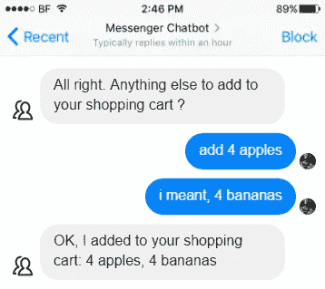

一个优秀的机器人可以像一个普通的应用程序一样有用。当谈到丰富、复杂、多层的应用程序时，没有竞争。

这是因为机器让我们能够访问庞大而复杂的信息系统，而早期的图形信息系统在帮助我们定位这些系统方面是一个革命性的飞跃。

现代应用得益于几十年的研究和实验。我们为什么要扔掉这个？

但是，如果我们把“替换”这个词换成“扩展”，事情就有趣多了。

今天最成功的 bot 体验采用了一种混合方法，将聊天合并到包含更多传统元素的更广泛的策略中。

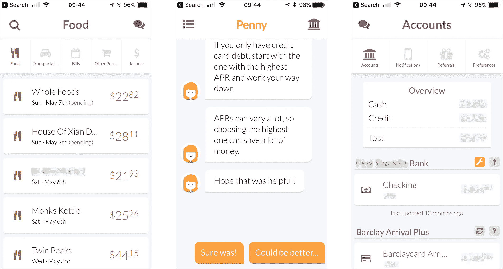

[https://www.pennyapp.io](https://www.pennyapp.io)

*   [*Penny*](https://www.pennyapp.io/) *除了传统的账户仪表盘和交易列表之外，还提供聊天式的建议和提醒。*
*   [*HubSpot Conversations*](https://www.hubspot.com/company-news/hubspot-announces-free-conversations-tool-for-multi-channel-one-to-one-communication-at-scale)*将 Facebook Messenger、现场聊天、社交媒体、电子邮件和其他消息渠道统一到一个共享收件箱中。*
*   [*层*](https://layer.com) *为开发人员提供了在移动网络和桌面网络以及本地应用上创建个性化消息体验的工具。*

下一波将是[多模态应用](https://willowtreeapps.com/ideas/the-end-of-apps-multimodal-ui-and-the-future-of-mobile)，在那里你可以说出你想要的(就像 Siri 一样)并以地图、文本甚至口头回应的形式获得信息。

# 为了机器人而机器人

> 我的产品需要机器人吗？现有平台能够支持它的功能吗？我有耐心造一个能做我想让它做的事的机器人吗？

炒作的广泛性的另一个有问题的方面是，它倾向于绕过这些基本问题。

对于许多公司来说，机器人并不是正确的解决方案。过去两年，机器人被盲目应用于不需要它们的问题的案例比比皆是。

为了机器人而制造机器人，放任自流并抱着乐观的态度永远不会有好结果:

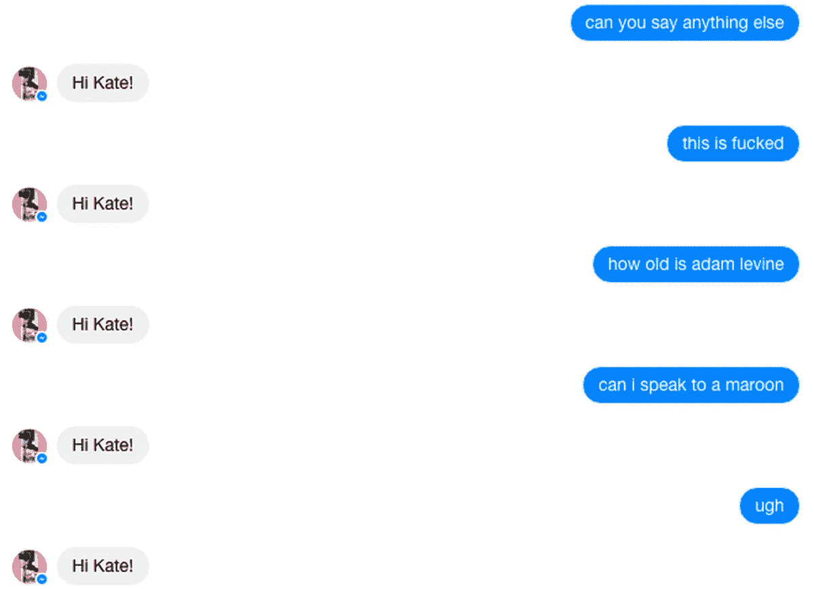

The totally necessary Maroon 5 chatbot in action

绝大多数机器人都是使用决策树逻辑构建的，其中机器人的固定响应依赖于在用户输入中发现特定的关键字。

这种方法的优点是很容易列出它们要涵盖的所有情况。这也恰恰是他们的劣势。

这是因为这些机器人纯粹是创造它们的人的能力、挑剔和耐心的反映；以及他们能够预测多少用户需求和输入。

当生活不符合这些条件时，问题就出现了。

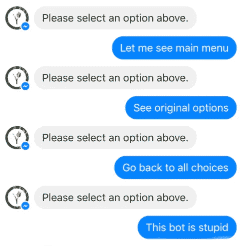

根据最近的报道，[Facebook Messenger 上的 10 万多个机器人中有 70%](https://www.fool.com/investing/2017/02/28/facebook-incs-chatbots-hit-a-70-failure-rate.aspx) 无法满足简单的用户请求。这部分是由于开发者未能将他们的机器人缩小到一个强大的领域。

当我们开发 GrowthBot 时，我们决定让它专门面向销售和营销人员:而不是一个“多面手”，尽管人们可能会对潜在能力过于兴奋。

记住:一个能做好一件事的机器人比一个多件事都做不好的机器人更有帮助。

# 难达到

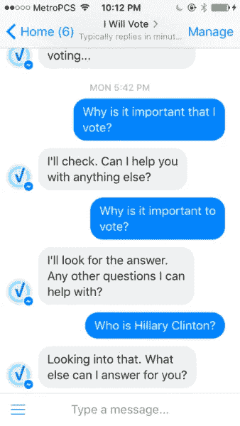

一个有能力的开发人员可以在几分钟内构建一个基本的机器人——但是一个可以进行对话的机器人呢？那是另一个故事。尽管围绕人工智能的炒作不断，但我们距离实现任何远似人类的东西还有很长的路要走。

在 **一个理想的世界里，**被称为 NLP(自然语言处理)的技术应该可以让聊天机器人理解它收到的消息。但是 NLP 才刚刚从研究实验室中出现，还处于起步阶段。

一些平台提供了一点 NLP，但即使是最好的也只是幼儿级别的能力(例如，想象一下 Siri 理解你的话，但不理解它们的意思。)

正如 Matt Asay 概述的那样，这导致了另一个问题:未能抓住开发人员的注意力和创造力。

> “在机器智能接近人类智能之前，消费者的兴趣永远不会实现。
> 
> 用户的兴趣取决于人工智能，它让消费者觉得与机器人交谈是值得的。"

对话是复杂的。它们不是线性的。话题围绕着彼此旋转，随机轮流，重新开始或者突然结束。

今天基于规则的对话系统太脆弱，无法处理这种不可预测性，使用机器学习的统计方法也同样有限。类似人类对话所需的人工智能水平还不存在。

与此同时，几乎没有高质量的开创性机器人引领潮流。正如戴夫·费尔德曼所说:

> “Slack、脸书、谷歌、微软、Kik 和其他公司应该开发自己的内置机器人来引领潮流吗？
> 
> 他们是否应该在 bot 基金和孵化器方面更加积极主动，雇佣导师以 Bot 方式教育参与者，或者提供工程和设计资源？高调合作伙伴资助的战略 Bot 计划？
> 
> 在我看来，是的，是的，是的。说到平台，开发者就是用户；我们不依赖用户理解为什么或如何使用我们的产品。我们必须给他们看。"

# GUI 不应该被解雇

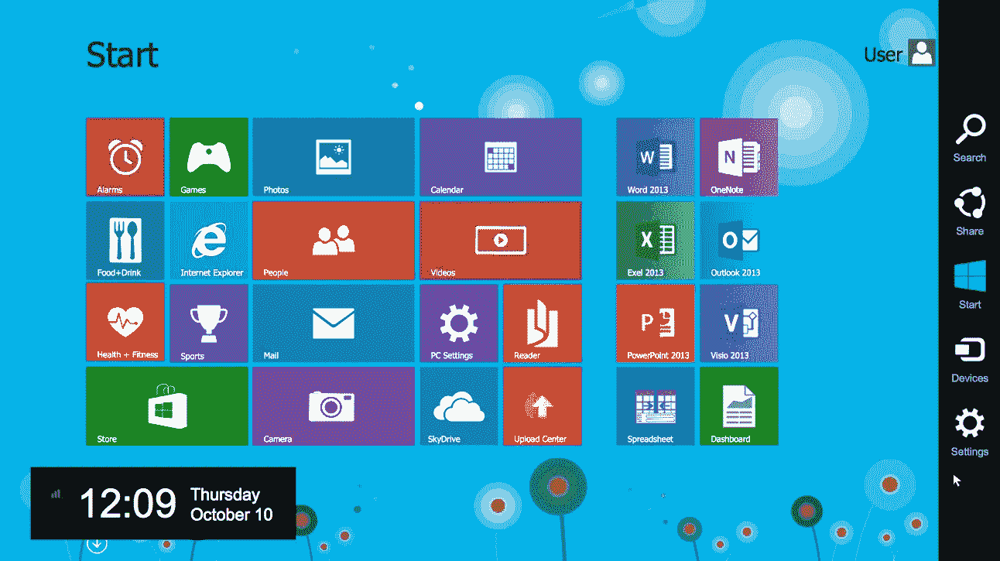

曾几何时，与计算机交互的唯一方式是在终端上键入神秘的命令。使用窗口、图标或鼠标的视觉界面是我们处理信息方式的一场革命

计算从基于文本的界面转移到图形用户界面(GUI)是有原因的。在输入方面，点击比打字更容易、更快。

轻敲或选择显然比键入整个句子更可取，即使是预测性的(通常容易出错的)文本。在输出方面，一张图片胜过千言万语这句古老的格言通常是正确的。

我们 **爱光学** [**显示**](http://www.t-sciences.com/news/humans-process-visual-data-better) **的信息因为我们是**高度视觉化的生物。孩子们喜欢触摸屏并非偶然。发明图形界面的先驱们受到了认知心理学的启发，认知心理学研究大脑如何处理交流。

对话式用户界面旨在复制人类喜欢的交流方式，但它们最终需要额外的认知努力。本质上，我们是在用一个更复杂的替代物来交换简单的东西。

当然，有些概念我们只能用语言来表达(“告诉我去博物馆的所有方法，给我 2000 步，但不要超过 35 分钟”)，但大多数任务可以用 GUI 比用对话式 UI 更有效、更直观地完成。

# 人类喜欢和其他人交谈

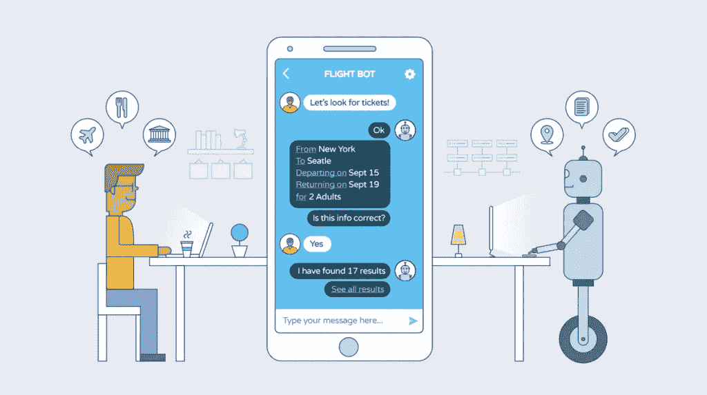

在商业互动中以人为目标是有意义的。

如果说有什么东西打破了[销售](https://blog.growthbot.org/the-future-of-sales-6-skills-every-b2b-sales-rep-needs)和[营销](https://blog.growthbot.org/8-strategies-to-embrace-the-future-of-content-marketing)的话，那就是缺乏人性:品牌隐藏在*票号*、*反馈表*、*不回复电子邮件*、*自动回复*和*门控“联系我们”表*。

脸书的目标是他们的机器人应该通过所谓的图灵测试，这意味着你无法分辨你是在和机器人说话还是在和人说话。但是机器人和人类不一样。永远不会。

对话不仅仅包含文本。

人类可以读懂字里行间的意思，利用上下文信息，理解像讽刺这样的双重含义。机器人很快就会忘记他们在谈论什么，这意味着这有点像与一个几乎没有短期记忆的人交谈。

正如 HubSpot 团队[指出的那样](https://www.hubspot.com/stories/chatbot-marketing-future):

> 机器人提供了一种与买家一对一互动的可扩展方式。然而，当它们无法提供像人们习惯于在即时通讯应用上与他人进行复杂、多层对话那样高效和愉快的体验时，它们就会失败。

人们不容易被愚弄，假装一个机器人是人肯定会减少回报(更不用说你在对你的用户撒谎)。

相比之下，即使是那些由最先进的自然语言处理技术驱动、擅长处理和制作内容的罕见机器人也将相形见绌。

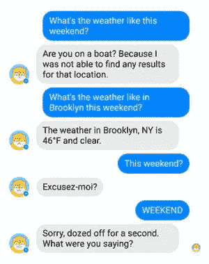

还有一件事。对话式用户界面是为了复制人类喜欢的交流方式——与其他人交流。

但这是人类更喜欢与机器互动的方式吗？

不一定。

在一天结束的时候，再多机智的妙语或类似人类的言谈举止也无法拯救机器人免于对话失败。

# 我们将何去何从？

在某种程度上，那些早期采用者并没有完全错。

人们对着谷歌主页大喊大叫，播放他们最喜欢的歌曲，从达美乐机器人那里订购披萨，从丝芙兰那里获得化妆技巧。但是在消费者反应和开发者参与方面，聊天机器人没有达到 2015/16 年左右产生的炒作。

差远了。

电脑**擅长**做电脑。搜索数据，处理数字，[分析观点](https://blog.growthbot.org/how-to-make-competitive-intelligence-your-competitive-advantage)并浓缩信息。

计算机不擅长理解人类的情感。NLP 的状态意味着他们仍然不能“理解”我们的要求，更不用说我们的感受了。

这就是为什么如果没有基本的人情味:同理心和情商，仍然无法想象有效的客户支持、销售或营销。

就目前而言，机器人可以继续帮助我们完成自动化的、重复的、低级别的任务和查询；作为一个更大、更复杂系统中的齿轮。我们期待得太多、太快，对他们和自己都是一种伤害。

但这还不是故事的全部。

是的，我们的行业大大高估了聊天机器人的最初影响。强调*初始*。

正如比尔·盖茨曾经说过的:

> 我们总是高估未来两年将发生的变化，低估未来十年将发生的变化。不要让自己被蒙骗而无所作为。

炒作结束了。这是件好事。现在，我们可以开始检查中间的灰色区域，而不是过度膨胀、疯狂的黑白区域。

我相信我们正处于爆炸性增长的开端。这种反高潮感对于[转型技术](https://blog.growthbot.org/the-samantha-effect-a-closer-look-into-the-future-of-bots)来说完全正常。

[消息传递](https://blog.growthbot.org/how-ai-will-pull-content-marketing-back-from-the-brink-of-destruction)将继续获得关注。聊天机器人不会消失。NLP 和 AI 一天比一天复杂。

开发者、应用和平台将继续试验并大量投资于对话式营销。

我迫不及待地想知道接下来 T2 会发生什么。

## 感谢阅读。如果你喜欢这篇文章，请随意查看 [HubSpot 的聊天机器人构建工具](https://www.hubspot.com/products/crm/chatbot-builder?utm_source=medium.com&utm_medium=referral&utm_campaign=chatbots-were-the-next-big-thing)