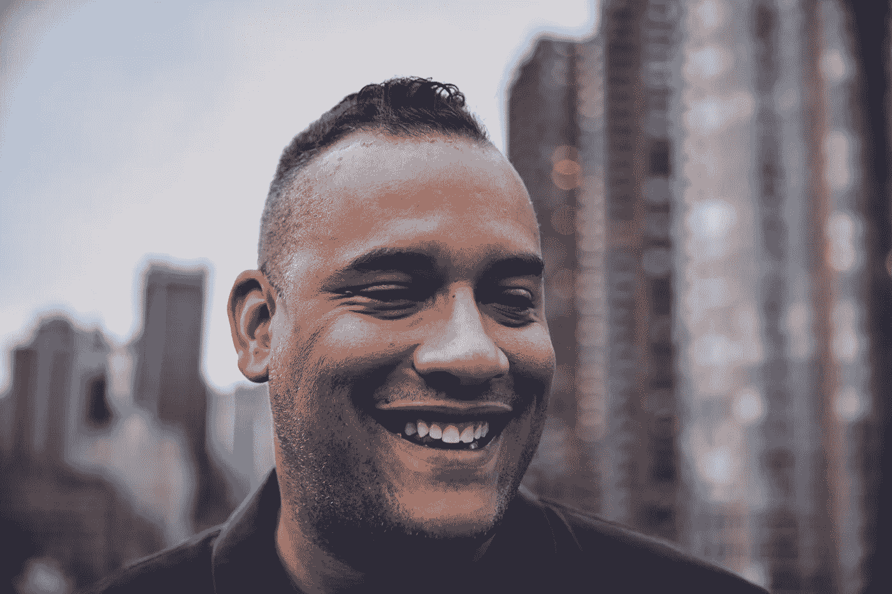
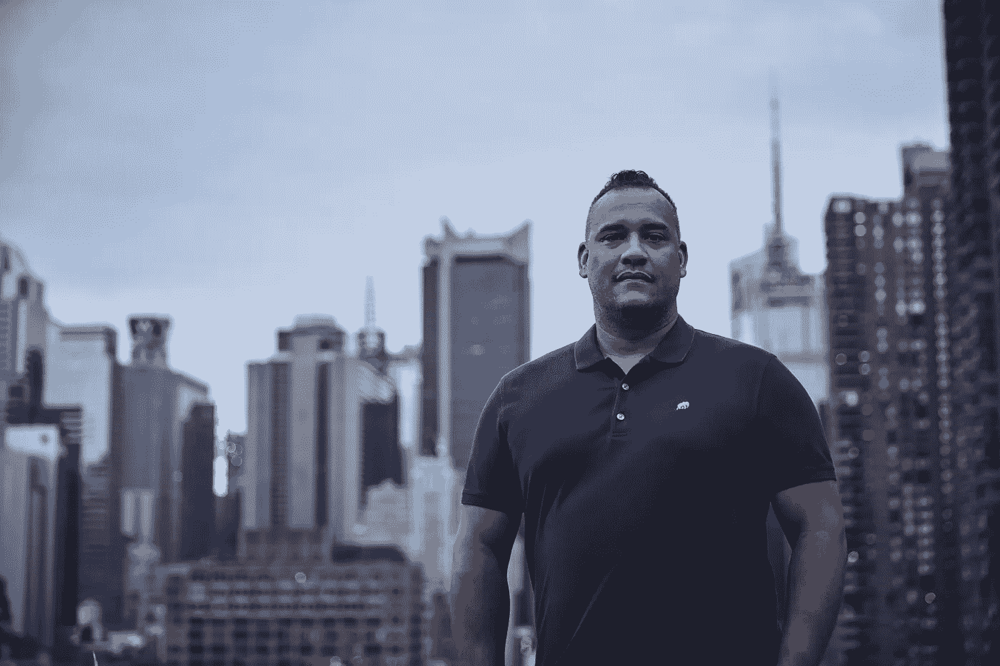

# 首席灵感官

> 原文：<https://medium.com/swlh/chief-inspiration-officerdoug-melville-2323deb36545>

采访 Doug Melville | Chief 首席多元化官

Portrait: [Tom Kubik](https://www.tomkubikphoto.com/patrons-of-progress-portraits)

道格·梅尔维尔是一个鼓舞人心的人。从在魔术师约翰逊身边工作到创办一家蒸蒸日上的公司，红地毯跑道，现在是 TBWA Worldwide 的首席多元化官，道格不断地激励着他周围的人。我们很幸运地称道格为良师益友，并和他坐下来听听他的故事。

## 你想要什么样的超能力？

连接器。这是我喜欢的一种超能力，因为这是我实际拥有的一种超能力，我非常感激它。

每个人都有一种超能力，要想成功，你要做的第一件事就是确定你的超能力。是意识到你自己的伟大，你自己的力量。你可以与任何成功的音乐家或演员交谈，他们会告诉你他们的超能力，因为这是他们一直在磨练的东西。

## 你是哪里人？

我来自康涅狄格州的布里奇波特。我妈妈来自南方。我妈妈来自南卡罗来纳州的伊尔莫，实际上有一个关于南卡罗来纳州伊尔莫的故事——当内战结束时，有一大批跨种族的成年人和婴儿，没有人真的想照顾他们或拥有他们，因为南方被毁灭了，每个人都很穷，没有土地，没有食物和资源。基本上他们开始把这些混血儿扔在南卡罗来纳州一个叫伊尔莫的镇上，结果变成了 30，000 个挂钥匙的混血儿。

当我们追溯我母亲的祖先时，我们发现她来自南卡罗来纳州的伊尔莫镇。我真的认为这将是一部很棒的电视剧，所有在场的人最终都会成家立业，因为他们中没有一个人知道整个种族的事情。它真的会触及种族问题，黑暗，光明。这就是我故事的南部，但我来自康涅狄格州的布里奇波特。

## **分享你生活中让你对让世界变得更美好充满热情的时刻？**

当我为魔术师约翰逊工作的时候，让世界变得更美好对我来说真的很重要。我住在洛杉矶，为他的公司“魔术师约翰逊企业”工作。

每次我们签合同或者和别人一起工作的时候，他都会确保和公司的所有员工见面。不仅仅是首席执行官和执行官，还有维修工，所有的“小时工”。他想确保他为他们签名，因为他知道他们是我们能与首席执行官合作的原因，因为所有的工人和劳动者。

他还会确保每当我们在旅行中吃午饭时，我们会停下来，从小企业订购。他并不真的想从连锁店订餐，他想去当地的夫妻店。他说，我们每天都应该做些事情来支持我们的社区和当地企业。他真的给我灌输了这种欲望。尽管他有很好的目标和关系以及家喻户晓的名字…他已经出名大约 30 年了，但他仍然继续确保作为一家公司，我们将确保与当地企业合作。

## “进步赞助人”旨在展示那些利用他们的影响力行善的人。“做好事”对你意味着什么？

我想做的事情之一是鼓励人们做他们相信的事情。在这个世界上，人们经常被告知“不”，“不能”，“不会”，“这很难”，这意味着看着某人，说“你可以做到。”

要想成功，你的生活中必须有三个不同的人:(1)你需要一个导师。一个导师基本上是你的北极星，或者是一个更资深的人，他可以真正帮助指导你；(2)你需要有一个倡导者。这是一个内部的人，他会支持你，说“我了解她，我理解她，我和她一起工作过，我认为她很棒，我想和她一起签约”，然后(3)你需要一个教练。这个人就在你身边，他会告诉你“你能行，你是冠军”。当你读到穆罕默德·阿里的故事时，他身边有一个叫德鲁·邦迪尼·布朗的人，他是他的宣传人员。他会带着他四处旅行，他会呆在角落里高喊“你是冠军，没有人比你更好，你能做到”。

奥巴马和特朗普最大的区别之一是，奥巴马是一个首席灵感；无论你喜欢他还是讨厌他，你都认识到，没有人可以质疑他总是会激励并说“嘿，伙计们，你们能行，我们能行”和“是的，我们能行”，但特朗普并没有真正炒作双方。你错过了灵感。对我来说，这就是做好事的意义。

Portrait: [Tom Kubik](https://www.tomkubikphoto.com/patrons-of-progress-portraits)

## **如果你可以选择一个词来形容你自己，你会选择什么，为什么？**

用一个词来形容我就是人类。当你是一个年轻的人，有一个初级的角色，人们经常非人化的人，他们把人变成一个标志，一个链接或一个表情符号。我觉得人要更有人情味。归根结底，这是关于温暖、舒适、支持和人性。

## **是什么激发了你担任 TBWA 首席多元化官的兴趣和热情？**

在我来这里工作之前，我为自己工作。当你为自己工作时，你可能会问“我是想继续为自己工作还是想成为社区的一员”。你可以来回走。有时似乎草更绿。当你为自己工作时，你想成为社区的一部分，当你是社区的一部分时，你可能想出去为自己工作。内心一直在斗争。

TBWA 的这个职位的独特之处在于，这个职位是创造出来的，我是第一个拥有它的人，这让我能够与我们的执行团队一起构建工作是什么，它将如何工作，它将如何展开。这是一个独特的机会，一家公司允许我塑造一个角色，你的意见直接进入它的结构，因为首席多元化官的角色在每个地方都有不同的设置。人们不知道它是什么，它是你创造的。

## 你希望我们的读者从你的故事中获得什么？

了解这一点后离开——一切都很重要。网上的一切，你做的一切，都是真枪实弹。人们经常说“没什么大不了的，这只是一件小事，”但我告诉每个人要做的是打开你手机上的私人浏览器，用引号括起你的名字，然后点击发送并告诉我有什么回复，因为你需要知道人们看到的第一件事。

我曾经是昆西·琼斯的实习生，他曾经告诉我，当你走进一个房间时，唯一领先于你的是你的名声。85%直接影响你生活的每一个决定，你都没有发言权。当你获得贷款时，当你遇到某人时，当你想去参加工作面试时——你生活中所有直接影响你生存的重大决定，你都没有发言权。当你不在的时候，你的名声会为你说话。

## **撇开资源和技术不谈，如果你能在 2020 年前给世界带来一个显著的变化，那会是什么？**

所有领导层和决策层的性别公平和均等。从历史上看，女性在全球范围内得不到充分的服务，这令人难以置信。沃伦·巴菲特曾在一次采访中说，他对美国取得的进步感到惊讶，因为它是一群人的想法和观点。他说，如果他们来到美国，让每个人坐下来，说“我们如何一起建设这个国家”，这个国家将远远领先于世界其他国家，这将永远不会成为一个话题。

## **分享一些你一路走来学到的、对你的旅程有帮助的东西？**

关注你的优势，而不是你的劣势。人们花了太多的时间试图改善他们的弱点，却没有足够的时间去加倍努力他们擅长的东西。你擅长某件特定的事情，而我擅长其他的事情，为了变得伟大，我们必须在我们擅长的事情上投入更多的时间。然而，我们经常做的是告诉人们“你不擅长这个，所以花很多时间变得更好。”但是你现在浪费了时间，因为你没有花时间去发现你擅长什么，你的超能力。

这是我的建议——关注你的优势，而不是你的劣势。

Portrait: [Tom Kubik](https://www.tomkubikphoto.com/patrons-of-progress-portraits)

在 Instagram 上关注顾客的进展 [@curiositylab](https://www.instagram.com/c_riositylab/)

概念+伦敦赖特-佩格斯制作，[迈克尔滕南特](https://www.linkedin.com/in/michael-tennant/) + [梅根霍尔茨豪尔](https://www.linkedin.com/in/meghan-holzhauer-29b2733/) //伦敦赖特-佩格斯采访 //汤姆库比克画像

## 这篇文章发表在 [The Startup](https://medium.com/swlh) 上，这是 Medium 最大的创业刊物，拥有 282，454+读者。

## 在这里订阅接收[我们的头条新闻](http://growthsupply.com/the-startup-newsletter/)。

