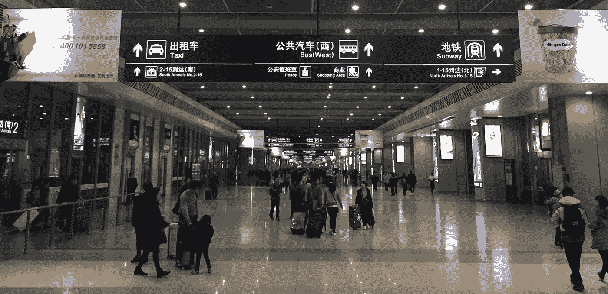
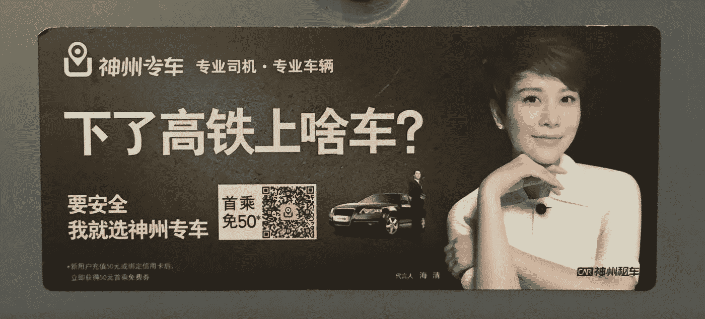

# 中国的移动革命(pt。1)

> 原文：<https://medium.com/swlh/china-s-mobile-revolution-pt-1-9447abe5c772>

A long walkway inside Shanghai HongQiao Transportation Hub — a 1.3 million square meters (10.8 million sq ft) structure that connects an international airport, a high-speed train station, and a city subway station. Photo taken by the author in Feb. 2016.

这是一个关于中国及其正在进行的移动革命的三集系列。在第 1 部分中，我将给出一些我亲身经历的变化的例子。

2016 年 2 月，我去中国和亲戚一起过农历新年。14 年前移民到北美后，我一直对中国的持续变化感到惊讶。

随着我在西方的生活与谷歌、脸书、Snapchat、优步、Youtube 和亚马逊提供的服务交织在一起，我意识到我在中国的亲戚无法访问这些服务(除了优步和亚马逊在一些城市)。这要归功于中国的防火长城，它阻挡了大多数西方互联网技术。

虽然我读过关于微信、阿里巴巴和小米崛起的报道，但我不知道这对生活在那里的人们有什么实际影响。缺乏背景意味着数字和图表保持原样。在潜意识里，我仍然认为那里的科技产业落后了，受到防火墙的限制，生产出毫无品味的仿制品。

> 男孩，我错了吗…

当我和我在那里的亲戚交流时，我对科技领域的丰富和活力有了更深刻的理解。毫无疑问，一场移动革命正在中国发生。

西方应用程序和中国应用程序在移动用户界面方面存在差异(我强烈推荐丹·格罗夫的这些[的博文](http://dangrover.com/blog/2014/12/01/chinese-mobile-app-ui-trends.html))。中国的基础生态系统也不同(例如:Visa 和 MasterCard 在那里不被普遍接受，所以人们依赖于银行卡和支付宝提供的托管服务；谷歌的 Play 商店被封，于是[替代安卓应用商店](https://www.techinasia.com/10-android-app-stores-china-2014-edition)蓬勃发展)。然而，就人们获得的价值和便利而言，整个磨难让人感觉似曾相识。

在北美，我优步和 Zipcar。在中国，他们用[滴滴](https://en.wikipedia.org/wiki/Didi_Chuxing)。我请我的朋友吃饭，所以我们不用担心谁来付午餐费。在中国，这是通过微信或支付宝完成的，或者更好的是，许多商家已经接受微信和支付宝。我在亚马逊 Prime 和 Instacart 上购物。在中国，任何东西都可以在淘宝和 JD.com 的 T2 买到。有时[送货甚至可以在两个小时内发生](http://finance.yahoo.com/news/jd-com-start-delivery-supermarket-020056359.html)。在北美，我看网飞和 Youtube 上的节目。那边是优酷和其他一些公司。

## 改变是好事

我目睹了我 82 岁的爷爷放弃了报纸和电视(他分别依赖了 50 年和 30 年的媒体),完全投入到移动设备上——在一部 1200 元人民币(186 美元)的小米智能手机上消费几乎所有的新闻和电视内容。他甚至学会了在[微信时刻](http://dangrover.com/blog/2014/12/01/chinese-mobile-app-ui-trends.html#moments)上发送信息和发表评论。

对他来说，技术转型始于 2014 年，当时我的表弟给他安装了一个小米盒子，让他可以点播新闻和电视剧。到了 2015 年秋天，我的姨妈明白了智能手机的威力，就给他买了一部作为礼物。经过一些指导，他能够很快学会使用它。

> 几十年的习惯在几天之内就被打破了。

他没有看晨报，只是用手机查看新闻。我的阿姨订阅了一个中文新闻聚合服务(类似于戴夫·佩尔的[)，每天早上通过微信把每日文摘转发给他。几十年来，晚上 7 点整，他会看电视上的全国新闻。如今，他会在手机上阅读文章。](http://nextdraft.com/)

当我问他对此有何感受时，他这样说:

> [网上]有无穷无尽的信息。我理解为什么报纸会倒闭。一键，你想看的就在那里。你不需要纸。

后来，我看着我 27 岁的表弟，一名机械工程师和一名经常旅行的人，在几秒钟内就在他的 iPhone 上完成了所有的旅行预订——首先通过团购应用程序预订一家提供优惠的酒店，然后通过中国铁路官方应用程序购买高铁票。他告诉我他的科技产品生活:

> 我认识的人都在微信上。我有一个工作小组，一个学校小组，一个家庭小组。我购物的时候用微信或者支付宝付款。但是我不经常亲自购物。我团购大多数东西。它节省了很多钱。

我 32 岁的表弟也有同感。作为一名大学管理人员和一个三岁孩子的父亲，他相当忙。他在三星(Samsung)双卡智能手机上向我展示了他在淘宝上信任的一个供应商订购的几磅高级澳大利亚牛肉，然后通过一个家庭服务应用程序安排了一次家政服务。在他看来，科技显然是一条必由之路:

> 很方便。你可以(在淘宝上)买到任何你想要的东西，价格比大多数商店都要便宜。即使是杂货之类的东西，也能在几个小时内送到。

有趣的是，虽然我是技术的早期采用者，但我的亲戚们不是——他们不会为了新奇而特意去使用新事物。他们使用他们是因为所提供的价值明显高于无能者。

这种快速采用的部分原因是由新一波中国企业家引领的快节奏创新。其中一部分是更广泛的文化现象。中国人在 30 年里经历的变化比美国人在 100 年里经历的变化还要多。人们看待变化和创新的方式肯定会受到一些影响。

> 中国人已经养成了期待进步和对新技术持乐观态度的习惯。

An ad about a [premium taxi app](https://itunes.apple.com/cn/app/shen-zhou-zhuan-che-quan-chu/id953939112?mt=8) (similar to Uber Black) on the back of seats of a high-speed train. QR codes are ubiquitous in China, most apps have QR scanners built-in.

这种文化可以在关于**移动应用**的广告类型和数量中看到。从电视广告到广告牌，到处都有各种应用的广告。那里的初创公司似乎在争夺市场份额，而不是搞清楚产品的市场适合度(也许他们已经这样做了)。

我开着电视在爷爷奶奶的客厅里和亲戚们聊了一天。背景音乐是 CCTV-3 频道(一个关注艺术和表演的频道，拥有广泛的全国观众)。

> **我看到的所有电视广告中，大约有 1/3 是关于应用程序的。**

想一想。这些全国性的电视广告揭示了一些有趣的事情。这表明中国的创业公司可以获得大量资本。这也意味着对市场份额的激烈竞争。我觉得非常有趣的是，有足够多的消费者不仅拥有智能手机，而且认为应用程序是完成事情的事实方式。

相比之下，你永远不会在美国国家电视台看到这么多钱花在营销移动应用上(也许是游戏，但不是应用)。这是我看到的一些。

[**Anjuke**](https://itunes.apple.com/us/app/ju-ke-zhao-er-shou-fang-xin/id415606289?mt=8) (安居客): a real estate listing app.

[**ChinaHR**](https://itunes.apple.com/cn/app/zhong-hua-ying-cai-wang-chinahr.com/id647145486?mt=8) (中华英才网): a recruitment platform that connects jobseekers with corporations.

[**58 SameCity**](https://itunes.apple.com/ca/app/58tong-cheng-zhao-pin-zhao/id480079300?mt=8)(58 同城): a Craigslist style directory for cities.

[**Uxin**](https://itunes.apple.com/cn/app/er-shou-che-you-xin-er-shou/id930764645?mt=8) (优信二手车): a used car transaction platform that inspects and certifies quality, similar to Beepi and Shift in the U.S.

顺便说一句，明星代言在中国确实有效。这就是为什么上面的每个广告都以名人为特色。来自 Uxin 的最后一个以 11 个熟悉的面孔作为建立信任的手段。尽管美国的商业广告已经超越了依靠幽默和独创性来迎合消费者愿望的阶段，但中国的商业广告还没有做到这一点。人们仍然强烈渴望提高他们的生活水平——因此大多数商业广告都关注生活方式。

## 新的规范

依靠应用程序来完成工作已经成为一种常态。正如我的两个堂兄弟提到的，人们使用应用程序做任何事情，并在网上购买大多数东西。越来越少的城市专业人士进入实体店。许多人完全跳过了桌面互联网。中国现在有 3 . 58 亿手机消费者(比整个美国人口还多)。

传统企业没有与这种趋势抗争，而是接受了这种变化——从大型零售连锁店到夫妻店，企业都接受通过微信支付和支付宝支付；许多城市交通局将移动支付集成到地铁闸机中，让乘客可以挥动手机进站；医院在微信上预约医生；电视网络正在将内容移植到在线视频门户网站上(有时会移交专有权)。

尚不清楚中国的移动革命有多少会发生在北美，如果有的话。显而易见的是，中国的变化速度比西方更快。激烈的市场营销表明竞争是激烈的。然而，最终，渴望并愿意使用新技术的普通人看到了他们生活的巨大改善。真正有趣的是，革命才刚刚开始。

[*在本系列*](/@TonyJing/chinas-mobile-revolution-pt-2-f0d91e47ced2#.2uqmpvc1x) *的第二部分中，我将把讨论稍微往后拨一点，以设置背景。我将解释“中国规模”是什么意思，中国如何同时开放和封闭，并列出中国在 21 世纪面临的主要挑战。*