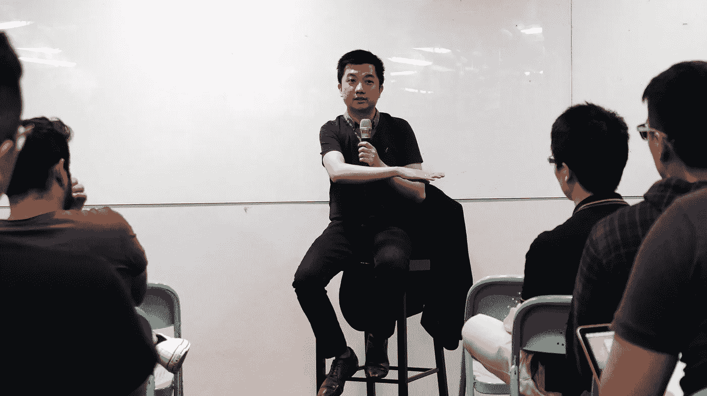

# 选择要输掉的战斗，这样你才能赢得战争

> 原文：<https://medium.com/swlh/choose-which-battles-to-lose-so-you-can-win-the-war-ad43b1d1ed1>

Quote by — Tokopedia CEO William Tanuwijaya, Photo Credits: NUS Enterprise [Blk71](https://www.facebook.com/Blk71Singapore/)

你可能会从印度尼西亚最大的电子商务市场之一 Tokopedia 的首席执行官的分享会中了解到电子商务。然而，在长达一小时的会议中，最大的收获是如何在生活中做出选择。

上周，William Tanuwijaya 登上了由新加坡国立大学企业主办的 Kopi Chat 的舞台，来自新加坡国立大学孵化器“飞机库”的年轻企业家也参加了该活动。

在简单分享了他发展 Tokpedia 的历程后——从一个无人问津的大学招聘摊位到印度尼西亚领先的电子商务市场——威廉回答了现场的问题。以下是最大的亮点:

# 建立一个可持续发展的企业，而不是立即盈利的企业

在回答 Tokopedia 为何不为买家提供货到付款(COD)服务的问题时，威廉放弃了可能是当晚最大的反向观点。

印度尼西亚有许多岛屿——准确地说是 17508 个——如果 Tokopedia 要在整个印度尼西亚提供鳕鱼，那将是极其昂贵的。尤其是对于退货。为此，威廉让观众想象一下:一个快递员穿越海洋、丛林和可怕的交通，只为了到达买家手中，然后一路被送回来。尽管 COD 为 Tokopedia 带来了更多的消费者，但这并不是一个可持续的商业模式。

拨开迷雾，他给了我们他对问题的分析:虽然印尼的 [**信用卡普及率约为 3%**](https://www.techinasia.com/startup-asia-jakarta-preview-doku-epayment-state-indonesia) ，但消费者更喜欢货到付款的真正原因是因为“他们不信任商家”。显然，解决方案更适合于增加信任。

为了解决这个问题:Tokopedia 向消费者披露销售数据，提供一个强大的商店评论和信任徽章系统，以帮助消费者做出更好的购买决定。此外，消费者还能获得仅次于货到付款的东西——在当地便利店付款。

总结这一点，威廉还解释了为什么 Tokopedia 很少提供折扣。大幅降价以获得市场份额违背了他建立可持续发展企业的理念。然而，他说有一个警告:折扣只是为了改变消费者的习惯。例如，Tokopedia 为从网络转向移动应用的消费者提供折扣。

# 选择要输掉的战斗

关于 Tokopedia 在印尼以外的扩张计划，William 借用了孙子兵法*中的概念。*

如果创业就像发动一场战争，那么做决定就像选择你的战斗。在 Tokopedia 的案例中，不同的市场代表不同的战场，其生存策略是输掉印度尼西亚以外的战斗。虽然看起来很讽刺，但这也是 Tokopedia 能够在竞争中胜出并持续时间超过其印度尼西亚竞争对手的原因之一。

他解释说，他的一些竞争对手比他有更大的野心。他们很早就选择去印度尼西亚以外的地方冒险。这产生了两个问题:

*   他们无法很好地为当地消费者服务；和
*   他们会更快用完现金。

通过输掉外面的战斗，Tokopedia 保留了本土优势，并发展到今天的十亿美元业务。

另一种看待它的方式是整体市场潜力。据威廉称，只有 1%的印尼人在网上购物。这意味着还有巨大的潜力。Tokopedia 只需要在印度尼西亚寻找下一个大的竞技场。

# 筹款需要运气，很多运气

备受期待的筹资问题并没有为令人挠头的问题提供银弹。相反，它指出了根本——建立一个可持续发展的企业。

这位迄今为止已经从 [**筹集到 2.5 亿美元**](https://www.techinasia.com/indonesia-tokopedia-raises-147m) 的首席执行官承认，他从未写过一份商业计划书。然而，这并不意味着我们其他人不应该这样做。他很快补充说，他可能应该养成这样做的习惯。

从威廉的角度来看，运气是他筹集数百万资金的一个重要因素。事实上，Tokopedia 是更幸运的创业公司之一，有投资者追逐他们。在这篇文章中，威廉讲述了红杉资本(Sequoia Capital)的兰在他飞往日本之前给他打电话，打听他乘坐的是哪一班飞机，并出现在 arrivals 机场向他发出邀请的故事。巧合的是，威廉也在日本寻求软银的投资。因此，当两笔交易都获得了响亮的“是”时，就创造了一个最终的大团圆结局。

事实证明，这只是那次旅行中三个好消息中的两个。

# 不要同时玩 5 个球

生命的五个球的比喻是 [**由当时的可口可乐首席执行官 Brian G. Dyson**](http://bsix12.com/the-five-balls-of-life/) 首先提出的。它讲述了一个人生活的五个方面——工作、家庭、健康、朋友和精神——用我们玩的球来表达。其中，四个球是玻璃做的。一个球是橡胶做的，它代表*工作*。

威廉引用了这个类比，并将他的创业之旅描述为一个有弹性的橡皮球:从公司资金接近耗尽的低谷，到去年 8 月实现 100 万商户的高峰。创业公司会面临失败。这就是为什么坚持和反弹是重要的。但是生活的其他方面没有工作这样的弹性。如果它们掉下来，就会粉碎。

当威廉拒绝陪同他的妻子(当时是女友)去日本参加她的医学院毕业典礼时，他差点就死了。威廉告诉我们，他事后感到内疚。他经常推迟和妻子的假期，因为某个特定的地区“对东京来说太重要了”

他承认，对他来说，同时兼顾生活中的五个球真的很难，如果这种情况继续下去，他会打破其中的一些球。他的解决办法是把两个球放在一边，任何时候都只专注于杂耍另外三个球。

Tokopedia 在本季度结束时表现超出预期。威廉放下工作舞会，飞往日本，向他可爱的妻子惊喜求婚。

就像他宣称的那样，她答应了，完成了帽子戏法。

> 感谢阅读！如果你喜欢你所读的，请随意点击下面的绿色心形小按钮来推荐这个故事，这样其他人也可以发现它。

