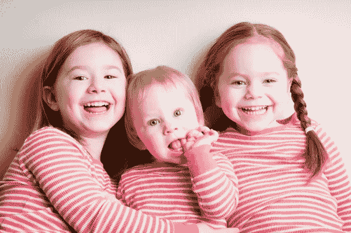

# 明智地选择和谁在一起！—你的环境决定了你是谁

> 原文：<https://medium.com/swlh/choose-who-you-are-with-wisely-your-environment-determines-who-you-are-6a69ba2f4cdc>

心理学家研究发现，在决定你是否会成为一个心智健全、有所作为的人时，你是谁并不重要，重要的是你和谁在一起。

[mensdailylife.com](http://mensdailylife.com/ten-must-read-2016-books-for-men/)

我一直在读马尔科姆·格拉德威尔的名著，书名是《引爆点》，书中他讲述了一群社会科学家在斯坦福大学做的一项研究。它是由菲利普·津巴多领导的。

他在大学的一个地下室创建了一个模拟监狱，尤其是在心理学系。地下室有三十五英尺长，建了三个小牢房，壁橱变成了单独监禁的牢房。

该组织随后在当地报纸上登广告招募志愿者。75 人申请，21 人被津巴多和他的同事选中。一半被随机挑选出来当警卫。他们的责任是维持监狱的秩序。另一半人被告知他们是囚犯。

> “实验的目的是试图找出为什么监狱是如此肮脏的地方。是因为监狱里都是令人讨厌的人，还是因为监狱是如此令人讨厌的环境，以至于让人变得令人讨厌？”(153)

津巴多希望这个实验持续两周。由于困难，他不得不在六天后取消。

人们开始感到痛苦，他们甚至开始折磨他们的狱友。看守正在对这些假囚犯进行心理折磨。

单独监禁，即使它是一个虚假的场景，将在几周内结束，导致人们极度不适，甚至疯狂的行为。

> “津巴多的结论是，有一些特殊的情况如此强大，它们可以压倒我们固有的倾向*”(154)。*

津巴多的意思并不是说我们的成长方式不会影响我们是谁，或者我们在哪个城市/社区长大不会改变我们的行为。正如格拉德威尔在他的书中指出的，“大多数心理学家认为，自然——遗传——可以解释我们倾向于这样做的一半原因”(155)。

[www.istockphoto.com](http://www.istockphoto.com/photos/studying)

# 出生顺序神话&你的环境

[www.sheknows.com](http://www.sheknows.com/parenting/articles/814372/5-tips-for-naming-siblings-1)

他指出了一些其他的研究。这是我觉得最有趣的一个，因为我有兄弟姐妹:

最近几年有很多关于为什么某些兄弟姐妹会有相似的性格特征的研究。哥哥姐姐更专横和保守，而弟弟妹妹更有创造性和叛逆性。

然而，当心理学家试图验证这一点时，他们发现真正重要的是环境。

朱迪思·哈里斯在*的《后天假设》中指出，我们只有在家庭中才会在自己的性格特征范围内行事。当我们远离家人时，我们不再叛逆(如果我们是弟弟妹妹)和保守(如果我们是哥哥姐姐)。*

> 朱迪思·哈里斯令人信服地指出，在决定孩子成长的过程中，同龄人的影响和社区的影响比家庭的影响更重要。。。。一个孩子在一个好的邻居和一个有问题的家庭比他或她在一个有问题的邻居和一个好的家庭要好”(167-8)。

# 个人观察

总之，我想说的是，和那些对你有积极影响的人在一起是非常重要的。

在这种情况下，我认为你应该和那些多读书、少喝酒、受人尊敬&有礼貌、真正关心你的幸福的人在一起。

我记得住在牛津一个与世隔绝的地方，在那里我周围一直住着 20 个人。

> 那是我一生中最孤独的时光之一。

这主要是因为他们没有一个人真正表现出他们能够关心我。他们只关心能给他们带来什么好处。因此，我不再抱有幻想，认为我也需要成为一个冷漠的人。

然后我来到了加拿大，意识到人们真的很关心你，我开始真正关心你。**我现在的环境是那些愿意尽力帮助处理个人事务的人。**

> 找到让你保持伟大的人。你的整个幸福取决于此。

## 在你走之前…

**🗣Connect 跟我上** [**推特**](https://twitter.com/JakubFerencik) **，或者**[**insta gram**](https://www.instagram.com/jejjejfercak/)**。**

*如果您觉得这篇文章有帮助，请点击*

下面的按钮 ( *记住它可以达到 50 次鼓掌——如果你慷慨地使用那个鼓掌按钮，那就帮了我大忙了；)* ) *或者分享一下脸书/* [***推特***](https://twitter.com/JakubFerencik) *上的文章，如果你想让你的朋友们从某种程度上受益的话。*

我写这封信是为了让你继续思考，让我感恩和反思。干杯干杯干杯，下次见，

继续反思。

## 这篇文章发表在 [The Startup](https://medium.com/swlh) 上，这是 Medium 最大的创业刊物，有 315，028+人关注。

## 在这里订阅接收[我们的头条新闻](http://growthsupply.com/the-startup-newsletter/)。

