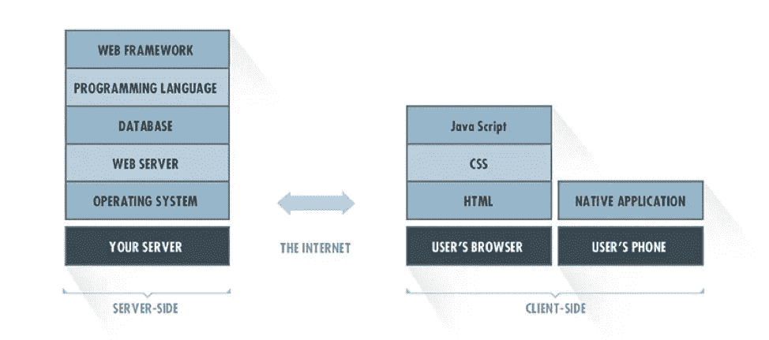
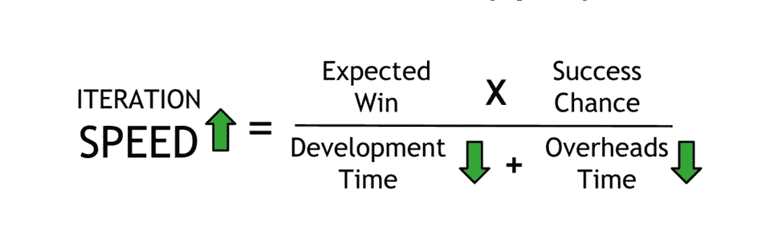

# 为您的移动应用选择合适的技术组合

> 原文：<https://medium.com/swlh/choosing-the-right-tech-stack-for-your-mobile-app-ee3043f7ce1d>

当你开始构建任何类型的技术时，你会发现自己在构建技术栈(即构成应用程序的软件组件集)时陷入了一些深层次的研究陷阱。你开始寻找一个可以写 Angular JS 或 Meteor 的开发者，这一切都是因为某个论坛上的一个陌生人告诉你要这么做。

现实是:单一的技术栈并不适用于所有的开发场景。您的移动应用的理想技术组合取决于您的情况。多年来，我们已经意识到寻找合适的语言或框架的过程需要时间和努力。

如果你做对了，高质量的技术是一个经常被忽视的竞争优势。我从经验中知道这一点。我在 [MindSea](https://www.mindsea.com/) 的团队已经帮助数十家企业更好地了解他们应该使用哪种技术来构建他们的移动应用。

在这篇文章中，我将回顾你在选择技术组合时应该考虑的因素。

# 这就是为什么你想让你的技术堆栈正确

技术栈是软件和编程语言的结合。

大多数移动应用技术都有两个元素:客户端和服务器端，也分别称为前端和后端。

这是一个技术堆栈的可视化表示:

*来源:* [*硅谷软件集团*](https://svsg.co/)

后端(服务器端)是数据和业务逻辑结合在一起交付产品主要功能的地方。你的用户永远不会直接与后端交互；后端将所有必要的信息发送到前端，前端以用户友好的方式提供这些信息。

使用错误的技术组合可能成本高昂，并使项目推迟数月。

一个常见的错误是在你还没有开始之前就计划好大规模。如果你正在开发一个早期产品，使用最流行的技术可能会令人兴奋。然而，如果你只是因为热而试图在最新的栈上创建一些东西，你可能会浪费你的时间。

新贵公司首席执行官、前谷歌企业应用程序总裁戴夫·吉鲁阿德在第一轮的一篇文章中谈到速度是一种习惯:

> 我一直认为速度是商业中的终极武器。在其他条件相同的情况下，任何市场中最快的公司都会胜出。几乎在你所关注的每一个行业中，速度都是领导者的决定性特征——如果不是决定性特征的话。

说到选择最佳技术组合，毫无疑问**速度是等式中的重要部分。但是速度意味着一些不同的东西。**

让我们讨论三种速度。

# 1.产品速度

首先是产品速度，这是用户体验的一个方面。用户体验(UX)是指当用户与应用程序交互时，应用程序如何响应。高质量的 UX 是关键，因为它意味着留住用户和获得五星好评。

应用程序的设计和感觉是 UX 的关键部分，但速度也是一个关键因素。

从前端的角度来看，产品速度意味着体验的速度，也意味着客户熟悉应用程序及其界面的速度。

相对于网络应用，一些受众更熟悉(因此也更舒服)本地应用。Compuware 发现 85%的消费者非常喜欢应用程序。最常见的原因:方便、快捷、易于浏览。

这种受众熟悉度有助于您确定是使用 Objective-C、Swift 还是 Java 来创建本地体验，还是使用 React 或 Angular 来创建桌面体验。

# 2.迭代速度

迭代速度是团队反复学习，然后通过代码或设计对这些学习采取行动的能力。如果您的团队不熟悉您使用的语言，您的迭代速度将会变慢。

公司增加成功几率的最好方法就是提高迭代速度。根据 Wojtek Skalski 的说法，要做到这一点，您的企业必须减少[开发时间和管理时间](https://startupsventurecapital.com/the-physics-of-startups-startup-speed-model-b014fab7deec?gi=7d434d7e1299):

开发时间意味着你花在编程、测试、开发和部署产品上的时间。开销时间是部署 A/B 测试、进行研究和讨论下一步工作所需的时间。

如果你的团队不熟悉你选择的技术栈，随着团队成员学习如何编写代码，开发时间会变慢。

**如果你选择了错误的堆栈，堆栈的局限性就会变得很明显**。当你的团队成员试图编码时，他们可能会转动轮子，增加时间开销。

当这种情况发生时，组织通常会寻求花费更多时间的解决方法。他们也可能选择从头开始:这将耗费更多的资源和时间。

# 3.项目速度

最后，考虑一下**项目速度**，或者你从有想法到启动所花的时间。

如果你正在为一个财富 500 强的品牌建立一个企业解决方案，时间表可能会很长，因为你是向现有的受众推出的。

不过，如果你是一家初创公司，你会努力让你的应用成为早期用户，以便打入市场。一般来说，初创公司可以依赖更简单、更精简的技术体系，因为他们专注于让用户获得 MVP(最小可行产品)。

# 选择技术组合时，你应该问什么问题？

在考虑移动应用的不同框架时，Quick Left 的团队提供了一系列很棒的问题。我们把自己的一些问题和 Quick Left 的列表结合起来，给你一个**问题的列表，每个团队在选择技术堆栈之前都应该考虑**。

以下是“快速左派”的一些观点:

*   有据可查吗？
*   周围有活跃的社区吗？
*   如果是一个新的框架，它的变化有多快？
*   它有企业支持者吗？如果是，他们在支持技术方面的记录如何？
*   容易测试吗？
*   雇佣开发人员来开发它会有多困难？
*   学习 it 的加速时间是什么样的？
*   您的业务需求中是否存在只有这种技术才能提供的独特之处？
*   说到托管和开发运维，您是否有资源来独自支持这些变化，或者购买像 [Heroku](https://www.heroku.com/) 或 [Engine Yard](https://www.engineyard.com/) 这样的平台即服务提供商是否有意义？

这里有几个我们也想问的问题:

*   任何监管问题(例如，数据必须留在 X 国境内/境外)？
*   您是否已经构建或维护了 web 服务？
*   你能处理多少停机时间(我们流音频->无；内容每周更新一次->很多)？
*   有没有其他我们需要集成的 API，它们有多痛苦？

当你思考这些问题时，记住没有正确或错误的答案。目的是尽可能多地了解你的应用程序的技术要求。提出这些问题将有助于做出正确的技术堆栈决策。

# 您的技术堆栈是您应用的基础

毫无疑问，选择正确的技术组合是一项重要的决策。

我已经解释了为什么选择很重要，但是具体应该采用哪种技术取决于您自己。没有适合所有人的千篇一律的堆栈。

我们希望这篇文章能够帮助您了解技术堆栈，并利用您需要的知识来选择技术堆栈。

*最初发表于*[*clutch.co*](https://clutch.co/app-developers/resources/choosing-right-tech-stack-for-mobile-app)*。*

## 这个故事发表在 [The Startup](https://medium.com/swlh) 上，这是 Medium 最大的创业刊物，拥有 289，682+人关注。

## 在这里订阅接收[我们的头条新闻](http://growthsupply.com/the-startup-newsletter/)。

