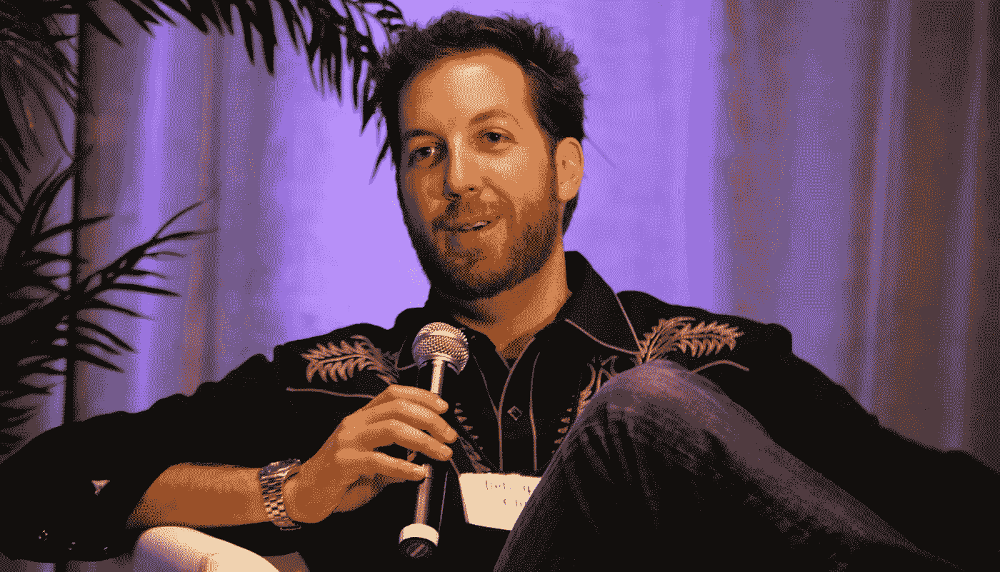

# 克里斯·萨卡挂起了他的马刺

> 原文：<https://medium.com/swlh/chris-sacca-hung-up-his-spurs-e9eb7d4e2b8c>

以下是他退休信中的三条人生经验

昨天，[克里斯·萨卡](https://twitter.com/sacca)宣布退役。根据福布斯杂志，他“精心制作了有史以来最好的种子投资组合。”在他的创业投资生涯中，他支持过 Twitter、优步、Instagram 等等。虽然他在早期投资中的成功是不可否认的，但我最钦佩的是他的人生哲学。我通读了他的退休信，[挂靴。](https://lowercasecapital.com/2017/04/26/hanging-up-my-spurs/)这是我的三大收获:

# 1.永远不要停止学习

> 我擅长我所做的事情，并且随着我从导师、创始人、合伙人、朋友、家人、陌生人、我自己的投资者以及经历本身中学习，我还在不断进步。

如果你不是一个终身学习者，一个永远的学生，你就不会达到萨卡 42 岁时的成就。他列出了他生活中的人以及经历本身，作为他不断提高能力的关键因素。

# 2.专注孕育成功

> 我所知道的在初创公司中表现出色的唯一方法就是全神贯注，呆在底层喘着气。我在风险投资领域取得了成功，因为多年来，我很少考虑或花时间在其他事情上。任何不完全的承诺都会让我感到沮丧和无效。

这让我想起村上春树的书里类似的一句话， [*我讲跑步的时候讲的*](https://www.goodreads.com/book/show/2195464.What_I_Talk_About_When_I_Talk_About_Running) *。村上写道:*“*专注是将你所有有限的才能集中在当下最重要的事情上的能力。”要实现任何有价值的事情，你需要克里斯·萨卡所说的“完全的投入”。*

这种心态适用于所有学科。无论他下一步做什么，无论是“对抗专制政权，做更多的电视节目，推出播客，[或]抚养三个六岁以下的好孩子”，我相信他都会对此做出同样的承诺。这是我尽力效仿的职业道德。

# 3.我们都在一起

> 我的生活一直受到国内外经历的指引，这些经历凸显了我们在这个问题上是多么地休戚相关。

这不是我第一次听到或读到克里斯谈论移情。在 Tim Ferris 秀的采访中，他谈到了去其他国家旅行来拓展你的世界观。他教导他的孩子同理心，他在招聘时寻找同理心，并在他投资的创始人身上鼓励同理心。

他接着谈到了向一个完全陌生的人寻求帮助的脆弱性，这个人不会说你的语言。他们会把你送进黑暗的小巷，痛打你一顿，然后拿走你的钱。或者，萨卡说，“就像这个星球上的大多数人一样，他们会非常友好并尽力帮助你。”

## 看到像克里斯·萨卡这样的人获得如此高的成功，真是令人鼓舞。他展示了用简化的生活方式可以实现什么。以他的世界观，我很期待他下一步的行动。

我叫布莱克·弗莱彻，我是一个更人性化的社交网络的创始人之一。Toktumi 是这样工作的:你登录视频聊天平台，分享你想谈论的事情，然后和一个与你有共同爱好和兴趣的陌生人进行对话。请随意发送电子邮件至 [blake@toktumi.io](mailto:blake@toktumi.io) ，我很乐意连接。