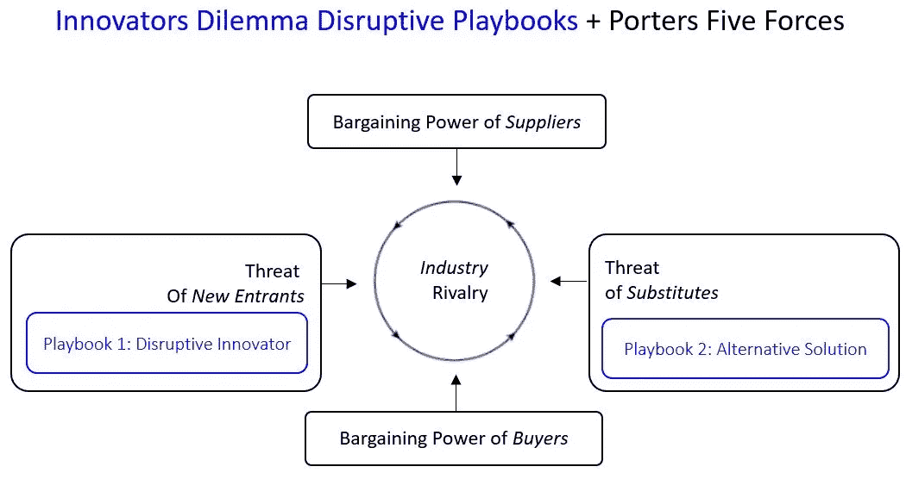

# 克里斯滕森的颠覆性创新行动手册+波特五种力量

> 原文：<https://medium.com/swlh/christensens-disruptive-innovation-playbooks-porters-five-forces-d27210320558>

我最近写了一篇关于术语*颠覆*使用范围扩大的[文章](/@hrgriffiths/the-dangerous-dilution-of-the-term-disruption-ef1b34e6c737)，这让我重温了 Clayton Christensen 1997 年关于颠覆*创新者困境的经典著作。在这本书里，Christensen 描述了两个原型“剧本”,详细描述了两种不同形式的破坏是如何随着时间的推移而发生的。*

## 剧本 1

第一部剧本描述了一个破坏性新进入者的一系列行动。Christensen 发现，他们最初用新的低端定位削弱了当前市场提供商的价值定位，以在当前提供商最没有价值的客户(甚至是当前提供商忽略的*非客户*)中获得立足点，然后增加他们定位的价值，以捕获中高端客户。

## 剧本 2

第二个剧本描述了当相邻市场中的组织开发新的替代解决方案来满足客户的潜在需求，从而将当前市场的客户吸引到相邻或新市场中可能存在的新的替代解决方案时会发生什么。

在他后来的工作中，Christensen 阐述了客户的工作要做的概念“以解释如何重新评估客户的潜在需求可以导致新的见解，发明和创新，这可能使当前的解决方案变得不那么相关或完全多余。

## 忽略剧本 2 的风险？

我注意到，在最近许多讨论颠覆和引用克里斯滕森作品的文章中，大多数只是提到了第一部剧本，而没有提到第二部。

我怀疑，这种对一个而不是两个剧本的关注，可能会让组织面临更高的风险，如果他们不善于认识到这个特定剧本何时会违背他们的利益，他们就会被替代解决方案的破坏弄得措手不及。

我还怀疑，鉴于我们目前在许多行业中经历的数字化创新的速度不断加快，一个组织或市场被第二部剧本而不是第一部剧本(或者除了第一部剧本之外)颠覆的可能性正在增加。

除了第二个剧本代表了新的可供选择的工作解决方案，我还怀疑我们会看到许多现有的“工作”,在不太遥远的将来，这些行业目前解决的工作将被完全淘汰。

这新一波的价值蒸发将会发生，因为潜在的需求被完全消除了。例如，基因疗法是否会导致某些疾病的根除，从而消除对当前一系列治疗方法的需求，而这些治疗方法正是围绕着某些领域建立起来的？

## 颠覆性创新剧本和搬运工力量之间的结合

这种思路让我回想起迈克尔·波特经典的五种力量框架，该框架试图通过分析五种力量来解释竞争强度，从而解释一个行业的潜在盈利能力。

就在那时，我意识到搬运工*竞争者*和*替补*力量和克里斯滕森的两个剧本之间的重叠，这是我之前没有注意到的，我在下面的图表中表示了这两个剧本。

这个简单的插图展示了 Christensen 的破坏性创新概念如何与 Porters 的五种力量框架相结合，以更好地了解特定行业的动态。

在这个初始版本中，我已经将行动手册展示为新进入者或替代者*、*的可能类型的子集，因为并非所有使用五种力量框架识别的新进入者或替代者都将被归类为使用 Christensen 定义的破坏性。

(黑色文字/方框图复制自维基百科——参见下面的来源参考。作者添加的蓝色文本框)

## 结论

对于那些习惯于使用波特的五种力量框架或克里斯滕森的创新者困境见解的人来说，如果你将两者结合起来，你可能会获得更大的见解。

## 参考资料:

*   搬运工五大势力— [维基百科词条](https://en.wikipedia.org/wiki/Porter%27s_five_forces_analysis)
*   克莱顿·克里斯滕森的创新者困境。ISBN-10: 1633691780

## 这个故事发表在 [The Startup](https://medium.com/swlh) 上，这是 Medium 最大的企业家出版物，拥有 298，432+人。

## 在这里订阅接收[我们的头条新闻](http://growthsupply.com/the-startup-newsletter/)。

