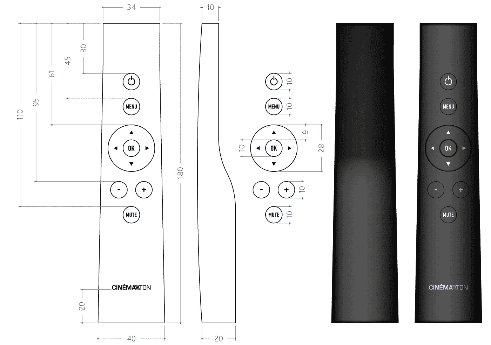
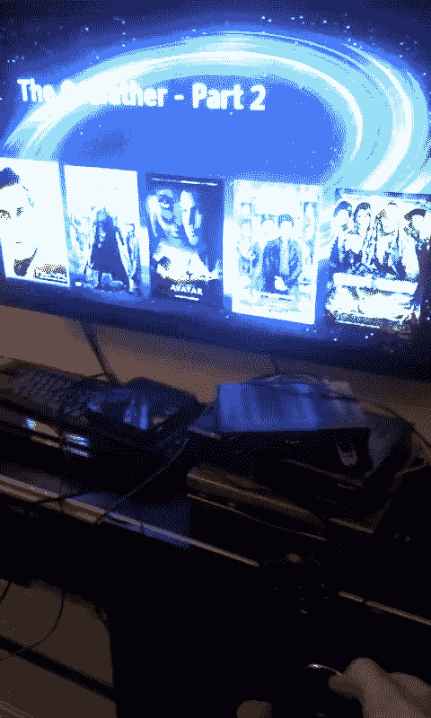
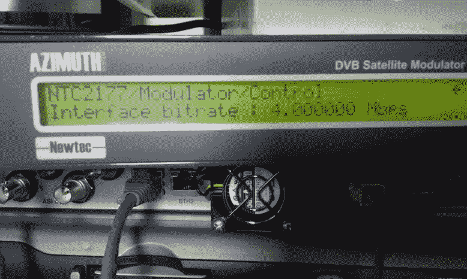

# Cinematon:在中亚启动视频点播服务

> 原文：<https://medium.com/swlh/cinematon-bootstrapping-video-on-demand-service-in-central-asia-a61ec79af984>

## 第 1 部分—从想法到概念验证

Satellite dishes. Satellite dishes everywhere! Ashgabat 2008\. Photo by [nyon45](https://www.flickr.com/photos/23371486@N04/) / Flickr

Cinematon 是一个通过卫星工作的视频点播平台，不需要互联网连接。这个多部分系列是我们的创业故事——从想法到成功退出(2012–2014)。

# 倾听空旷的天空

有一个由技术人员组成的小团体在做[卫星“钓鱼”](https://www.pcworld.com/article/193201/SkyGrabber.html)——他们将自己的接收器调到卫星互联网提供商已知的频率，拦截其他用户下载的所有文件。因为卫星无线电信号传播到地球上三分之一的地方，任何收听正确频率的人都可以免费获得这些文件的副本。

虽然收到的文件大多是垃圾，但偶尔也会捕捉到一些有用的信息，尤其是电影文件。那时候，在世界的这个地方，互联网超级贵，超级慢。电影文件就像天上掉下来的礼物。我爸爸在家里把“钓鱼”作为一种爱好，但它不是为一般人准备的——你需要设置一台带有 DVB-S 调谐器卡的 PC，配置抓天软件，并保持系统全天候运行。

## 啊哈！瞬间

如果我能建造一个简单的设备，从开放的天空中抓取媒体文件，会怎么样？我以为我可以用一个简单易用的设备解决问题中“复杂”的部分，但是最大的挑战是所有的垃圾文件。没有人会买下载垃圾的设备。

如果我可以成为卫星互联网服务的合法用户，为自己的数据使用付费，并定期为自己下载最新的高质量电影，这样世界上所有收听我的卫星通信的人也可以从空中获得一份拷贝，会怎么样？“钓鱼者”——也就是我的易用设备的潜在客户——将不再需要等到有人下载电影文件。我可以只为我的使用支付一次数据费用，并通过卫星将我想要的任何文件推送给我所有的客户！

忘记“渔民”的设备吧——我可以用卫星在没有互联网连接的地方建造网飞。卫星电视在这里已经很大了。阿什哈巴德的人们会从我这里购买一个简单的卫星调谐器，并将其连接到他们的电视上。它会自动下载最新的电影，你可以随时随地看你想看的电影。网飞对土库曼斯坦来说，没有互联网也行得通吗？这将是一个神奇的装置！为什么仅限于土库曼斯坦？互联网在其他国家也很糟糕。电视也大多是垃圾——烦人的广告，老电影。我打算扼杀电视(就像网飞在美国做的那样)。我甚至可以收取月订费。我对这个想法非常兴奋！

# 投

我开始向我在阿什哈巴德的朋友们推销这个通过卫星为中亚服务的网飞的想法，征求他们的意见。

> “您可以随时观看数百部电影，无广告，高清，随时更新最新版本，无需互联网！”

这个新产品的想法很简单，但是执行起来超级复杂，有太多的未知因素。构建定制硬件？检查。大规模生产它？检查。从卫星运营商那里租赁广播流量？检查。与电影/媒体公司达成许可协议？检查。政治方面也很有挑战性。一些政府可能会考虑让一家推广电影的公司成为一家独立的媒体公司，并试图对其进行监管。

我和我的朋友都没有成功的经验。这个想法很快就被埋进了“好但不可能的想法”的墓地，再也不会被提起。

# 捣鼓数字，又名“商业计划”

经过初步讨论，我放弃了这个想法。一年很快过去了，我为了工作从阿什哈巴德搬到了迪拜。一个晴朗的夜晚，我出乎意料地收到了朋友瓦迪姆发来的一条信息:他的一位投资者喜欢我们很久以前的想法，愿意投资 100 万美元，正在等待商业计划。

我开始联系卫星运营商——主要是亚马尔和土耳其卫星公司。Yamal 201 更好，因为我的目标市场中的每个人都有一个指向它的卫星天线。结果，**从亚马尔以 4 mbps 的速率广播数据每月要花费 25000 美元。**以 4 mbps 的速度，我们每天可以向订户推送超过 40GB 的新内容。

根据市场上基于 Linux 的卫星电视接收器的价格，我估计我们的定制设备的制造成本约为 100 美元。我们必须在设备上安装一个大硬盘来存储客户的全部媒体收藏。

我认为我们可以在第一年达到 16K 用户，在 5 年内达到 100K。这是一个合理的数字，因为该地区的卫星付费电视运营商拥有数千万用户。向 10 万名客户收取每月 10 美元的订阅费，转化为每年 1200 万美元的业务！

很快就清楚了，投资者对该公司 50%的股份感兴趣。我觉得我们可以做得更好，所以没有跟进。投资者的兴趣促使我们重新认真考虑这个项目。

事情看起来很好！至少在理论上是这样。

# 组

尽管我们当时没有正式或非正式的协议，但我有一些朋友，我把他们视为共同创始人:Hojamyrat，他在该地区有商业经验，有很多关系 Vadim，他是一个超级天才的设计师和创意营销人员。还有，我爸爸和哥哥 Agajan 帮了我们很多。

我们希望在筹集任何外部资金并投入项目之前，先建立一个功能性的概念验证/原型设备。我们希望 100%相信这个东西可以建成，我们希望对投资者有更好的杠杆作用。

Vadim 开始从事品牌、产品设计和用户界面/UX 的工作。

Logo design

Remote Control design

# 概念证明

我们没有办法得到满足我们需求的定制 PCB。这太贵了，也太冒险了。我决定使用成熟的现成硬件，但安装我们自己的软件，并用我们的品牌定制设备的外壳。

我买了一堆基于 Linux 的卫星接收器来黑。[梦想盒子](http://dreambox.de/)接收器是一个很好的候选，因为它是德国制造的，有开源软件，但价格昂贵。乌克兰设计的 [OpenBox](http://www.openbox.ua/) 接收器更便宜。然后是一个叫做 SparkBox 的接收器的中国复制品。我每样买了一个样品，带回家拆开。OpenBox 和 SparkBox 基于 ST 微电子公司的 CPU/芯片组。我做了广泛的研究，并决定将目标锁定在 STi7111 芯片上，因为这款设备的价格约为 60 美元，非常受欢迎，并有良好的 Linux 支持。

The SparkBox STB running the first proof-of-concept UI

我对这些基于 Linux 的电视接收机的编程应用一无所知。有一个开源项目叫做 Enigma2。这个项目使用 Python 和 C++开发了在接收器上运行的驱动程序、SDK 和 GUI 代码。阅读 Enigma2 代码和文档是一个很好的起点。我学会了如何在电视屏幕上绘制图形，处理遥控器按钮的按下，以及播放存储在本地存储器上的视频文件。

经过三四周的兼职黑客工作，我有了一个运行在 SparkBox 硬件上的视频点播应用程序的超级基本 GUI。它在主屏幕上显示电影海报，并允许用户通过遥控器选择、播放、暂停、快进和倒带电影。我刚刚编写了我的第一个电视应用程序，它运行得非常好！

# 实验室设置

我需要在我的家庭实验室中使用卫星互联网来测试和开发这个概念验证设备。在我迪拜的公寓里安装卫星互联网几乎是不可能的——这需要获得在住宅公寓里安装卫星天线的许可，以及专用卫星互联网服务的巨额安装和每月费用。

在寻找替代解决方案时，我发现有一种 L 波段卫星调制器可以接收 IP 流量并产生射频(RF)信号，就像来自真正的卫星一样。唯一的缺点是——这些全新设备的标价是 10，000 美元。幸运的是，易贝帮了我一把——我花 1000 美元找到了一台二手的，不久之后，我就有了自己的实验室，并做好了准备。

Sat signal generator purchased on eBay

# 神奇的数学

另一个缺失的重要部分是通过单一卫星频道向所有客户同时可靠地传送媒体文件的软件。

实现这一目标意味着应对两个不同的挑战:

1.  卫星广播是单向频道。在互联网上，客户端可以再次向服务器请求丢失或遗失的数据包。不幸的是，在我们的案例中，没有从客户设备反馈给我们的反馈渠道。我们客户的设备只能听我们说话，不能和我们说话。
2.  **无线电频道，尤其是卫星频道，噪音大且不可靠。**由于恶劣天气、干扰或电缆和碟形天线连接不当，经常会出现数据包丢失的情况。

对这些问题的一个简单的解决方案是盲目地重传两次，并希望在两次传输之间，我们的客户收到了他们需要的所有内容。然而，这种解决方案会使我们本已昂贵的卫星带宽成本加倍，而且在大范围内不可靠。

事实证明，我们的广播问题已经得到了很好的研究，有效而实用的解决方案已经广泛应用于从移动网络到火星探测器的通信系统中。

神奇的解决方案是[擦除纠正码(ECC)](https://en.wikipedia.org/wiki/Erasure_code) ，这是一种算法，用足够的冗余信息丰富我们的文件，以允许重建丢失的部分。实施 ECC 后，我们的 1GB 媒体文件增长到 1.3GB，但它使我们能够以清晰的质量播放原始视频内容，即使在嘈杂的环境和恶劣的天气情况下也是如此。

开源[低密度奇偶校验(LDPC)](http://planete-bcast.inrialpes.fr/article344d.html?id_article=7) 实现对于我们的原型设备来说已经足够好了。

# 直播！

是时候在现实世界中测试我们的原型了，我们需要一个真正的卫星频道。我们没有直接去卫星运营商那里租赁专用转发器，而是在 [LanSat](https://www.lansat.ru/) (一家单向卫星互联网提供商)上注册了一个账户，并安排按数据使用量付费(每兆字节 0.01 美元)。在玩了一些 [UDP 打洞](https://en.wikipedia.org/wiki/UDP_hole_punching)的把戏后，我可以使用这项服务进行测试广播。

第一个视频文件通过 [Yamal 201](https://en.wikipedia.org/wiki/Yamal_201) 卫星广播，并被我们的原型机顶盒成功接收，并在电视上播放。令人惊讶的是，一些以前看似不可能的事情最终变成了现实，并掌握在我们手中！

# 经验教训

*   利用不寻常的事物 l .该地区没有互联网接入和大量的卫星天线并不是提供数字服务的挫折，而是一个利用的机会。
*   购买二手实验室设备。易贝 1，000 美元的 L 波段卫星调制器远远优于我们在新设备上花费的 1 万美元。在产品开发阶段，每一分钱都很重要。
*   **数学作品。对你的技术背后的计算机科学问题进行研究。了解最先进的解决方案和理论局限性。**
*   **现有平台上的原型。**不要急于完成定制 PCB 设计。

# 本系列的下一篇…

第 2 部分将讲述我们如何将原型设备投入大规模生产。一旦准备好了，就跟着我读。

## 这篇文章发表在 [The Startup](https://medium.com/swlh) 上，这是 Medium 最大的创业刊物，有+389，305 人关注。

## 在这里订阅接收[我们的头条新闻](http://growthsupply.com/the-startup-newsletter/)。

