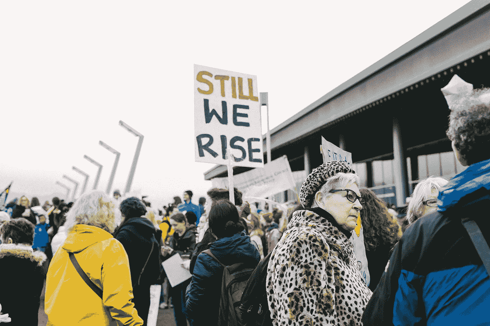

# 毫无歉意地要求你的经济权力

> 原文：<https://medium.com/swlh/claim-your-economic-power-without-apology-e9ea0fd514bf>

stocksnap.io Alexa Mazzarello

## 无所畏惧，乐于助人，坦然面对

新闻中关于身居要职的富人利用这种权力征服他人、或腐蚀制度、或以其他方式对我们的文化或环境采取破坏性行动的故事激励我成为一名更好的企业家。我知道，这种经济力量可以用于建设性的目的——帮助人们，创造就业机会，使整个公民体系可持续发展，支持每个人。

在她最近的[文章](https://www.theatlantic.com/entertainment/archive/2017/10/harvey-weinstein-and-the-economics-of-consent/543618/)中，布里特·马灵巧妙地描述了为什么宣称我们的经济实力是至关重要的。它不仅给了你选择的自由，能够围绕妥协设定你自己的条件，它也给了你建设性贡献的力量。

> "自我提升的想法让我感到恶心……！"

这是我见过的最酷的女人之一的原话。她放弃了利润丰厚的开发商职业，创办了一家社会企业，帮助我们最大的城市之一的无家可归者，这个城市是全国无家可归问题最严重的城市之一。

她成功地创建了一个网站和应用程序，做了它想要做的事情。但她觉得自己无法宣传自己的工作或与此相关的自身。

她的话让我感到难过，这是为什么:女性不经常被鼓励谈论她们的成就，为她们邀功，当然也不吹嘘她们。当我们这样做的时候，我们经常会为此感到难过。

她的服务有如此大的潜力，事实上，她的服务范围和影响力正在令人难以置信地增长，她是如此有魅力的大使。如果她选择做哪怕是最微小的自我推销，我想她会被更多的支持和贡献淹没。

我忍不住解开她的评论，并考虑它的所有含义。**错过的将是她最想努力为之服务的人。**

我们必须克服阻碍我们实现梦想的信念，如果不是为了我们自己的荣耀，也是为了那些从我们的努力中获益最多的人。我认为有三件事会让我们走得更远:

# 1.无所畏惧

> 我们最大的恐惧不是我们不够好。我们最深的恐惧是我们的力量无法估量。最让我们害怕的是我们的光明，而不是我们的黑暗。玛丽安娜·威廉森

克服恐惧，拥抱我们的力量。做好事，告诉别人，请求他们的支持。

对我来说，无耻的自我推销和浮夸之间有很大的区别，告诉世界你创造了一些伟大的东西，如果它得到所需的支持，将会帮助很多人。

# 2.乐于助人

> 不帮助其他女人的女人在地狱里有一个特殊的位置。—马德琳·奥尔布赖特

互相帮助。需要的时候寻求帮助。能给就给。

永远不要贬低另一个女人和她为做好工作所做的努力。

好吧，你可能鄙视推广你的工作，或者只是不太擅长。你能拿出什么样的技能来与擅长此道的人交换呢？你能把我介绍给最好的公关人员吗？他可能会给我一笔好交易。或许我可以帮你安装需要激活的 SSL 证书。让我们互相帮助。有足够的空间让我们获得成功，同时赚钱或吸引钱来做更多的好事。

# 3.毫无歉意地出席

> 不需要任何人认可的女人是这个星球上最可怕的人。-Mohadesa Najumi

不要给任何人“验证”你的权力。仅仅通过行动和努力，你就是有效的。对我来说，寻求认可的另一面甚至比认可本身更加阴险。感觉你必须为你的野心或成就找借口的想法会让你和你的工作更加停滞不前。它会让你表现得“不如”，成就不如，或者把眼光定得太低。

如果你不道歉或退缩，你确实可以成为一股令人生畏的力量，可以勇往直前，取得巨大成就。这种力量不一定要灌输恐惧。它可以给你和你所代表的东西注入信心，对你的工作和成就的钦佩，这有助于扩大它的范围，渴望支持和贡献你正在努力实现的目标。这意味着对你正在从事的事业或你试图服务的人有更大的影响。

## 利润、权力和动机

但是这种自我推销的排斥背后还有其他原因。她也普遍认为通过工作赚钱本来就不好。她对此表示歉意，只希望能够向从事建设和开发的技术人员支付报酬，以补偿他们的时间。

她害怕创造一种现金流，这种现金流将维持并增强她帮助更多无家可归者的能力，或者更长久地帮助更多的人。她当然想这么做，但如果这意味着“自我推销”或以赚钱的方式经营，她就不会这么做。她觉得这会破坏她的好意。企业的整个资金方面让她很不舒服。

我想知道这是不是女人经常面临的问题，而男人却不会。如果是这样，那是为什么呢？在我看来，男人总是把金钱和权力联系在一起，两者兼得通常被认为是好事。许多两者兼而有之的人为他们的社区、社会、地球做了不可思议的事情，他们从未想过要为此道歉，也不会逃避宣传他们自己和他们的工作。

当然有很多人滥用金钱和权力。但我认为，重要的是要提醒我们自己，我们还可以为我们努力服务的人们和我们充满激情的事业做更多的事情。没有道歉。

这就是为什么我努力成为一名更好的企业家，为我的技能定价，拒绝为没有免费工作而道歉。我经常在这方面失败，但每次我都提醒自己为什么这很重要，并打算下次做得更好:我在给自己自由，不要在别人的条件上妥协。我在要求我的权力，维护我的独立。

我可以做更多的事情来对我最关心的事情产生积极的影响。

你可以在这里注册来接收我的第一本书发布的消息，*成为一个无畏的领导者:一个简单的指南来掌控和建立快乐、高效、高绩效的团队*。我将很快与在这里注册的每个人分享免费资料。

*我写了我是如何成为一家科技创业公司的创始人的，一个 40 多岁的女性，没有任何创业经验，也是我一路走来学到的所有东西。你可以在这里看到更多:*[https://medium.com/@eshassere](/@eshassere)*如果你认为这可能对其他人的创业之旅有所帮助，请推荐并分享。*

## 这篇文章发表在《创业》[上，258，400 多人聚集在一起阅读 Medium 关于创业的主要报道。](https://medium.com/swlh)

## 点击订阅接收我们的头条新闻[。](http://growthsupply.com/the-startup-newsletter/)

