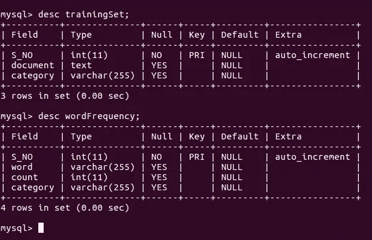
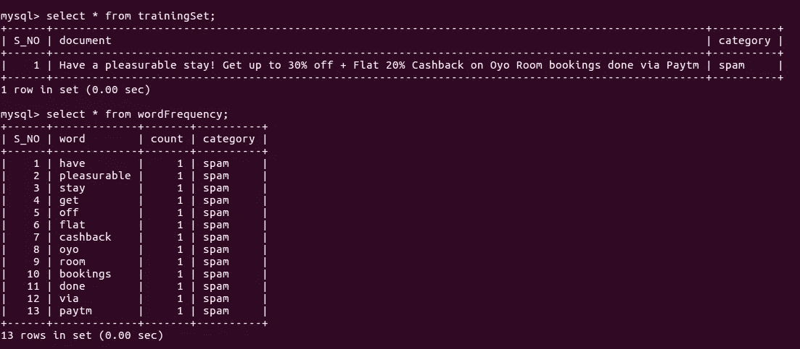
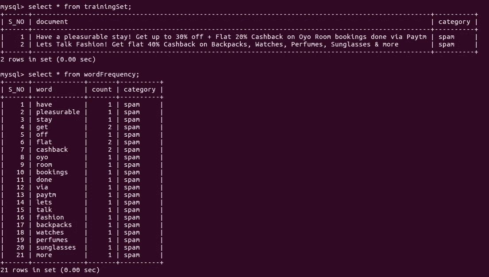
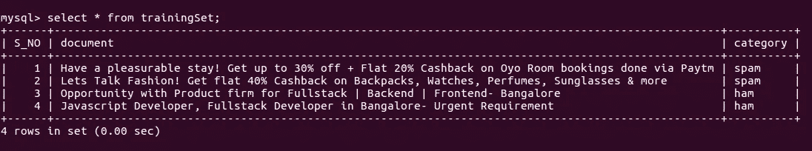
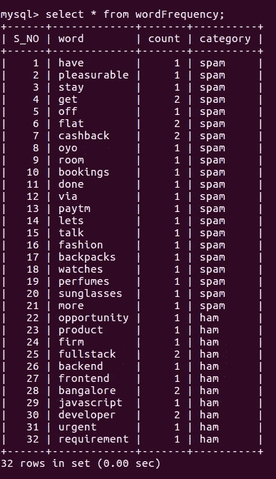

# 使用朴素贝叶斯分类器将电子邮件分类为垃圾邮件和垃圾邮件

> 原文：<https://medium.com/swlh/classify-emails-into-ham-and-spam-using-naive-bayes-classifier-ffddd7faa1ef>

## 我们在建造什么？

我们将使用朴素贝叶斯定理构建一个简单的电子邮件分类器。用 PHP 实现的算法可以在这里找到-[https://github.com/varunon9/naive-bayes-classifier](https://github.com/varunon9/naive-bayes-classifier)

## **稍微介绍一下-**

> 来自[维基百科](https://en.wikipedia.org/wiki/Bayes%27_theorem):
> **P(A | B)**=**P(B | A)* P(A)/P(B)**其中 A 和 B 是事件， **P(B)！= 0**
> **P(A | B)** 是条件概率:假设 B 为真，事件 A 发生的可能性。
> **P(B | A)** 也是条件概率:假设 A 为真，事件 B 发生的可能性。
> **P(A)** 和 **P(B)** 是彼此独立地观察到 A 和 B 的概率，这就是所谓的边际概率。

现在让我们假设我们有几个已经被分类为垃圾邮件的文档(**训练集**)。因此“*这封邮件是垃圾邮件还是垃圾邮件*的问题也可以表述为- *给定包含以下文档的最新邮件是垃圾邮件或垃圾邮件的概率是多少？*(此处文档为邮件中的部分文字)。数学上我们可以-

> **P(ham | bodyText)** =假定电子邮件包含 document- bodyText(假设 bodyText =电子邮件的内容)
> **P(垃圾邮件| bodyText)** =假定电子邮件包含 document-body text
> **P(ham | bodyText) = (P(ham)* P(bodyText | ham))/P(body text)
> P(垃圾邮件| body text)=(P(垃圾邮件)* P(body text |垃圾邮件)**

## 准备训练集-

我们必须有一个训练数据集才能让我们的分类器工作。我们将使用 MySql 作为数据库来存储我们的训练集。让我们从数据库模式开始。

training set database schema

我们将创建两个表。

1.  带列`document(text)`和`category(varchar)`的训练集。该表将保存所有电子邮件及其类别，即垃圾邮件或垃圾邮件。
2.  词频有`word(varchar)`、`count(int)`和`category(varchar)`三栏。该表将保存目前看到的所有单词及其计数和类别。

让我们用下面的数据集训练我们的分类器。(我将使用 https://github.com/varunon9/naive-bayes-classifier 的[应用程序来训练我们的分类器)。](https://github.com/varunon9/naive-bayes-classifier)

1.  祝您过得愉快！通过 Paytm 预订 Oyo 客房，最高可享受 30%的折扣+20%的固定返现。(垃圾邮件)
2.  让我们谈论时尚！购买背包、手表、香水、太阳镜等产品可获得 40%的统一返现。(垃圾邮件)
3.  产品公司为 full stack | back end | Frontend-Bangalore 提供的机会。(火腿)
4.  Javascript 开发人员，班加罗尔的全栈开发人员-迫切需要。(火腿)

Database after training with first data set.

Database after training with first and second data sets.

trainingSet table data after training with all 4 data sets.

wordFrequency table data after training with all 4 data sets.

## 实现算法-

我们的分类器将实现以下伪代码-

if(P(ham | body text)> P(spam | body text)){
返回‘ham’；
} else {
返回‘垃圾邮件’；
}

> **P(ham | body text)=(P(ham)* P(bodyText | ham))/P(body text)
> P(spam | body text)=(P(spam)* P(body text | spam)/P(body text)** *由于 P(body text)是常量，在两个表达式中是常见的，所以我们可以避开。请注意，我们的目标不是计算实际概率，而只是比较。* **P(ham) *=* 属于 ham 类别的文档数/文档总数
> P(spam) *=* 属于 spam 类别的文档数/文档总数** *为了计算上述两个概率，我们将使用 trainingSet 表。* **P(body text | spam)= P(word 1 | spam)* P(word 2 | spam)*…
> P(body text | ham)= P(word 1 | ham)* P(word 2 | ham)*…** *要计算以上两个概率，我们就用词频表。这里，单词 1、单词 2、单词 3 到单词 n 是正文中的总单词数。* **P(word1 | spam) =属于垃圾邮件类别的 word1 的计数/属于垃圾邮件类别的总计数。
> P(word1 | ham) =属于 ham 类别的 word1 的计数/属于 ham 类别的单词总数。**

## 需要注意的事项-

如果我们的分类器检测到训练数据集中不存在的新单词，会发生什么？在这种情况下，`P(new-word | ham)`或`P(new-word | spam)`将为 0，使得所有乘积等于 0。

为了解决这个问题，我们将两边都用圆木。新的伪代码将是-

if(log(P(ham | body text))> log(P(spam | body text)){
返回' ham '；
} else {
返回‘垃圾邮件’；
}

***log(P(ham | body text))= log(P(ham))+log(P(body text | ham))
= log(P(ham))+log(P(word 1 | ham))+log(P(word 2 | ham))***…

但是等等，我们的问题还是没有解决。如果我们的分类器遇到训练数据集中不存在的新词，则 P(新词|类别)将为 0，log(0)未定义。为了解决这个问题，我们将使用拉普拉斯平滑。现在我们要-

***P(词 1 | ham) =(属于类别 ham 的词 1 的计数+ 1) /(属于 ham 的词的总计数+训练数据集即我们的数据库中的不同词的数量)***

***P(单词 1 |垃圾邮件)=(属于垃圾邮件类别的单词 1 的计数+ 1) /(属于垃圾邮件的单词的总计数+训练数据集即我们的数据库中的不同单词的数量)***

为了进一步改进分类器，我们可以对正文(即电子邮件的内容)进行标记。

## 测试我们的分类器-

**$ classifier->classifier('扫描 Paytm 二维码支付&赢 100%返现')；** //垃圾邮件

**$ classifier->classifier(' Re:申请 Fullstack 开发者')；** //火腿

## 结论-

假设我们的训练数据集是好的，朴素贝叶斯分类器易于实现并提供非常好的结果。它还可以用于对情绪进行分类，即快乐/悲伤/中性，或者对推文中的情绪进行分类，即积极/消极/中性等。如果您发现任何错误或问题，请在[https://github.com/varunon9/naive-bayes-classifier](https://github.com/varunon9/naive-bayes-classifier)创建 github 问题。

## 这个故事发表在 [The Startup](https://medium.com/swlh) 上，这是 Medium 最大的企业家出版物，拥有 293，189+人。

## 在这里订阅接收[我们的头条新闻](http://growthsupply.com/the-startup-newsletter/)。

