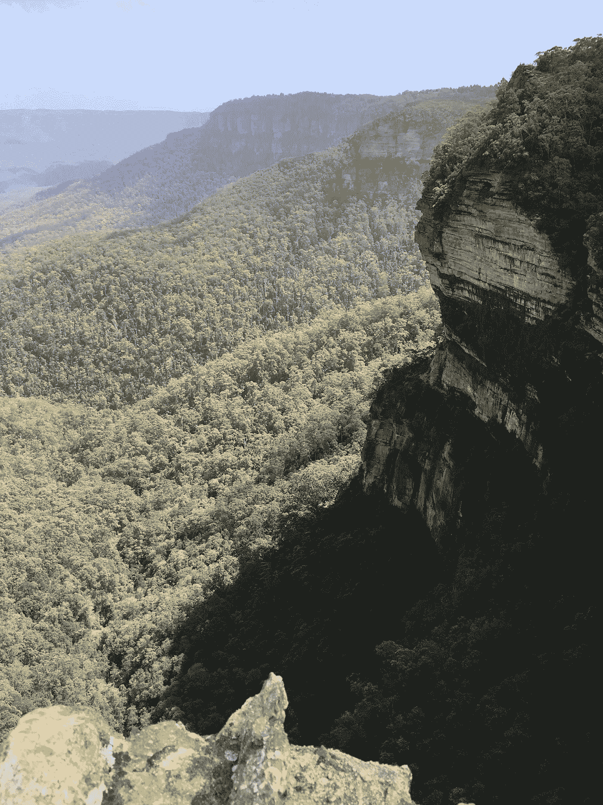

# 摆脱债务

> 原文：<https://medium.com/swlh/climbing-out-of-debt-e76dad248357>

最近，在澳大利亚出差时，我进行了几天的自我静修，学习如何摆脱债务。那是精神债。

*一、什么是自退？*对我来说，这意味着创造一个环境，让我能够排除杂念，集中注意力。完全脱离我的日常生活。没有工作，没有邮件，没有懈怠，没有电话，没有短信，没有社交媒体(反正我也不用)，也没有新闻媒体。只有我和我自己。

在澳洲的时候，我租了一辆车(在悉尼，我*无所畏惧地*在道路的左侧行驶！)最后到了蓝山，在城市西边几个小时的路程。使用谷歌地图(这是我手机的唯一用途)，我随机来到了温特沃斯瀑布。我下了车，开始步行。步行变成了攀登，有许多起伏，沿着一条徒步小径，直到我来到一个了望点，那里有我见过的最令人惊叹的山谷景色之一。郁郁葱葱的绿色一望无际(记住，现在是夏天)，小山和巨大的岩层增加了景观的深度，让我受到大自然之美的启发。

当我最终完全沉浸其中时，我发现自己站在那里，平静地观察着物理空间，然后自然地开始通过入住来观察我自己的精神状态*。当处于冥想状态时，*检查* 意味着观察我的精神或情绪状态，就好像我是另一个人，一个我可以完全看到内在的人。*

现在令我惊讶的是，物理空间的静止和安静对我的内心空间产生了相反的影响。我的脑海里很快充满了想法。不去想我在哪里，不去想我在外面观察到了什么。但是想到我觉得我应该做的事情。*换句话说，我的待办事项清单。*

当我开始意识到我内心的想法时，一种强烈的感觉油然而生。我开始觉得我欠了债。精神上。在我能让自己在精神上和情感上呈现出我的身体状况之前，我觉得我必须首先偿还未完成的事情。完成我之前承诺的事情。一种'*一旦这样，那么'*式的感觉。

当我们认为债务是一个术语时，我们会立即将其与财务状况联系起来，并想到抵押贷款、贷款、信用卡或银行账户。现在，债务如何转化为我们的精神状态？在我放松之前，精神债是我觉得我应该做的事情的积累。这可能是我们今天生活的文化的一个明显症状。

我认为精神债是自己强加的。我创造了它。作为完成工作的动力来源，这也许是有用的，但只是在一定程度上。精神债务会很快超过它的用处，因为它会限制我体验当下的能力。

回到我的静修，那种精神上负债的感觉是我在旅行开始时观察到的。仅仅几天后，在澳大利亚的静修结束时，我再次反思了自己的精神和情绪状态，并很高兴地告诉大家，我不再负债了。不是因为我清除了一切。实际上，我没有做待办事项清单上的任何事情。相反，我在自己身上投入了时间。练习、冥想、阅读、写作和反思。基本上，在我的账户上建立信用。

我觉得我的账户已经平衡了。一路走来，我知道有很多方法可以摆脱我不时背负的精神债务。

 [## 学会无所畏惧:一步一个脚印

### 我花了一个漫长的周末去哈德逊谷做了一次随机的、最后一刻的旅行。这是绝对美丽的，它是…

medium.com](/find-focus/learning-to-be-fearless-one-step-at-a-time-f44a1b0b26b1)  [## 冰山教会了我什么是谦逊

### 最近，我发现自己在冰岛呆了几天，在去欧洲的途中进行了一次自发的最后一刻的冒险…

medium.com](/find-focus/what-an-iceberg-taught-me-about-humility-cc7ee2c7505)  [## 看着蝴蝶的眼睛

### 上周末，我和一个朋友在城市北部徒步旅行，虽然我沉浸在大自然中，这是…

medium.com](/find-focus/look-into-the-eyes-of-a-butterfly-8a80225b6bd8) 

— -

**库纳尔·古普塔**是 [Polar](http://www.polar.me) 的创始人&首席执行官，Polar 是一家技术平台提供商，其使命是实现优质内容的商业模式。Polar 的合作伙伴包括全球主要出版商，业务总部位于多伦多，在纽约、伦敦和悉尼设有办事处。

Kunal 热衷于在现代寻找平静和专注。库纳尔是加拿大领先的精神健康医院和研究机构 CAMH 的董事会成员。他定期在他的博客 findfocus.today 上写关于领导力、正念和技术文化的话题。

你可以在 [LinkedIn](https://ca.linkedin.com/in/kunalfrompolar) 上和他联系。

## 这个故事发表在 [The Startup](https://medium.com/swlh) 上，这是 Medium 最大的企业家出版物，拥有 305，461+人。

## 在此订阅接收[我们的头条新闻](http://growthsupply.com/the-startup-newsletter/)。

