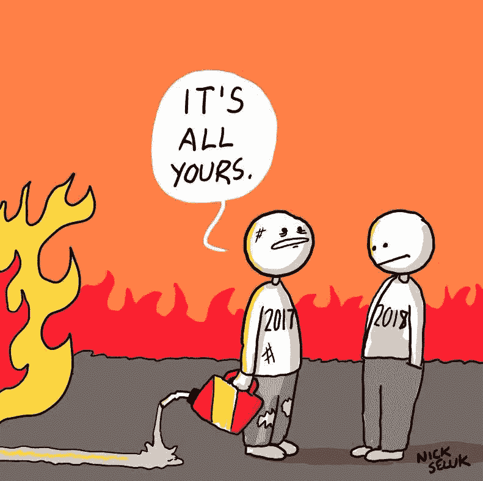

# 创业 CEO 2018 收官……

> 原文：<https://medium.com/swlh/closing-out-2018-with-meaning-347d043fa30a>

“饥饿，冷水淋浴，艰苦的体力和脑力劳动”？

嗯…我的一些朋友、同事和家人就是这么看的。我的看法非常不同，这是一个重要的方式来结束这一年来建立的坚实基础。

对许多人来说，2017 年是充满挑战的一年，我肯定会记住这一年，原因我将在未来的帖子中讨论，但 2018 年是建设备份的一年。这一年，我为自己未来十年的生活打下了基础。

A few people felt like this at close of 2017…lol

# 这是从一个 LinkedIn 帖子开始的，

然后发展成一个更长的 FB 帖子…然后我决定写在这里+详述我如何结束今年。

我希望你能在这里找到一些有用的东西，你可以在今年或以后实施。

Credit to Viktor for his impact on my way of thinking.

## 来自 FB 的原始帖子

今天是星期四(午餐时间),我过的最后一天是星期六——晚餐吃些饼干。

*5 天…除了水、360 千焦的果汁和稀释的骨汤，什么都没有。*

视角…这是一个强大的东西。

*过去这一周，我有:*

*   *5 天没有进食*
*   *每天早上酷热的冷水淋浴*
*   *每天 1hr 的体力劳动*
*   *在办公室进行 15 小时精神紧张的工作(没有休息时间)*

*或者……是吗:*

*   *斋戒五天，在那里我感到洁净&焕然一新*
*   *清爽的晨雨*
*   *运动@健身房*
*   多产的工作，动力如此之大，以至于我不想停下来。

我们比我们习惯相信的要强大得多。

这让我想起维克多·弗兰克尔的《人类对意义的探索》，这是有史以来最重要的书之一(心理学家/精神病学家，曾是奥斯威辛集中营的战俘)..

中心论点是，生活的意义不仅仅是“快乐”或“舒适”，而是在你所做的事情中找到“意义”。

*透视就是这样。你可以从生活/世界中发生的任何事情中找到更有力量的意义——从那里，你可以做出更好的决定&产生更好的影响。*

事实上，作为人类，我们在克服困难中找到了更多的意义。这是我们增强力量的方式；无论是身体上的(在健身房)，精神上的，心理上的还是情感上的。正是对某些东西的抗拒让我们变得更好——因此，如果你认同生活是有意义的这一观点——经常试图让自己快乐/分散注意力/屈服于舒适可能是有害的。

在我结束对你们这些混蛋的禁欲/禅宗之前，我会结束这一切..

但是我会用这首歌来留给你。

*我今天早上训练的时候听了这首歌，它帮助我克服了有时的头晕，这首歌是🔥🔥*

所以是的。那是我的帖子。它在网上得到了相当多的反馈。

事实上，它实际上激励我在如何结束这一年时更加深思熟虑——在此之后，我对许多事情采取了行动，并创建了我的“年终清单”——我认为我们都应该拥有的东西。

这份年终清单(或净化)比外出、聚会、喝醉重要得多&让你从过去的一年或现在的生活中分心。

这段深思、净化、沉默、冥想和计划的时间会让你在新的一年里与众不同。

当其他人正在“克服”他们的宿醉时——你将准备好，清晰，专注和满足——为未来做好准备——当然，就像前几年一样，新的一年将再次考验你。

# 我的年终清单

你会注意到净化/禁食/沉默的主题——跨越多个领域。

**1。48 小时的沉默**

没错。没有电话，没有网络，没有声音。只有我。只是沉默。就像一个迷你的瑜伽..

**2。清理我的待办事项**

我不知道你怎么想，但我淹没在要做的事情中，我知道我会继续淹没，除非我找出什么是真正重要的，重新组织，重新校准，然后冒险前进，

**3。未来一年的计划**

这是必须的。我过去常常做这整个精心设计的 2 天过程——但是随着年龄的增长，我发现我越来越不需要把它变成一个巨大的过程。我保持简单:

*   今年我最想做的 10 件事是什么
*   突出显示前 3 到 5 名
*   将它们分成三个主要类别。我的是:个人、职业和金融。

**4。冥想**

今年，特别是临近尾声的时候，我发现我更倾向于再次冥想。这在 2017 年已经过时了，但现在又回来了。一定是我最近一直在听艾伦·瓦茨的歌…哈哈

**5。禁食&干净饮食**

我发现在我的 5 天禁食后(实际上结束了 6 天，因为第 5 天我吃了一些蓝莓，但无论如何)我感觉如此干净，我不太倾向于在我的身体里拉屎。

事实上，我的运气一直很好，以至于食物成了一种事后的想法——这对我没有坏处，反而有好处。反正我们都吃太多了。

**6。刻苦训练**

我又开始训练了，一次又一次，经过 5 天的禁食，我感觉更强壮，更轻盈，更快&我恢复得更快了。

**7。阅读**

花了很多时间来阅读。八月份我生日的时候，我疯狂地看书，有太多的东西要补上。再加上我“必读”清单上的一大堆文章。

**8。写作**

同样重要。写作有助于综合你所消费的一切。我的媒体中有超过 70 个未完成的“草稿”博客，我的目标是从现在到一月中旬大量生产其中的一些。

**9。打扫房间**

打扫卫生有一种极端冥想的感觉……我通常在安静中做，或者让艾伦·瓦茨做背景音乐。

干净的环境似乎也会对你的内在产生影响。我不知道这是为什么，但这是我一生都经历过的事情。

10。卖掉我所有多余的垃圾，包括屎币…哈哈

和上面很像。人类是奇怪的生物，多年来囤积了如此多的垃圾。我们不仅随身携带它，还储存它——大多数时候甚至不记得我们有它(这包括你在任何地方的地下交易所里放着的所有狗屎硬币……哈哈)。

更不用说，你会惊讶地发现你有这么多垃圾，如果你卖掉它们，可以为你真正想要或需要的东西提供资金。周末旅行，买点比特币，礼物等。

**11。扔掉我所有不想要的东西**

以上的延伸。有时候，浪费时间去卖垃圾是不值得的——外面有需要的人，比起在你的地下室/阁楼/衣柜或任何你决定储藏你所有垃圾的地方，他们可以更好地重复利用这些垃圾。

**12。退订**

我退订的基本上都是 ***一切*** 。随着时间的推移，我们积累了太多真实世界的垃圾，同样，我们的电子邮件也是我们生活中最大的垃圾场之一——给我们带来过多的分心(往好了说)和压力(往坏了说)。我抛弃了所有东西，除了下面的:

*   代币日报:[https://www.tokendaily.co/join-newsletter/QW7l](https://www.tokendaily.co/join-newsletter/QW7l)

soona amhaz 每日策划最好的比特币更广泛的加密，她是少数得到它的人之一。

*   琥珀色( [www.getamber.io](http://www.getamber.io) )

我们在琥珀的两周文摘。我有偏见，但这很好，因为我们有很高的准入门槛和很棒的废话过滤器。

*   富足(迪亚曼蒂斯的时事通讯——总是鼓舞人心)
*   我的每日媒体文摘
*   每日产品搜索
*   Crunchbase 日报

所以你有它。

我刚刚意识到这是“12 件事”…不可思议。

我要结束这篇文章，给你们留下艾伦·瓦特的一个短片，里面讨论了一些解决痛苦的佛教谚语。

关键的一点是，这不是关于摆脱、避免或逃避痛苦或苦难，而是关于拥抱、承认和忍受它。

这就是你如何积聚力量&活出一个有价值的人生。

我希望你从中获得一些价值，并祝愿每个人在 2018 年有一个惊人的结局，并在未来有一个繁荣的新篇章。

如果你喜欢这篇文章，请给它一点爱，为它鼓掌(或几下),并把它传给任何你认为应该读一读的人。

**阿列克斯**

**首席执行官&联合创始人@ Amber Labs**

[www.getamber.io](http://www.getamber.io)

你可以在这里找到更多我的作品:

 [## 亚历山大·斯维茨基—中等

### 琥珀实验室的首席执行官+decentralizedpodcast.com.au 的共同主持人。比特币、金钱、哲学、商业、初创企业和企业家精神的出口

medium.com](/@AleksandarSvetski)  [## 亚历山大·斯维茨基——黑客正午

### 阅读《黑客正午》中亚历山大·斯维特斯基的文章。CEO @ www.getamber.io + Co 主持人@decentralizedpodcast.com.au…

hackernoon.com](https://hackernoon.com/@AleksandarSvetski) 

您可以在这里联系我:

 [## 亚历山大·斯维特斯基|职业简介| LinkedIn

### 查看 Aleksandar Svetski 在 LinkedIn 上的职业简介。LinkedIn 是世界上最大的商业网络，帮助…

www.linkedin.com](https://www.linkedin.com/in/alekssvetski/)  [## 亚历山大·斯维茨基(@亚历山大·斯维茨基)|推特

### Aleksandar Svetski 的最新推文(@AleksSvetski)。对金钱、BTC、人类学感兴趣的无毛黑猩猩…

twitter.com](https://twitter.com/AleksSvetski) 

## 这篇文章发表在 [The Startup](https://medium.com/swlh) 上，这是 Medium 最大的创业刊物，拥有+404，714 名读者。

## 在这里订阅接收[我们的头条新闻](http://growthsupply.com/the-startup-newsletter/)。

