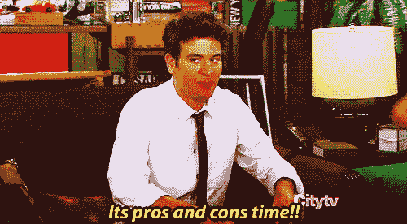

# 本周收盘技巧:本·富兰克林收盘

> 原文：<https://medium.com/swlh/closing-technique-of-the-week-the-ben-franklin-close-2bda69c87b6>

《销售》、《美国的缔造者》和《百元大钞》是如何碰撞成一部杰作的…

结束销售是一种艺术形式。关于达成销售，我最喜欢的一点是，每一个可能发生的情况都是不同的。这就是为什么销售人员最难克服异议并最终达成销售。做这件事没有单一的方法。实际上，我们建议拥有一套结束技巧，并不断练习克服这些异议。本周的收盘技巧是本·富兰克林收盘。

这种结束技巧和时间一样古老…或者至少和本·富兰克林一样古老…或者至少和《快乐吉尔摩》中的老太太一样古老。

是啊，那么老。说真的，这种技巧之所以被称为“本·富兰克林关门法”,是因为它包含了利弊清单。以前，本·富兰克林喜欢列利弊清单。

这些清单是一个有效的工具，可以让你把想法写在纸上，找出什么是重要的，什么是你担心的。谁知道如果没有这些利弊清单，美国人可能永远不会理解宣布从英国独立的重要性？不管是不是这样，这都不能改变这样一个事实，即本·富兰克林喜欢利弊清单，而且它们非常有效。

Ben Franklin Close(又名 List Close)非常有助于了解你的客户看重什么，帮助他们想到所有积极的方面，并帮助他们认识到缺点是为所有好处付出的小小代价。

# 它是如何工作的

这种结束技巧只有在正确呈现的情况下才会起作用。重要的是要意识到利大于弊至少要多 2 到 3 倍。我建议坐下来，写下你的产品或服务给客户带来的所有好处。也可以尽情发挥创造力！有时候你的专业意见是你无法真正衡量的，比如它让你的客户感觉如何，它会减轻他们的痛苦，等等。

当你的客户不同意你的提议时，提出列出利弊清单的想法。挂断可能是价格、睡觉、思考等等。基本上，当您遇到需要逻辑和打破交易的困难异议时，您会使用这种结束方式。

结束听起来可能像，“(客户的名字)，我知道你想回家考虑这笔交易。我完全同意像这样重要的决定；然而，这不会改变你至少要确保利大于弊的事实。现在，在你走之前，我们能一起做一个吗？”

当你的客户就在你面前时，你会想用这种近距离，因为你可以消除他们的异议并开始克服它们。最好是一起努力找到解决方案，这会让你的客户更加信任你。

免责声明:我建议尽一切努力让客户自己提出利弊。你可能不得不开始行动，但是一旦你这样做了，就让他们来说。这很重要，因为你可能会陈述一些对你有利但对他们不利的事情。

你可能会认为你的 1 周交货时间框架是可怕的，但不知道你的竞争对手有 2 天交货。价格是你要留意的。你可能认为你的价格很低很公平，但这很可能是阻碍交易的原因。

# 列表完成后

一旦你列出了所有的利弊，你就可以开始增值了。我建议弄清楚当前的清单对你的客户来说值多少钱。这样你就可以缩小客户认为的价值和实际成本之间的差距。这一点很重要，因为如果你的交易成本为 5000 美元，但客户却停留在 4500 美元，你不是在卖 5000 美元，而是在卖 500 美元。从销售的角度来看，这种差距更容易管理。

你可以通过想出更多的优点来增加价值。请记住，有些专业人士可能对你的客户毫无价值。出于这个原因，你应该问类似“这对你有什么价值？”又加了一个亲之后。继续下去，直到你用完专业。

一旦你获得的价值超过了成本，你就获得了销售。一定要问清楚！在此结束时要求销售的最佳方式是要求结束时寻找一个不回答。这将有助于你达成交易，因为“不”字让你的客户放心，并给他们控制权。你可以这样要求销售:“现在我们已经完成了这个清单，还有其他理由不马上进行交易吗？”一定要保证安静。

不意味着交易结束了。“是”意味着你必须问是什么阻碍了它，并努力克服它。

如果你在 Ben Franklin 收盘时出牌正确，你一定会增加你的成交率和收入。让这种结束成为你开始掌握结束并成为你所在领域的专家的一种方式。

如果你喜欢这种结束技巧，看看我最喜欢的 [***假设结束***](https://codycameron.com/closing-technique-of-the-week-the-assumptive-close/) ， [***如果一切都一样结束***](https://codycameron.com/closing-technique-of-the-week-if-everything-were-the-same-close/) 或 [***“如果”结束***](https://codycameron.com/closing-technique-of-the-week-the-if-close/) 。或者看看我的一些最佳作品，看看我从商业 中学到的 [***5 个改变人生的教训。***](https://codycameron.com/5-life-changing-lessons-i-learned-from-business/)

订阅我的博客，这样你就可以得到我所有的独家内容！你不会想错过任何东西的！cameron.com

如果你喜欢这个帖子或者学到了什么，帮我一个忙，按下那个按钮！

很棒，

[科迪·卡梅伦](https://twitter.com/realcodycameron)

## 这篇文章发表在 [The Startup](https://medium.com/swlh) 上，这是 Medium 最大的创业刊物，拥有+370，107 名读者。

## 在这里订阅接收[我们的头条新闻](http://growthsupply.com/the-startup-newsletter/)。

